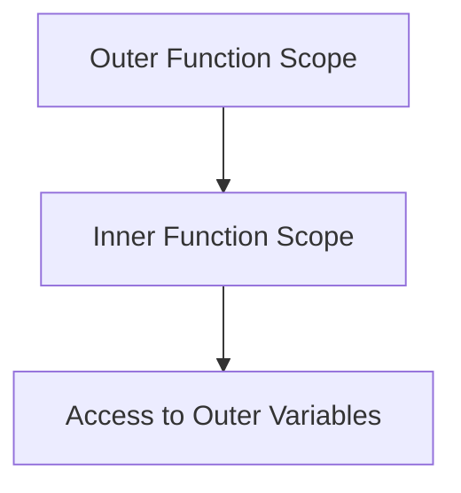

## 9.3 Returning Functions from Functions

In JavaScript, functions are first-class citizens, meaning they can be treated like any other data type. This allows us to pass functions as arguments, store them in variables, and even return them from other functions. In this section, we'll explore the concept of returning functions from functions, understand how closures play a role in this pattern, and discuss practical use cases such as function factories and configuration functions.

### Understanding the Concept

Returning a function from another function is a powerful feature in JavaScript. This pattern is often used to create functions with specific behaviors or configurations. When a function returns another function, it can maintain access to the variables and parameters of the outer function, thanks to closures.

#### What is a Closure?

A closure is a function that retains access to its lexical scope, even when the function is executed outside that scope. This means that a function can "remember" the environment in which it was created. Closures are essential when returning functions because they allow the returned function to access variables from the outer function.

### Basic Example of Returning Functions

Let's start with a simple example to illustrate how a function can return another function:

```javascript
function greet(greeting) {
    return function(name) {
        return `${greeting}, ${name}!`;
    };
}

const sayHello = greet("Hello");
console.log(sayHello("Alice")); // Output: Hello, Alice!
console.log(sayHello("Bob"));   // Output: Hello, Bob!
```

In this example, the `greet` function returns another function that takes a `name` parameter. The inner function has access to the `greeting` parameter of the outer function, demonstrating the concept of a closure.

### Function Factories

A common use case for returning functions is to create function factories. A function factory is a function that generates other functions based on certain parameters or configurations. This pattern is useful for creating reusable and customizable functions.

#### Example: Creating a Multiplier Function Factory

```javascript
function createMultiplier(multiplier) {
    return function(number) {
        return number * multiplier;
    };
}

const double = createMultiplier(2);
const triple = createMultiplier(3);

console.log(double(5)); // Output: 10
console.log(triple(5)); // Output: 15
```

In this example, `createMultiplier` is a function factory that returns a new function. The returned function multiplies its input by the `multiplier` specified when the factory is called. This pattern allows us to create multiple multiplier functions with different behaviors.

### Configuration Functions

Another practical application of returning functions is in creating configuration functions. These functions allow us to set up specific configurations or settings that are used by the returned function.

#### Example: Configuring a Logger Function

```javascript
function createLogger(prefix) {
    return function(message) {
        console.log(`[${prefix}] ${message}`);
    };
}

const infoLogger = createLogger("INFO");
const errorLogger = createLogger("ERROR");

infoLogger("This is an informational message."); // Output: [INFO] This is an informational message.
errorLogger("This is an error message.");       // Output: [ERROR] This is an error message.
```

In this example, `createLogger` returns a logging function that prefixes messages with a specified string. This allows us to create different loggers for various log levels or categories.

### Closures in Returning Functions

When a function returns another function, closures enable the inner function to access the outer function's variables. This is crucial for maintaining state or configuration across function calls.

#### Visualizing Closures

To better understand how closures work in this context, let's visualize the scope chain when returning functions:



In this diagram, the inner function retains access to the variables in the outer function's scope, even after the outer function has finished executing. This is the essence of closures.

### Practical Use Cases

Returning functions from functions is a versatile pattern with numerous applications. Here are some scenarios where this pattern is particularly beneficial:

1. **Event Handlers**: Create event handlers with specific configurations or behaviors.
2. **Memoization**: Implement memoization by returning a function that caches results.
3. **Currying**: Simplify function calls by breaking down a function with multiple arguments into a series of functions with single arguments.
4. **Middleware**: Build middleware functions that process requests in a pipeline.

### Try It Yourself

To deepen your understanding, try modifying the examples provided. For instance, create a function factory that generates functions to calculate the area of different shapes, or a configuration function that formats dates based on a specified locale.

### References and Further Reading

- [MDN Web Docs: Closures](https://developer.mozilla.org/en-US/docs/Web/JavaScript/Closures)
- [JavaScript.info: Closures](https://javascript.info/closure)
- [W3Schools: JavaScript Functions](https://www.w3schools.com/js/js_functions.asp)

### Knowledge Check

Before moving on, let's test your understanding of returning functions from functions with a few questions.

## Quiz Time!



### What is a closure in JavaScript?

- [x] A function that retains access to its lexical scope
- [ ] A function that returns another function
- [ ] A function that is executed immediately
- [ ] A function that has no parameters

> **Explanation:** A closure is a function that retains access to its lexical scope, allowing it to access variables from its outer function even after the outer function has finished executing.

### What is a function factory?

- [x] A function that generates other functions based on parameters
- [ ] A function that is executed immediately
- [ ] A function that has no parameters
- [ ] A function that returns a string

> **Explanation:** A function factory is a function that generates other functions based on certain parameters or configurations, allowing for reusable and customizable functions.

### How does a returned function access variables from its outer function?

- [x] Through closures
- [ ] By passing variables as arguments
- [ ] By using global variables
- [ ] By using the `this` keyword

> **Explanation:** A returned function accesses variables from its outer function through closures, which allow it to retain access to the outer function's scope.

### Which of the following is a practical use case for returning functions?

- [x] Creating event handlers with specific configurations
- [ ] Declaring global variables
- [ ] Using `eval` to execute code
- [ ] Writing inline styles

> **Explanation:** Returning functions is useful for creating event handlers with specific configurations, among other use cases like memoization and currying.

### What does the following code return: `createMultiplier(2)(5)`?

- [x] 10
- [ ] 5
- [ ] 2
- [ ] 15

> **Explanation:** The `createMultiplier(2)` returns a function that multiplies its input by 2. When called with 5, it returns 10.

### What is the benefit of using configuration functions?

- [x] They allow setting up specific configurations for the returned function
- [ ] They execute functions immediately
- [ ] They eliminate the need for parameters
- [ ] They make functions run faster

> **Explanation:** Configuration functions allow setting up specific configurations or settings that are used by the returned function, making them flexible and reusable.

### What is the output of `infoLogger("Test message")` if `infoLogger` is created using `createLogger("INFO")`?

- [x] [INFO] Test message
- [ ] Test message
- [ ] INFO: Test message
- [ ] [INFO] [Test message]

> **Explanation:** The `infoLogger` function prefixes the message with `[INFO]`, so the output is `[INFO] Test message`.

### Which of the following is NOT a use case for returning functions?

- [ ] Memoization
- [ ] Currying
- [ ] Middleware
- [x] Declaring variables

> **Explanation:** Returning functions is not used for declaring variables. It is used for patterns like memoization, currying, and middleware.

### How can you modify a returned function to change its behavior?

- [x] By changing the parameters passed to the outer function
- [ ] By using global variables
- [ ] By editing the function's code
- [ ] By using `eval`

> **Explanation:** You can modify a returned function's behavior by changing the parameters passed to the outer function, which affects the closure.

### True or False: A closure allows a function to access variables from its outer function even after the outer function has finished executing.

- [x] True
- [ ] False

> **Explanation:** This statement is true. Closures allow a function to access variables from its outer function even after the outer function has finished executing.



Remember, this is just the beginning. As you progress, you'll build more complex and interactive web pages. Keep experimenting, stay curious, and enjoy the journey!
