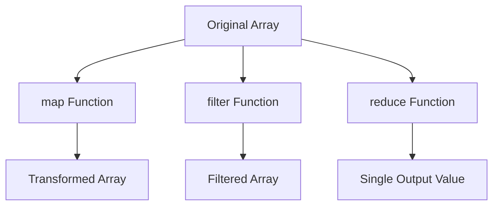

## 9.4 Built-in Higher-Order Functions

JavaScript is a versatile language that supports multiple programming paradigms, including functional programming. One of the key features that enable functional programming in JavaScript is higher-order functions. In this section, we will delve into some of the most commonly used built-in higher-order functions: `map`, `filter`, and `reduce`. These functions are essential tools for working with arrays and can significantly enhance the readability and efficiency of your code.

### Understanding Higher-Order Functions

Before we dive into the specifics of each function, let's briefly revisit what higher-order functions are. A higher-order function is a function that can take other functions as arguments or return them as results. This capability allows for more abstract and flexible code, enabling developers to create more modular and reusable functions.

### The `map` Method

The `map` method is a higher-order function that creates a new array by applying a provided function to each element of the original array. It is a powerful tool for transforming data.

#### Purpose and Syntax

The primary purpose of `map` is to transform an array into a new array where each element is the result of applying a function to the corresponding element in the original array. The syntax for `map` is as follows:

```javascript
array.map(callback(currentValue[, index[, array]])[, thisArg])
```

- **callback**: A function that is called for every element of the array. It receives three arguments:
  - `currentValue`: The current element being processed.
  - `index` (optional): The index of the current element.
  - `array` (optional): The array `map` was called upon.
- **thisArg** (optional): A value to use as `this` when executing the callback.

#### Example of `map`

Let's look at an example where we use `map` to double the values in an array:

```javascript
const numbers = [1, 2, 3, 4, 5];
const doubled = numbers.map(number => number * 2);

console.log(doubled); // Output: [2, 4, 6, 8, 10]
```

In this example, the `map` function iterates over each element in the `numbers` array, applies the transformation `number * 2`, and returns a new array `doubled` with the transformed values.

#### Try It Yourself

Try modifying the example above to square each number instead of doubling it. What changes do you need to make?

### The `filter` Method

The `filter` method is another higher-order function that creates a new array with all elements that pass a test implemented by the provided function.

#### Purpose and Syntax

The `filter` method is used to create a subset of an array based on a condition. The syntax for `filter` is as follows:

```javascript
array.filter(callback(element[, index[, array]])[, thisArg])
```

- **callback**: A function that is called for every element of the array. It receives three arguments:
  - `element`: The current element being processed.
  - `index` (optional): The index of the current element.
  - `array` (optional): The array `filter` was called upon.
- **thisArg** (optional): A value to use as `this` when executing the callback.

#### Example of `filter`

Let's filter an array to include only even numbers:

```javascript
const numbers = [1, 2, 3, 4, 5, 6];
const evenNumbers = numbers.filter(number => number % 2 === 0);

console.log(evenNumbers); // Output: [2, 4, 6]
```

In this example, the `filter` function checks each element to see if it is even. If the condition `number % 2 === 0` is true, the element is included in the new array `evenNumbers`.

#### Try It Yourself

Modify the example above to filter out numbers greater than 3. What does the resulting array look like?

### The `reduce` Method

The `reduce` method is a powerful higher-order function that executes a reducer function on each element of the array, resulting in a single output value.

#### Purpose and Syntax

The `reduce` method is used to accumulate values in an array into a single result. The syntax for `reduce` is as follows:

```javascript
array.reduce(callback(accumulator, currentValue[, index[, array]])[, initialValue])
```

- **callback**: A function to execute on each element in the array. It receives four arguments:
  - `accumulator`: The accumulated value previously returned in the last invocation of the callback, or `initialValue`, if supplied.
  - `currentValue`: The current element being processed.
  - `index` (optional): The index of the current element.
  - `array` (optional): The array `reduce` was called upon.
- **initialValue** (optional): A value to use as the first argument to the first call of the callback.

#### Example of `reduce`

Let's use `reduce` to sum all the numbers in an array:

```javascript
const numbers = [1, 2, 3, 4, 5];
const sum = numbers.reduce((accumulator, currentValue) => accumulator + currentValue, 0);

console.log(sum); // Output: 15
```

In this example, the `reduce` function iterates over each element in the `numbers` array, adding each element to the `accumulator`, which starts at 0. The final result is the sum of all numbers.

#### Try It Yourself

Try using `reduce` to find the product of all numbers in the array. What changes do you need to make to the code?

### Promoting Functional Programming Practices

The use of `map`, `filter`, and `reduce` promotes functional programming practices in JavaScript. These methods encourage:

- **Immutability**: They do not modify the original array but return a new array, preserving the original data.
- **Declarative Code**: They allow you to express what you want to achieve rather than how to achieve it, leading to more readable and maintainable code.
- **Reusability**: By using functions as arguments, you can easily reuse logic across different parts of your application.

### Visualizing Array Transformations

To better understand how these methods work, let's visualize the transformation process using a flowchart.



**Diagram Description**: This flowchart illustrates how the `map`, `filter`, and `reduce` functions transform an original array into a new array or a single output value.

### References and Further Reading

For more information on these methods, you can refer to the following resources:

- [MDN Web Docs - Array.prototype.map()](https://developer.mozilla.org/en-US/docs/Web/JavaScript/Reference/Global_Objects/Array/map)
- [MDN Web Docs - Array.prototype.filter()](https://developer.mozilla.org/en-US/docs/Web/JavaScript/Reference/Global_Objects/Array/filter)
- [MDN Web Docs - Array.prototype.reduce()](https://developer.mozilla.org/en-US/docs/Web/JavaScript/Reference/Global_Objects/Array/reduce)

### Knowledge Check

Let's test your understanding of built-in higher-order functions with a few questions:

1. What is the primary purpose of the `map` method?
2. How does the `filter` method determine which elements to include in the new array?
3. What is the role of the `accumulator` in the `reduce` method?
4. How do `map`, `filter`, and `reduce` promote functional programming practices?
5. Can you use `reduce` to concatenate strings in an array? How?

### Embrace the Journey

Remember, mastering these higher-order functions is just the beginning. As you continue to explore JavaScript, you'll discover even more powerful tools and techniques. Keep experimenting, stay curious, and enjoy the journey!

## Quiz Time!



### What is the primary purpose of the `map` method?

- [x] To transform each element of an array into a new array
- [ ] To filter elements of an array based on a condition
- [ ] To accumulate values into a single result
- [ ] To sort elements of an array

> **Explanation:** The `map` method is used to transform each element of an array into a new array by applying a function to each element.

### How does the `filter` method determine which elements to include in the new array?

- [x] By applying a test function to each element and including those that pass
- [ ] By transforming each element with a provided function
- [ ] By accumulating elements into a single result
- [ ] By sorting elements based on a condition

> **Explanation:** The `filter` method includes elements in the new array if they pass the test implemented by the provided function.

### What is the role of the `accumulator` in the `reduce` method?

- [x] To store the accumulated result of the function across all elements
- [ ] To filter elements based on a condition
- [ ] To transform each element into a new array
- [ ] To sort elements of an array

> **Explanation:** The `accumulator` in the `reduce` method stores the accumulated result of the function across all elements, leading to a single output value.

### How do `map`, `filter`, and `reduce` promote functional programming practices?

- [x] By encouraging immutability and declarative code
- [ ] By modifying the original array
- [ ] By using imperative programming techniques
- [ ] By requiring complex loops

> **Explanation:** These methods promote functional programming by encouraging immutability (not modifying the original array) and allowing for declarative code, which is more readable and maintainable.

### Can you use `reduce` to concatenate strings in an array? How?

- [x] Yes, by using `reduce` with a function that concatenates each string to the accumulator
- [ ] No, `reduce` can only be used with numbers
- [ ] Yes, but only if the array is sorted first
- [ ] No, `reduce` is not suitable for strings

> **Explanation:** You can use `reduce` to concatenate strings by providing a function that adds each string to the accumulator, resulting in a single concatenated string.

### Which method would you use to create a new array with elements that meet a specific condition?

- [ ] map
- [x] filter
- [ ] reduce
- [ ] sort

> **Explanation:** The `filter` method is used to create a new array with elements that meet a specific condition.

### What does the `map` method return?

- [x] A new array with transformed elements
- [ ] A single value
- [ ] The original array with modified elements
- [ ] A sorted array

> **Explanation:** The `map` method returns a new array with elements that have been transformed by the provided function.

### What is the initial value in the `reduce` method used for?

- [x] To set the initial value of the accumulator
- [ ] To determine the first element to process
- [ ] To filter elements before reducing
- [ ] To sort elements before reducing

> **Explanation:** The initial value in the `reduce` method is used to set the initial value of the accumulator, which is then used in the first call of the callback function.

### Which method would you use to apply a function to each element of an array and return a single value?

- [ ] map
- [ ] filter
- [x] reduce
- [ ] sort

> **Explanation:** The `reduce` method is used to apply a function to each element of an array and return a single value.

### True or False: The `map` method modifies the original array.

- [ ] True
- [x] False

> **Explanation:** False. The `map` method does not modify the original array; it returns a new array with transformed elements.


