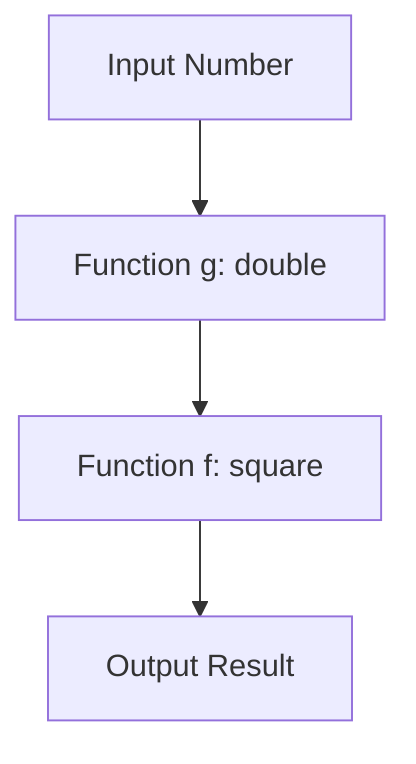

## 9.5 Practical Examples

In this section, we'll delve into practical examples of higher-order functions in JavaScript. Higher-order functions are a powerful feature that can greatly simplify complex tasks, such as data processing, by allowing us to write more modular and reusable code. We'll explore how to implement these functions in real-world scenarios, provide exercises to practice, and offer solutions for self-assessment.

### Understanding Higher-Order Functions

Before we dive into examples, let's briefly recap what higher-order functions are. A higher-order function is a function that can take other functions as arguments or return them as results. This capability allows us to create more abstract and flexible code.

### Practical Example 1: Filtering Data

Let's start with a common task: filtering data. Suppose we have an array of objects representing people, and we want to filter out those who are adults (age 18 and above).

```javascript
// Array of people
const people = [
  { name: 'Alice', age: 17 },
  { name: 'Bob', age: 22 },
  { name: 'Charlie', age: 15 },
  { name: 'David', age: 30 }
];

// Higher-order function to filter adults
function filterAdults(people, callback) {
  return people.filter(callback);
}

// Callback function to check if a person is an adult
function isAdult(person) {
  return person.age >= 18;
}

// Using the higher-order function
const adults = filterAdults(people, isAdult);
console.log(adults);
```

In this example, `filterAdults` is a higher-order function that takes an array of people and a callback function `isAdult`. It uses the `filter` method to return only those people who meet the criteria defined in `isAdult`.

### Practical Example 2: Transforming Data

Next, let's look at transforming data. Imagine you have an array of numbers, and you want to square each number.

```javascript
// Array of numbers
const numbers = [1, 2, 3, 4, 5];

// Higher-order function to transform numbers
function transformNumbers(numbers, callback) {
  return numbers.map(callback);
}

// Callback function to square a number
function square(number) {
  return number * number;
}

// Using the higher-order function
const squaredNumbers = transformNumbers(numbers, square);
console.log(squaredNumbers);
```

Here, `transformNumbers` is a higher-order function that takes an array of numbers and a callback function `square`. It uses the `map` method to apply the transformation to each number.

### Practical Example 3: Reducing Data

Reducing data is another common task. Let's say we want to calculate the total age of all people in our array.

```javascript
// Higher-order function to reduce data
function totalAge(people, callback, initialValue) {
  return people.reduce(callback, initialValue);
}

// Callback function to sum ages
function sumAges(total, person) {
  return total + person.age;
}

// Using the higher-order function
const total = totalAge(people, sumAges, 0);
console.log(total);
```

In this example, `totalAge` is a higher-order function that uses the `reduce` method. It takes an array of people, a callback function `sumAges`, and an initial value for the total age.

### Practical Example 4: Composing Functions

Function composition is a powerful technique that allows us to combine simple functions to create more complex operations. Let's compose functions to first double a number and then square it.

```javascript
// Function to double a number
function double(number) {
  return number * 2;
}

// Function to compose two functions
function compose(f, g) {
  return function(x) {
    return f(g(x));
  };
}

// Composing double and square
const doubleThenSquare = compose(square, double);

// Using the composed function
const result = doubleThenSquare(3);
console.log(result);
```

In this example, `compose` is a higher-order function that takes two functions `f` and `g` and returns a new function that applies `g` to its argument and then `f` to the result.

### Practical Example 5: Sorting with Custom Criteria

Sorting data with custom criteria is another practical use of higher-order functions. Let's sort our array of people by age.

```javascript
// Higher-order function to sort data
function sortByAge(people, callback) {
  return people.sort(callback);
}

// Callback function to compare ages
function compareAges(personA, personB) {
  return personA.age - personB.age;
}

// Using the higher-order function
const sortedPeople = sortByAge(people, compareAges);
console.log(sortedPeople);
```

Here, `sortByAge` is a higher-order function that uses the `sort` method with a custom comparison function `compareAges`.

### Try It Yourself

Now it's your turn! Try modifying the examples above to:

1. Filter people who are under 18.
2. Transform numbers by cubing them instead of squaring.
3. Calculate the average age of people.
4. Compose functions to first square a number and then double it.
5. Sort people by name instead of age.

### Solutions

1. **Filter people who are under 18:**

```javascript
function isUnderage(person) {
  return person.age < 18;
}

const underagePeople = filterAdults(people, isUnderage);
console.log(underagePeople);
```

2. **Transform numbers by cubing them:**

```javascript
function cube(number) {
  return number * number * number;
}

const cubedNumbers = transformNumbers(numbers, cube);
console.log(cubedNumbers);
```

3. **Calculate the average age of people:**

```javascript
function averageAge(people) {
  const total = totalAge(people, sumAges, 0);
  return total / people.length;
}

const average = averageAge(people);
console.log(average);
```

4. **Compose functions to first square a number and then double it:**

```javascript
const squareThenDouble = compose(double, square);

const result2 = squareThenDouble(3);
console.log(result2);
```

5. **Sort people by name:**

```javascript
function compareNames(personA, personB) {
  return personA.name.localeCompare(personB.name);
}

const sortedByName = sortByAge(people, compareNames);
console.log(sortedByName);
```

### Visualizing Function Composition

To better understand function composition, let's visualize it using a flowchart.



**Caption:** This flowchart illustrates the process of composing two functions, `double` and `square`, to transform an input number.

### References and Further Reading

- [MDN Web Docs: Array.prototype.filter()](https://developer.mozilla.org/en-US/docs/Web/JavaScript/Reference/Global_Objects/Array/filter)
- [MDN Web Docs: Array.prototype.map()](https://developer.mozilla.org/en-US/docs/Web/JavaScript/Reference/Global_Objects/Array/map)
- [MDN Web Docs: Array.prototype.reduce()](https://developer.mozilla.org/en-US/docs/Web/JavaScript/Reference/Global_Objects/Array/reduce)
- [MDN Web Docs: Array.prototype.sort()](https://developer.mozilla.org/en-US/docs/Web/JavaScript/Reference/Global_Objects/Array/sort)

### Knowledge Check

- What is a higher-order function?
- How can higher-order functions simplify data processing tasks?
- Can you write a higher-order function that applies a discount to each item in a shopping cart?
- How would you modify a function to sort an array of strings by their length?

### Embrace the Journey

Remember, mastering higher-order functions is a journey. As you practice and experiment with these concepts, you'll find new ways to simplify and enhance your code. Keep exploring, stay curious, and enjoy the process of becoming a more proficient JavaScript developer!

## Quiz Time!



### What is a higher-order function in JavaScript?

- [x] A function that takes other functions as arguments or returns them as results.
- [ ] A function that only performs arithmetic operations.
- [ ] A function that is defined using the `function` keyword.
- [ ] A function that can only be used with arrays.

> **Explanation:** A higher-order function is one that can take other functions as arguments or return them as results, allowing for more abstract and flexible code.

### Which method is commonly used with higher-order functions to filter data?

- [x] `filter`
- [ ] `map`
- [ ] `reduce`
- [ ] `sort`

> **Explanation:** The `filter` method is used to create a new array with all elements that pass the test implemented by the provided function.

### What does the `reduce` method do in JavaScript?

- [x] It executes a reducer function on each element of the array, resulting in a single output value.
- [ ] It creates a new array with the results of calling a provided function on every element.
- [ ] It sorts the elements of an array in place.
- [ ] It filters elements based on a condition.

> **Explanation:** The `reduce` method applies a function against an accumulator and each element in the array to reduce it to a single value.

### How can function composition be described?

- [x] Combining simple functions to build more complex operations.
- [ ] Writing functions that only perform one task.
- [ ] Using functions to modify global variables.
- [ ] Creating functions that do not return any value.

> **Explanation:** Function composition involves combining simple functions to build more complex operations, allowing for modular and reusable code.

### What is the purpose of the `map` method in JavaScript?

- [x] To create a new array with the results of calling a provided function on every element.
- [ ] To filter elements based on a condition.
- [ ] To sort the elements of an array in place.
- [ ] To execute a reducer function on each element of the array.

> **Explanation:** The `map` method creates a new array populated with the results of calling a provided function on every element in the calling array.

### How can higher-order functions improve code reusability?

- [x] By allowing functions to be passed as arguments or returned, enabling modular code.
- [ ] By making functions longer and more complex.
- [ ] By reducing the number of functions needed in a program.
- [ ] By preventing functions from being reused.

> **Explanation:** Higher-order functions improve reusability by allowing functions to be passed as arguments or returned, enabling more modular and flexible code.

### What is a practical use of the `sort` method with higher-order functions?

- [x] Sorting data with custom criteria using a comparison function.
- [ ] Filtering data based on a condition.
- [ ] Transforming data by applying a function to each element.
- [ ] Reducing data to a single value.

> **Explanation:** The `sort` method can be used with a comparison function to sort data with custom criteria, making it a practical use of higher-order functions.

### Which of the following is NOT a characteristic of higher-order functions?

- [ ] They can take other functions as arguments.
- [ ] They can return functions as results.
- [x] They can only be used with arrays.
- [ ] They allow for more abstract and flexible code.

> **Explanation:** Higher-order functions are not limited to arrays; they can be used with any data type and allow for more abstract and flexible code.

### What is the result of composing two functions, `f` and `g`, where `f(g(x))` is applied?

- [x] The result of applying `g` to `x` and then `f` to the result.
- [ ] The result of applying `f` to `x` and then `g` to the result.
- [ ] The result of applying both `f` and `g` to `x` simultaneously.
- [ ] The result of applying `f` to `g` without any input.

> **Explanation:** Function composition involves applying `g` to `x` first and then `f` to the result, which is the essence of composing functions.

### True or False: Higher-order functions can only be used in functional programming languages.

- [ ] True
- [x] False

> **Explanation:** False. Higher-order functions can be used in many programming languages, including JavaScript, which supports both functional and imperative programming paradigms.




