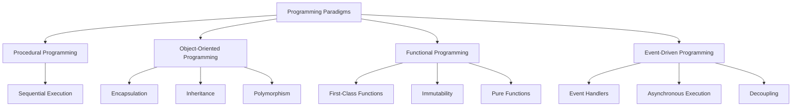

## 1.1 Introduction to Programming Paradigms

Welcome to the fascinating world of programming paradigms! As we embark on this journey, we'll explore the different styles and approaches that shape how we write and think about code. Understanding programming paradigms is crucial for any aspiring software developer, as they provide the foundational principles that guide the design and structure of programs. In this section, we'll delve into the core paradigms: procedural, object-oriented, functional, and event-driven programming. We'll illustrate each with examples and discuss their significance in the evolution of programming languages.

### What Are Programming Paradigms?

Programming paradigms are essentially the methodologies or styles of programming that dictate how we structure and write code. They provide a framework for solving problems and organizing code in a way that is logical, efficient, and maintainable. Each paradigm offers a unique perspective on how to approach programming tasks, and understanding these paradigms can greatly enhance your ability to write effective code.

#### The Role of Programming Paradigms

Programming paradigms play a pivotal role in shaping the design of programming languages. They influence the syntax, features, and capabilities of a language, guiding developers in how they should think about and solve problems. By understanding the different paradigms, developers can choose the most appropriate approach for a given problem, leading to more efficient and elegant solutions.

### Overview of Main Programming Paradigms

Let's take a closer look at the main programming paradigms and their characteristics.

#### Procedural Programming

Procedural programming is one of the oldest and most straightforward paradigms. It is based on the concept of procedure calls, where a program is composed of a sequence of instructions that execute one after another. This paradigm emphasizes a clear sequence of steps to achieve a desired outcome.

**Key Characteristics:**
- **Sequential Execution:** Code is executed in a linear, step-by-step manner.
- **Use of Procedures/Functions:** Code is organized into reusable blocks called procedures or functions.
- **State and Variables:** Relies on variables to store and manipulate data.

**Example:**

```javascript
// Procedural approach to calculate the sum of an array
function calculateSum(array) {
    let sum = 0;
    for (let i = 0; i < array.length; i++) {
        sum += array[i];
    }
    return sum;
}

const numbers = [1, 2, 3, 4, 5];
console.log(calculateSum(numbers)); // Output: 15
```

In this example, we define a function `calculateSum` that takes an array as input and calculates the sum of its elements using a loop. The procedural approach focuses on the sequence of operations needed to achieve the result.

#### Object-Oriented Programming (OOP)

Object-oriented programming is a paradigm that organizes code around objects, which are instances of classes. It emphasizes encapsulation, inheritance, and polymorphism to create modular and reusable code.

**Key Characteristics:**
- **Encapsulation:** Bundles data and methods that operate on the data within objects.
- **Inheritance:** Allows classes to inherit properties and methods from other classes.
- **Polymorphism:** Enables objects to be treated as instances of their parent class.

**Example:**

```javascript
// Object-oriented approach to represent a car
class Car {
    constructor(make, model, year) {
        this.make = make;
        this.model = model;
        this.year = year;
    }

    displayInfo() {
        console.log(`${this.year} ${this.make} ${this.model}`);
    }
}

const myCar = new Car('Toyota', 'Corolla', 2020);
myCar.displayInfo(); // Output: 2020 Toyota Corolla
```

In this example, we define a `Car` class with properties and a method to display information about the car. The object-oriented approach focuses on creating objects that represent real-world entities.

#### Functional Programming

Functional programming is a paradigm that treats computation as the evaluation of mathematical functions. It avoids changing state and mutable data, emphasizing the use of pure functions and immutability.

**Key Characteristics:**
- **First-Class Functions:** Functions are treated as first-class citizens and can be passed as arguments or returned from other functions.
- **Immutability:** Data is immutable, meaning it cannot be changed once created.
- **Pure Functions:** Functions have no side effects and return the same output for the same input.

**Example:**

```javascript
// Functional approach to calculate the sum of an array
const numbers = [1, 2, 3, 4, 5];
const sum = numbers.reduce((accumulator, currentValue) => accumulator + currentValue, 0);
console.log(sum); // Output: 15
```

In this example, we use the `reduce` method to calculate the sum of an array. The functional approach focuses on using functions to transform data without modifying it.

#### Event-Driven Programming

Event-driven programming is a paradigm where the flow of the program is determined by events, such as user actions or sensor outputs. It is commonly used in graphical user interfaces and real-time systems.

**Key Characteristics:**
- **Event Handlers:** Functions that are triggered in response to events.
- **Asynchronous Execution:** Code execution is driven by events, which can occur at unpredictable times.
- **Decoupling:** Separates event producers from event consumers.

**Example:**

```javascript
// Event-driven approach to handle a button click
document.getElementById('myButton').addEventListener('click', function() {
    console.log('Button clicked!');
});
```

In this example, we attach an event listener to a button element that logs a message when the button is clicked. The event-driven approach focuses on responding to events as they occur.

### Importance of Programming Paradigms

Programming paradigms are essential because they provide a structured way to approach problem-solving and code organization. They influence how we think about and design software, leading to more efficient and maintainable code. By understanding different paradigms, developers can choose the most suitable approach for their specific needs, leading to better software design and implementation.

#### Shaping Programming Languages

Programming paradigms have a significant impact on the design and features of programming languages. For example, languages like Java and C++ are heavily influenced by the object-oriented paradigm, while languages like Haskell and Lisp are rooted in functional programming. Understanding the paradigms behind a language can help developers leverage its strengths and write more effective code.

### Visualizing Programming Paradigms

To better understand the relationships between different programming paradigms, let's visualize them using a diagram. This diagram illustrates how each paradigm relates to the others and highlights their unique characteristics.



This diagram provides a visual representation of the key characteristics of each programming paradigm, helping to reinforce the concepts we've discussed.

### Try It Yourself

Now that we've explored the main programming paradigms, it's time to experiment with them. Try modifying the code examples provided in this section to deepen your understanding. For instance, you can:

- **Procedural:** Modify the `calculateSum` function to calculate the product of the array elements instead.
- **Object-Oriented:** Add a method to the `Car` class to calculate the car's age based on the current year.
- **Functional:** Use the `map` function to create a new array with each element squared.
- **Event-Driven:** Add an event listener to change the button's text when clicked.

By experimenting with these examples, you'll gain hands-on experience with each paradigm and better understand their unique features.

### References and Further Reading

For more information on programming paradigms, consider exploring the following resources:

- [MDN Web Docs: JavaScript Guide](https://developer.mozilla.org/en-US/docs/Web/JavaScript/Guide)
- [W3Schools: JavaScript Tutorial](https://www.w3schools.com/js/)
- [Eloquent JavaScript: A Modern Introduction to Programming](https://eloquentjavascript.net/)

### Knowledge Check

Let's reinforce what we've learned with a few questions:

1. What are programming paradigms, and why are they important?
2. How does procedural programming differ from object-oriented programming?
3. What are the key characteristics of functional programming?
4. How does event-driven programming handle asynchronous execution?
5. Why is it beneficial to understand multiple programming paradigms?

### Embrace the Journey

As you continue your journey into the world of programming, remember that understanding programming paradigms is just the beginning. Each paradigm offers unique insights and tools that can enhance your coding skills and problem-solving abilities. Keep experimenting, stay curious, and enjoy the process of learning and growing as a developer!

## Quiz Time!



### What is a programming paradigm?

- [x] A style or methodology of programming
- [ ] A specific programming language
- [ ] A type of software application
- [ ] A hardware component

> **Explanation:** A programming paradigm is a style or methodology of programming that provides a framework for solving problems and organizing code.

### Which paradigm emphasizes sequential execution and the use of procedures?

- [x] Procedural Programming
- [ ] Object-Oriented Programming
- [ ] Functional Programming
- [ ] Event-Driven Programming

> **Explanation:** Procedural programming emphasizes sequential execution and organizes code into reusable blocks called procedures or functions.

### What is a key characteristic of object-oriented programming?

- [x] Encapsulation
- [ ] First-Class Functions
- [ ] Immutability
- [ ] Event Handlers

> **Explanation:** Encapsulation is a key characteristic of object-oriented programming, where data and methods are bundled within objects.

### In functional programming, what is meant by "pure functions"?

- [x] Functions that have no side effects and return the same output for the same input
- [ ] Functions that can modify global variables
- [ ] Functions that are executed asynchronously
- [ ] Functions that handle events

> **Explanation:** Pure functions in functional programming have no side effects and return the same output for the same input, ensuring predictability and reliability.

### How does event-driven programming handle code execution?

- [x] By responding to events as they occur
- [ ] By executing code in a strict sequence
- [ ] By using pure functions
- [ ] By encapsulating data within objects

> **Explanation:** Event-driven programming handles code execution by responding to events as they occur, allowing for asynchronous and dynamic interactions.

### Which paradigm is most associated with inheritance and polymorphism?

- [x] Object-Oriented Programming
- [ ] Procedural Programming
- [ ] Functional Programming
- [ ] Event-Driven Programming

> **Explanation:** Object-oriented programming is most associated with inheritance and polymorphism, allowing for code reuse and flexibility.

### What is a common feature of functional programming languages?

- [x] First-Class Functions
- [ ] Sequential Execution
- [ ] Event Handlers
- [ ] Inheritance

> **Explanation:** Functional programming languages commonly feature first-class functions, allowing functions to be passed as arguments and returned from other functions.

### What is the primary focus of procedural programming?

- [x] The sequence of operations needed to achieve a result
- [ ] The creation of objects and classes
- [ ] The use of pure functions
- [ ] The handling of events

> **Explanation:** Procedural programming primarily focuses on the sequence of operations needed to achieve a result, organizing code into procedures or functions.

### What is an advantage of understanding multiple programming paradigms?

- [x] It allows developers to choose the most suitable approach for a given problem
- [ ] It limits the types of problems that can be solved
- [ ] It restricts the use of certain programming languages
- [ ] It simplifies code to a single style

> **Explanation:** Understanding multiple programming paradigms allows developers to choose the most suitable approach for a given problem, leading to more efficient and effective solutions.

### True or False: Event-driven programming is commonly used in graphical user interfaces.

- [x] True
- [ ] False

> **Explanation:** True. Event-driven programming is commonly used in graphical user interfaces, where user actions trigger events that drive the program's flow.


