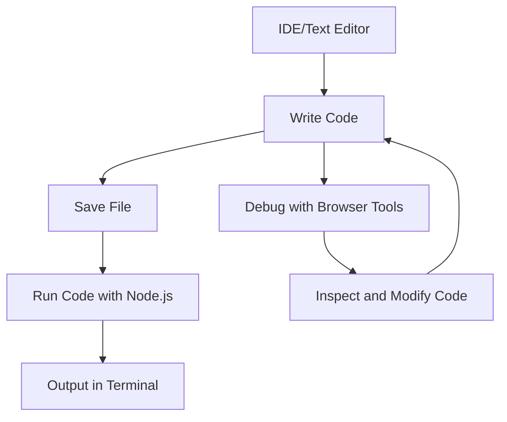

## 1.10 Setting Up Your Development Environment

Welcome to the exciting journey of learning Object-Oriented Programming (OOP) in JavaScript! Before we dive into coding, it's crucial to set up a development environment that will support your learning and development process. A well-configured environment can significantly enhance your productivity and make coding more enjoyable. In this section, we'll guide you through setting up your development environment, including choosing an Integrated Development Environment (IDE) or text editor, installing Node.js and npm, and utilizing browser developer tools for testing and debugging.

### Choosing the Right IDE or Text Editor

The first step in setting up your development environment is selecting an IDE or text editor that suits your needs. An IDE is a software application that provides comprehensive facilities to computer programmers for software development, while a text editor is a simpler tool that allows you to write and edit code. Here are some popular options for JavaScript development:

#### Visual Studio Code (VS Code)

- **Overview**: Visual Studio Code, commonly known as VS Code, is a free, open-source code editor developed by Microsoft. It is highly popular among developers due to its versatility and extensive range of extensions.
- **Features**:
  - **IntelliSense**: Provides smart code completions based on variable types, function definitions, and imported modules.
  - **Integrated Terminal**: Allows you to run command-line tools directly within the editor.
  - **Extensions**: A vast library of extensions to enhance functionality, such as ESLint for linting and Prettier for code formatting.
  - **Version Control**: Built-in Git support for version control.
- **Installation**: Visit the [Visual Studio Code website](https://code.visualstudio.com/) to download and install the editor for your operating system.

#### Sublime Text

- **Overview**: Sublime Text is a lightweight, cross-platform text editor known for its speed and simplicity.
- **Features**:
  - **Multiple Selections**: Make ten changes at the same time, not one change ten times.
  - **Command Palette**: Access frequently used functions quickly.
  - **Split Editing**: Edit files side by side.
- **Installation**: Download Sublime Text from the [official website](https://www.sublimetext.com/).

#### Atom

- **Overview**: Atom is a free, open-source text editor developed by GitHub. It is highly customizable and has a large community of users.
- **Features**:
  - **Teletype**: Collaborate with other developers in real-time.
  - **File System Browser**: Easily browse and open files and projects.
  - **Themes**: Customize the look and feel with themes.
- **Installation**: Get Atom from the [Atom website](https://atom.io/).

#### WebStorm

- **Overview**: WebStorm is a commercial IDE developed by JetBrains, specifically designed for JavaScript development.
- **Features**:
  - **Smart Code Assistance**: Code completion, navigation, and refactoring.
  - **Debugging**: Powerful debugging tools for client-side and Node.js applications.
  - **Integration**: Seamless integration with popular frameworks like React, Angular, and Vue.js.
- **Installation**: Download WebStorm from the [JetBrains website](https://www.jetbrains.com/webstorm/).

### Installing Node.js and npm

Node.js is a JavaScript runtime built on Chrome's V8 JavaScript engine. It allows you to run JavaScript code outside of a web browser, making it an essential tool for modern JavaScript development. npm (Node Package Manager) is a package manager for Node.js, which helps you install and manage libraries and dependencies for your projects.

#### Steps to Install Node.js and npm

1. **Download the Installer**:
   - Visit the [Node.js website](https://nodejs.org/) and download the installer for your operating system (Windows, macOS, or Linux).

2. **Run the Installer**:
   - Open the downloaded installer and follow the installation instructions. The installer will automatically install both Node.js and npm.

3. **Verify Installation**:
   - Open your terminal or command prompt and type the following commands to verify the installation:
     ```bash
     node -v
     ```
     This command should return the version number of Node.js installed on your system.
     ```bash
     npm -v
     ```
     This command should return the version number of npm installed on your system.

4. **Update npm (Optional)**:
   - You can update npm to the latest version using the following command:
     ```bash
     npm install -g npm@latest
     ```

### Utilizing Browser Developer Tools

Browser developer tools are essential for testing and debugging JavaScript code. They provide a suite of tools that allow you to inspect, debug, and analyze your web applications. Here are some popular browser developer tools:

#### Google Chrome Developer Tools

- **Overview**: Chrome DevTools is a set of web developer tools built directly into the Google Chrome browser.
- **Features**:
  - **Elements Panel**: Inspect and modify the DOM and CSS.
  - **Console**: Log diagnostic information and interact with the JavaScript environment.
  - **Sources Panel**: Debug JavaScript with breakpoints and watch expressions.
  - **Network Panel**: Analyze network activity and performance.
- **Access**: Right-click on any web page and select "Inspect" or press `Ctrl+Shift+I` (Windows/Linux) or `Cmd+Option+I` (macOS).

#### Firefox Developer Tools

- **Overview**: Firefox Developer Tools offer a powerful set of tools for web development.
- **Features**:
  - **Responsive Design Mode**: Test how your website looks on different devices.
  - **JavaScript Debugger**: Set breakpoints and step through code.
  - **Performance**: Analyze runtime performance and memory usage.
- **Access**: Right-click on a web page and select "Inspect Element" or press `Ctrl+Shift+I` (Windows/Linux) or `Cmd+Option+I` (macOS).

#### Microsoft Edge Developer Tools

- **Overview**: Edge DevTools provide a comprehensive suite of tools for debugging and testing web applications.
- **Features**:
  - **3D View**: Visualize the DOM in 3D.
  - **Emulation**: Simulate different devices and network conditions.
  - **Accessibility**: Check for accessibility issues.
- **Access**: Right-click on a web page and select "Inspect" or press `F12`.

### Setting Up a Simple Project

Now that you have your IDE, Node.js, and browser tools ready, let's set up a simple JavaScript project to test your environment.

#### Create a Project Directory

1. **Open Terminal or Command Prompt**:
   - Navigate to the location where you want to create your project directory.

2. **Create a New Directory**:
   - Use the following command to create a new directory:
     ```bash
     mkdir my-first-js-project
     ```

3. **Navigate to the Directory**:
   - Change into the new directory:
     ```bash
     cd my-first-js-project
     ```

#### Initialize a Node.js Project

1. **Initialize npm**:
   - Run the following command to create a `package.json` file:
     ```bash
     npm init -y
     ```
   - This file will manage your project's dependencies and metadata.

#### Create a JavaScript File

1. **Create a New File**:
   - In your IDE or text editor, create a new file named `app.js`.

2. **Write a Simple JavaScript Program**:
   - Add the following code to `app.js`:
     ```javascript
     // app.js
     console.log("Hello, World! Welcome to JavaScript OOP!");
     ```

3. **Run the JavaScript File**:
   - In your terminal, run the following command to execute the JavaScript file:
     ```bash
     node app.js
     ```
   - You should see the output: `Hello, World! Welcome to JavaScript OOP!`

### Try It Yourself

Now that you have set up your development environment, try modifying the `app.js` file to include more complex logic. For example, add a function that greets the user by name:

```javascript
// app.js
function greet(name) {
  console.log(`Hello, ${name}! Welcome to JavaScript OOP!`);
}

greet("Student");
```

Run the file again using `node app.js` and observe the output. Experiment with different names and messages to get comfortable with editing and running JavaScript code.

### Visualizing the Development Workflow

To better understand how the different components of your development environment interact, let's visualize the workflow using a diagram.



**Diagram Description**: This flowchart illustrates the typical workflow in a JavaScript development environment. You write code in an IDE or text editor, save the file, run the code using Node.js, and view the output in the terminal. You can also debug and inspect code using browser developer tools, making modifications as needed.

### References and Resources

- [Visual Studio Code Documentation](https://code.visualstudio.com/docs)
- [Node.js Official Website](https://nodejs.org/)
- [Google Chrome DevTools](https://developer.chrome.com/docs/devtools/)
- [Mozilla Firefox Developer Tools](https://developer.mozilla.org/en-US/docs/Tools)

### Knowledge Check

Before we wrap up, let's reinforce what we've learned with a few questions:

- What is the role of an IDE in JavaScript development?
- How do you verify the installation of Node.js and npm?
- Name two features of Chrome Developer Tools.
- What command is used to initialize a Node.js project?

### Embrace the Journey

Setting up your development environment is the first step in your journey to mastering JavaScript and Object-Oriented Programming. Remember, this is just the beginning. As you progress, you'll build more complex and interactive applications. Keep experimenting, stay curious, and enjoy the journey!

## Quiz Time!



### What is an IDE?

- [x] A software application that provides comprehensive facilities to computer programmers for software development.
- [ ] A simple tool that allows you to write and edit code.
- [ ] A package manager for Node.js.
- [ ] A set of web developer tools built into browsers.

> **Explanation:** An IDE, or Integrated Development Environment, is a software application that provides comprehensive facilities to computer programmers for software development.

### Which of the following is a feature of Visual Studio Code?

- [x] IntelliSense
- [ ] Teletype
- [ ] 3D View
- [ ] Command Palette

> **Explanation:** IntelliSense is a feature of Visual Studio Code that provides smart code completions based on variable types, function definitions, and imported modules.

### How do you verify the installation of Node.js?

- [x] By typing `node -v` in the terminal.
- [ ] By typing `npm -v` in the terminal.
- [ ] By visiting the Node.js website.
- [ ] By opening a JavaScript file.

> **Explanation:** You can verify the installation of Node.js by typing `node -v` in the terminal, which returns the version number of Node.js installed on your system.

### Which command is used to initialize a Node.js project?

- [x] `npm init -y`
- [ ] `node init`
- [ ] `npm start`
- [ ] `node install`

> **Explanation:** The command `npm init -y` is used to initialize a Node.js project, creating a `package.json` file with default settings.

### What is the purpose of browser developer tools?

- [x] To inspect, debug, and analyze web applications.
- [ ] To write and edit code.
- [ ] To manage libraries and dependencies.
- [ ] To provide a global point of access.

> **Explanation:** Browser developer tools are used to inspect, debug, and analyze web applications, providing a suite of tools for web development.

### Which of the following is a feature of Chrome DevTools?

- [x] Elements Panel
- [ ] Multiple Selections
- [ ] Smart Code Assistance
- [ ] Split Editing

> **Explanation:** The Elements Panel is a feature of Chrome DevTools that allows you to inspect and modify the DOM and CSS.

### What is npm?

- [x] A package manager for Node.js.
- [ ] A JavaScript runtime built on Chrome's V8 engine.
- [ ] A set of web developer tools built into browsers.
- [ ] A software application that provides comprehensive facilities to computer programmers for software development.

> **Explanation:** npm, or Node Package Manager, is a package manager for Node.js that helps you install and manage libraries and dependencies for your projects.

### How can you access Firefox Developer Tools?

- [x] Right-click on a web page and select "Inspect Element."
- [ ] Press `Ctrl+Shift+I` (Windows/Linux) or `Cmd+Option+I` (macOS).
- [ ] Open the terminal and type `firefox-devtools`.
- [ ] Download from the Firefox website.

> **Explanation:** You can access Firefox Developer Tools by right-clicking on a web page and selecting "Inspect Element" or by pressing `Ctrl+Shift+I` (Windows/Linux) or `Cmd+Option+I` (macOS).

### What command is used to update npm to the latest version?

- [x] `npm install -g npm@latest`
- [ ] `npm update`
- [ ] `node update`
- [ ] `npm upgrade`

> **Explanation:** The command `npm install -g npm@latest` is used to update npm to the latest version globally.

### True or False: WebStorm is a free, open-source IDE.

- [ ] True
- [x] False

> **Explanation:** WebStorm is a commercial IDE developed by JetBrains, specifically designed for JavaScript development, and is not free or open-source.


