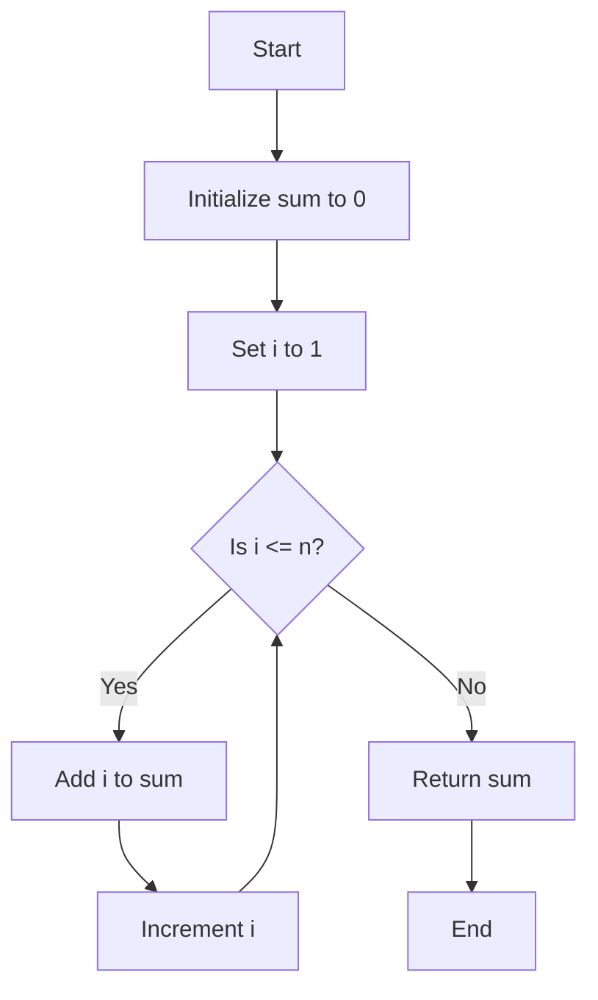

## 1.2 Procedural Programming Basics

Welcome to the world of procedural programming! In this section, we will explore one of the most fundamental programming paradigms that forms the backbone of many programming languages, including JavaScript. Procedural programming is all about writing code in a way that follows a clear, sequential order, much like following a recipe in the kitchen. Let's dive in and understand how this approach works, its characteristics, and why it eventually led to the development of other paradigms.

### Understanding Procedural Programming

Procedural programming is a paradigm that relies on procedures or routines to operate on data. It is characterized by a linear top-down approach where the program is divided into a set of procedures or functions. These functions are blocks of code designed to perform specific tasks and can be reused throughout the program.

#### Key Characteristics of Procedural Programming

1. **Sequential Execution**: Code execution follows a linear path, executing one statement after another. This makes it easy to trace and debug.
2. **Modularity**: Programs are divided into smaller, manageable functions or procedures, promoting code reuse and organization.
3. **Local and Global Variables**: Variables can be defined within functions (local) or outside them (global), affecting their scope and lifetime.
4. **Control Structures**: Use of loops (`for`, `while`) and conditional statements (`if`, `else`) to control the flow of execution.
5. **State Management**: The state of the program is managed through variables and data structures, which are manipulated by functions.

#### Code Execution: A Sequential Journey

In procedural programming, the execution of code is akin to following a step-by-step process. Each line of code is executed in the order it appears unless directed otherwise by control structures. This predictability makes procedural programming intuitive for beginners.

Consider the following analogy: Imagine you are following a recipe to bake a cake. The recipe provides a list of ingredients and a series of steps to follow. You start by gathering the ingredients, then mix them in a specific order, bake the mixture, and finally, let it cool. Each step is crucial and must be followed in sequence to achieve the desired result.

Similarly, in procedural programming, you define a series of instructions for the computer to execute, ensuring that each step is completed before moving on to the next.

### Procedural Programming in Everyday Life

To better understand procedural programming, let's compare it to everyday processes. Consider the task of making a cup of coffee:

1. **Boil Water**: Heat water until it reaches the boiling point.
2. **Add Coffee**: Place coffee grounds in a cup or coffee maker.
3. **Pour Water**: Pour the boiling water over the coffee grounds.
4. **Stir and Serve**: Stir the mixture and serve hot.

Each step is a procedure that must be executed in order. Skipping or rearranging steps could result in an undesirable outcome, much like a program that doesn't function as intended if the sequence is altered.

### A Simple Procedural Program in JavaScript

Let's look at a simple example of procedural programming in JavaScript. We'll write a program that calculates the sum of numbers from 1 to 10.

```javascript
// Function to calculate the sum of numbers from 1 to n
function calculateSum(n) {
  let sum = 0; // Initialize sum variable
  for (let i = 1; i <= n; i++) { // Loop from 1 to n
    sum += i; // Add each number to the sum
  }
  return sum; // Return the final sum
}

// Calculate the sum of numbers from 1 to 10
let result = calculateSum(10);
console.log("The sum of numbers from 1 to 10 is:", result);
```

In this example, we define a function `calculateSum` that takes a number `n` as an argument and calculates the sum of numbers from 1 to `n`. The program follows a sequential flow: initializing a sum variable, iterating through numbers, adding each number to the sum, and finally returning the result.

### Visualizing Program Flow

To better understand how procedural programming works, let's visualize the flow of a simple program using a flowchart.



**Caption**: This flowchart illustrates the sequential execution of a program that calculates the sum of numbers from 1 to `n`. The program starts by initializing a sum variable, then iterates through numbers, adding each to the sum, and finally returns the result.

### Limitations of Procedural Programming

While procedural programming is straightforward and easy to understand, it has certain limitations that led to the development of other paradigms, such as object-oriented programming (OOP) and functional programming. Let's explore some of these limitations:

1. **Scalability**: As programs grow in size and complexity, managing and maintaining procedural code becomes challenging. Functions can become long and difficult to understand.
2. **Code Reusability**: Although functions promote reuse, procedural programming lacks the abstraction and encapsulation provided by OOP, making it harder to reuse code across different projects.
3. **Data and Function Separation**: In procedural programming, data and functions are separate entities. This can lead to issues with data integrity and security, as functions can inadvertently modify global data.
4. **Limited Abstraction**: Procedural programming does not provide mechanisms for modeling real-world entities and relationships, which can make it less intuitive for certain applications.

### Transitioning to Other Paradigms

The limitations of procedural programming prompted the development of other paradigms that offer more flexibility and abstraction. Object-oriented programming, for example, introduces the concept of objects, which encapsulate data and behavior, promoting code reuse and modularity.

Functional programming, on the other hand, emphasizes immutability and the use of pure functions, reducing side effects and making code more predictable.

### Try It Yourself

Now that we've covered the basics of procedural programming, try modifying the code example provided earlier. Experiment with different ranges of numbers or add additional functionality, such as calculating the product of numbers instead of the sum. This hands-on practice will help reinforce your understanding of procedural programming concepts.

### References and Further Reading

- [MDN Web Docs: Introduction to JavaScript](https://developer.mozilla.org/en-US/docs/Web/JavaScript/Guide/Introduction)
- [W3Schools: JavaScript Functions](https://www.w3schools.com/js/js_functions.asp)

### Knowledge Check

Before we wrap up, let's summarize the key takeaways from this section:

- Procedural programming is a paradigm that structures code in a sequential manner, using functions to perform specific tasks.
- Code execution follows a linear path, making it intuitive and easy to debug.
- While procedural programming is straightforward, it has limitations in scalability, code reusability, and data management.
- The development of other paradigms, such as OOP and functional programming, addresses these limitations by offering more abstraction and flexibility.

Remember, this is just the beginning. As you progress, you'll build more complex and interactive web pages. Keep experimenting, stay curious, and enjoy the journey!

## Quiz Time!



### What is a key characteristic of procedural programming?

- [x] Sequential execution of code
- [ ] Use of classes and objects
- [ ] Emphasis on immutability
- [ ] Event-driven architecture

> **Explanation:** Procedural programming is characterized by the sequential execution of code, where instructions are executed in the order they appear.

### How does procedural programming handle code execution?

- [x] In a linear, top-down manner
- [ ] By using event listeners
- [ ] Through asynchronous callbacks
- [ ] By encapsulating data in objects

> **Explanation:** Procedural programming executes code in a linear, top-down manner, following a sequence of instructions.

### What is an example of a real-world process similar to procedural programming?

- [x] Following a recipe
- [ ] Designing a blueprint
- [ ] Organizing a database
- [ ] Creating a user interface

> **Explanation:** Following a recipe is similar to procedural programming, as it involves executing steps in a specific order to achieve a desired outcome.

### What is a limitation of procedural programming?

- [x] Difficulty in managing large codebases
- [ ] Lack of support for asynchronous operations
- [ ] Inability to define functions
- [ ] Overhead of creating classes

> **Explanation:** Procedural programming can become difficult to manage as codebases grow larger, due to its lack of abstraction and encapsulation.

### Which paradigm was developed to address the limitations of procedural programming?

- [x] Object-oriented programming
- [ ] Event-driven programming
- [ ] Declarative programming
- [ ] Reactive programming

> **Explanation:** Object-oriented programming was developed to address the limitations of procedural programming by introducing concepts like encapsulation and abstraction.

### What is the role of functions in procedural programming?

- [x] To perform specific tasks and promote code reuse
- [ ] To define classes and objects
- [ ] To handle asynchronous operations
- [ ] To manage state transitions

> **Explanation:** Functions in procedural programming perform specific tasks and promote code reuse, making programs more modular and organized.

### How does procedural programming manage program state?

- [x] Through variables and data structures
- [ ] By using event listeners
- [ ] Through class inheritance
- [ ] By defining interfaces

> **Explanation:** Procedural programming manages program state through variables and data structures, which are manipulated by functions.

### What is a common control structure used in procedural programming?

- [x] Loops and conditional statements
- [ ] Event listeners
- [ ] Promises and async/await
- [ ] Class constructors

> **Explanation:** Loops and conditional statements are common control structures in procedural programming, used to control the flow of execution.

### What is a benefit of procedural programming for beginners?

- [x] Intuitive and easy to debug
- [ ] Supports complex data modeling
- [ ] Emphasizes immutability
- [ ] Provides built-in concurrency

> **Explanation:** Procedural programming is intuitive and easy to debug, making it a good starting point for beginners learning to code.

### True or False: Procedural programming is the only paradigm used in JavaScript.

- [ ] True
- [x] False

> **Explanation:** False. JavaScript is a multi-paradigm language that supports procedural, object-oriented, and functional programming.




