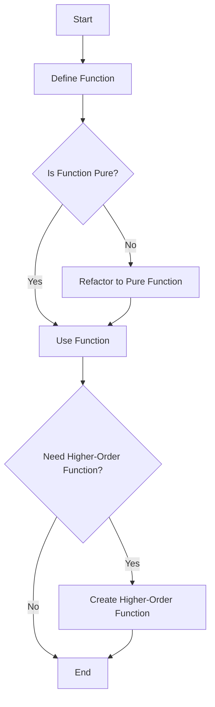

## 1.3 Overview of Functional Programming

In the world of programming, various paradigms offer different approaches to solving problems. One such paradigm is **Functional Programming (FP)**, which emphasizes the use of functions to achieve computational results. In this section, we will delve into the core principles of functional programming, understand how JavaScript supports these features, and explore how they can be applied to write clean, efficient, and maintainable code.

### Understanding Functional Programming

Functional programming is a declarative programming paradigm where programs are constructed by applying and composing functions. It treats computation as the evaluation of mathematical functions and avoids changing state or mutable data. Let's break down some of the key concepts:

#### Functions as First-Class Citizens

In functional programming, functions are treated as **first-class citizens**. This means functions can be assigned to variables, passed as arguments to other functions, and returned from other functions. This capability allows for higher-order functions, which are functions that operate on other functions.

**Example:**

```javascript
// Assigning a function to a variable
const greet = function(name) {
  return `Hello, ${name}!`;
};

// Passing a function as an argument
function sayHello(greetingFunction, name) {
  console.log(greetingFunction(name));
}

sayHello(greet, 'Alice'); // Output: Hello, Alice!

// Returning a function from another function
function createMultiplier(multiplier) {
  return function(number) {
    return number * multiplier;
  };
}

const double = createMultiplier(2);
console.log(double(5)); // Output: 10
```

In this example, we see how functions can be manipulated just like any other data type, showcasing their flexibility and power in functional programming.

#### Immutability

Immutability is a core principle of functional programming. It refers to the idea that data should not be changed after it is created. Instead of modifying existing data, new data structures are created. This approach helps prevent side effects and makes code easier to reason about.

**Example:**

```javascript
// Immutable data example
const numbers = [1, 2, 3, 4, 5];

// Using map to create a new array with doubled values
const doubledNumbers = numbers.map(number => number * 2);

console.log(numbers); // Output: [1, 2, 3, 4, 5]
console.log(doubledNumbers); // Output: [2, 4, 6, 8, 10]
```

In this example, the `map` function is used to create a new array `doubledNumbers` without altering the original `numbers` array, demonstrating immutability.

#### Pure Functions

A **pure function** is a function where the output value is determined only by its input values, without observable side effects. This means that calling a pure function with the same arguments will always produce the same result, and it does not modify any external state.

**Example:**

```javascript
// Pure function example
function add(a, b) {
  return a + b;
}

console.log(add(2, 3)); // Output: 5
console.log(add(2, 3)); // Output: 5
```

The `add` function is pure because it consistently returns the same output for the same inputs and does not affect any external state.

### Functional Programming in JavaScript

JavaScript is a multi-paradigm language, meaning it supports multiple programming styles, including functional programming. Let's explore some functional programming features in JavaScript.

#### Higher-Order Functions

Higher-order functions are functions that take other functions as arguments or return them as results. JavaScript's array methods like `map`, `filter`, and `reduce` are examples of higher-order functions.

**Example:**

```javascript
const numbers = [1, 2, 3, 4, 5];

// Using filter to get even numbers
const evenNumbers = numbers.filter(number => number % 2 === 0);

console.log(evenNumbers); // Output: [2, 4]
```

The `filter` function takes a callback function as an argument and returns a new array containing elements that satisfy the condition defined in the callback.

#### Function Composition

Function composition is the process of combining two or more functions to produce a new function. This technique is fundamental in functional programming as it allows for building complex operations from simple functions.

**Example:**

```javascript
// Function composition example
const add = x => x + 1;
const multiply = x => x * 2;

const addThenMultiply = x => multiply(add(x));

console.log(addThenMultiply(5)); // Output: 12
```

In this example, `addThenMultiply` is a composed function that first adds 1 to the input and then multiplies the result by 2.

#### Currying

Currying is a technique of transforming a function that takes multiple arguments into a sequence of functions that each take a single argument. This allows for partial application of functions.

**Example:**

```javascript
// Currying example
function curryAdd(a) {
  return function(b) {
    return a + b;
  };
}

const addFive = curryAdd(5);
console.log(addFive(3)); // Output: 8
```

Here, `curryAdd` is a curried function that returns a new function when called with an argument, allowing for partial application.

#### Recursion

Recursion is a technique where a function calls itself to solve a problem. It is often used in functional programming to handle tasks that involve repetitive operations.

**Example:**

```javascript
// Recursive function example
function factorial(n) {
  if (n === 0) {
    return 1;
  }
  return n * factorial(n - 1);
}

console.log(factorial(5)); // Output: 120
```

The `factorial` function is a classic example of recursion, where the function calls itself to compute the factorial of a number.

### Visualizing Functional Programming Concepts

To better understand how functional programming concepts interact, let's visualize them using a flowchart.



**Diagram Description:** This flowchart illustrates the process of defining a function, checking its purity, and determining if a higher-order function is needed in functional programming.

### Try It Yourself

Now that we've covered the basics, it's time to experiment with these concepts. Try modifying the code examples to see how changes affect the output. For instance, create your own higher-order functions or experiment with currying and recursion.

### Further Reading

For more information on functional programming in JavaScript, consider exploring the following resources:

- [MDN Web Docs: Functional Programming](https://developer.mozilla.org/en-US/docs/Glossary/Functional_programming)
- [Eloquent JavaScript: Functions](https://eloquentjavascript.net/03_functions.html)
- [JavaScript Info: Function Expressions and Arrows](https://javascript.info/function-expressions-arrows)

### Knowledge Check

Before we wrap up, let's summarize the key takeaways:

- **Functions as First-Class Citizens:** Functions can be used like any other variable.
- **Immutability:** Avoid changing data; create new data structures instead.
- **Pure Functions:** Functions that produce the same output for the same inputs without side effects.
- **Higher-Order Functions:** Functions that take other functions as arguments or return them.
- **Function Composition:** Combining simple functions to build complex operations.
- **Currying:** Transforming functions to take one argument at a time.
- **Recursion:** Solving problems by having functions call themselves.

### Embrace the Journey

Remember, this is just the beginning of your journey into functional programming. As you continue to explore and experiment, you'll discover more ways to leverage these concepts to write efficient and elegant code. Keep practicing, stay curious, and enjoy the process!

## Quiz Time!



### What is a key characteristic of functional programming?

- [x] Functions are first-class citizens.
- [ ] Functions cannot be assigned to variables.
- [ ] Functions must always return void.
- [ ] Functions cannot be passed as arguments.

> **Explanation:** In functional programming, functions are treated as first-class citizens, meaning they can be assigned to variables, passed as arguments, and returned from other functions.

### What does immutability in functional programming refer to?

- [x] Data should not be changed after it is created.
- [ ] Data can be freely modified.
- [ ] Functions should not return values.
- [ ] Variables must be declared with `var`.

> **Explanation:** Immutability means that once data is created, it should not be changed. Instead, new data structures should be created.

### What is a pure function?

- [x] A function that returns the same output for the same inputs without side effects.
- [ ] A function that modifies global variables.
- [ ] A function that always returns `undefined`.
- [ ] A function that depends on external state.

> **Explanation:** A pure function consistently returns the same output for the same inputs and does not produce side effects.

### Which JavaScript feature supports functional programming?

- [x] Higher-order functions like `map`, `filter`, and `reduce`.
- [ ] The `for` loop.
- [ ] The `switch` statement.
- [ ] The `break` keyword.

> **Explanation:** Higher-order functions such as `map`, `filter`, and `reduce` are key features that support functional programming in JavaScript.

### What is function composition?

- [x] Combining two or more functions to create a new function.
- [ ] Dividing a function into smaller parts.
- [ ] Writing functions without parameters.
- [ ] Using functions only once.

> **Explanation:** Function composition involves combining multiple functions to form a new function, allowing for complex operations from simple functions.

### What is currying in functional programming?

- [x] Transforming a function that takes multiple arguments into a sequence of functions that each take a single argument.
- [ ] Combining two functions into one.
- [ ] Creating functions without parameters.
- [ ] Using functions to modify global variables.

> **Explanation:** Currying transforms a function with multiple arguments into a series of functions that each take a single argument, enabling partial application.

### What is recursion?

- [x] A technique where a function calls itself.
- [ ] A technique where a function modifies global variables.
- [ ] A technique where a function never returns.
- [ ] A technique where a function is only called once.

> **Explanation:** Recursion is a technique where a function calls itself to solve a problem, often used for repetitive operations.

### Which of the following is an example of a higher-order function?

- [x] `Array.prototype.map`
- [ ] `console.log`
- [ ] `parseInt`
- [ ] `Math.random`

> **Explanation:** `Array.prototype.map` is a higher-order function because it takes a function as an argument and applies it to each element in the array.

### What is the benefit of using pure functions?

- [x] They are predictable and easier to test.
- [ ] They can modify global state.
- [ ] They always return `null`.
- [ ] They require more memory.

> **Explanation:** Pure functions are predictable and easier to test because they always produce the same output for the same inputs and do not have side effects.

### True or False: JavaScript is a purely functional programming language.

- [ ] True
- [x] False

> **Explanation:** False. JavaScript is a multi-paradigm language that supports functional programming but is not purely functional.


