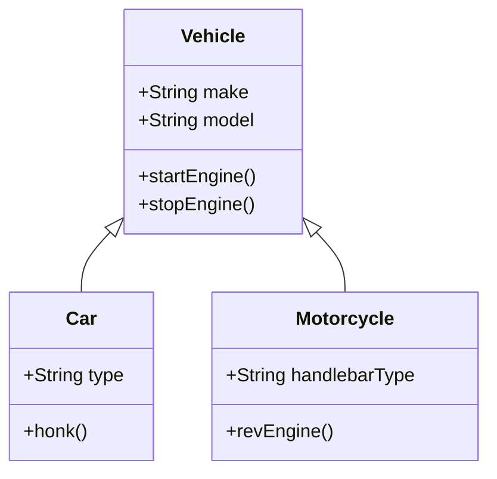

## 1.4 Introduction to Object-Oriented Programming (OOP)

Welcome to the world of Object-Oriented Programming (OOP), a paradigm that allows us to model real-world entities in our code. As we embark on this journey, we'll explore the fundamental principles of OOP—encapsulation, inheritance, polymorphism, and abstraction—and understand why they are crucial for managing complex codebases. Let's dive in!

### What is Object-Oriented Programming?

Object-Oriented Programming (OOP) is a programming paradigm centered around the concept of "objects." An object is a self-contained unit that bundles data and the operations that manipulate that data. Think of objects as real-world entities, like a car or a person, each having attributes (data) and behaviors (methods).

#### Key Principles of OOP

To grasp OOP, we need to understand its four main principles:

1. **Encapsulation**: Encapsulation involves bundling the data (attributes) and the methods (functions) that operate on the data into a single unit, or object. This principle hides the internal state of the object from the outside world, exposing only what is necessary. It's akin to a car's dashboard, where you interact with the controls without needing to know the intricacies of the engine.

2. **Inheritance**: Inheritance allows us to create new classes based on existing ones. It promotes code reuse and establishes a hierarchical relationship between classes. Imagine a family tree where children inherit traits from their parents. Similarly, a "Car" class might inherit properties from a more generic "Vehicle" class.

3. **Polymorphism**: Polymorphism enables objects to be treated as instances of their parent class. It allows for methods to do different things based on the object it is acting upon. For example, both a "Dog" and a "Cat" class might inherit from an "Animal" class, but each can have a different implementation of a "speak" method.

4. **Abstraction**: Abstraction involves hiding the complex reality while exposing only the necessary parts. It simplifies the interaction with objects by providing a clear interface. Think of it as using a TV remote; you press buttons without needing to understand the electronics inside.

### Why OOP?

OOP is beneficial for several reasons, especially when managing complex codebases:

- **Modularity**: OOP allows developers to break down complex problems into smaller, manageable parts. Each object represents a piece of the puzzle, making it easier to understand and maintain.

- **Reusability**: Through inheritance and polymorphism, OOP promotes code reuse. You can create new objects with little or no modification to existing code, saving time and effort.

- **Scalability**: As applications grow, OOP provides a structured way to manage complexity. New features can be added with minimal disruption to existing code.

- **Maintainability**: Encapsulation ensures that objects manage their own state, reducing dependencies and making it easier to update or fix code.

### Real-World Analogies

To make these concepts more relatable, let's use some analogies:

- **Encapsulation**: Consider a smartphone. You interact with it through a screen and buttons, but you don't need to know how it processes your input internally. The complexity is hidden, allowing you to focus on the functionality.

- **Inheritance**: Think of a library system. A "Book" class might have properties like title and author. A "DigitalBook" class can inherit these properties and add new ones, like file format.

- **Polymorphism**: Imagine a universal remote control that can operate different devices. The same "power" button can turn on a TV or a stereo, depending on the context.

- **Abstraction**: Consider an ATM machine. You use it to withdraw money without needing to understand the banking processes behind the scenes.

### Visualizing OOP Concepts

Let's visualize these concepts with a simple diagram:



In this diagram, `Vehicle` is a base class with common properties and methods. `Car` and `Motorcycle` inherit from `Vehicle`, adding their unique attributes and behaviors.

### Code Example: A Simple OOP Model

Let's look at a simple code example to illustrate these principles:

```javascript
// Define a base class Vehicle
class Vehicle {
    constructor(make, model) {
        this.make = make;
        this.model = model;
    }

    startEngine() {
        console.log(`${this.make} ${this.model} engine started.`);
    }

    stopEngine() {
        console.log(`${this.make} ${this.model} engine stopped.`);
    }
}

// Define a Car class that inherits from Vehicle
class Car extends Vehicle {
    constructor(make, model, type) {
        super(make, model);
        this.type = type;
    }

    honk() {
        console.log(`${this.make} ${this.model} goes beep beep!`);
    }
}

// Define a Motorcycle class that inherits from Vehicle
class Motorcycle extends Vehicle {
    constructor(make, model, handlebarType) {
        super(make, model);
        this.handlebarType = handlebarType;
    }

    revEngine() {
        console.log(`${this.make} ${this.model} goes vroom vroom!`);
    }
}

// Create instances of Car and Motorcycle
const myCar = new Car('Toyota', 'Corolla', 'Sedan');
const myMotorcycle = new Motorcycle('Harley-Davidson', 'Sportster', 'Ape Hangers');

// Demonstrate polymorphism
myCar.startEngine();
myCar.honk();
myCar.stopEngine();

myMotorcycle.startEngine();
myMotorcycle.revEngine();
myMotorcycle.stopEngine();
```

In this example, we define a `Vehicle` class with common properties and methods. The `Car` and `Motorcycle` classes inherit from `Vehicle`, adding their unique features. This demonstrates encapsulation, inheritance, and polymorphism in action.

### Try It Yourself

Experiment with the code example above by:

- Adding a new method to the `Vehicle` class, like `fuelUp()`.
- Creating a new class, `Truck`, that inherits from `Vehicle` and has a unique method, `loadCargo()`.
- Modifying the `honk()` method in the `Car` class to include the car type in the message.

### Advantages of OOP Over Other Paradigms

While procedural and functional programming have their strengths, OOP offers unique advantages:

- **Intuitive Design**: OOP's use of real-world metaphors makes it easier to conceptualize and design systems.
- **Robust Error Handling**: Encapsulation helps isolate errors within specific objects, making debugging more straightforward.
- **Enhanced Collaboration**: OOP's modular nature allows teams to work on different parts of a project simultaneously without conflicts.

### Knowledge Check

Let's reinforce what we've learned with a few questions:

- What are the four main principles of OOP?
- How does encapsulation benefit code maintainability?
- Can you give an example of inheritance in a real-world scenario?
- How does polymorphism enhance code flexibility?

### Summary

In this section, we've introduced the core concepts of Object-Oriented Programming: encapsulation, inheritance, polymorphism, and abstraction. We've explored how these principles help manage complex codebases and make programming more intuitive. Remember, this is just the beginning. As you progress, you'll build more complex and interactive applications using OOP. Keep experimenting, stay curious, and enjoy the journey!

## Quiz Time!



### What is encapsulation in OOP?

- [x] Bundling data and methods into a single unit
- [ ] Allowing objects to inherit properties
- [ ] Enabling objects to be treated as instances of their parent class
- [ ] Hiding complex reality while exposing only necessary parts

> **Explanation:** Encapsulation involves bundling the data and methods that operate on the data into a single unit, or object.

### Which principle of OOP allows for code reuse?

- [ ] Encapsulation
- [x] Inheritance
- [ ] Polymorphism
- [ ] Abstraction

> **Explanation:** Inheritance allows for code reuse by creating new classes based on existing ones.

### How does polymorphism benefit OOP?

- [x] Allows methods to do different things based on the object
- [ ] Hides the internal state of objects
- [ ] Simplifies the interaction with objects
- [ ] Promotes code reuse

> **Explanation:** Polymorphism enables methods to perform different actions based on the object it is acting upon.

### What is the main advantage of abstraction?

- [ ] It allows objects to inherit properties
- [ ] It bundles data and methods into a single unit
- [x] It hides complex reality while exposing only necessary parts
- [ ] It enables objects to be treated as instances of their parent class

> **Explanation:** Abstraction simplifies interaction by hiding complex details and providing a clear interface.

### Which OOP principle is demonstrated by a universal remote control?

- [ ] Encapsulation
- [ ] Inheritance
- [x] Polymorphism
- [ ] Abstraction

> **Explanation:** Polymorphism is demonstrated by a universal remote control, where the same button can perform different actions depending on the device.

### What is a real-world example of inheritance?

- [x] A "Dog" class inheriting from an "Animal" class
- [ ] A smartphone hiding its internal processes
- [ ] A TV remote controlling different devices
- [ ] An ATM machine providing cash

> **Explanation:** Inheritance is shown when a "Dog" class inherits properties and methods from an "Animal" class.

### How does encapsulation improve maintainability?

- [x] By hiding the internal state of objects
- [ ] By allowing objects to inherit properties
- [ ] By enabling objects to be treated as instances of their parent class
- [ ] By simplifying the interaction with objects

> **Explanation:** Encapsulation improves maintainability by hiding the internal state of objects, reducing dependencies.

### What does the `super` keyword do in JavaScript?

- [x] Calls the constructor of the parent class
- [ ] Creates a new instance of a class
- [ ] Defines a method in a class
- [ ] Bundles data and methods into a single unit

> **Explanation:** The `super` keyword is used to call the constructor of the parent class in JavaScript.

### Which principle of OOP is most related to modularity?

- [ ] Inheritance
- [x] Encapsulation
- [ ] Polymorphism
- [ ] Abstraction

> **Explanation:** Encapsulation is closely related to modularity as it bundles data and methods into a single unit.

### True or False: OOP is only useful for large projects.

- [ ] True
- [x] False

> **Explanation:** OOP is beneficial for projects of all sizes, as it helps organize and manage code effectively.



Remember, this is just the beginning. As you progress, you'll build more complex and interactive applications using OOP. Keep experimenting, stay curious, and enjoy the journey!
