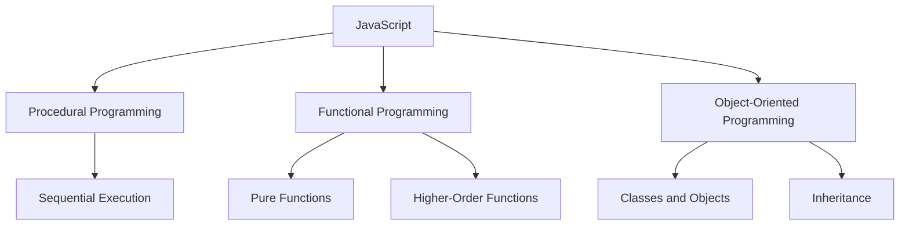

## 1.5 JavaScript as a Multi-Paradigm Language

JavaScript is a versatile and dynamic programming language that supports multiple programming paradigms. This flexibility allows developers to choose the most suitable approach for their specific needs, whether it be procedural, functional, or object-oriented programming (OOP). In this section, we will explore what it means for a language to be multi-paradigm and how JavaScript implements these paradigms. We will also provide examples to illustrate each paradigm's application in JavaScript.

### What is a Multi-Paradigm Language?

A multi-paradigm programming language is one that supports more than one programming style or paradigm. This means developers can use different approaches to solve problems, depending on the nature of the task and their personal or team preferences. The main paradigms supported by JavaScript are:

- **Procedural Programming**: Focuses on writing procedures or routines that operate on data.
- **Functional Programming**: Emphasizes the use of functions and immutable data.
- **Object-Oriented Programming**: Organizes code into objects that contain both data and methods.

By supporting these paradigms, JavaScript provides developers with the flexibility to adopt the best practices from each, leading to more efficient and maintainable code.

### Procedural Programming in JavaScript

Procedural programming is one of the oldest programming paradigms and is characterized by a sequence of instructions that execute one after the other. This paradigm is straightforward and intuitive, making it a good starting point for beginners.

#### Example of Procedural Programming

Let's consider a simple example of procedural programming in JavaScript:

```javascript
// Define a function to calculate the area of a rectangle
function calculateRectangleArea(length, width) {
    return length * width;
}

// Define a function to calculate the perimeter of a rectangle
function calculateRectanglePerimeter(length, width) {
    return 2 * (length + width);
}

// Main procedure
let length = 5;
let width = 3;

let area = calculateRectangleArea(length, width);
let perimeter = calculateRectanglePerimeter(length, width);

console.log("Area:", area);
console.log("Perimeter:", perimeter);
```

In this example, we define two functions to calculate the area and perimeter of a rectangle. The main procedure involves calling these functions with specific values and logging the results. This approach is simple and effective for straightforward tasks.

### Functional Programming in JavaScript

Functional programming treats computation as the evaluation of mathematical functions and avoids changing state or mutable data. It emphasizes the use of pure functions, higher-order functions, and first-class functions.

#### Key Concepts in Functional Programming

- **Pure Functions**: Functions that have no side effects and return the same output for the same input.
- **Higher-Order Functions**: Functions that take other functions as arguments or return them as results.
- **First-Class Functions**: Functions that can be treated like any other variable.

#### Example of Functional Programming

Here's an example of functional programming in JavaScript:

```javascript
// Define a pure function to double a number
const double = (n) => n * 2;

// Define a higher-order function that applies a function to each element in an array
const map = (arr, fn) => {
    let result = [];
    for (let i = 0; i < arr.length; i++) {
        result.push(fn(arr[i]));
    }
    return result;
};

// Use the map function to double each number in the array
let numbers = [1, 2, 3, 4];
let doubledNumbers = map(numbers, double);

console.log(doubledNumbers); // Output: [2, 4, 6, 8]
```

In this example, we define a pure function `double` and a higher-order function `map`. The `map` function takes an array and a function as arguments and applies the function to each element in the array. This demonstrates the use of functional programming concepts in JavaScript.

### Object-Oriented Programming in JavaScript

Object-oriented programming is a paradigm based on the concept of "objects," which can contain data and code to manipulate that data. JavaScript's implementation of OOP is prototype-based, allowing objects to inherit properties and methods from other objects.

#### Key Concepts in Object-Oriented Programming

- **Objects**: Instances of classes that contain data and methods.
- **Classes**: Blueprints for creating objects.
- **Inheritance**: Mechanism for creating new classes from existing ones.
- **Encapsulation**: Restricting access to certain components of an object.
- **Polymorphism**: Ability to process objects differently based on their data type or class.

#### Example of Object-Oriented Programming

Here's an example of object-oriented programming in JavaScript using ES6 classes:

```javascript
// Define a class for a Rectangle
class Rectangle {
    constructor(length, width) {
        this.length = length;
        this.width = width;
    }

    // Method to calculate the area
    calculateArea() {
        return this.length * this.width;
    }

    // Method to calculate the perimeter
    calculatePerimeter() {
        return 2 * (this.length + this.width);
    }
}

// Create an instance of the Rectangle class
let myRectangle = new Rectangle(5, 3);

console.log("Area:", myRectangle.calculateArea());
console.log("Perimeter:", myRectangle.calculatePerimeter());
```

In this example, we define a `Rectangle` class with a constructor to initialize its properties and methods to calculate the area and perimeter. We then create an instance of the class and use its methods to perform calculations.

### Flexibility of JavaScript

JavaScript's ability to support multiple paradigms makes it an incredibly flexible language. Developers can choose the paradigm that best fits their needs or even combine paradigms within a single project. This flexibility is one of the reasons why JavaScript is so widely used in web development.

#### Combining Paradigms

It's common to see JavaScript code that combines different paradigms. For example, you might use functional programming for data processing and object-oriented programming for structuring your application. This hybrid approach allows you to leverage the strengths of each paradigm.

#### Example of Combining Paradigms

Here's an example that combines functional and object-oriented programming:

```javascript
// Define a class for a Book
class Book {
    constructor(title, author) {
        this.title = title;
        this.author = author;
    }

    // Method to display book information
    display() {
        console.log(`${this.title} by ${this.author}`);
    }
}

// Define a function to filter books by author
const filterBooksByAuthor = (books, author) => {
    return books.filter(book => book.author === author);
};

// Create an array of Book objects
let books = [
    new Book("The Great Gatsby", "F. Scott Fitzgerald"),
    new Book("To Kill a Mockingbird", "Harper Lee"),
    new Book("1984", "George Orwell")
];

// Filter books by author and display them
let filteredBooks = filterBooksByAuthor(books, "George Orwell");
filteredBooks.forEach(book => book.display());
```

In this example, we define a `Book` class and a functional programming-style function `filterBooksByAuthor`. We create an array of `Book` objects and use the function to filter and display books by a specific author. This demonstrates how JavaScript's multi-paradigm nature allows for flexible and efficient coding.

### Visualizing JavaScript's Multi-Paradigm Nature

To better understand how JavaScript supports multiple paradigms, let's visualize the relationships between these paradigms and how they can be applied in JavaScript.



**Diagram Description**: This diagram illustrates how JavaScript supports procedural, functional, and object-oriented programming paradigms. Each paradigm has its own set of characteristics and techniques, such as sequential execution for procedural programming, pure functions and higher-order functions for functional programming, and classes, objects, and inheritance for object-oriented programming.

### Try It Yourself

Now that we've explored the different paradigms supported by JavaScript, it's time to try it yourself! Experiment with the code examples provided in this section. Here are some suggestions for modifications:

- **Procedural Programming**: Modify the rectangle example to include additional calculations, such as diagonal length.
- **Functional Programming**: Create a new higher-order function that filters an array based on a condition.
- **Object-Oriented Programming**: Add a new method to the `Rectangle` class to calculate the diagonal length.

### References and Links

For further reading on JavaScript and its paradigms, check out the following resources:

- [MDN Web Docs: JavaScript](https://developer.mozilla.org/en-US/docs/Web/JavaScript)
- [W3Schools: JavaScript](https://www.w3schools.com/js/)
- [Eloquent JavaScript](https://eloquentjavascript.net/): A book that covers JavaScript programming and its paradigms.

### Knowledge Check

Before we wrap up, let's reinforce what we've learned with a few questions and exercises.

- **Question**: What are the main paradigms supported by JavaScript?
- **Exercise**: Write a JavaScript function that uses both functional and object-oriented programming to process an array of objects.

### Embrace the Journey

Remember, this is just the beginning. As you progress, you'll build more complex and interactive web pages. Keep experimenting, stay curious, and enjoy the journey! JavaScript's flexibility allows you to explore different paradigms and find the best solutions for your projects.

### Quiz Time!



### What does it mean for a language to be multi-paradigm?

- [x] It supports multiple programming styles or paradigms.
- [ ] It only supports object-oriented programming.
- [ ] It is limited to procedural programming.
- [ ] It does not support functional programming.

> **Explanation:** A multi-paradigm language supports various programming styles, allowing developers to choose the most suitable approach for their needs.

### Which of the following is a characteristic of functional programming?

- [x] Pure functions
- [ ] Classes and objects
- [ ] Sequential execution
- [ ] Global variables

> **Explanation:** Functional programming emphasizes pure functions, which have no side effects and return the same output for the same input.

### What is a key feature of object-oriented programming?

- [x] Inheritance
- [ ] Higher-order functions
- [ ] Immutable data
- [ ] Sequential execution

> **Explanation:** Inheritance is a key feature of object-oriented programming, allowing new classes to be created from existing ones.

### How does JavaScript implement object-oriented programming?

- [x] Through prototype-based inheritance
- [ ] Through class-based inheritance only
- [ ] By using global variables
- [ ] By avoiding the use of objects

> **Explanation:** JavaScript implements object-oriented programming using prototype-based inheritance, allowing objects to inherit properties and methods from other objects.

### What is a higher-order function?

- [x] A function that takes other functions as arguments or returns them as results
- [ ] A function that has no parameters
- [ ] A function that only uses global variables
- [ ] A function that is always recursive

> **Explanation:** A higher-order function is one that can take other functions as arguments or return them as results, a key concept in functional programming.

### Which paradigm is characterized by a sequence of instructions that execute one after the other?

- [x] Procedural Programming
- [ ] Functional Programming
- [ ] Object-Oriented Programming
- [ ] Declarative Programming

> **Explanation:** Procedural programming is characterized by a sequence of instructions that execute one after the other, making it straightforward and intuitive.

### What is a pure function?

- [x] A function that has no side effects and returns the same output for the same input
- [ ] A function that modifies global variables
- [ ] A function that always returns undefined
- [ ] A function that depends on external data

> **Explanation:** A pure function has no side effects and returns the same output for the same input, a key concept in functional programming.

### How can JavaScript's multi-paradigm nature benefit developers?

- [x] By allowing them to choose the best paradigm for their specific needs
- [ ] By restricting them to a single programming style
- [ ] By making code less maintainable
- [ ] By limiting the use of functions

> **Explanation:** JavaScript's multi-paradigm nature allows developers to choose the best paradigm for their specific needs, leading to more efficient and maintainable code.

### What is encapsulation in object-oriented programming?

- [x] Restricting access to certain components of an object
- [ ] Allowing global access to all variables
- [ ] Using only procedural code
- [ ] Avoiding the use of classes

> **Explanation:** Encapsulation is the concept of restricting access to certain components of an object, a key principle in object-oriented programming.

### True or False: JavaScript only supports object-oriented programming.

- [ ] True
- [x] False

> **Explanation:** False. JavaScript is a multi-paradigm language that supports procedural, functional, and object-oriented programming.


