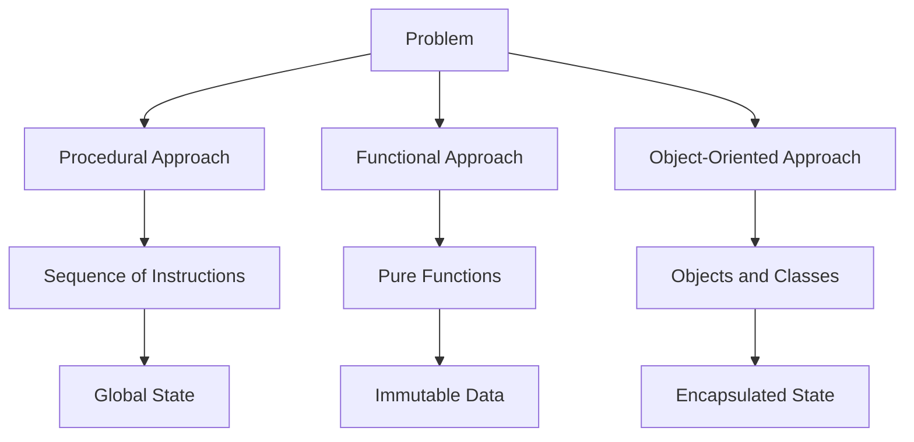

## 1.6 Comparing Programming Paradigms

In the world of software development, programming paradigms are like different lenses through which we can view and solve problems. Each paradigm offers its unique approach to structuring code and managing data. In this section, we'll delve into three major paradigms: Procedural, Functional, and Object-Oriented Programming (OOP). We'll compare their characteristics, explore their pros and cons, and provide code examples to illustrate how the same problem can be solved using each paradigm.

### Understanding Programming Paradigms

Before diving into comparisons, let's briefly revisit what a programming paradigm is. A programming paradigm is a style or way of programming that is characterized by a particular set of concepts and practices. It influences how developers think about and structure their code.

### Comparative Table of Programming Paradigms

To start, let's look at a comparative table that highlights the key differences among procedural, functional, and object-oriented paradigms:

| Feature/Aspect           | Procedural Programming                | Functional Programming                | Object-Oriented Programming           |
|--------------------------|---------------------------------------|---------------------------------------|---------------------------------------|
| **Core Concept**         | Sequence of instructions              | Functions as first-class citizens     | Objects and classes                   |
| **State Management**     | Global state, variables               | Immutable state, pure functions       | Encapsulated state in objects         |
| **Modularity**           | Functions and procedures              | Functions and higher-order functions  | Classes and objects                   |
| **Data Abstraction**     | Limited                               | High, through functions               | High, through objects and classes     |
| **Reusability**          | Function reuse                        | Function composition                  | Inheritance and polymorphism          |
| **Ease of Testing**      | Moderate                              | High, due to pure functions           | Moderate, with encapsulation          |
| **Concurrency**          | Manual management                     | Easier with immutable data            | Managed through object interactions   |
| **Code Readability**     | Linear, straightforward               | Can be abstract and concise           | Structured, intuitive with classes    |
| **Use Cases**            | Simple scripts, system programming    | Data transformations, mathematical    | Complex applications, UI components   |

### Procedural Programming

Procedural programming is one of the oldest paradigms and forms the foundation of many modern languages. It structures programs as a sequence of instructions or procedures, which are executed step-by-step.

#### Pros of Procedural Programming

- **Simplicity**: Easy to understand and follow, especially for beginners.
- **Efficiency**: Direct manipulation of memory and resources can lead to efficient code.
- **Wide Adoption**: Many legacy systems and languages like C are procedural.

#### Cons of Procedural Programming

- **Scalability**: Difficult to manage as programs grow larger.
- **Reusability**: Limited support for code reuse beyond functions.
- **Maintenance**: Harder to maintain due to global state and dependencies.

#### Code Example: Procedural Approach

Let's consider a simple problem: calculating the area of a rectangle.

```javascript
// Procedural approach to calculate the area of a rectangle
function calculateRectangleArea(width, height) {
    return width * height;
}

let width = 5;
let height = 10;
let area = calculateRectangleArea(width, height);
console.log("Area of the rectangle:", area);
```

### Functional Programming

Functional programming treats computation as the evaluation of mathematical functions and avoids changing state or mutable data.

#### Pros of Functional Programming

- **Immutability**: Leads to safer and more predictable code.
- **Modularity**: Functions can be easily composed and reused.
- **Concurrency**: Easier to implement due to immutable data structures.

#### Cons of Functional Programming

- **Learning Curve**: Can be abstract and challenging for beginners.
- **Performance**: May have overhead due to immutability and recursion.
- **Verbosity**: Can lead to verbose code with excessive function nesting.

#### Code Example: Functional Approach

Let's solve the same rectangle area problem using a functional approach.

```javascript
// Functional approach to calculate the area of a rectangle
const calculateRectangleArea = (width, height) => width * height;

const width = 5;
const height = 10;
const area = calculateRectangleArea(width, height);
console.log("Area of the rectangle:", area);
```

### Object-Oriented Programming

Object-Oriented Programming (OOP) organizes code into objects, which are instances of classes. It emphasizes encapsulation, inheritance, and polymorphism.

#### Pros of Object-Oriented Programming

- **Modularity**: Code is organized into classes, making it easier to manage.
- **Reusability**: Inheritance and polymorphism promote code reuse.
- **Maintainability**: Encapsulation helps in managing complexity.

#### Cons of Object-Oriented Programming

- **Overhead**: Can introduce unnecessary complexity for simple problems.
- **Performance**: May have performance overhead due to abstraction layers.
- **Learning Curve**: Requires understanding of concepts like classes and inheritance.

#### Code Example: Object-Oriented Approach

Let's solve the rectangle area problem using an object-oriented approach.

```javascript
// Object-Oriented approach to calculate the area of a rectangle
class Rectangle {
    constructor(width, height) {
        this.width = width;
        this.height = height;
    }

    calculateArea() {
        return this.width * this.height;
    }
}

const rectangle = new Rectangle(5, 10);
const area = rectangle.calculateArea();
console.log("Area of the rectangle:", area);
```

### When to Use Each Paradigm

Understanding when to apply each paradigm is crucial for effective software development. Here are some scenarios where one paradigm might be preferred over others:

- **Procedural Programming**: Ideal for simple scripts, system-level programming, and when performance is critical.
- **Functional Programming**: Best suited for data transformations, mathematical computations, and when immutability is required.
- **Object-Oriented Programming**: Suitable for complex applications, UI components, and when code maintainability and reusability are priorities.

### Visualizing Paradigm Differences

To further illustrate the differences between these paradigms, let's use a flowchart to visualize how each paradigm approaches problem-solving:



### Try It Yourself

To deepen your understanding, try modifying the code examples above:

- **Procedural**: Add a function to calculate the perimeter of the rectangle.
- **Functional**: Use a higher-order function to apply a discount to the calculated area.
- **Object-Oriented**: Add a method to the `Rectangle` class to calculate the perimeter.

### References and Further Reading

For more information on programming paradigms, consider exploring these resources:

- [MDN Web Docs: JavaScript Guide](https://developer.mozilla.org/en-US/docs/Web/JavaScript/Guide)
- [W3Schools: JavaScript Tutorial](https://www.w3schools.com/js/)
- [Eloquent JavaScript](https://eloquentjavascript.net/)

### Knowledge Check

To reinforce your learning, consider these questions:

- What are the main differences between procedural and functional programming?
- How does object-oriented programming enhance code reusability?
- In what scenarios might functional programming be preferred over procedural programming?

### Embrace the Journey

Remember, this is just the beginning. As you progress, you'll build more complex and interactive applications. Keep experimenting, stay curious, and enjoy the journey!

## Quiz Time!



### Which paradigm emphasizes the use of objects and classes?

- [ ] Procedural Programming
- [ ] Functional Programming
- [x] Object-Oriented Programming
- [ ] None of the above

> **Explanation:** Object-Oriented Programming is centered around the use of objects and classes to structure code.

### What is a key advantage of functional programming?

- [ ] Global state management
- [x] Immutability
- [ ] Direct memory manipulation
- [ ] Complex inheritance

> **Explanation:** Functional programming emphasizes immutability, which leads to safer and more predictable code.

### Which paradigm is most suitable for simple scripts and system-level programming?

- [x] Procedural Programming
- [ ] Functional Programming
- [ ] Object-Oriented Programming
- [ ] None of the above

> **Explanation:** Procedural programming is ideal for simple scripts and system-level programming due to its straightforward approach.

### What is a disadvantage of object-oriented programming?

- [ ] Lack of modularity
- [ ] Difficulty in testing
- [x] Overhead and complexity
- [ ] Poor performance

> **Explanation:** Object-oriented programming can introduce unnecessary complexity for simple problems, leading to overhead.

### Which paradigm uses pure functions as a core concept?

- [ ] Procedural Programming
- [x] Functional Programming
- [ ] Object-Oriented Programming
- [ ] None of the above

> **Explanation:** Functional programming relies on pure functions, which do not have side effects and always produce the same output for the same input.

### What is a common use case for object-oriented programming?

- [ ] Data transformations
- [ ] Mathematical computations
- [x] Complex applications and UI components
- [ ] System-level programming

> **Explanation:** Object-oriented programming is well-suited for complex applications and UI components due to its modularity and encapsulation.

### Which paradigm is known for its ease of concurrency?

- [ ] Procedural Programming
- [x] Functional Programming
- [ ] Object-Oriented Programming
- [ ] None of the above

> **Explanation:** Functional programming is easier to implement with concurrency due to its use of immutable data structures.

### What is a key feature of procedural programming?

- [x] Sequence of instructions
- [ ] Immutable data
- [ ] Encapsulated state
- [ ] Inheritance

> **Explanation:** Procedural programming is characterized by a sequence of instructions executed step-by-step.

### Which paradigm is best for managing complex state and interactions?

- [ ] Procedural Programming
- [ ] Functional Programming
- [x] Object-Oriented Programming
- [ ] None of the above

> **Explanation:** Object-oriented programming is best for managing complex state and interactions through encapsulation and object interactions.

### True or False: Functional programming avoids changing state or mutable data.

- [x] True
- [ ] False

> **Explanation:** Functional programming avoids changing state or mutable data, focusing on pure functions and immutability.


