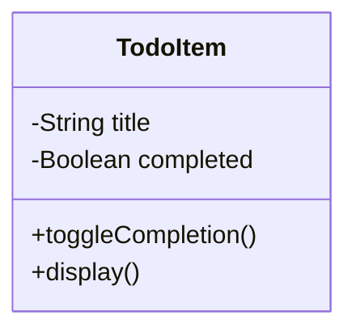

## 1.7 When to Use OOP in JavaScript

As we delve deeper into the world of programming paradigms, it's crucial to understand when and why to use Object-Oriented Programming (OOP) in JavaScript. OOP is a paradigm that can significantly enhance the structure, maintainability, and scalability of your code, especially in large-scale applications. In this section, we'll explore the types of projects that benefit from OOP, discuss how it improves code maintainability and reusability, and provide examples of successful OOP implementations. We'll also encourage you to consider project requirements when choosing a programming paradigm.

### Understanding the Need for OOP

Before diving into specific scenarios, let's briefly revisit what makes OOP unique. OOP is centered around the concept of "objects," which are instances of classes. These objects encapsulate data and behavior, allowing developers to model real-world entities in a more intuitive way. Key principles of OOP include encapsulation, inheritance, and polymorphism, which together provide a robust framework for building complex applications.

### Project Types That Benefit from OOP

#### Large-Scale Applications

One of the primary scenarios where OOP shines is in large-scale applications. These applications often involve thousands of lines of code and require a high degree of organization to manage complexity. OOP helps by:

- **Encapsulating Complexity**: By organizing code into classes and objects, developers can encapsulate complexity and make the codebase more manageable.
- **Facilitating Collaboration**: Large projects typically involve multiple developers. OOP's clear structure allows team members to work on different parts of the application simultaneously without stepping on each other's toes.
- **Enhancing Maintainability**: With OOP, changes to one part of the application are less likely to affect others, making maintenance easier.

#### Applications Requiring Reusability

OOP is also ideal for applications that require a high degree of reusability. By defining classes and objects, developers can create reusable components that can be easily integrated into different parts of the application or even into other projects. This is particularly useful in:

- **Library and Framework Development**: Libraries and frameworks benefit from OOP as they often need to provide reusable components that developers can use in various contexts.
- **Plugin Systems**: Applications that support plugins can use OOP to define a clear interface for plugin development, ensuring consistency and reusability.

#### Complex User Interfaces

Applications with complex user interfaces, such as those involving dynamic content or interactive elements, can benefit from OOP. By modeling UI components as objects, developers can:

- **Simplify State Management**: Encapsulate the state and behavior of UI components within objects, making it easier to manage changes and interactions.
- **Promote Code Reuse**: Reuse UI components across different parts of the application, reducing duplication and improving consistency.

### How OOP Improves Code Maintainability and Reusability

#### Encapsulation

Encapsulation is a core principle of OOP that involves bundling data and methods that operate on that data within a single unit, or class. This approach offers several advantages:

- **Data Hiding**: By restricting access to certain parts of an object, encapsulation helps prevent unintended interference and misuse.
- **Modularity**: Encapsulated objects can be developed, tested, and maintained independently, promoting modularity.

#### Inheritance

Inheritance allows new classes to inherit properties and methods from existing classes, facilitating code reuse and reducing redundancy. This leads to:

- **Hierarchical Class Structures**: Developers can create a hierarchy of classes, where common functionality is defined in base classes and specialized behavior is added in derived classes.
- **Ease of Maintenance**: Changes made to a base class automatically propagate to derived classes, simplifying maintenance.

#### Polymorphism

Polymorphism enables objects to be treated as instances of their parent class, allowing for flexible and interchangeable code. This is particularly useful in:

- **Designing Extensible Systems**: Polymorphism allows developers to design systems that can be easily extended with new functionality without modifying existing code.
- **Implementing Dynamic Behavior**: By using polymorphism, developers can implement dynamic behavior that adapts to different contexts.

### Case Studies of Successful OOP Implementations

#### Case Study 1: A Large E-commerce Platform

Consider a large e-commerce platform with thousands of products, multiple payment gateways, and a complex user interface. By using OOP, the development team can:

- **Model Products as Objects**: Each product can be represented as an object with properties like name, price, and description, and methods for calculating discounts or handling inventory.
- **Encapsulate Payment Logic**: Payment processing can be encapsulated within a class, with different subclasses for each payment gateway, allowing for easy addition of new gateways.
- **Reuse UI Components**: Common UI elements like product cards and shopping carts can be defined as reusable components, ensuring consistency across the platform.

#### Case Study 2: A Social Media Application

In a social media application, OOP can be used to:

- **Model Users and Posts**: Users and posts can be represented as objects, with methods for liking, sharing, and commenting.
- **Implement a Plugin System**: The application can support plugins for additional features, with a clear interface defined using OOP principles.
- **Manage Complex Interactions**: By encapsulating interactions within objects, developers can manage complex interactions between users, posts, and notifications.

### Consider Project Requirements When Choosing a Paradigm

While OOP offers many benefits, it's important to consider the specific requirements of your project when choosing a programming paradigm. Here are some factors to consider:

- **Project Size and Complexity**: For small, simple projects, the overhead of OOP may not be justified. Consider using procedural or functional programming for simpler tasks.
- **Team Size and Structure**: In a large team, OOP can facilitate collaboration and code organization. In a smaller team, other paradigms may be more efficient.
- **Performance Requirements**: OOP can introduce some performance overhead due to its abstraction layers. For performance-critical applications, consider using a mix of paradigms to optimize performance.

### Try It Yourself: Experiment with OOP in JavaScript

To get a hands-on understanding of OOP in JavaScript, try implementing a simple application using OOP principles. Here's a basic example to get you started:

```javascript
// Define a class for a simple Todo item
class TodoItem {
  constructor(title, completed = false) {
    this.title = title;
    this.completed = completed;
  }

  // Method to toggle the completion status
  toggleCompletion() {
    this.completed = !this.completed;
  }

  // Method to display the todo item
  display() {
    console.log(`${this.title} - ${this.completed ? "Completed" : "Pending"}`);
  }
}

// Create a new Todo item
const todo = new TodoItem("Learn OOP in JavaScript");

// Display the todo item
todo.display(); // Output: Learn OOP in JavaScript - Pending

// Toggle the completion status
todo.toggleCompletion();

// Display the todo item again
todo.display(); // Output: Learn OOP in JavaScript - Completed
```

**Try It Yourself**: Modify the `TodoItem` class to include a due date property and a method to check if the todo item is overdue. Experiment with creating multiple todo items and managing them using an array.

### Visualizing OOP Concepts

To better understand how OOP structures your code, let's visualize the relationship between classes and objects using a simple class diagram.



**Diagram Description**: This class diagram represents the `TodoItem` class, showing its properties (`title` and `completed`) and methods (`toggleCompletion()` and `display()`).

### References and Further Reading

For more information on OOP in JavaScript, consider exploring the following resources:

- [MDN Web Docs: Object-Oriented Programming](https://developer.mozilla.org/en-US/docs/Learn/JavaScript/Objects/Object-oriented_JS)
- [W3Schools: JavaScript OOP](https://www.w3schools.com/js/js_object_oriented.asp)

### Knowledge Check

To reinforce your understanding of when to use OOP in JavaScript, consider the following questions:

1. What are the key benefits of using OOP in large-scale applications?
2. How does encapsulation improve code maintainability?
3. In what scenarios might you choose a different programming paradigm over OOP?
4. How can OOP facilitate collaboration in a large development team?

### Embrace the Journey

Remember, learning when and how to use OOP in JavaScript is a journey. As you progress, you'll gain a deeper understanding of how to apply OOP principles effectively in your projects. Keep experimenting, stay curious, and enjoy the journey!

## Quiz Time!



### What is one of the primary benefits of using OOP in large-scale applications?

- [x] Encapsulating complexity
- [ ] Simplifying syntax
- [ ] Reducing file size
- [ ] Increasing execution speed

> **Explanation:** OOP helps manage complexity by organizing code into classes and objects, making large-scale applications more manageable.


### How does inheritance contribute to code reusability?

- [x] By allowing new classes to inherit properties and methods from existing classes
- [ ] By reducing the number of lines of code
- [ ] By simplifying variable declarations
- [ ] By enhancing function performance

> **Explanation:** Inheritance allows new classes to reuse code from existing classes, reducing redundancy and promoting reusability.


### In what type of project is OOP particularly beneficial?

- [x] Large-scale applications
- [ ] Simple scripts
- [ ] Single-page websites
- [ ] Static HTML pages

> **Explanation:** OOP is particularly beneficial in large-scale applications due to its ability to manage complexity and facilitate collaboration.


### What is encapsulation in OOP?

- [x] Bundling data and methods within a single unit or class
- [ ] Sharing variables across multiple functions
- [ ] Using global variables to store data
- [ ] Writing code in a single file

> **Explanation:** Encapsulation involves bundling data and methods within a class, promoting modularity and data hiding.


### Which of the following is a scenario where OOP might not be the best choice?

- [x] Small, simple projects
- [ ] Complex user interfaces
- [ ] Applications requiring reusability
- [ ] Large-scale applications

> **Explanation:** For small, simple projects, the overhead of OOP may not be justified, and simpler paradigms might be more efficient.


### What is polymorphism in OOP?

- [x] Treating objects as instances of their parent class
- [ ] Using multiple inheritance
- [ ] Defining multiple classes in a single file
- [ ] Sharing methods between unrelated classes

> **Explanation:** Polymorphism allows objects to be treated as instances of their parent class, enabling flexible and interchangeable code.


### How can OOP facilitate collaboration in a large development team?

- [x] By providing a clear structure that allows team members to work on different parts simultaneously
- [ ] By reducing the number of files in the project
- [ ] By minimizing the use of comments
- [ ] By using a single coding style

> **Explanation:** OOP's clear structure allows team members to work on different parts of the application simultaneously without conflicts.


### What is a potential drawback of using OOP in performance-critical applications?

- [x] It can introduce some performance overhead due to abstraction layers
- [ ] It simplifies code readability
- [ ] It reduces code reusability
- [ ] It limits the use of functions

> **Explanation:** OOP can introduce performance overhead due to its abstraction layers, which might be a concern in performance-critical applications.


### Which principle of OOP involves creating a hierarchy of classes?

- [x] Inheritance
- [ ] Encapsulation
- [ ] Polymorphism
- [ ] Abstraction

> **Explanation:** Inheritance involves creating a hierarchy of classes where common functionality is defined in base classes.


### True or False: OOP is always the best choice for every JavaScript project.

- [ ] True
- [x] False

> **Explanation:** OOP is not always the best choice for every project. It's important to consider the specific requirements and complexity of the project when choosing a programming paradigm.


