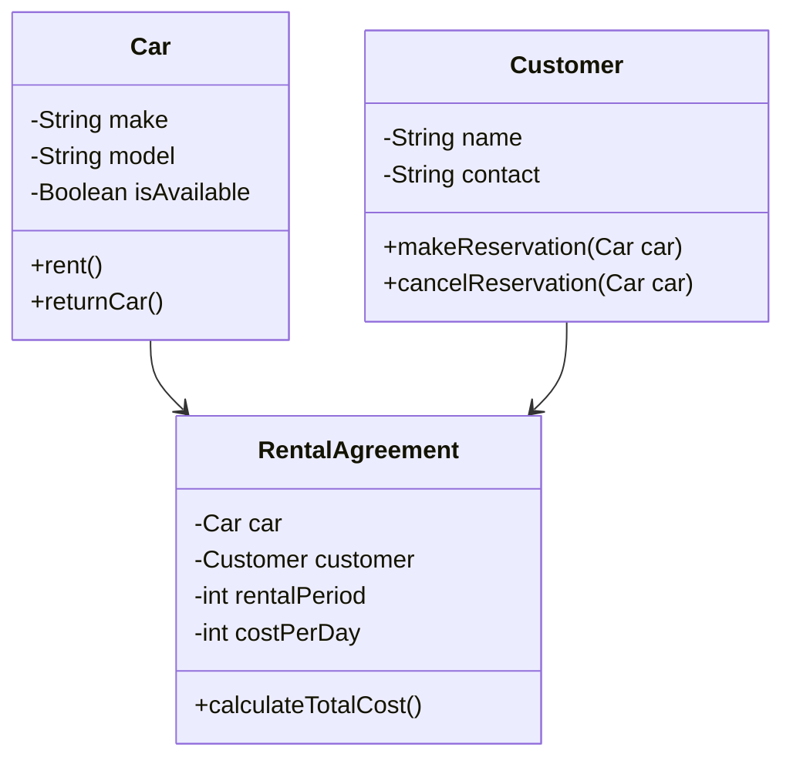

## 1.8 Real-World Examples of OOP in JavaScript

Object-Oriented Programming (OOP) is a powerful paradigm that helps developers model complex systems by organizing code into objects. These objects can represent real-world entities, making it easier to manage and extend codebases. In this section, we'll explore real-world examples of OOP in JavaScript, showcasing how this paradigm is applied in popular software and frameworks. We'll also examine how OOP principles help in modeling complex systems, using relatable analogies and diagrams to enhance understanding.

### Understanding OOP in Real-World Applications

Before diving into specific examples, let's briefly recap the core principles of OOP: encapsulation, inheritance, and polymorphism. These principles allow developers to create modular, reusable, and maintainable code.

1. **Encapsulation**: This involves bundling data and methods that operate on that data within a single unit or class. It hides the internal state of the object from the outside world, exposing only what is necessary through a public interface.

2. **Inheritance**: This allows a new class to inherit properties and methods from an existing class. It promotes code reuse and establishes a relationship between classes.

3. **Polymorphism**: This enables objects to be treated as instances of their parent class, allowing for flexibility and the ability to override methods in derived classes.

These principles are the foundation of OOP and are used extensively in real-world applications to solve complex problems.

### Popular Software and Frameworks Built Using OOP Principles

#### 1. React.js

React.js is a popular JavaScript library for building user interfaces, particularly single-page applications. It utilizes OOP principles to manage the complexity of UI components.

- **Components as Objects**: In React, components are treated as objects. Each component has its own state and lifecycle methods, encapsulating the logic and UI representation. This encapsulation makes it easier to manage complex UIs by breaking them down into smaller, reusable pieces.

- **Inheritance and Composition**: React promotes the use of composition over inheritance. However, the concept of extending components is still prevalent. For example, higher-order components (HOCs) can wrap existing components to enhance their functionality, demonstrating polymorphism.

- **Example**: Consider a `Button` component that encapsulates its appearance and behavior. It can be reused across the application, and its functionality can be extended through HOCs to add features like logging or analytics.

```javascript
class Button extends React.Component {
  handleClick() {
    console.log('Button clicked!');
  }

  render() {
    return <button onClick={this.handleClick}>Click Me</button>;
  }
}
```

#### 2. Node.js and Express.js

Node.js is a runtime environment that allows JavaScript to be used on the server side. Express.js, a web application framework for Node.js, leverages OOP principles to handle HTTP requests and responses.

- **Middleware as Objects**: In Express.js, middleware functions are treated as objects that handle requests and responses. This encapsulation allows for modular and reusable code.

- **Router as an Object**: The `Router` object in Express.js is a great example of OOP. It encapsulates routes and their handlers, providing a clean interface for defining application endpoints.

- **Example**: A simple Express.js application with a `Router` object to handle user-related routes.

```javascript
const express = require('express');
const app = express();
const userRouter = express.Router();

userRouter.get('/users', (req, res) => {
  res.send('List of users');
});

app.use('/api', userRouter);

app.listen(3000, () => {
  console.log('Server is running on port 3000');
});
```

#### 3. Angular

Angular is a platform for building mobile and desktop web applications. It uses OOP concepts extensively to structure applications.

- **Components and Services**: Angular components and services are classes that encapsulate logic and data. Services can be injected into components, promoting code reuse and separation of concerns.

- **Inheritance and Dependency Injection**: Angular's dependency injection system allows for the easy extension and customization of services, demonstrating inheritance and polymorphism.

- **Example**: An Angular service that encapsulates data fetching logic.

```typescript
import { Injectable } from '@angular/core';
import { HttpClient } from '@angular/common/http';
import { Observable } from 'rxjs';

@Injectable({
  providedIn: 'root'
})
export class DataService {
  constructor(private http: HttpClient) {}

  fetchData(): Observable<any> {
    return this.http.get('https://api.example.com/data');
  }
}
```

### Modeling Complex Systems with OOP

OOP is particularly useful for modeling complex systems because it allows developers to represent real-world entities as objects. Let's explore how OOP can be used to model a car rental system.

#### Car Rental System Example

Imagine we are building a car rental system. We need to represent various entities such as cars, customers, and rental agreements. OOP allows us to model these entities as classes, encapsulating their properties and behaviors.

1. **Car Class**: Represents a car with properties like make, model, and availability status. It can have methods to rent or return the car.

2. **Customer Class**: Represents a customer with properties like name and contact information. It can have methods to make a reservation or cancel it.

3. **RentalAgreement Class**: Represents a rental agreement between a customer and the car rental company. It can have properties like rental period and cost, and methods to calculate the total cost.

```javascript
class Car {
  constructor(make, model) {
    this.make = make;
    this.model = model;
    this.isAvailable = true;
  }

  rent() {
    if (this.isAvailable) {
      this.isAvailable = false;
      console.log(`${this.make} ${this.model} has been rented.`);
    } else {
      console.log(`${this.make} ${this.model} is not available.`);
    }
  }

  returnCar() {
    this.isAvailable = true;
    console.log(`${this.make} ${this.model} has been returned.`);
  }
}

class Customer {
  constructor(name, contact) {
    this.name = name;
    this.contact = contact;
  }

  makeReservation(car) {
    car.rent();
  }

  cancelReservation(car) {
    car.returnCar();
  }
}

class RentalAgreement {
  constructor(car, customer, rentalPeriod) {
    this.car = car;
    this.customer = customer;
    this.rentalPeriod = rentalPeriod;
    this.costPerDay = 50; // Example cost per day
  }

  calculateTotalCost() {
    return this.rentalPeriod * this.costPerDay;
  }
}

// Usage
const car = new Car('Toyota', 'Camry');
const customer = new Customer('John Doe', 'john@example.com');
const rentalAgreement = new RentalAgreement(car, customer, 5);

customer.makeReservation(car);
console.log(`Total cost: $${rentalAgreement.calculateTotalCost()}`);
customer.cancelReservation(car);
```

### Visualizing OOP Concepts

To better understand how OOP models complex systems, let's visualize the car rental system using a class diagram. This diagram shows the relationships between the `Car`, `Customer`, and `RentalAgreement` classes.



### Try It Yourself

Now that we've explored how OOP can be used to model a car rental system, try modifying the code examples to add new features. For instance, you could:

- Add a `LuxuryCar` class that extends the `Car` class, with additional properties like `chauffeurService`.
- Implement a method in the `RentalAgreement` class to apply discounts for long-term rentals.
- Create a `Fleet` class to manage multiple cars and track their availability.

### Real-World Benefits of OOP

OOP offers several benefits that make it an ideal choice for modeling complex systems:

1. **Modularity**: By encapsulating data and behavior within classes, OOP promotes modularity. This makes it easier to manage and update codebases, as changes to one part of the system don't affect others.

2. **Reusability**: Inheritance allows developers to reuse existing code, reducing duplication and improving maintainability.

3. **Flexibility**: Polymorphism enables developers to write flexible code that can work with different types of objects, making it easier to extend and customize applications.

4. **Maintainability**: OOP's emphasis on encapsulation and modularity makes codebases easier to understand and maintain over time.

### References and Further Reading

For more information on OOP and its applications in JavaScript, consider exploring the following resources:

- [MDN Web Docs on OOP](https://developer.mozilla.org/en-US/docs/Learn/JavaScript/Objects/Object-oriented_JS)
- [W3Schools JavaScript OOP Tutorial](https://www.w3schools.com/js/js_object_oriented.asp)
- [React.js Official Documentation](https://reactjs.org/docs/getting-started.html)
- [Express.js Official Documentation](https://expressjs.com/)
- [Angular Official Documentation](https://angular.io/docs)

### Embrace the Journey

Remember, this is just the beginning of your journey into the world of OOP in JavaScript. As you progress, you'll build more complex and interactive applications. Keep experimenting, stay curious, and enjoy the journey!

## Quiz Time!



### Which of the following is NOT a core principle of OOP?

- [ ] Encapsulation
- [ ] Inheritance
- [ ] Polymorphism
- [x] Compilation

> **Explanation:** Compilation is not a core principle of OOP. The core principles are encapsulation, inheritance, and polymorphism.

### What is the main advantage of encapsulation in OOP?

- [x] It hides the internal state of an object.
- [ ] It allows objects to inherit properties.
- [ ] It enables objects to be treated as instances of their parent class.
- [ ] It compiles code faster.

> **Explanation:** Encapsulation hides the internal state of an object, exposing only necessary parts through a public interface.

### In React.js, what is a common way to extend the functionality of a component?

- [x] Higher-order components (HOCs)
- [ ] Compilation
- [ ] Polymorphism
- [ ] Inheritance

> **Explanation:** Higher-order components (HOCs) are used in React.js to extend the functionality of components.

### Which JavaScript framework uses dependency injection extensively?

- [ ] React.js
- [x] Angular
- [ ] Express.js
- [ ] Node.js

> **Explanation:** Angular uses dependency injection extensively to manage services and components.

### What is the purpose of the `Router` object in Express.js?

- [x] To encapsulate routes and their handlers.
- [ ] To compile JavaScript code.
- [ ] To manage state in components.
- [ ] To handle database connections.

> **Explanation:** The `Router` object in Express.js encapsulates routes and their handlers, providing a clean interface for defining endpoints.

### Which of the following is a benefit of using OOP in software development?

- [x] Modularity
- [x] Reusability
- [ ] Compilation speed
- [ ] Syntax simplicity

> **Explanation:** OOP promotes modularity and reusability, making code easier to manage and extend.

### What is the relationship between the `Car` and `RentalAgreement` classes in the car rental system example?

- [x] The `Car` class is used by the `RentalAgreement` class.
- [ ] The `RentalAgreement` class inherits from the `Car` class.
- [ ] The `Car` class inherits from the `RentalAgreement` class.
- [ ] The `Car` class compiles the `RentalAgreement` class.

> **Explanation:** The `Car` class is used by the `RentalAgreement` class to represent the car being rented.

### What is polymorphism in OOP?

- [x] The ability for objects to be treated as instances of their parent class.
- [ ] The process of hiding the internal state of an object.
- [ ] The inheritance of properties and methods from a parent class.
- [ ] The compilation of code into machine language.

> **Explanation:** Polymorphism allows objects to be treated as instances of their parent class, enabling flexibility and method overriding.

### Which of the following is an example of a real-world entity that can be modeled as an object in OOP?

- [x] Car
- [ ] Compilation
- [ ] Syntax
- [ ] Code

> **Explanation:** A car is a real-world entity that can be modeled as an object in OOP, with properties and methods.

### True or False: OOP makes codebases easier to understand and maintain over time.

- [x] True
- [ ] False

> **Explanation:** OOP's emphasis on encapsulation and modularity makes codebases easier to understand and maintain over time.


