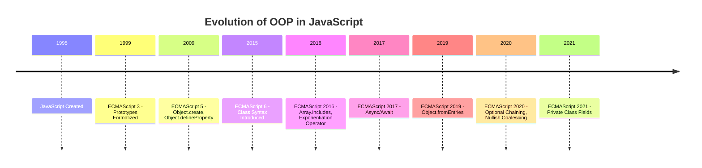

## 1.9 Evolution of OOP in JavaScript

JavaScript, a language that has become ubiquitous in web development, has undergone significant transformations since its inception. One of the most notable evolutions in JavaScript is its approach to Object-Oriented Programming (OOP). In this section, we will trace the history and evolution of OOP features in JavaScript, from its early days of prototype-based inheritance to the introduction of ES6 classes and beyond.

### A Brief History of JavaScript's Development

JavaScript was created in 1995 by Brendan Eich while working at Netscape Communications. Initially developed in just ten days, JavaScript was designed to be a lightweight scripting language for adding interactivity to web pages. Its primary goal was to enable non-programmers to create dynamic content easily. Over the years, JavaScript has evolved from a simple scripting language into a powerful, full-fledged programming language capable of supporting complex applications.

#### Early Days: The Prototype-Based Approach

In its early versions, JavaScript implemented OOP using a prototype-based model. Unlike classical OOP languages like Java or C++, which use classes to define object blueprints, JavaScript used prototypes. This approach allowed objects to inherit properties and methods directly from other objects, providing a flexible and dynamic inheritance mechanism.

**Prototype-Based Inheritance:**

In JavaScript, every object has a prototype, which is another object from which it inherits properties and methods. This prototype chain continues until it reaches an object with a null prototype, known as the base object. This model allows for dynamic inheritance, where objects can be extended and modified at runtime.

```javascript
// Creating an object using a constructor function
function Animal(name) {
  this.name = name;
}

// Adding a method to the prototype
Animal.prototype.speak = function() {
  console.log(`${this.name} makes a noise.`);
};

// Creating an instance
const dog = new Animal('Dog');
dog.speak(); // Output: Dog makes a noise.
```

In the example above, the `speak` method is added to the `Animal` prototype, allowing all instances of `Animal` to access this method. This demonstrates how JavaScript's prototype-based inheritance works.

### The Introduction of ES6 Classes

With the release of ECMAScript 6 (ES6) in 2015, JavaScript introduced a more familiar class syntax for defining objects and their behaviors. This was a significant milestone in the evolution of OOP in JavaScript, as it provided developers with a more intuitive and structured way to implement object-oriented principles.

**ES6 Classes:**

ES6 classes are syntactical sugar over JavaScript's existing prototype-based inheritance. They provide a cleaner and more concise way to create objects and handle inheritance, making JavaScript more approachable for developers coming from class-based OOP languages.

```javascript
// Defining a class
class Animal {
  constructor(name) {
    this.name = name;
  }

  speak() {
    console.log(`${this.name} makes a noise.`);
  }
}

// Creating an instance
const cat = new Animal('Cat');
cat.speak(); // Output: Cat makes a noise.
```

In this example, the `Animal` class is defined using the `class` keyword, and the `speak` method is added directly within the class body. This syntax is more aligned with traditional OOP languages, making it easier for developers to understand and use.

#### Impact of ES6 Classes

The introduction of ES6 classes had a profound impact on JavaScript development:

1. **Improved Readability and Maintainability:**
   - The class syntax makes code more readable and easier to maintain, especially for developers familiar with class-based languages.

2. **Enhanced Inheritance:**
   - ES6 classes support inheritance through the `extends` keyword, allowing developers to create hierarchical class structures.

3. **Static Methods and Properties:**
   - Classes can define static methods and properties, which are associated with the class itself rather than any instance.

4. **Encapsulation:**
   - While JavaScript does not enforce strict encapsulation, ES6 classes provide a framework for organizing code and encapsulating functionality.

### Key Milestones and Updates Related to OOP

The evolution of OOP in JavaScript has been marked by several key milestones and updates:

#### ECMAScript 3 (1999)

- **Introduction of Prototypes:**
  - ECMAScript 3 formalized the prototype-based inheritance model, laying the foundation for JavaScript's object-oriented capabilities.

#### ECMAScript 5 (2009)

- **`Object.create` Method:**
  - Introduced the `Object.create` method, allowing developers to create objects with a specified prototype.
  
- **`Object.defineProperty`:**
  - Enabled the definition of properties with specific attributes (e.g., writable, enumerable, configurable).

```javascript
// Using Object.create to create an object with a specified prototype
const animalPrototype = {
  speak() {
    console.log(`${this.name} makes a noise.`);
  }
};

const dog = Object.create(animalPrototype);
dog.name = 'Dog';
dog.speak(); // Output: Dog makes a noise.
```

#### ECMAScript 6 (2015)

- **Class Syntax:**
  - Introduced the `class` keyword, providing a more familiar syntax for defining objects and inheritance.

- **Arrow Functions:**
  - Simplified function expressions and provided lexical `this` binding, making it easier to work with methods in classes.

- **Template Literals:**
  - Enhanced string manipulation, allowing for more readable and maintainable code.

#### ECMAScript 2016 and Beyond

- **ES2016 (ES7):**
  - Introduced the `includes` method for arrays and the exponentiation operator (`**`).

- **ES2017 (ES8):**
  - Added async/await for handling asynchronous operations, improving code readability and flow.

- **ES2019 (ES10):**
  - Introduced `Object.fromEntries`, allowing the creation of objects from key-value pairs.

- **ES2020 (ES11):**
  - Added optional chaining (`?.`) and nullish coalescing (`??`), simplifying code that deals with null or undefined values.

- **ES2021 (ES12):**
  - Introduced private class fields and methods, providing a way to encapsulate data within classes.

```javascript
class Animal {
  #name; // Private field

  constructor(name) {
    this.#name = name;
  }

  speak() {
    console.log(`${this.#name} makes a noise.`);
  }
}

const bird = new Animal('Bird');
bird.speak(); // Output: Bird makes a noise.
```

### Visualizing the Evolution of OOP in JavaScript

To better understand the evolution of OOP in JavaScript, let's visualize the key milestones and updates using a timeline diagram.



### Try It Yourself: Experimenting with ES6 Classes

To solidify your understanding of ES6 classes, try modifying the following code example:

```javascript
class Vehicle {
  constructor(type, wheels) {
    this.type = type;
    this.wheels = wheels;
  }

  describe() {
    console.log(`This is a ${this.type} with ${this.wheels} wheels.`);
  }
}

// Create a new instance of Vehicle
const bike = new Vehicle('Bike', 2);
bike.describe(); // Output: This is a Bike with 2 wheels.

// Try creating a new class that extends Vehicle
class Car extends Vehicle {
  constructor(type, wheels, brand) {
    super(type, wheels);
    this.brand = brand;
  }

  describe() {
    console.log(`This is a ${this.brand} ${this.type} with ${this.wheels} wheels.`);
  }
}

// Create a new instance of Car
const tesla = new Car('Car', 4, 'Tesla');
tesla.describe(); // Output: This is a Tesla Car with 4 wheels.
```

**Challenge:** Modify the `Car` class to include a method that honks the horn, and test it with the `tesla` instance.

### Key Takeaways

- JavaScript has evolved significantly since its creation, with OOP features becoming more robust and intuitive over time.
- The prototype-based inheritance model provided a flexible way to implement OOP in early JavaScript versions.
- The introduction of ES6 classes brought a more familiar and structured approach to OOP, improving readability and maintainability.
- Recent ECMAScript updates continue to enhance JavaScript's OOP capabilities, with features like private class fields and methods.

### Embrace the Journey

Remember, this is just the beginning of your journey with JavaScript and OOP. As you progress, you'll build more complex and interactive applications. Keep experimenting, stay curious, and enjoy the journey!

## Quiz Time!



### What is the primary purpose of JavaScript when it was first created?

- [x] To add interactivity to web pages
- [ ] To build server-side applications
- [ ] To create desktop applications
- [ ] To replace HTML

> **Explanation:** JavaScript was initially created to add interactivity to web pages, making them more dynamic and engaging.

### How does JavaScript implement inheritance in its early versions?

- [x] Using prototypes
- [ ] Using classes
- [ ] Using interfaces
- [ ] Using modules

> **Explanation:** JavaScript uses a prototype-based inheritance model, where objects inherit properties and methods from other objects.

### What was a significant feature introduced in ES6 related to OOP?

- [x] Class syntax
- [ ] Object.create method
- [ ] Arrow functions
- [ ] Template literals

> **Explanation:** ES6 introduced the class syntax, providing a more familiar way to define objects and handle inheritance.

### What keyword is used in ES6 classes to create a subclass?

- [x] extends
- [ ] inherit
- [ ] subclass
- [ ] super

> **Explanation:** The `extends` keyword is used to create a subclass in ES6 classes, allowing for inheritance.

### Which ECMAScript version introduced async/await?

- [ ] ES6
- [ ] ES2016
- [x] ES2017
- [ ] ES2019

> **Explanation:** Async/await was introduced in ES2017, providing a more readable way to handle asynchronous operations.

### What method was introduced in ECMAScript 5 to create objects with a specified prototype?

- [x] Object.create
- [ ] Object.defineProperty
- [ ] Object.assign
- [ ] Object.fromEntries

> **Explanation:** The `Object.create` method was introduced in ECMAScript 5 to create objects with a specified prototype.

### What feature in ES2021 allows for encapsulating data within classes?

- [x] Private class fields
- [ ] Static methods
- [ ] Arrow functions
- [ ] Template literals

> **Explanation:** ES2021 introduced private class fields, allowing for encapsulation of data within classes.

### Which of the following is NOT a feature introduced in ES6?

- [ ] Class syntax
- [ ] Arrow functions
- [ ] Template literals
- [x] Optional chaining

> **Explanation:** Optional chaining was introduced in ES2020, not ES6.

### What is the purpose of the `super` keyword in ES6 classes?

- [x] To call the parent class constructor
- [ ] To define a static method
- [ ] To create a new instance
- [ ] To access private fields

> **Explanation:** The `super` keyword is used to call the parent class constructor in a subclass.

### True or False: JavaScript enforces strict encapsulation with ES6 classes.

- [ ] True
- [x] False

> **Explanation:** JavaScript does not enforce strict encapsulation with ES6 classes, but it provides a framework for organizing code and encapsulating functionality.


