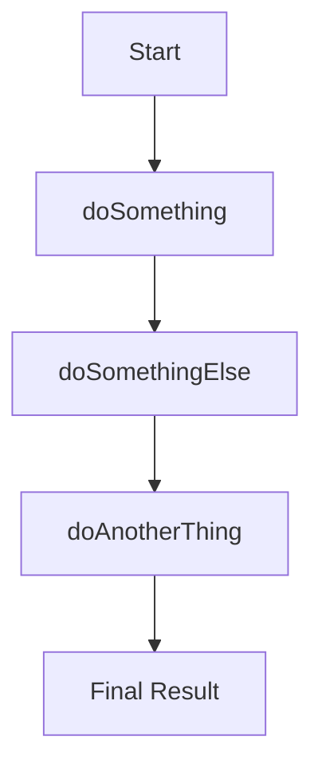

## 10.1 Callbacks and Their Challenges

In the world of JavaScript, understanding how to handle asynchronous operations is crucial. JavaScript is inherently single-threaded, meaning it can only execute one operation at a time. However, real-world applications often require performing multiple tasks simultaneously, such as fetching data from a server or reading files. This is where asynchronous programming comes into play, and one of the foundational concepts in this realm is the **callback function**.

### What Are Callbacks?

A **callback** is a function passed as an argument to another function, which is then invoked inside the outer function to complete some kind of routine or action. Callbacks are a way to ensure that a particular piece of code runs after an asynchronous operation has completed. This is essential in JavaScript, where operations like network requests, file reading, or timers do not block the execution of other code.

#### How Callbacks Work

Let's break down the concept of callbacks with a simple example:

```javascript
function fetchData(callback) {
    setTimeout(() => {
        console.log("Data fetched from server");
        callback();
    }, 2000);
}

function processData() {
    console.log("Processing data");
}

fetchData(processData);
```

In this example, `fetchData` simulates an asynchronous operation using `setTimeout`, which waits for 2 seconds before executing the code inside it. The `processData` function is passed as a callback to `fetchData`, ensuring that it runs only after the data has been "fetched."

### Asynchronous Operations Using Callbacks

JavaScript provides several built-in functions that utilize callbacks to handle asynchronous operations. Here are some common examples:

#### 1. Event Listeners

Event listeners are a classic example of callbacks in action. They wait for a specific event to occur and execute a callback function when it does.

```javascript
document.getElementById("myButton").addEventListener("click", function() {
    console.log("Button was clicked!");
});
```

In this snippet, the callback function logs a message to the console whenever the button with the ID `myButton` is clicked.

#### 2. Timers

JavaScript's `setTimeout` and `setInterval` functions are used to execute code after a delay or at regular intervals, respectively.

```javascript
setTimeout(() => {
    console.log("This message is displayed after 3 seconds");
}, 3000);
```

Here, the callback function is executed after a 3-second delay.

#### 3. AJAX Requests

AJAX (Asynchronous JavaScript and XML) requests are used to fetch data from a server without refreshing the page. Callbacks are crucial in handling the response once the request is complete.

```javascript
function getData(url, callback) {
    const xhr = new XMLHttpRequest();
    xhr.open("GET", url, true);
    xhr.onload = function() {
        if (xhr.status === 200) {
            callback(null, xhr.responseText);
        } else {
            callback(`Error: ${xhr.status}`);
        }
    };
    xhr.send();
}

getData("https://api.example.com/data", function(error, data) {
    if (error) {
        console.error(error);
    } else {
        console.log("Data received:", data);
    }
});
```

In this example, the `getData` function makes an AJAX request and uses a callback to handle the response or error.

### The Challenges of Callbacks

While callbacks are a powerful tool for managing asynchronous operations, they come with their own set of challenges. Let's explore some of these issues.

#### 1. Callback Hell

One of the most notorious problems with callbacks is **callback hell**, also known as the "pyramid of doom." This occurs when callbacks are nested within other callbacks, leading to code that is difficult to read and maintain.

```javascript
doSomething(function(result) {
    doSomethingElse(result, function(newResult) {
        doAnotherThing(newResult, function(finalResult) {
            console.log("Final result:", finalResult);
        });
    });
});
```

As you can see, the code becomes increasingly indented, making it hard to follow the flow of execution. This can lead to bugs and make the codebase challenging to maintain.

#### 2. Inversion of Control

Callbacks often involve handing over control to another function, which can lead to unexpected behavior if not managed carefully. This is known as **inversion of control**. When you pass a callback to a third-party library or API, you relinquish control over when and how that callback will be executed.

#### 3. Error Handling Complexity

Handling errors in callback-based code can be cumbersome. Unlike synchronous code, where you can use try-catch blocks, asynchronous code requires you to handle errors in each callback function.

```javascript
function asyncOperation(callback) {
    try {
        // Simulate an error
        throw new Error("Something went wrong!");
    } catch (error) {
        callback(error);
    }
}

asyncOperation(function(error) {
    if (error) {
        console.error("Error:", error.message);
    } else {
        console.log("Operation successful");
    }
});
```

In this example, error handling is done inside the callback, which can lead to repetitive and scattered error management throughout the code.

#### 4. Readability Issues

Asynchronous code with multiple callbacks can quickly become difficult to read and understand, especially for beginners. The logical flow of the program is not immediately apparent, making it harder to debug and maintain.

### Visualizing Callback Hell

To better understand the concept of callback hell, let's visualize it using a flowchart. This diagram illustrates how deeply nested callbacks can lead to complex and hard-to-follow code structures.



In this flowchart, each step represents a callback function, and the nesting creates a pyramid-like structure, making it challenging to trace the flow from start to finish.

### The Need for Better Solutions

Given the challenges associated with callbacks, developers have sought better ways to manage asynchronous code. This has led to the development of several alternatives and enhancements to the traditional callback approach.

#### 1. Promises

Promises provide a more structured way to handle asynchronous operations, allowing you to chain operations and handle errors more gracefully. They help flatten the pyramid of doom and improve code readability.

```javascript
function fetchData() {
    return new Promise((resolve, reject) => {
        setTimeout(() => {
            const success = true;
            if (success) {
                resolve("Data fetched successfully");
            } else {
                reject("Failed to fetch data");
            }
        }, 2000);
    });
}

fetchData()
    .then(data => {
        console.log(data);
    })
    .catch(error => {
        console.error(error);
    });
```

In this example, `fetchData` returns a promise, and the `then` and `catch` methods are used to handle the success and error cases, respectively.

#### 2. Async/Await

The `async` and `await` keywords, introduced in ES2017, provide a more synchronous-like syntax for writing asynchronous code. They build on top of promises and make the code easier to read and maintain.

```javascript
async function fetchData() {
    try {
        const data = await new Promise((resolve, reject) => {
            setTimeout(() => {
                resolve("Data fetched successfully");
            }, 2000);
        });
        console.log(data);
    } catch (error) {
        console.error(error);
    }
}

fetchData();
```

Here, the `await` keyword pauses the execution of the `fetchData` function until the promise is resolved or rejected, making the code appear more linear and easier to follow.

### Try It Yourself

To solidify your understanding of callbacks and their challenges, try modifying the code examples provided. Experiment with adding more nested callbacks to see how quickly the complexity increases. Then, refactor the code using promises or async/await to observe how these alternatives improve readability and maintainability.

### Knowledge Check

- What is a callback function, and how is it used in JavaScript?
- Can you identify the problems associated with callback hell?
- How do promises and async/await address the limitations of callbacks?

### Summary

In this section, we've explored the concept of callbacks and their role in asynchronous programming in JavaScript. While callbacks are a fundamental tool for managing asynchronous operations, they come with challenges such as callback hell, inversion of control, and error handling complexity. By understanding these issues, we can appreciate the need for better solutions like promises and async/await, which offer more readable and maintainable ways to handle asynchronous code.

Remember, mastering asynchronous programming is a journey. Keep experimenting, stay curious, and enjoy the process of learning and improving your JavaScript skills!

## Quiz Time!



### What is a callback function in JavaScript?

- [x] A function passed as an argument to another function to be executed later
- [ ] A function that runs immediately after being defined
- [ ] A function that is only used for error handling
- [ ] A function that is automatically called by the JavaScript engine

> **Explanation:** A callback function is passed as an argument to another function and is executed after the completion of some operation.

### What is one of the main issues with using callbacks for asynchronous operations?

- [x] Callback hell
- [ ] Lack of support for asynchronous operations
- [ ] Inability to handle errors
- [ ] Excessive memory usage

> **Explanation:** Callback hell refers to the situation where callbacks are nested within each other, leading to difficult-to-read and maintain code.

### How can you handle errors in callback-based code?

- [x] By passing an error object to the callback function
- [ ] By using a try-catch block
- [ ] By ignoring errors
- [ ] By using the `finally` keyword

> **Explanation:** In callback-based code, errors are typically handled by passing an error object to the callback function.

### What is inversion of control in the context of callbacks?

- [x] Relinquishing control over when and how a callback is executed
- [ ] Controlling the flow of the program using callbacks
- [ ] Using callbacks to manage synchronous code
- [ ] Ensuring callbacks run in a specific order

> **Explanation:** Inversion of control occurs when you pass a callback to another function or library, giving up control over its execution.

### How do promises improve upon callbacks?

- [x] They provide a more structured way to handle asynchronous operations
- [ ] They eliminate the need for asynchronous programming
- [ ] They run faster than callbacks
- [ ] They are only used for error handling

> **Explanation:** Promises offer a structured way to handle asynchronous operations, allowing for chaining and better error handling.

### What keyword is used to pause the execution of an async function until a promise is resolved?

- [x] await
- [ ] async
- [ ] pause
- [ ] stop

> **Explanation:** The `await` keyword is used to pause the execution of an async function until a promise is resolved or rejected.

### What is the main advantage of using async/await over promises?

- [x] It provides a more synchronous-like syntax for asynchronous code
- [ ] It eliminates the need for error handling
- [ ] It runs faster than promises
- [ ] It is only used for synchronous code

> **Explanation:** Async/await provides a more synchronous-like syntax, making asynchronous code easier to read and maintain.

### Which of the following is a common use case for callbacks in JavaScript?

- [x] Event listeners
- [ ] Variable declarations
- [ ] Synchronous loops
- [ ] Arithmetic operations

> **Explanation:** Callbacks are commonly used in event listeners to execute code in response to events.

### What is the purpose of the `setTimeout` function in JavaScript?

- [x] To execute a callback function after a specified delay
- [ ] To immediately execute a function
- [ ] To create a new variable
- [ ] To handle errors in asynchronous code

> **Explanation:** The `setTimeout` function is used to execute a callback function after a specified delay.

### True or False: Callbacks are the only way to handle asynchronous operations in JavaScript.

- [ ] True
- [x] False

> **Explanation:** While callbacks are a foundational tool for handling asynchronous operations, JavaScript also provides promises and async/await as alternatives.


