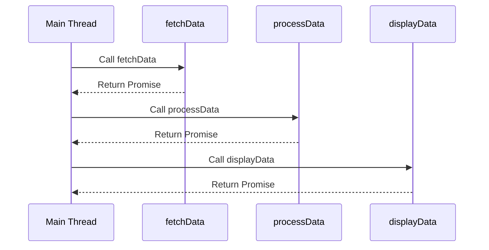

## 10.10 Best Practices for Asynchronous OOP

Asynchronous programming is a critical aspect of modern JavaScript development, especially when dealing with operations that take time to complete, such as network requests, file I/O, or timers. In this section, we will explore best practices for writing clean and maintainable asynchronous object-oriented code. We will cover key principles, patterns, and techniques to help you manage asynchronous operations effectively.

### Understanding Asynchronous Programming

Before diving into best practices, let's briefly revisit what asynchronous programming is. In JavaScript, asynchronous programming allows you to perform tasks without blocking the main thread. This means your application can continue executing other code while waiting for an operation to complete. This is particularly important in web development, where you want to keep the user interface responsive.

### Key Principles of Asynchronous Programming

1. **Non-blocking Operations**: Ensure that long-running tasks do not block the execution of other code. This is achieved through asynchronous functions, callbacks, promises, and async/await.

2. **Concurrency**: Manage multiple operations that can run simultaneously. JavaScript's event loop and concurrency model allow you to handle multiple tasks efficiently.

3. **Error Handling**: Implement robust error handling to manage exceptions that may occur during asynchronous operations.

4. **Resource Management**: Properly manage resources such as memory and network connections to avoid leaks and ensure efficient use.

### Avoiding Nested Callbacks

One of the common pitfalls in asynchronous programming is the "callback hell" or "pyramid of doom," which occurs when you have multiple nested callbacks. This can lead to code that is difficult to read and maintain. 

#### Example of Callback Hell

```javascript
function fetchData(callback) {
    setTimeout(() => {
        console.log("Data fetched");
        callback();
    }, 1000);
}

function processData(callback) {
    setTimeout(() => {
        console.log("Data processed");
        callback();
    }, 1000);
}

function displayData() {
    setTimeout(() => {
        console.log("Data displayed");
    }, 1000);
}

fetchData(() => {
    processData(() => {
        displayData();
    });
});
```

#### Solution: Use Promises

Promises provide a cleaner way to handle asynchronous operations and avoid nested callbacks.

```javascript
function fetchData() {
    return new Promise((resolve) => {
        setTimeout(() => {
            console.log("Data fetched");
            resolve();
        }, 1000);
    });
}

function processData() {
    return new Promise((resolve) => {
        setTimeout(() => {
            console.log("Data processed");
            resolve();
        }, 1000);
    });
}

function displayData() {
    return new Promise((resolve) => {
        setTimeout(() => {
            console.log("Data displayed");
            resolve();
        }, 1000);
    });
}

fetchData()
    .then(processData)
    .then(displayData)
    .catch((error) => console.error("Error:", error));
```

### Embrace Async/Await

The `async`/`await` syntax introduced in ES2017 provides a more readable and concise way to work with promises. It allows you to write asynchronous code that looks synchronous, making it easier to understand and maintain.

#### Example Using Async/Await

```javascript
async function handleData() {
    try {
        await fetchData();
        await processData();
        await displayData();
    } catch (error) {
        console.error("Error:", error);
    }
}

handleData();
```

### Proper Error Handling

Error handling is crucial in asynchronous programming. With promises, you can use `.catch()` to handle errors. With `async`/`await`, you can use try/catch blocks.

#### Example of Error Handling with Async/Await

```javascript
async function fetchData() {
    throw new Error("Failed to fetch data");
}

async function handleData() {
    try {
        await fetchData();
    } catch (error) {
        console.error("Error:", error.message);
    }
}

handleData();
```

### Consistent Naming Conventions

Consistent naming conventions improve code readability and maintainability. Here are some guidelines:

- **Use Verb-Based Names**: Name asynchronous functions with verbs that indicate action, such as `fetchData`, `loadUser`, or `saveFile`.
- **Suffix Async Functions**: Consider suffixing asynchronous functions with `Async` to indicate their nature, e.g., `fetchDataAsync`.

### Debugging Asynchronous Code

Debugging asynchronous code can be challenging due to the non-linear execution flow. Here are some tips:

- **Use Breakpoints**: Modern browsers and IDEs allow you to set breakpoints in asynchronous code.
- **Console Logging**: Use `console.log` to trace the execution flow and inspect variable states.
- **Error Stack Traces**: Pay attention to stack traces in error messages to identify where errors occur.

### Testing Asynchronous Code

Testing asynchronous code requires special attention to ensure tests wait for operations to complete. Use testing frameworks like Jest or Mocha, which provide utilities for handling asynchronous tests.

#### Example of Testing with Jest

```javascript
test("fetchData resolves with data", async () => {
    const data = await fetchData();
    expect(data).toBeDefined();
});
```

### Resource Management

Efficient resource management is essential to prevent memory leaks and ensure optimal performance. Here are some practices:

- **Close Connections**: Ensure network connections or file handles are closed after use.
- **Use Weak References**: Use `WeakMap` or `WeakSet` for caching objects to allow garbage collection.

### Visualizing Asynchronous Flow

To better understand how asynchronous operations flow, let's visualize a simple sequence of asynchronous tasks using a flowchart.



### Try It Yourself

Experiment with the code examples provided. Try modifying them to perform different tasks or handle additional asynchronous operations. For instance, add error handling to the promise-based example or introduce a new asynchronous function.

### Summary

In this section, we've explored best practices for writing asynchronous object-oriented code in JavaScript. By avoiding nested callbacks, embracing async/await, implementing proper error handling, and following consistent naming conventions, you can write clean and maintainable code. Remember to manage resources efficiently and use debugging and testing tools to ensure your code works as expected.

### Embrace the Journey

Asynchronous programming can be challenging, but with practice, you'll become proficient in writing efficient and maintainable code. Keep experimenting, stay curious, and enjoy the journey!

## Quiz Time!



### What is a common issue with using nested callbacks in asynchronous programming?

- [x] Callback hell
- [ ] Synchronous execution
- [ ] Blocking the main thread
- [ ] Memory leaks

> **Explanation:** Nested callbacks can lead to "callback hell," making code difficult to read and maintain.

### Which syntax provides a more readable way to handle promises in JavaScript?

- [x] async/await
- [ ] Callbacks
- [ ] setTimeout
- [ ] XMLHttpRequest

> **Explanation:** The async/await syntax allows you to write asynchronous code that looks synchronous, improving readability.

### How can you handle errors in asynchronous functions using async/await?

- [x] Use try/catch blocks
- [ ] Use .then() method
- [ ] Use setTimeout
- [ ] Use console.log

> **Explanation:** You can use try/catch blocks to handle errors in functions that use async/await.

### What is a recommended naming convention for asynchronous functions?

- [x] Suffix with Async
- [ ] Prefix with Sync
- [ ] Use all uppercase letters
- [ ] Use numeric suffixes

> **Explanation:** Suffixing asynchronous functions with "Async" helps indicate their asynchronous nature.

### What tool can you use to set breakpoints in asynchronous code?

- [x] Browser developer tools
- [ ] Notepad
- [ ] Paint
- [ ] Calculator

> **Explanation:** Modern browsers provide developer tools that allow you to set breakpoints in asynchronous code.

### Which of the following is a best practice for managing resources in asynchronous programming?

- [x] Close connections after use
- [ ] Keep all connections open
- [ ] Avoid using promises
- [ ] Use synchronous functions

> **Explanation:** Closing connections after use helps prevent resource leaks and ensures efficient resource management.

### How can you test asynchronous code using Jest?

- [x] Use async/await in test functions
- [ ] Use synchronous assertions
- [ ] Avoid testing asynchronous code
- [ ] Use setTimeout in tests

> **Explanation:** Jest supports async/await, allowing you to test asynchronous code by waiting for promises to resolve.

### What is the purpose of using WeakMap or WeakSet in asynchronous programming?

- [x] Allow garbage collection of cached objects
- [ ] Prevent garbage collection
- [ ] Increase memory usage
- [ ] Block asynchronous operations

> **Explanation:** WeakMap and WeakSet allow objects to be garbage collected, preventing memory leaks.

### What is the main benefit of using promises over callbacks?

- [x] Improved readability and maintainability
- [ ] Faster execution
- [ ] Reduced memory usage
- [ ] Increased complexity

> **Explanation:** Promises improve readability and maintainability by avoiding nested callbacks and providing a cleaner syntax.

### True or False: Asynchronous programming in JavaScript blocks the main thread.

- [ ] True
- [x] False

> **Explanation:** Asynchronous programming allows tasks to run without blocking the main thread, keeping the application responsive.


