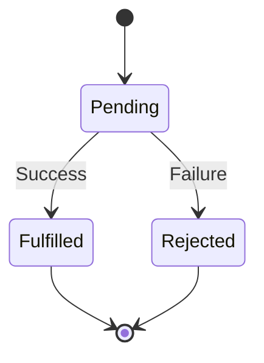
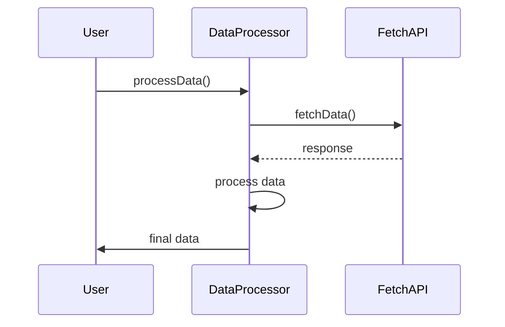

## 10.2 Promises in Object Methods

As we delve deeper into the world of JavaScript, one of the challenges we often face is managing asynchronous operations. Whether it's fetching data from a server, reading a file, or waiting for a timer, asynchronous tasks are a staple of modern web development. In this section, we'll explore how promises, a powerful feature in JavaScript, can be used within object methods to handle these tasks more effectively.

### Understanding Promises

Promises are a way to handle asynchronous operations in JavaScript. They provide a cleaner, more intuitive way to work with asynchronous code compared to traditional callbacks. A promise represents a value that may be available now, or in the future, or never.

#### States of a Promise

A promise can be in one of three states:

1. **Pending**: The initial state. The operation is ongoing, and the promise is neither fulfilled nor rejected.
2. **Fulfilled**: The operation completed successfully, and the promise has a resulting value.
3. **Rejected**: The operation failed, and the promise has a reason for the failure (usually an error).

Here's a simple diagram to visualize the states of a promise:



### Creating Promises

Let's start by creating a simple promise. A promise is created using the `Promise` constructor, which takes a function as an argument. This function is called the executor, and it receives two parameters: `resolve` and `reject`. These are functions that you call to change the state of the promise.

```javascript
const myPromise = new Promise((resolve, reject) => {
    // Simulate an asynchronous operation
    setTimeout(() => {
        const success = true; // Simulate success or failure
        if (success) {
            resolve("Operation successful!");
        } else {
            reject("Operation failed.");
        }
    }, 1000);
});
```

### Using Promises in Object Methods

In object-oriented programming, it's common to encapsulate functionality within methods. We can use promises within these methods to handle asynchronous tasks.

#### Example: Fetching Data with Promises

Let's create a class that fetches data from a server. We'll use the `fetch` API, which returns a promise.

```javascript
class DataFetcher {
    constructor(url) {
        this.url = url;
    }

    fetchData() {
        return fetch(this.url)
            .then(response => {
                if (!response.ok) {
                    throw new Error('Network response was not ok');
                }
                return response.json();
            })
            .catch(error => {
                console.error('There was a problem with the fetch operation:', error);
            });
    }
}

const fetcher = new DataFetcher('https://api.example.com/data');
fetcher.fetchData().then(data => console.log(data));
```

In this example, the `fetchData` method returns a promise. It uses the `fetch` API to retrieve data from a URL. If the fetch is successful, the promise is fulfilled with the JSON data. If there's an error, the promise is rejected, and the error is logged.

### Chaining Promises

One of the powerful features of promises is chaining. You can chain multiple `.then()` calls to handle sequences of asynchronous operations.

#### Example: Chaining Promises

Let's extend our `DataFetcher` class to process the data after fetching it.

```javascript
class DataProcessor extends DataFetcher {
    processData() {
        return this.fetchData()
            .then(data => {
                // Process the data
                console.log('Processing data:', data);
                return data.map(item => item.value * 2); // Example processing
            })
            .then(processedData => {
                console.log('Processed data:', processedData);
                return processedData;
            })
            .catch(error => {
                console.error('Error processing data:', error);
            });
    }
}

const processor = new DataProcessor('https://api.example.com/data');
processor.processData().then(finalData => console.log('Final data:', finalData));
```

In this example, the `processData` method chains multiple `.then()` calls to first fetch the data, then process it, and finally log the processed data. If any step in the chain fails, the `.catch()` method handles the error.

### Handling Errors with Promises

Error handling with promises is straightforward. You can use the `.catch()` method to handle any errors that occur in the promise chain.

#### Example: Error Handling

Let's modify our `DataFetcher` class to demonstrate error handling.

```javascript
class RobustDataFetcher extends DataFetcher {
    fetchData() {
        return fetch(this.url)
            .then(response => {
                if (!response.ok) {
                    throw new Error('Network response was not ok');
                }
                return response.json();
            })
            .catch(error => {
                console.error('Fetch error:', error);
                throw error; // Re-throw the error for further handling
            });
    }
}

const robustFetcher = new RobustDataFetcher('https://api.example.com/data');
robustFetcher.fetchData()
    .then(data => console.log('Data:', data))
    .catch(error => console.error('Final error handler:', error));
```

In this example, the `fetchData` method logs the error and re-throws it. This allows the error to be handled further down the promise chain.

### Best Practices for Using Promises

When using promises in object-oriented code, it's important to follow best practices to ensure your code is clean, readable, and maintainable.

#### Avoid the Promise Constructor Antipattern

The Promise constructor antipattern occurs when you unnecessarily wrap an existing promise in a new promise. This can lead to more complex and less readable code.

**Antipattern Example:**

```javascript
class BadExample {
    fetchData() {
        return new Promise((resolve, reject) => {
            fetch(this.url)
                .then(response => resolve(response))
                .catch(error => reject(error));
        });
    }
}
```

**Correct Approach:**

```javascript
class GoodExample {
    fetchData() {
        return fetch(this.url);
    }
}
```

In the correct approach, we directly return the promise from `fetch`, avoiding the unnecessary wrapping.

#### Improve Code Readability and Error Handling

Promises improve code readability by allowing you to write asynchronous code in a more synchronous style. They also provide a centralized way to handle errors, making your code more robust.

- **Use `.then()` for success and `.catch()` for errors**: This separates the success and error handling logic, making your code easier to read.
- **Chain promises**: Use promise chaining to handle sequences of asynchronous operations.
- **Handle errors at the end of the chain**: Place a `.catch()` at the end of your promise chain to handle any errors that occur.

### Try It Yourself

Now that we've covered the basics of using promises in object methods, it's time to experiment. Try modifying the `DataProcessor` class to add additional processing steps. For example, you could filter the data or calculate statistics.

```javascript
class CustomDataProcessor extends DataProcessor {
    additionalProcessing(data) {
        return data.filter(item => item.value > 10);
    }

    processData() {
        return super.processData()
            .then(data => this.additionalProcessing(data))
            .then(filteredData => {
                console.log('Filtered data:', filteredData);
                return filteredData;
            })
            .catch(error => {
                console.error('Error in additional processing:', error);
            });
    }
}

const customProcessor = new CustomDataProcessor('https://api.example.com/data');
customProcessor.processData().then(finalData => console.log('Final processed data:', finalData));
```

### Visualizing Promise Chaining

To better understand how promise chaining works, let's visualize the flow of operations:



### References and Further Reading

For more information on promises and asynchronous programming in JavaScript, check out these resources:

- [MDN Web Docs: Promises](https://developer.mozilla.org/en-US/docs/Web/JavaScript/Guide/Using_promises)
- [JavaScript.info: Promises](https://javascript.info/promise-basics)
- [W3Schools: JavaScript Promises](https://www.w3schools.com/js/js_promise.asp)

### Knowledge Check

Before moving on, let's summarize the key points:

- Promises provide a cleaner way to handle asynchronous operations compared to callbacks.
- A promise can be in one of three states: pending, fulfilled, or rejected.
- You can chain promises using `.then()` and handle errors with `.catch()`.
- Avoid the Promise constructor antipattern by not wrapping existing promises.
- Promises improve code readability and error handling.

### Embrace the Journey

As you continue your journey with JavaScript, remember that mastering asynchronous programming is a crucial skill. Promises are just one tool in your toolkit, but they are powerful and versatile. Keep experimenting, stay curious, and enjoy the process of learning and growing as a developer!

## Quiz Time!



### What is a promise in JavaScript?

- [x] An object representing the eventual completion or failure of an asynchronous operation
- [ ] A synchronous operation that executes immediately
- [ ] A method for handling synchronous code
- [ ] A way to create objects in JavaScript

> **Explanation:** A promise is an object that represents the eventual completion (or failure) of an asynchronous operation and its resulting value.

### Which of the following is NOT a state of a promise?

- [ ] Pending
- [ ] Fulfilled
- [ ] Rejected
- [x] Resolved

> **Explanation:** The three states of a promise are pending, fulfilled, and rejected. "Resolved" is not a state of a promise.

### How do you handle errors in a promise chain?

- [ ] Using `.then()`
- [x] Using `.catch()`
- [ ] Using `.finally()`
- [ ] Using `try...catch`

> **Explanation:** Errors in a promise chain are handled using `.catch()`, which catches any errors that occur in the chain.

### What is the Promise constructor antipattern?

- [x] Wrapping an existing promise in a new promise unnecessarily
- [ ] Using promises for synchronous operations
- [ ] Using `.catch()` for success handling
- [ ] Using `.then()` for error handling

> **Explanation:** The Promise constructor antipattern occurs when you wrap an existing promise in a new promise unnecessarily, leading to more complex code.

### What method is used to chain promises?

- [x] `.then()`
- [ ] `.catch()`
- [ ] `.finally()`
- [ ] `.resolve()`

> **Explanation:** The `.then()` method is used to chain promises, allowing you to handle sequences of asynchronous operations.

### What is the purpose of the `.catch()` method in promises?

- [ ] To chain promises
- [x] To handle errors in a promise chain
- [ ] To resolve a promise
- [ ] To reject a promise

> **Explanation:** The `.catch()` method is used to handle errors that occur in a promise chain.

### What does the `fetch` API return?

- [x] A promise
- [ ] An array
- [ ] A string
- [ ] An object

> **Explanation:** The `fetch` API returns a promise that resolves to the Response object representing the completion of the request.

### Why are promises preferred over callbacks?

- [x] They provide a cleaner, more readable way to handle asynchronous operations
- [ ] They are faster than callbacks
- [ ] They are synchronous
- [ ] They do not handle errors

> **Explanation:** Promises are preferred over callbacks because they provide a cleaner, more readable way to handle asynchronous operations and centralize error handling.

### What is the initial state of a promise?

- [x] Pending
- [ ] Fulfilled
- [ ] Rejected
- [ ] Resolved

> **Explanation:** The initial state of a promise is pending, indicating that the operation is ongoing.

### True or False: Promises can only be used in object-oriented programming.

- [ ] True
- [x] False

> **Explanation:** False. Promises can be used in any JavaScript code, not just in object-oriented programming.


