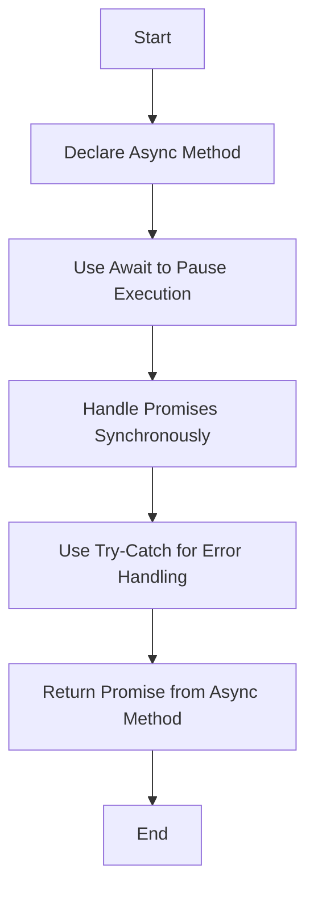

## 10.3 Async/Await in Classes

In this section, we will delve into the powerful `async`/`await` syntax introduced in ES2017, which revolutionizes how we handle asynchronous operations in JavaScript. By incorporating these features into classes, we can write more readable, maintainable, and efficient code. Let's explore how to declare `async` methods in classes, use `await` to handle promises synchronously, and simplify error handling with try-catch blocks.

### Understanding `async`/`await`

Before we dive into using `async`/`await` in classes, it's essential to understand what these keywords do. The `async` keyword is used to define an asynchronous function, which always returns a promise. This means that even if your function doesn't explicitly return a promise, JavaScript will wrap the return value in a promise.

The `await` keyword can only be used inside `async` functions. It pauses the execution of the function until the promise is resolved, allowing you to write asynchronous code that looks and behaves like synchronous code. This makes it easier to read and understand, especially for those new to asynchronous programming.

### Declaring `async` Methods in Classes

To declare an `async` method within a class, you simply prefix the method definition with the `async` keyword. This tells JavaScript that the method will perform asynchronous operations and return a promise.

```javascript
class DataFetcher {
  async fetchData(url) {
    const response = await fetch(url);
    const data = await response.json();
    return data;
  }
}

const fetcher = new DataFetcher();
fetcher.fetchData('https://api.example.com/data')
  .then(data => console.log(data))
  .catch(error => console.error('Error fetching data:', error));
```

In this example, the `fetchData` method is defined as an `async` method. It uses `await` to pause execution until the `fetch` promise is resolved, then waits for the `response.json()` promise to resolve before returning the data.

### Using `await` to Handle Promises

The `await` keyword allows us to write asynchronous code in a synchronous style. Instead of chaining `.then()` calls, we can use `await` to wait for a promise to resolve and assign its resolved value to a variable.

```javascript
class WeatherService {
  async getWeather(city) {
    try {
      const response = await fetch(`https://api.weather.com/v3/wx/conditions/current?city=${city}`);
      const weatherData = await response.json();
      return weatherData;
    } catch (error) {
      console.error('Error fetching weather data:', error);
    }
  }
}

const weatherService = new WeatherService();
weatherService.getWeather('New York')
  .then(weather => console.log(weather))
  .catch(error => console.error('Error:', error));
```

In this code, `await` is used twice: once to wait for the `fetch` promise and once to wait for the `response.json()` promise. This approach makes the code easier to read and understand compared to traditional promise chaining.

### Simplifying Error Handling with Try-Catch

One of the significant advantages of using `async`/`await` is the ability to handle errors using try-catch blocks. This provides a more straightforward and intuitive way to manage errors compared to using `.catch()` with promises.

```javascript
class FileUploader {
  async uploadFile(file) {
    try {
      const response = await fetch('https://api.upload.com/files', {
        method: 'POST',
        body: file
      });
      if (!response.ok) {
        throw new Error('File upload failed');
      }
      const result = await response.json();
      return result;
    } catch (error) {
      console.error('Error uploading file:', error);
    }
  }
}

const uploader = new FileUploader();
uploader.uploadFile(someFile)
  .then(result => console.log('File uploaded successfully:', result))
  .catch(error => console.error('Upload error:', error));
```

In this example, we use a try-catch block to handle any errors that occur during the file upload process. If an error is thrown, it is caught in the catch block, where we can handle it appropriately.

### Async Functions Always Return a Promise

It's important to remember that `async` functions always return a promise, regardless of whether you explicitly return a promise or not. This means you can use `.then()` and `.catch()` on the result of an `async` function.

```javascript
class Calculator {
  async add(a, b) {
    return a + b;
  }
}

const calculator = new Calculator();
calculator.add(5, 10)
  .then(result => console.log('Sum:', result))
  .catch(error => console.error('Error:', error));
```

In this example, the `add` method is an `async` function that returns the sum of two numbers. Even though it returns a simple number, JavaScript wraps it in a promise, allowing us to use `.then()` to handle the result.

### Encouraging Readable Asynchronous Code

Using `async`/`await` in classes encourages writing more readable and maintainable asynchronous code. By avoiding complex promise chains and using synchronous-style code, you can make your codebase easier to understand and work with.

Let's look at a more complex example that demonstrates how `async`/`await` can simplify asynchronous operations involving multiple promises.

```javascript
class UserProfile {
  async getUserProfile(userId) {
    try {
      const userResponse = await fetch(`https://api.example.com/users/${userId}`);
      const user = await userResponse.json();

      const postsResponse = await fetch(`https://api.example.com/users/${userId}/posts`);
      const posts = await postsResponse.json();

      return { user, posts };
    } catch (error) {
      console.error('Error fetching user profile:', error);
    }
  }
}

const userProfile = new UserProfile();
userProfile.getUserProfile(1)
  .then(profile => {
    console.log('User:', profile.user);
    console.log('Posts:', profile.posts);
  })
  .catch(error => console.error('Profile error:', error));
```

In this example, we fetch both user data and their posts using `await`. The code is clean and straightforward, making it easy to follow the flow of asynchronous operations.

### Visualizing Async/Await in Classes

To better understand how `async`/`await` works in classes, let's visualize the process using a flowchart.



This flowchart illustrates the steps involved in using `async`/`await` in a class method. It begins with declaring an `async` method, using `await` to handle promises, managing errors with try-catch, and finally returning a promise from the method.

### Try It Yourself

To reinforce your understanding of `async`/`await` in classes, try modifying the examples provided. Here are a few suggestions:

1. **Modify the URL**: Change the API endpoints in the examples to fetch different data.
2. **Add More Async Operations**: Introduce additional `await` statements to handle more asynchronous tasks.
3. **Experiment with Error Handling**: Throw different types of errors and see how they are caught in the catch block.
4. **Create Your Own Class**: Design a new class with `async` methods to perform a series of asynchronous operations.

### References and Further Reading

- [MDN Web Docs: async function](https://developer.mozilla.org/en-US/docs/Web/JavaScript/Reference/Statements/async_function)
- [MDN Web Docs: await](https://developer.mozilla.org/en-US/docs/Web/JavaScript/Reference/Operators/await)
- [JavaScript.info: Async/await](https://javascript.info/async-await)

### Knowledge Check

- What is the purpose of the `async` keyword in JavaScript?
- How does `await` improve the readability of asynchronous code?
- Why is error handling more straightforward with try-catch in `async` functions?
- What does an `async` function return by default?

### Embrace the Journey

Remember, mastering `async`/`await` is a significant step towards writing efficient and readable asynchronous code. As you continue to practice and experiment with these concepts, you'll gain confidence in handling complex asynchronous operations. Keep exploring, stay curious, and enjoy the journey of becoming a proficient JavaScript developer!

## Quiz Time!



### What does the `async` keyword do in a function?

- [x] It makes the function return a promise.
- [ ] It makes the function run faster.
- [ ] It allows the function to be called without parameters.
- [ ] It converts the function to a string.

> **Explanation:** The `async` keyword makes a function return a promise, allowing asynchronous operations to be handled more easily.

### How does `await` affect the execution of an `async` function?

- [x] It pauses the function execution until the promise is resolved.
- [ ] It speeds up the function execution.
- [ ] It converts the promise to a string.
- [ ] It cancels the function execution.

> **Explanation:** `await` pauses the execution of an `async` function until the promise is resolved, making the code easier to read and understand.

### What is the benefit of using try-catch with `async`/`await`?

- [x] Simplifies error handling.
- [ ] Increases code execution speed.
- [ ] Converts errors to strings.
- [ ] Makes functions synchronous.

> **Explanation:** Using try-catch with `async`/`await` simplifies error handling by allowing errors to be caught and managed in a straightforward manner.

### What does an `async` function return if no return statement is provided?

- [x] A promise that resolves to `undefined`.
- [ ] A string representation of the function.
- [ ] A promise that rejects.
- [ ] The function itself.

> **Explanation:** An `async` function always returns a promise, and if no return statement is provided, it resolves to `undefined`.

### Can `await` be used outside of an `async` function?

- [ ] Yes, in any JavaScript code.
- [x] No, it must be inside an `async` function.
- [ ] Yes, but only in Node.js.
- [ ] Yes, but only in the browser.

> **Explanation:** `await` can only be used inside an `async` function to pause execution until a promise is resolved.

### What happens if a promise is rejected in an `async` function without a try-catch block?

- [x] The promise returned by the `async` function is rejected.
- [ ] The function execution stops immediately.
- [ ] The promise is automatically resolved.
- [ ] The error is logged to the console.

> **Explanation:** If a promise is rejected in an `async` function without a try-catch block, the promise returned by the function is rejected.

### How can you handle multiple asynchronous operations in sequence using `async`/`await`?

- [x] Use multiple `await` statements in an `async` function.
- [ ] Use a single `await` statement for all operations.
- [ ] Chain `.then()` calls.
- [ ] Use a single try-catch block.

> **Explanation:** You can handle multiple asynchronous operations in sequence by using multiple `await` statements within an `async` function.

### What is the return type of an `async` method in a class?

- [x] A promise.
- [ ] A string.
- [ ] An object.
- [ ] A number.

> **Explanation:** An `async` method in a class returns a promise, allowing asynchronous operations to be managed effectively.

### How can you handle errors in an `async` function?

- [x] Use a try-catch block.
- [ ] Use a switch statement.
- [ ] Use a for loop.
- [ ] Use an if-else statement.

> **Explanation:** Errors in an `async` function can be handled using a try-catch block, which allows for straightforward error management.

### True or False: `async`/`await` can be used to write synchronous-looking code for asynchronous operations.

- [x] True
- [ ] False

> **Explanation:** True. `async`/`await` allows asynchronous code to be written in a synchronous style, improving readability and maintainability.


