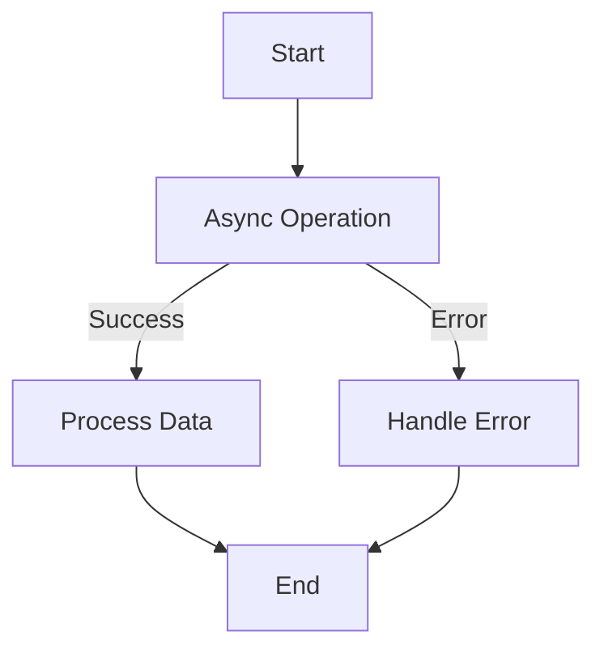

## 10.4 Handling Errors in Asynchronous Code

Asynchronous programming is a powerful feature in JavaScript, allowing us to perform tasks without blocking the main thread. However, it introduces unique challenges, particularly in error handling. In this section, we will explore various strategies to manage errors effectively in asynchronous code, using callbacks, promises, and `async`/`await`. We will also discuss the importance of error propagation and consistent error handling patterns.

### Understanding the Challenges

Handling errors in asynchronous code can be tricky because the error might occur at a different time than the code that initiated the operation. Unlike synchronous code, where errors can be caught using a simple `try-catch` block, asynchronous code requires more sophisticated techniques.

#### Why is Error Handling Important?

1. **User Experience**: Proper error handling ensures that users are informed of issues without crashing the application.
2. **Debugging**: It helps developers identify and fix issues quickly.
3. **Security**: Prevents sensitive information from being exposed through error messages.

### Error Handling with Callbacks

Callbacks were the original way to handle asynchronous operations in JavaScript. They involve passing a function as an argument to another function, which is then executed after the asynchronous operation completes.

#### Callback Pattern

A typical callback pattern involves passing an error object as the first argument to the callback function. If an error occurs, this object is not `null` or `undefined`.

```javascript
function fetchData(url, callback) {
    setTimeout(() => {
        const error = null; // Simulate no error
        const data = { id: 1, name: 'John Doe' };
        callback(error, data);
    }, 1000);
}

fetchData('https://api.example.com/data', (error, data) => {
    if (error) {
        console.error('Error fetching data:', error);
    } else {
        console.log('Data received:', data);
    }
});
```

#### Challenges with Callbacks

- **Callback Hell**: Nesting multiple callbacks can lead to deeply nested code, making it hard to read and maintain.
- **Error Propagation**: Manually passing errors through callback chains can be cumbersome.

### Error Handling with Promises

Promises provide a more elegant way to handle asynchronous operations, allowing us to chain operations and manage errors more effectively.

#### Promise Basics

A promise represents a value that may be available now, or in the future, or never. It can be in one of three states: pending, fulfilled, or rejected.

```javascript
function fetchData(url) {
    return new Promise((resolve, reject) => {
        setTimeout(() => {
            const error = null; // Simulate no error
            const data = { id: 1, name: 'John Doe' };
            if (error) {
                reject('Error fetching data');
            } else {
                resolve(data);
            }
        }, 1000);
    });
}

fetchData('https://api.example.com/data')
    .then(data => {
        console.log('Data received:', data);
    })
    .catch(error => {
        console.error('Error:', error);
    });
```

#### Catching Errors in Promise Chains

Errors in promise chains can be caught using the `.catch()` method. This method can catch errors from any previous promise in the chain.

```javascript
fetchData('https://api.example.com/data')
    .then(data => {
        console.log('Data received:', data);
        return processData(data); // Assume this is another promise
    })
    .then(processedData => {
        console.log('Processed Data:', processedData);
    })
    .catch(error => {
        console.error('Error:', error);
    });
```

#### Common Pitfalls

- **Unhandled Promise Rejections**: If a promise is rejected and there is no `.catch()` handler, it can lead to unhandled promise rejections. This can crash the application in Node.js or cause warnings in browsers.

### Error Handling with Async/Await

The `async`/`await` syntax introduced in ES2017 provides a more readable and synchronous-like way to work with promises.

#### Using Try-Catch with Async/Await

With `async`/`await`, we can use `try-catch` blocks to handle errors, making the code cleaner and easier to understand.

```javascript
async function fetchData(url) {
    try {
        const response = await fetch(url);
        const data = await response.json();
        console.log('Data received:', data);
    } catch (error) {
        console.error('Error fetching data:', error);
    }
}

fetchData('https://api.example.com/data');
```

#### Propagating Errors

When an error occurs in an asynchronous function, it can be propagated to the caller by simply throwing it. This allows higher-level functions to handle errors appropriately.

```javascript
async function fetchData(url) {
    const response = await fetch(url);
    if (!response.ok) {
        throw new Error('Network response was not ok');
    }
    return await response.json();
}

async function main() {
    try {
        const data = await fetchData('https://api.example.com/data');
        console.log('Data received:', data);
    } catch (error) {
        console.error('Error in main:', error);
    }
}

main();
```

### Consistent Error Handling Patterns

Consistency in error handling is crucial for maintainability and readability. Here are some best practices:

1. **Centralize Error Handling**: Use a central error handling function or middleware to manage errors uniformly.
2. **Log Errors**: Always log errors for debugging purposes.
3. **User-Friendly Messages**: Display user-friendly error messages instead of raw error details.
4. **Graceful Degradation**: Ensure the application continues to function, even if some features fail.

### Visualizing Error Propagation

To better understand how errors propagate in asynchronous code, let's visualize the process using a flowchart.



In this flowchart, we see that an asynchronous operation can lead to either successful data processing or error handling, depending on the outcome.

### Try It Yourself

Experiment with the code examples provided. Try modifying the `fetchData` function to simulate errors and observe how they are handled in different scenarios. This hands-on practice will solidify your understanding of asynchronous error handling.

### References and Further Reading

- [MDN Web Docs: Promises](https://developer.mozilla.org/en-US/docs/Web/JavaScript/Guide/Using_promises)
- [MDN Web Docs: Async/Await](https://developer.mozilla.org/en-US/docs/Learn/JavaScript/Asynchronous/Async_await)
- [Node.js Error Handling Best Practices](https://nodejs.org/en/docs/guides/error-handling-best-practices/)

### Knowledge Check

- What are the main differences between handling errors in synchronous and asynchronous code?
- How does the `.catch()` method work in promise chains?
- Why is consistent error handling important in asynchronous programming?

### Embrace the Journey

Remember, mastering error handling in asynchronous code is a journey. As you continue to learn and experiment, you'll become more adept at writing robust and reliable JavaScript applications. Keep exploring, stay curious, and enjoy the process!

## Quiz Time!



### What is a common challenge when handling errors in asynchronous code?

- [x] Errors may occur at a different time than the code that initiated the operation.
- [ ] Errors are always synchronous.
- [ ] Errors do not need to be handled in asynchronous code.
- [ ] Asynchronous code does not support error handling.

> **Explanation:** In asynchronous code, errors can occur at a different time than the code that initiated the operation, making error handling more complex.

### How can errors be propagated in promise chains?

- [x] By using the `.catch()` method.
- [ ] By using the `.then()` method.
- [ ] By using the `await` keyword.
- [ ] By using the `setTimeout` function.

> **Explanation:** The `.catch()` method is used to handle errors in promise chains, allowing errors to be propagated and caught.

### What is the purpose of the `try-catch` block in `async`/`await`?

- [x] To handle errors in asynchronous functions.
- [ ] To handle errors in synchronous functions only.
- [ ] To log errors without handling them.
- [ ] To prevent errors from occurring.

> **Explanation:** The `try-catch` block is used in `async`/`await` to handle errors in asynchronous functions, providing a clean and readable way to manage errors.

### What is a common pitfall in promise-based error handling?

- [x] Unhandled promise rejections.
- [ ] Synchronous errors.
- [ ] Using `try-catch` blocks.
- [ ] Using callbacks.

> **Explanation:** Unhandled promise rejections occur when a promise is rejected, and there is no `.catch()` handler to manage the error, leading to potential application crashes.

### Which of the following is a best practice for consistent error handling?

- [x] Centralize error handling.
- [ ] Ignore errors.
- [x] Log errors for debugging.
- [ ] Display raw error details to users.

> **Explanation:** Centralizing error handling and logging errors for debugging are best practices for consistent error management. Displaying raw error details to users is not recommended.

### What is the benefit of using promises over callbacks for error handling?

- [x] Promises provide a more elegant and readable way to chain operations and manage errors.
- [ ] Promises eliminate the need for error handling.
- [ ] Promises are always faster than callbacks.
- [ ] Promises do not support error handling.

> **Explanation:** Promises offer a more elegant and readable way to handle asynchronous operations and errors compared to callbacks, which can lead to callback hell.

### How can you simulate an error in a promise-based function?

- [x] By calling `reject()` with an error message.
- [ ] By calling `resolve()` with an error message.
- [ ] By using `console.error()`.
- [ ] By using `setTimeout()`.

> **Explanation:** In a promise-based function, you can simulate an error by calling `reject()` with an error message, which will trigger the `.catch()` handler.

### What is the role of the `async` keyword in JavaScript?

- [x] It allows the use of `await` within a function to handle asynchronous operations.
- [ ] It makes a function synchronous.
- [ ] It automatically handles errors.
- [ ] It replaces the need for promises.

> **Explanation:** The `async` keyword allows the use of `await` within a function, enabling asynchronous operations to be handled in a more synchronous-like manner.

### Why is it important to display user-friendly error messages?

- [x] To improve user experience by providing clear and helpful information.
- [ ] To expose technical details to users.
- [ ] To avoid handling errors.
- [ ] To make the application run faster.

> **Explanation:** Displaying user-friendly error messages improves user experience by providing clear and helpful information without exposing technical details.

### True or False: The `await` keyword can be used outside of an `async` function.

- [ ] True
- [x] False

> **Explanation:** The `await` keyword can only be used inside an `async` function to pause execution until a promise is resolved or rejected.


