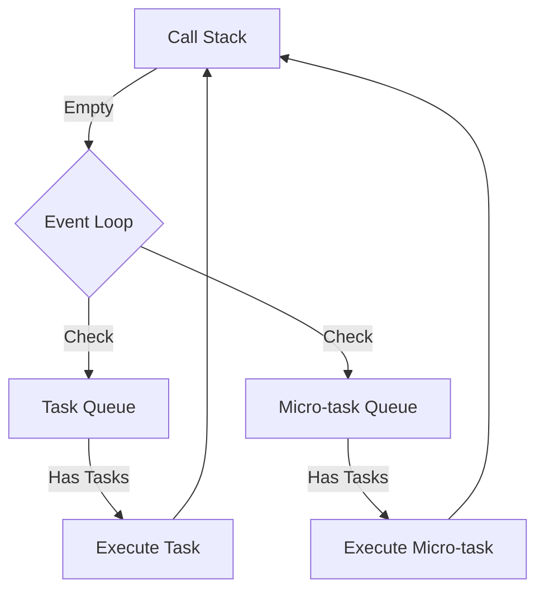
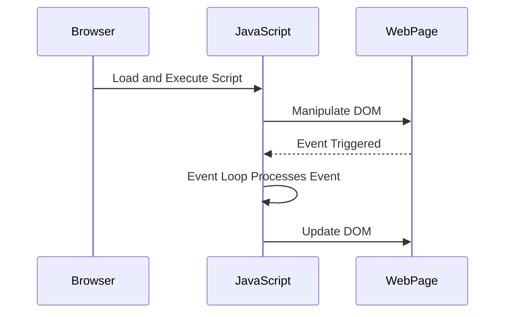

## 10.5 The Event Loop and Concurrency

JavaScript is a single-threaded, non-blocking, asynchronous, concurrent language. This might sound like a mouthful, but understanding these terms is crucial to mastering JavaScript's asynchronous behavior. At the heart of this behavior is the **event loop**, a mechanism that allows JavaScript to perform non-blocking operations by offloading operations to the system kernel whenever possible. In this section, we'll delve into the event loop, explore how it manages asynchronous execution, and understand its impact on performance and responsiveness.

### Understanding the Event Loop

The event loop is a fundamental part of JavaScript's runtime environment. It is responsible for executing code, collecting and processing events, and executing queued sub-tasks. Let's break down the components involved in this process:

- **Call Stack**: A data structure that keeps track of the execution context. It works on a Last In, First Out (LIFO) principle, meaning the last function pushed onto the stack is the first to be executed.
- **Task Queue (Macro-task Queue)**: A queue where tasks are placed for execution after the current execution stack is empty. Examples include `setTimeout`, `setInterval`, and I/O tasks.
- **Micro-task Queue**: A queue for tasks that need to be executed immediately after the currently executing script. Promises and `process.nextTick` in Node.js are examples of micro-tasks.

#### How the Event Loop Works

The event loop continuously checks the call stack to see if there's any function that needs to be executed. If the call stack is empty, it checks the task queue to see if there are any tasks waiting to be executed. If there are, it pushes the first task from the queue onto the call stack, which effectively starts its execution.



**Diagram Explanation**: This flowchart illustrates the event loop's operation. The event loop checks if the call stack is empty. If it is, it checks the task queue and micro-task queue for pending tasks, executing them as necessary.

### The Call Stack

The call stack is a simple data structure that records where in the program we are. When we enter a function, we push it onto the stack. When we return from a function, we pop it off the stack. This is how the JavaScript engine keeps track of function calls.

Consider the following example:

```javascript
function firstFunction() {
    console.log("First function");
    secondFunction();
    console.log("Back to first function");
}

function secondFunction() {
    console.log("Second function");
}

firstFunction();
```

**Execution Flow**:
1. `firstFunction` is called and added to the call stack.
2. `console.log("First function")` is executed.
3. `secondFunction` is called and added to the call stack.
4. `console.log("Second function")` is executed.
5. `secondFunction` completes and is removed from the call stack.
6. `console.log("Back to first function")` is executed.
7. `firstFunction` completes and is removed from the call stack.

### Task Queue (Macro-task Queue)

The task queue is where tasks are queued for execution after the current execution stack is empty. Tasks in this queue are often referred to as macro-tasks. Examples include:

- `setTimeout`
- `setInterval`
- I/O operations

When the call stack is empty, the event loop will take the first task from the task queue and push it onto the call stack, executing it.

```javascript
console.log("Start");

setTimeout(() => {
    console.log("Timeout");
}, 0);

console.log("End");
```

**Output**:
```
Start
End
Timeout
```

**Explanation**: Even though `setTimeout` is set to 0 milliseconds, it doesn't execute immediately. Instead, the callback is placed in the task queue and will only be executed after the call stack is empty.

### Micro-task Queue

The micro-task queue is similar to the task queue but has a higher priority. Micro-tasks are executed immediately after the currently executing script and before any task in the task queue. Examples of micro-tasks include:

- Promises
- `process.nextTick` in Node.js

```javascript
console.log("Start");

Promise.resolve().then(() => {
    console.log("Promise resolved");
});

console.log("End");
```

**Output**:
```
Start
End
Promise resolved
```

**Explanation**: The promise's `then` callback is placed in the micro-task queue and executed immediately after the current script, but before any tasks in the task queue.

### Asynchronous Callbacks

Asynchronous callbacks are functions that are executed after a certain event occurs. They are a key part of JavaScript's non-blocking nature. The event loop handles these callbacks by placing them in the appropriate queue (task or micro-task) and executing them when the call stack is empty.

Consider the following example with both a promise and a `setTimeout`:

```javascript
console.log("Start");

setTimeout(() => {
    console.log("Timeout");
}, 0);

Promise.resolve().then(() => {
    console.log("Promise resolved");
});

console.log("End");
```

**Output**:
```
Start
End
Promise resolved
Timeout
```

**Explanation**: The promise's `then` callback is executed before the `setTimeout` callback because the micro-task queue is processed before the task queue.

### Visualizing JavaScript's Interaction with Web Browsers and Web Pages

To better understand how JavaScript interacts with web browsers and web pages, consider the following diagram:



**Diagram Explanation**: This sequence diagram illustrates the interaction between a web browser, JavaScript, and a web page. JavaScript executes scripts, manipulates the DOM, processes events via the event loop, and updates the DOM as necessary.

### Timing of Code Execution and Race Conditions

Understanding the event loop is crucial for managing the timing of code execution and avoiding race conditions. A **race condition** occurs when the timing or order of events affects the outcome of a program. In JavaScript, race conditions can occur when asynchronous operations are not properly synchronized.

Consider the following example:

```javascript
let data;

function fetchData(callback) {
    setTimeout(() => {
        data = "Data fetched";
        callback();
    }, 1000);
}

fetchData(() => {
    console.log(data);
});

console.log("Data:", data);
```

**Output**:
```
Data: undefined
Data fetched
```

**Explanation**: The `console.log("Data:", data)` statement executes before the data is fetched, resulting in `undefined`. To avoid this race condition, ensure that dependent code executes only after asynchronous operations complete.

### Impact on Performance and Responsiveness

The event loop's ability to handle asynchronous operations without blocking the main thread is crucial for maintaining performance and responsiveness in applications. By offloading tasks to the task queue or micro-task queue, JavaScript can continue executing other code while waiting for asynchronous operations to complete.

However, it's important to manage these operations carefully to avoid performance bottlenecks. For example, placing too many tasks in the task queue can lead to delays in processing, affecting the responsiveness of the application.

### Try It Yourself

To gain a deeper understanding of the event loop and concurrency, try modifying the code examples provided. Experiment with different combinations of `setTimeout`, promises, and synchronous code to observe how the event loop manages execution. Consider the following challenges:

1. Modify the `setTimeout` delay to see how it affects the order of execution.
2. Add additional promises and observe how they are prioritized over tasks in the task queue.
3. Introduce synchronous code between asynchronous operations to see how it impacts execution order.

### Key Takeaways

- The event loop is a core part of JavaScript's runtime environment, enabling asynchronous execution.
- The call stack, task queue, and micro-task queue work together to manage code execution.
- Asynchronous callbacks are executed based on their placement in the task or micro-task queue.
- Understanding the event loop is crucial for managing code execution timing and avoiding race conditions.
- Properly managing asynchronous operations is essential for maintaining performance and responsiveness in applications.

### Further Reading

For more information on the event loop and concurrency in JavaScript, consider exploring the following resources:

- [MDN Web Docs: Event Loop](https://developer.mozilla.org/en-US/docs/Web/JavaScript/EventLoop)
- [JavaScript.info: Event Loop](https://javascript.info/event-loop)
- [Node.js Documentation: Event Loop](https://nodejs.org/en/docs/guides/event-loop-timers-and-nexttick/)

## Quiz Time!



### What is the primary role of the event loop in JavaScript?

- [x] To manage asynchronous execution and process events
- [ ] To compile JavaScript code
- [ ] To handle memory allocation
- [ ] To manage network requests

> **Explanation:** The event loop is responsible for managing asynchronous execution and processing events in JavaScript.

### Which of the following is a part of the event loop mechanism?

- [x] Call Stack
- [x] Task Queue
- [x] Micro-task Queue
- [ ] Memory Heap

> **Explanation:** The call stack, task queue, and micro-task queue are all components of the event loop mechanism.

### What is the order of execution for tasks in the event loop?

- [x] Call stack, micro-task queue, task queue
- [ ] Task queue, call stack, micro-task queue
- [ ] Micro-task queue, task queue, call stack
- [ ] Call stack, task queue, micro-task queue

> **Explanation:** The event loop processes the call stack first, followed by the micro-task queue, and then the task queue.

### Which of the following is an example of a micro-task?

- [x] Promise
- [ ] setTimeout
- [ ] setInterval
- [ ] I/O operation

> **Explanation:** Promises are an example of micro-tasks, which are executed before tasks in the task queue.

### What happens when the call stack is empty in the event loop?

- [x] The event loop checks the task queue for pending tasks
- [ ] The event loop terminates
- [ ] The event loop checks the memory heap
- [ ] The event loop compiles code

> **Explanation:** When the call stack is empty, the event loop checks the task queue for pending tasks to execute.

### How can race conditions be avoided in JavaScript?

- [x] By synchronizing asynchronous operations
- [ ] By using more synchronous code
- [ ] By increasing the number of tasks in the task queue
- [ ] By using more memory

> **Explanation:** Race conditions can be avoided by properly synchronizing asynchronous operations to ensure dependent code executes in the correct order.

### What is the purpose of the micro-task queue?

- [x] To execute tasks immediately after the current script and before the task queue
- [ ] To execute tasks after the task queue
- [ ] To execute tasks before the call stack
- [ ] To execute tasks in parallel with the call stack

> **Explanation:** The micro-task queue is used to execute tasks immediately after the current script and before any tasks in the task queue.

### Which of the following statements is true about the event loop?

- [x] It allows JavaScript to perform non-blocking operations
- [ ] It blocks the execution of code
- [ ] It only works with synchronous code
- [ ] It is not part of the JavaScript runtime environment

> **Explanation:** The event loop allows JavaScript to perform non-blocking operations by managing asynchronous execution.

### What is the relationship between the call stack and the task queue?

- [x] The task queue holds tasks that are executed when the call stack is empty
- [ ] The call stack holds tasks that are executed when the task queue is empty
- [ ] The task queue and call stack execute tasks simultaneously
- [ ] The call stack and task queue are unrelated

> **Explanation:** The task queue holds tasks that are executed when the call stack is empty, allowing for asynchronous execution.

### True or False: The event loop is responsible for handling memory allocation in JavaScript.

- [ ] True
- [x] False

> **Explanation:** The event loop is not responsible for handling memory allocation; it manages asynchronous execution and event processing.



Remember, this is just the beginning. As you progress, you'll build more complex and interactive web pages. Keep experimenting, stay curious, and enjoy the journey!
