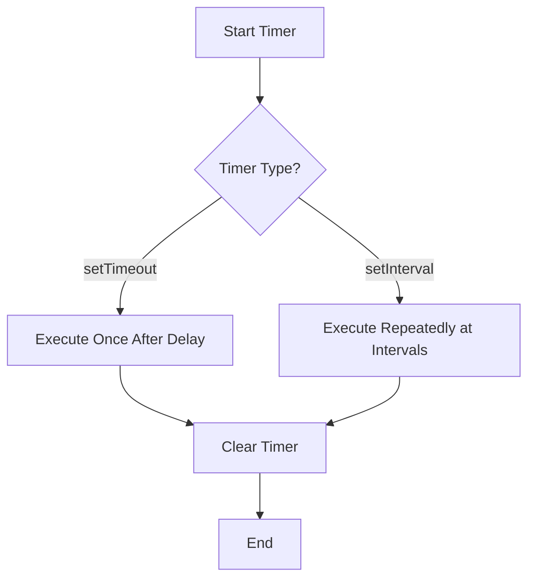

## 10.6 Working with Timers

In the world of JavaScript, timers are essential tools for managing asynchronous operations. They allow us to schedule tasks to run at specific times or intervals, making them invaluable for creating dynamic and responsive applications. In this section, we'll explore how to use JavaScript's built-in timer functions, `setTimeout` and `setInterval`, within the context of object-oriented programming (OOP). We'll cover how these functions work, how to integrate them into class methods, and best practices for managing timers to avoid common pitfalls like memory leaks.

### Understanding JavaScript Timers

JavaScript provides two primary functions for working with timers:

- **`setTimeout`**: Executes a function once after a specified delay.
- **`setInterval`**: Repeatedly executes a function at specified intervals.

Both functions are part of the Web API, meaning they are available in the browser environment and in Node.js. Let's take a closer look at each of these functions.

#### setTimeout

The `setTimeout` function is used to run a function once after a specified number of milliseconds. Its syntax is as follows:

```javascript
setTimeout(function, delay, arg1, arg2, ...);
```

- **`function`**: The function to execute after the delay.
- **`delay`**: The time, in milliseconds, to wait before executing the function.
- **`arg1, arg2, ...`**: Optional arguments to pass to the function.

Here's a simple example:

```javascript
setTimeout(() => {
  console.log("This message is displayed after 2 seconds.");
}, 2000);
```

In this example, the message will be logged to the console after a 2-second delay.

#### setInterval

The `setInterval` function is used to repeatedly execute a function at specified intervals. Its syntax is similar to `setTimeout`:

```javascript
setInterval(function, interval, arg1, arg2, ...);
```

- **`function`**: The function to execute at each interval.
- **`interval`**: The time, in milliseconds, between each execution of the function.
- **`arg1, arg2, ...`**: Optional arguments to pass to the function.

Here's an example:

```javascript
setInterval(() => {
  console.log("This message is displayed every 2 seconds.");
}, 2000);
```

This code will log the message to the console every 2 seconds until the interval is cleared.

### Integrating Timers in Object-Oriented Programming

In object-oriented programming, it's common to encapsulate functionality within classes. Let's explore how to use `setTimeout` and `setInterval` within class methods.

#### Using setTimeout in Class Methods

When using `setTimeout` in a class method, it's important to consider the context of `this`. The `this` keyword refers to the object that owns the method. However, when a function is called by `setTimeout`, `this` does not automatically refer to the class instance. To maintain the correct context, you can use an arrow function or the `bind` method.

Here's an example using an arrow function:

```javascript
class TimerExample {
  constructor() {
    this.message = "Hello, world!";
  }

  startTimer() {
    setTimeout(() => {
      console.log(this.message);
    }, 1000);
  }
}

const example = new TimerExample();
example.startTimer();
```

In this example, the arrow function preserves the `this` context, allowing us to access `this.message` within the `setTimeout` callback.

Alternatively, you can use the `bind` method:

```javascript
class TimerExample {
  constructor() {
    this.message = "Hello, world!";
  }

  startTimer() {
    setTimeout(function() {
      console.log(this.message);
    }.bind(this), 1000);
  }
}

const example = new TimerExample();
example.startTimer();
```

The `bind` method creates a new function with the `this` value set to the specified object.

#### Using setInterval in Class Methods

Similarly, when using `setInterval` in class methods, you need to ensure the correct `this` context. Here's an example using an arrow function:

```javascript
class Repeater {
  constructor() {
    this.count = 0;
  }

  startRepeating() {
    this.intervalId = setInterval(() => {
      this.count++;
      console.log(`Count: ${this.count}`);
    }, 1000);
  }

  stopRepeating() {
    clearInterval(this.intervalId);
  }
}

const repeater = new Repeater();
repeater.startRepeating();

// Call repeater.stopRepeating() to stop the interval
```

In this example, the `setInterval` function increments a counter every second. The `stopRepeating` method uses `clearInterval` to stop the interval.

### Managing and Clearing Timers

Properly managing and clearing timers is crucial to prevent memory leaks and ensure efficient resource usage. Both `setTimeout` and `setInterval` return a unique identifier that can be used to clear the timer.

#### Clearing setTimeout

To clear a timeout, use the `clearTimeout` function with the identifier returned by `setTimeout`:

```javascript
const timeoutId = setTimeout(() => {
  console.log("This will not be logged.");
}, 2000);

clearTimeout(timeoutId);
```

In this example, the timeout is cleared before the function can execute.

#### Clearing setInterval

Similarly, use `clearInterval` to stop an interval:

```javascript
const intervalId = setInterval(() => {
  console.log("This will not be logged.");
}, 2000);

clearInterval(intervalId);
```

### Use Cases for Timers

Timers are versatile tools with a variety of use cases in web development. Let's explore some common scenarios where timers are useful.

#### Debouncing

Debouncing is a technique used to limit the rate at which a function is executed. It's often used in scenarios like search input fields, where you want to wait for the user to stop typing before sending a request.

Here's a simple debounce implementation using `setTimeout`:

```javascript
class Search {
  constructor() {
    this.timerId = null;
  }

  debounceSearch(callback, delay) {
    clearTimeout(this.timerId);
    this.timerId = setTimeout(callback, delay);
  }
}

const search = new Search();
const searchInput = document.getElementById('search');

searchInput.addEventListener('input', () => {
  search.debounceSearch(() => {
    console.log('Search executed');
  }, 300);
});
```

In this example, the search function is executed 300 milliseconds after the user stops typing.

#### Polling

Polling is a technique where you repeatedly check for changes or updates at regular intervals. It's often used in scenarios like checking for new messages or updates from a server.

Here's a simple polling implementation using `setInterval`:

```javascript
class Poller {
  constructor() {
    this.pollingId = null;
  }

  startPolling(callback, interval) {
    this.pollingId = setInterval(callback, interval);
  }

  stopPolling() {
    clearInterval(this.pollingId);
  }
}

const poller = new Poller();
poller.startPolling(() => {
  console.log('Checking for updates...');
}, 5000);

// Call poller.stopPolling() to stop polling
```

In this example, the polling function checks for updates every 5 seconds.

#### Scheduling Tasks

Timers can be used to schedule tasks that need to be executed at specific times. This can be useful for tasks like sending reminders or updating UI elements.

Here's an example of scheduling a task using `setTimeout`:

```javascript
class TaskScheduler {
  scheduleTask(callback, delay) {
    setTimeout(callback, delay);
  }
}

const scheduler = new TaskScheduler();
scheduler.scheduleTask(() => {
  console.log('Task executed');
}, 10000);
```

In this example, the task is executed 10 seconds after being scheduled.

### Considerations for Using Timers

When working with timers, there are several considerations to keep in mind:

- **Performance**: Excessive use of timers can impact performance, especially if they are set to execute at very short intervals.
- **Memory Leaks**: Always clear timers when they are no longer needed to prevent memory leaks.
- **Accuracy**: Timers are not guaranteed to execute at the exact specified time, especially if the browser is busy with other tasks.

### Visualizing Timer Operations

To better understand how timers work, let's visualize the process using a flowchart:



This flowchart illustrates the decision-making process when using timers, highlighting the difference between `setTimeout` and `setInterval`.

### Try It Yourself

To solidify your understanding of timers, try modifying the examples above:

- Change the delay or interval values to see how they affect execution.
- Add additional functionality to the class methods, such as logging the current time.
- Implement a countdown timer using `setInterval`.

### References and Further Reading

For more information on JavaScript timers, check out these resources:

- [MDN Web Docs: setTimeout](https://developer.mozilla.org/en-US/docs/Web/API/setTimeout)
- [MDN Web Docs: setInterval](https://developer.mozilla.org/en-US/docs/Web/API/setInterval)
- [JavaScript.info: Timers](https://javascript.info/settimeout-setinterval)

### Knowledge Check

Before moving on, take a moment to reflect on what you've learned:

- Can you explain the difference between `setTimeout` and `setInterval`?
- How would you use an arrow function to maintain the correct `this` context in a class method?
- What are some common use cases for timers in web development?

### Embrace the Journey

Remember, mastering timers is just one step on your journey to becoming proficient in JavaScript and object-oriented programming. Keep experimenting, stay curious, and enjoy the process of learning and discovery!

## Quiz Time!



### What is the primary purpose of `setTimeout` in JavaScript?

- [x] To execute a function once after a specified delay
- [ ] To execute a function repeatedly at specified intervals
- [ ] To clear a previously set timer
- [ ] To bind the `this` context in a function

> **Explanation:** `setTimeout` is used to execute a function once after a specified delay in milliseconds.

### How can you maintain the correct `this` context in a `setTimeout` callback within a class method?

- [x] Use an arrow function
- [ ] Use a regular function
- [ ] Use a global variable
- [ ] Use a for loop

> **Explanation:** Arrow functions do not have their own `this` context, so they inherit `this` from the surrounding lexical context, which is the class instance.

### What function is used to stop a `setInterval` timer?

- [x] `clearInterval`
- [ ] `clearTimeout`
- [ ] `stopInterval`
- [ ] `stopTimeout`

> **Explanation:** `clearInterval` is used to stop a timer set by `setInterval`.

### What is a common use case for debouncing with `setTimeout`?

- [x] Limiting the rate of function execution, such as in search input fields
- [ ] Repeatedly checking for updates from a server
- [ ] Scheduling tasks to run at specific times
- [ ] Logging messages to the console

> **Explanation:** Debouncing is used to limit the rate at which a function is executed, often in scenarios like search input fields.

### Which of the following is a potential issue when using timers excessively?

- [x] Performance impact
- [x] Memory leaks
- [ ] Improved accuracy
- [ ] Faster execution

> **Explanation:** Excessive use of timers can impact performance and lead to memory leaks if not managed properly.

### What does `setInterval` return?

- [x] A unique identifier for the interval
- [ ] The result of the executed function
- [ ] The delay time in milliseconds
- [ ] A promise object

> **Explanation:** `setInterval` returns a unique identifier that can be used to clear the interval with `clearInterval`.

### How can you clear a `setTimeout` timer?

- [x] Use `clearTimeout` with the timer's identifier
- [ ] Use `clearInterval` with the timer's identifier
- [ ] Use `stopTimeout` with the timer's identifier
- [ ] Use `cancelTimeout` with the timer's identifier

> **Explanation:** `clearTimeout` is used to clear a timer set by `setTimeout`, using the timer's identifier.

### What is the role of `bind` when used with a function in a timer?

- [x] To set the `this` context for the function
- [ ] To execute the function immediately
- [ ] To delay the function execution
- [ ] To repeat the function execution

> **Explanation:** `bind` creates a new function with the `this` value set to the specified object, ensuring the correct context.

### Which of the following is NOT a use case for timers?

- [x] Compiling JavaScript code
- [ ] Debouncing user input
- [ ] Polling for server updates
- [ ] Scheduling tasks

> **Explanation:** Timers are used for scheduling tasks, debouncing, and polling, but not for compiling code.

### True or False: Timers in JavaScript are guaranteed to execute at the exact specified time.

- [ ] True
- [x] False

> **Explanation:** Timers are not guaranteed to execute at the exact specified time due to potential delays caused by other tasks in the browser.




