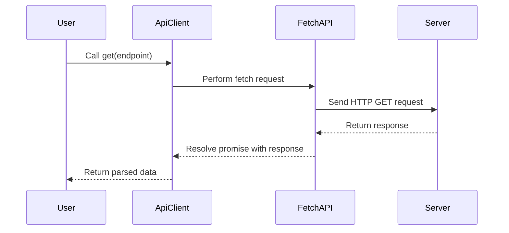

## 10.7 Fetch API and OOP

In this section, we'll explore how to incorporate network requests within your JavaScript classes using the Fetch API. This modern interface allows us to perform various HTTP methods such as GET and POST, handle promises, and process responses effectively. By the end of this chapter, you'll be equipped to integrate fetch calls within class methods and handle errors gracefully, all while adhering to best practices for organizing API interactions.

### Introduction to the Fetch API

The Fetch API is a modern web API that provides a more powerful and flexible feature set for making network requests compared to the older XMLHttpRequest. It is built into modern browsers and allows us to perform network requests similar to XMLHttpRequest (XHR). However, it is more powerful and flexible, using promises to handle asynchronous operations.

#### Key Features of Fetch API

- **Promise-Based**: Fetch uses promises, making it easier to handle asynchronous operations.
- **Streamlined Syntax**: Fetch has a simpler and cleaner syntax compared to XMLHttpRequest.
- **Support for Various HTTP Methods**: Fetch supports GET, POST, PUT, DELETE, and more.
- **Response Handling**: Fetch provides a variety of methods to handle responses, such as `json()`, `text()`, and `blob()`.

Let's start with a simple example to understand how the Fetch API works.

```javascript
// Example of a simple GET request using Fetch API
fetch('https://jsonplaceholder.typicode.com/posts/1')
  .then(response => response.json()) // Parse the JSON from the response
  .then(data => console.log(data)) // Log the data to the console
  .catch(error => console.error('Error:', error)); // Handle any errors
```

In this example, we perform a GET request to a placeholder API. We then parse the JSON response and log it to the console. If there's an error, we catch it and log an error message.

### Performing HTTP Methods with Fetch

The Fetch API allows us to perform various HTTP methods. Let's explore how to use GET, POST, and other HTTP methods.

#### GET Request

A GET request is used to retrieve data from a server. We've already seen a simple GET request in the previous example. Here's another example:

```javascript
// Function to fetch data from an API
function fetchData(url) {
  fetch(url)
    .then(response => {
      if (!response.ok) {
        throw new Error('Network response was not ok');
      }
      return response.json();
    })
    .then(data => console.log(data))
    .catch(error => console.error('Fetch error:', error));
}

// Call the function with a URL
fetchData('https://jsonplaceholder.typicode.com/posts');
```

In this example, we define a function `fetchData` that takes a URL as an argument. We check if the response is okay using `response.ok`. If not, we throw an error. Otherwise, we parse the JSON and log the data.

#### POST Request

A POST request is used to send data to a server. Here's how to perform a POST request with Fetch:

```javascript
// Function to post data to an API
function postData(url, data) {
  fetch(url, {
    method: 'POST', // Specify the HTTP method
    headers: {
      'Content-Type': 'application/json' // Set the content type
    },
    body: JSON.stringify(data) // Convert the data to a JSON string
  })
    .then(response => response.json())
    .then(data => console.log('Success:', data))
    .catch(error => console.error('Error:', error));
}

// Call the function with a URL and data
postData('https://jsonplaceholder.typicode.com/posts', { title: 'foo', body: 'bar', userId: 1 });
```

In this example, we define a function `postData` that takes a URL and data as arguments. We specify the HTTP method as `POST` and set the `Content-Type` header to `application/json`. We then convert the data to a JSON string using `JSON.stringify()` and send it in the request body.

#### Other HTTP Methods

Fetch can also be used to perform other HTTP methods such as PUT, DELETE, etc. The syntax is similar to POST, with the method name changed accordingly.

### Integrating Fetch Calls within Class Methods

Now that we understand how to perform HTTP requests using Fetch, let's integrate these calls within class methods. This approach allows us to encapsulate network logic within objects, promoting code reuse and organization.

#### Creating a Simple API Client Class

Let's create a simple API client class that can perform GET and POST requests.

```javascript
class ApiClient {
  constructor(baseUrl) {
    this.baseUrl = baseUrl; // Base URL for the API
  }

  // Method to perform a GET request
  get(endpoint) {
    return fetch(`${this.baseUrl}${endpoint}`)
      .then(response => {
        if (!response.ok) {
          throw new Error('Network response was not ok');
        }
        return response.json();
      });
  }

  // Method to perform a POST request
  post(endpoint, data) {
    return fetch(`${this.baseUrl}${endpoint}`, {
      method: 'POST',
      headers: {
        'Content-Type': 'application/json'
      },
      body: JSON.stringify(data)
    })
      .then(response => {
        if (!response.ok) {
          throw new Error('Network response was not ok');
        }
        return response.json();
      });
  }
}

// Example usage of the ApiClient class
const apiClient = new ApiClient('https://jsonplaceholder.typicode.com');

// Perform a GET request
apiClient.get('/posts/1')
  .then(data => console.log('GET response:', data))
  .catch(error => console.error('GET error:', error));

// Perform a POST request
apiClient.post('/posts', { title: 'foo', body: 'bar', userId: 1 })
  .then(data => console.log('POST response:', data))
  .catch(error => console.error('POST error:', error));
```

In this example, we define an `ApiClient` class with a constructor that takes a base URL. We have two methods, `get` and `post`, to perform GET and POST requests, respectively. We use template literals to construct the full URL and handle responses similarly to our previous examples.

### Handling Promises and Processing Responses

When working with the Fetch API, handling promises and processing responses is crucial. Let's dive deeper into these aspects.

#### Understanding Promises

A promise is an object representing the eventual completion or failure of an asynchronous operation. Fetch returns a promise that resolves to the response of the request.

- **Pending**: The initial state, neither fulfilled nor rejected.
- **Fulfilled**: The operation completed successfully.
- **Rejected**: The operation failed.

#### Processing Responses

When a fetch promise is fulfilled, we can process the response using methods like `json()`, `text()`, or `blob()`. These methods return a promise that resolves to the parsed data.

```javascript
// Example of processing a JSON response
fetch('https://jsonplaceholder.typicode.com/posts/1')
  .then(response => response.json()) // Parse the JSON from the response
  .then(data => console.log(data)) // Log the data to the console
  .catch(error => console.error('Error:', error)); // Handle any errors
```

In this example, we use `response.json()` to parse the JSON response. Similarly, we can use `response.text()` for plain text responses or `response.blob()` for binary data.

### Error Handling for Network Failures or HTTP Errors

Handling errors is an essential part of working with network requests. Let's explore how to handle network failures and HTTP errors effectively.

#### Network Failures

Network failures occur when the request cannot reach the server. These can be handled using the `catch` method of a promise.

```javascript
// Example of handling network failures
fetch('https://jsonplaceholder.typicode.com/invalid-url')
  .then(response => {
    if (!response.ok) {
      throw new Error('HTTP error, status = ' + response.status);
    }
    return response.json();
  })
  .catch(error => console.error('Network error:', error));
```

In this example, we simulate a network failure by using an invalid URL. We catch the error and log it to the console.

#### HTTP Errors

HTTP errors occur when the server returns a response with a status code indicating an error (e.g., 404, 500). These can be handled by checking the `response.ok` property.

```javascript
// Example of handling HTTP errors
fetch('https://jsonplaceholder.typicode.com/posts/1')
  .then(response => {
    if (!response.ok) {
      throw new Error('HTTP error, status = ' + response.status);
    }
    return response.json();
  })
  .then(data => console.log(data))
  .catch(error => console.error('HTTP error:', error));
```

In this example, we check if `response.ok` is false, indicating an HTTP error. We then throw an error with the status code.

### Best Practices for Organizing API Interactions

When working with the Fetch API and integrating it into your classes, it's essential to follow best practices to ensure your code is maintainable and organized.

#### Separating Concerns

Separate your API logic from your application logic. This separation makes your code easier to maintain and test. Use classes or modules to encapsulate API interactions.

#### Handling Errors Gracefully

Always handle errors gracefully. Provide meaningful error messages and consider retry mechanisms for transient errors.

#### Using Constants for URLs and Endpoints

Define constants for URLs and endpoints to avoid hardcoding them throughout your code. This approach makes it easier to update URLs if they change.

```javascript
// Constants for API endpoints
const API_BASE_URL = 'https://jsonplaceholder.typicode.com';
const POSTS_ENDPOINT = '/posts';
```

#### Documenting Your Code

Document your code to explain the purpose of each function or class. Use comments to describe complex logic or important decisions.

### Try It Yourself

Now that we've covered the basics of using the Fetch API with OOP, try modifying the examples to suit your needs. Here are a few suggestions:

- **Add PUT and DELETE Methods**: Extend the `ApiClient` class to include methods for PUT and DELETE requests.
- **Handle Different Response Types**: Modify the `get` method to handle different response types, such as text or blob.
- **Implement Retry Logic**: Add retry logic to handle transient network errors.

### Visualizing Fetch API and OOP Integration

To better understand how the Fetch API integrates with OOP, let's visualize the process using a sequence diagram.



**Diagram Description**: This sequence diagram illustrates the interaction between a user, an `ApiClient` class, the Fetch API, and a server. The user calls the `get` method on the `ApiClient`, which performs a fetch request using the Fetch API. The server processes the request and returns a response, which is then resolved and returned to the user as parsed data.

### References and Links

For further reading and deeper dives into the topics covered in this section, consider the following resources:

- [MDN Web Docs: Fetch API](https://developer.mozilla.org/en-US/docs/Web/API/Fetch_API)
- [W3Schools: Fetch API](https://www.w3schools.com/js/js_api_fetch.asp)
- [JavaScript.info: Fetch](https://javascript.info/fetch)

### Knowledge Check

Let's reinforce what we've learned with a few questions and exercises.

- **What are the key features of the Fetch API?**
- **How do you handle errors when using Fetch?**
- **Why is it beneficial to encapsulate fetch logic within classes?**

### Embrace the Journey

Remember, this is just the beginning. As you progress, you'll build more complex and interactive web applications. Keep experimenting, stay curious, and enjoy the journey!

## Quiz Time!



### What is the Fetch API primarily used for?

- [x] Making network requests
- [ ] Manipulating the DOM
- [ ] Handling events
- [ ] Managing local storage

> **Explanation:** The Fetch API is primarily used for making network requests to retrieve or send data to a server.

### Which HTTP method is used to retrieve data from a server?

- [x] GET
- [ ] POST
- [ ] PUT
- [ ] DELETE

> **Explanation:** The GET method is used to retrieve data from a server.

### How can you handle errors when using the Fetch API?

- [x] Using the catch method of a promise
- [ ] Using a try-catch block
- [ ] Ignoring them
- [ ] Using console.log

> **Explanation:** Errors in Fetch can be handled using the `catch` method of a promise.

### What does the response.json() method do?

- [x] Parses the JSON from the response
- [ ] Sends data to the server
- [ ] Logs data to the console
- [ ] Converts data to a string

> **Explanation:** The `response.json()` method parses the JSON from the response.

### What is a benefit of encapsulating fetch logic within classes?

- [x] Code reuse and organization
- [ ] Increased complexity
- [ ] Slower execution
- [ ] Less maintainability

> **Explanation:** Encapsulating fetch logic within classes promotes code reuse and organization.

### Which HTTP method is used to send data to a server?

- [x] POST
- [ ] GET
- [ ] DELETE
- [ ] PATCH

> **Explanation:** The POST method is used to send data to a server.

### What is a promise in JavaScript?

- [x] An object representing the eventual completion or failure of an asynchronous operation
- [ ] A function that executes immediately
- [ ] A method for handling events
- [ ] A way to manipulate the DOM

> **Explanation:** A promise is an object representing the eventual completion or failure of an asynchronous operation.

### What does the response.ok property indicate?

- [x] Whether the HTTP response was successful
- [ ] The size of the response
- [ ] The type of data returned
- [ ] The URL of the request

> **Explanation:** The `response.ok` property indicates whether the HTTP response was successful.

### How can you perform a POST request using the Fetch API?

- [x] By specifying the method as 'POST' in the fetch options
- [ ] By using the GET method
- [ ] By using the PUT method
- [ ] By using the DELETE method

> **Explanation:** To perform a POST request using the Fetch API, specify the method as 'POST' in the fetch options.

### The Fetch API is built into modern browsers and uses promises to handle asynchronous operations.

- [x] True
- [ ] False

> **Explanation:** True, the Fetch API is built into modern browsers and uses promises to handle asynchronous operations.


