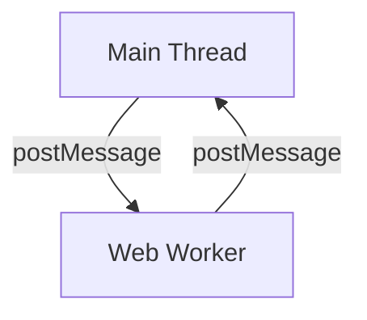

## 10.8 Web Workers and Multithreading

As we delve deeper into the world of JavaScript and object-oriented programming, it's crucial to understand how to manage tasks efficiently, especially when dealing with computationally intensive operations. JavaScript is inherently single-threaded, meaning it executes one task at a time. This can become a bottleneck when performing heavy computations or when you want to keep your UI responsive. Enter **Web Workers**—a powerful feature that allows us to run scripts in background threads, enabling multithreading in browsers.

### Understanding Web Workers

**Web Workers** are a means to run JavaScript in the background, separate from the main execution thread of a web application. This allows you to perform tasks without interfering with the user interface, ensuring that your application remains responsive. Web Workers are particularly useful for tasks like complex calculations, data processing, and handling large datasets.

#### Key Features of Web Workers

- **Background Execution**: Web Workers run in a separate thread, allowing the main thread to remain free for UI updates.
- **Message Passing**: Communication between the main thread and workers is done through an event-driven message-passing system.
- **Isolation**: Workers do not have access to the DOM, ensuring that they do not directly affect the UI.
- **Concurrency**: By offloading tasks to workers, you can achieve concurrent execution, improving performance for intensive tasks.

### Creating and Using Web Workers

Let's explore how to create a Web Worker and communicate with it using messages.

#### Step 1: Creating a Worker Script

First, we need a separate JavaScript file that will serve as the worker script. Let's create a simple worker that performs a calculation:

```javascript
// worker.js
self.onmessage = function(event) {
    const data = event.data;
    const result = data * data; // Simple computation: squaring the number
    self.postMessage(result);
};
```

In this script, we listen for messages from the main thread using `self.onmessage`. When a message is received, we perform a calculation and send the result back using `self.postMessage`.

#### Step 2: Instantiating the Worker in the Main Thread

Now, let's create a worker instance in our main JavaScript file and communicate with it:

```javascript
// main.js
const worker = new Worker('worker.js');

// Send a message to the worker
worker.postMessage(5);

// Listen for messages from the worker
worker.onmessage = function(event) {
    console.log('Result from worker:', event.data);
};
```

Here, we create a new `Worker` instance, passing the path to our worker script. We then send a message to the worker using `worker.postMessage` and listen for responses with `worker.onmessage`.

### Offloading Intensive Computations

Web Workers are ideal for offloading tasks that are computationally intensive. Let's consider a scenario where we need to perform a large number of calculations:

#### Example: Calculating Fibonacci Numbers

Calculating Fibonacci numbers is a common example of a task that can be offloaded to a worker:

```javascript
// fibonacciWorker.js
self.onmessage = function(event) {
    const num = event.data;
    const result = fibonacci(num);
    self.postMessage(result);
};

function fibonacci(n) {
    if (n <= 1) return n;
    return fibonacci(n - 1) + fibonacci(n - 2);
}
```

In this worker script, we calculate Fibonacci numbers recursively. This is a task that can slow down the main thread if executed directly.

```javascript
// main.js
const fibonacciWorker = new Worker('fibonacciWorker.js');

fibonacciWorker.postMessage(40); // Sending a large number for computation

fibonacciWorker.onmessage = function(event) {
    console.log('Fibonacci result:', event.data);
};
```

By offloading the Fibonacci calculation to a worker, we keep the main thread responsive while the computation is performed in the background.

### Limitations of Web Workers

While Web Workers are powerful, they come with certain limitations:

- **No DOM Access**: Workers cannot directly manipulate the DOM. This means you cannot update the UI from a worker.
- **Limited APIs**: Not all browser APIs are available in workers. For example, `alert` and `document` are not accessible.
- **Overhead**: Creating and managing workers involves some overhead. For lightweight tasks, the overhead might outweigh the benefits.

### Use Cases for Web Workers

Web Workers are beneficial in scenarios where you need to perform tasks that would otherwise block the main thread. Some common use cases include:

- **Data Processing**: Parsing large JSON files or processing large datasets.
- **Image Manipulation**: Performing operations like filtering or resizing images.
- **Complex Calculations**: Running algorithms that require significant computation time.
- **Network Requests**: Handling network requests and responses without blocking the UI.

### Transferable Objects and Structured Cloning

When communicating with workers, data is copied between threads using structured cloning. However, for large data sets, this can be inefficient. **Transferable objects** offer a solution by transferring ownership of an object to the worker, avoiding the need to copy data.

#### Example: Using Transferable Objects

```javascript
// main.js
const buffer = new ArrayBuffer(1024);
const worker = new Worker('worker.js');

worker.postMessage(buffer, [buffer]); // Transfer the buffer to the worker
```

In this example, we transfer an `ArrayBuffer` to the worker, allowing it to work with the data without copying it.

### Visualizing Web Workers

To better understand how Web Workers interact with the main thread, let's visualize the process using a flowchart:



This diagram illustrates the message-passing mechanism between the main thread and a Web Worker. The main thread sends a message to the worker, and the worker processes the message and sends a response back.

### Try It Yourself

Experiment with Web Workers by modifying the examples provided. Try changing the computation in the worker script or sending different types of data. Observe how the main thread remains responsive while the worker performs its tasks.

### References and Further Reading

- [MDN Web Docs: Using Web Workers](https://developer.mozilla.org/en-US/docs/Web/API/Web_Workers_API/Using_web_workers)
- [W3Schools: HTML5 Web Workers](https://www.w3schools.com/html/html5_webworkers.asp)

### Key Takeaways

- **Web Workers** enable multithreading in JavaScript by running scripts in background threads.
- **Message Passing** is used for communication between the main thread and workers.
- **Offloading Tasks** to workers can improve application performance by keeping the main thread free for UI updates.
- **Limitations** include no direct DOM access and limited API availability.
- **Transferable Objects** can optimize data transfer between threads.

Remember, this is just the beginning. As you progress, you'll build more complex and interactive web applications. Keep experimenting, stay curious, and enjoy the journey!

## Quiz Time!



### What is the primary purpose of Web Workers in JavaScript?

- [x] To run scripts in background threads, enabling multithreading.
- [ ] To directly manipulate the DOM.
- [ ] To handle network requests.
- [ ] To manage CSS styles.

> **Explanation:** Web Workers are designed to run scripts in background threads, allowing for multithreading and keeping the main thread responsive.

### How do Web Workers communicate with the main thread?

- [x] Through a message-passing system.
- [ ] By directly accessing the DOM.
- [ ] Using shared variables.
- [ ] Through synchronous function calls.

> **Explanation:** Web Workers communicate with the main thread using an event-driven message-passing system.

### What is a limitation of Web Workers?

- [x] They cannot access the DOM directly.
- [ ] They can only perform network requests.
- [ ] They can only run in Node.js environments.
- [ ] They require a specific browser plugin.

> **Explanation:** Web Workers cannot access the DOM directly, which is a key limitation.

### Which of the following is a use case for Web Workers?

- [x] Performing complex calculations.
- [ ] Styling web pages.
- [ ] Creating HTML elements.
- [ ] Managing CSS animations.

> **Explanation:** Web Workers are ideal for performing complex calculations without blocking the main thread.

### What are transferable objects in the context of Web Workers?

- [x] Objects that can be transferred to a worker without copying.
- [ ] Objects that can manipulate the DOM.
- [ ] Objects that are shared between multiple workers.
- [ ] Objects that can only be used in the main thread.

> **Explanation:** Transferable objects are those that can be transferred to a worker, allowing it to work with the data without copying.

### What is structured cloning?

- [x] A method of copying objects between threads.
- [ ] A way to access the DOM from a worker.
- [ ] A technique for styling web pages.
- [ ] A method for handling network requests.

> **Explanation:** Structured cloning is the method used to copy objects between threads when communicating with Web Workers.

### What happens if you try to access the DOM from a Web Worker?

- [x] It will result in an error.
- [ ] The DOM will be updated.
- [ ] The worker will crash.
- [ ] The main thread will block.

> **Explanation:** Attempting to access the DOM from a Web Worker will result in an error, as workers do not have access to the DOM.

### How can you optimize data transfer between the main thread and a worker?

- [x] By using transferable objects.
- [ ] By using synchronous messages.
- [ ] By accessing the DOM directly.
- [ ] By using shared variables.

> **Explanation:** Transferable objects allow data to be transferred to a worker without copying, optimizing the transfer process.

### What is the role of the `self` keyword in a worker script?

- [x] It refers to the global context of the worker.
- [ ] It refers to the main thread.
- [ ] It refers to the DOM.
- [ ] It refers to the parent window.

> **Explanation:** In a worker script, `self` refers to the global context of the worker, similar to `window` in the main thread.

### True or False: Web Workers can directly manipulate the DOM.

- [ ] True
- [x] False

> **Explanation:** False. Web Workers cannot directly manipulate the DOM; they run in a separate thread and communicate with the main thread through messages.


