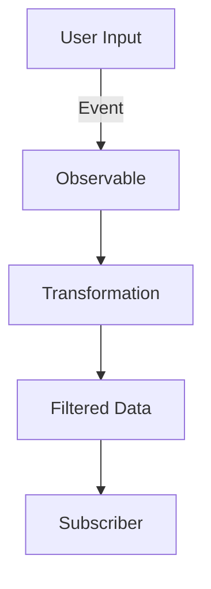

## 10.9 Observables and Reactive Programming

In the world of JavaScript, managing asynchronous data streams efficiently and effectively is crucial for building responsive and scalable applications. One powerful paradigm that addresses this need is **Reactive Programming**, and at its core lies the concept of **Observables**. In this section, we will explore what observables are, how they compare to promises, and how you can use them to handle complex asynchronous scenarios in JavaScript.

### Introduction to Observables

Observables are a fundamental concept in reactive programming, allowing you to work with asynchronous data streams. They provide a way to subscribe to data streams and react to new data as it arrives. Unlike promises, which handle a single future value, observables can emit multiple values over time.

#### Key Characteristics of Observables

- **Lazy Evaluation**: Observables are lazy, meaning they don't start emitting values until you subscribe to them. This allows for efficient resource usage.
- **Multiple Emissions**: Unlike promises, which resolve once, observables can emit multiple values over time, making them ideal for handling streams of data.
- **Cancellation**: Subscriptions to observables can be canceled, allowing you to stop receiving data when it's no longer needed.

### Comparing Observables and Promises

While both observables and promises are used to handle asynchronous operations, they have distinct differences that make them suitable for different scenarios.

| Feature         | Promises                        | Observables                         |
|-----------------|---------------------------------|-------------------------------------|
| **Emissions**   | Single value or error           | Multiple values over time           |
| **Cancellation**| Not cancelable once started     | Subscriptions can be canceled       |
| **Laziness**    | Eager, starts immediately       | Lazy, starts on subscription        |
| **Operators**   | Limited chaining (then, catch)  | Rich set of operators for data manipulation |

#### When to Use Promises vs. Observables

- **Promises** are suitable for operations that produce a single result, such as fetching data from an API.
- **Observables** are ideal for scenarios involving multiple values over time, such as handling user input events or real-time data streams.

### Creating and Using Observables with RxJS

RxJS (Reactive Extensions for JavaScript) is a popular library for working with observables in JavaScript. It provides a rich set of operators to create, transform, and combine observables.

#### Creating Observables

To create an observable, you can use the `Observable` constructor or helper functions provided by RxJS.

```javascript
import { Observable } from 'rxjs';

// Creating an observable that emits values 1, 2, and 3
const observable = new Observable(subscriber => {
  subscriber.next(1);
  subscriber.next(2);
  subscriber.next(3);
  subscriber.complete();
});

// Subscribing to the observable
observable.subscribe({
  next(value) { console.log(value); },
  error(err) { console.error('Error:', err); },
  complete() { console.log('Completed'); }
});
```

#### Using RxJS Operators

RxJS provides a wide range of operators to manipulate observables. These operators can be used to filter, transform, and combine data streams.

##### Example: Transforming Data with `map`

The `map` operator allows you to transform the values emitted by an observable.

```javascript
import { from } from 'rxjs';
import { map } from 'rxjs/operators';

const numbers = from([1, 2, 3, 4, 5]);

const squaredNumbers = numbers.pipe(
  map(value => value * value)
);

squaredNumbers.subscribe(value => console.log(value));
```

##### Example: Filtering Data with `filter`

The `filter` operator allows you to filter out values based on a condition.

```javascript
import { from } from 'rxjs';
import { filter } from 'rxjs/operators';

const numbers = from([1, 2, 3, 4, 5]);

const evenNumbers = numbers.pipe(
  filter(value => value % 2 === 0)
);

evenNumbers.subscribe(value => console.log(value));
```

### Handling Complex Asynchronous Scenarios

Observables excel at handling complex asynchronous scenarios, such as dealing with user events or real-time data streams.

#### Example: Handling User Input Events

You can use observables to handle user input events, such as clicks or key presses, in a reactive manner.

```javascript
import { fromEvent } from 'rxjs';
import { map } from 'rxjs/operators';

// Create an observable from click events on a button
const button = document.querySelector('button');
const clicks = fromEvent(button, 'click');

// Transform the click event to a message
const messages = clicks.pipe(
  map(() => 'Button clicked!')
);

messages.subscribe(message => console.log(message));
```

#### Example: Real-Time Data Streams

Observables are well-suited for handling real-time data streams, such as WebSocket connections or server-sent events.

```javascript
import { webSocket } from 'rxjs/webSocket';

// Create a WebSocket subject
const socket = webSocket('ws://example.com/socket');

// Subscribe to messages from the server
socket.subscribe(
  message => console.log('Received:', message),
  err => console.error('Error:', err),
  () => console.log('Connection closed')
);

// Send a message to the server
socket.next({ message: 'Hello, server!' });
```

### Combining Observables

RxJS provides operators to combine multiple observables, allowing you to create complex data flows.

#### Example: Merging Observables

The `merge` operator combines multiple observables into a single observable.

```javascript
import { merge, of } from 'rxjs';

const observable1 = of('Hello');
const observable2 = of('World');

const combined = merge(observable1, observable2);

combined.subscribe(value => console.log(value));
```

#### Example: Concatenating Observables

The `concat` operator concatenates multiple observables, emitting values from each in sequence.

```javascript
import { concat, of } from 'rxjs';

const observable1 = of('First');
const observable2 = of('Second');

const combined = concat(observable1, observable2);

combined.subscribe(value => console.log(value));
```

### Visualizing Reactive Programming

To better understand how observables work, let's visualize the flow of data in a reactive system.



**Diagram Description**: This flowchart illustrates how user input events are captured by an observable, transformed, filtered, and then delivered to a subscriber.

### Reactive Programming for Scalability

Reactive programming offers several benefits for building scalable applications:

- **Efficient Resource Usage**: Observables are lazy and only consume resources when necessary.
- **Composability**: Operators allow you to build complex data flows from simple components.
- **Asynchronous Handling**: Observables handle asynchronous data streams naturally, making them ideal for real-time applications.

### Encouragement to Explore Reactive Programming

As you continue your journey in JavaScript development, consider incorporating reactive programming into your projects. It offers a powerful way to manage asynchronous data and build responsive, scalable applications. Remember, this is just the beginning. Keep experimenting, stay curious, and enjoy the journey!

### Try It Yourself

To deepen your understanding of observables and reactive programming, try modifying the code examples provided. Experiment with different operators, create your own observables, and explore how they can be used to handle asynchronous data in your applications.

### References and Further Reading

- [RxJS Documentation](https://rxjs.dev/)
- [MDN Web Docs: Asynchronous JavaScript](https://developer.mozilla.org/en-US/docs/Learn/JavaScript/Asynchronous)
- [Reactive Programming Overview](https://www.reactivemanifesto.org/)

## Quiz Time!



### What is a key characteristic of observables?

- [x] They can emit multiple values over time.
- [ ] They resolve once like promises.
- [ ] They cannot be canceled.
- [ ] They are eager and start immediately.

> **Explanation:** Observables can emit multiple values over time, unlike promises which resolve once.

### When should you use promises over observables?

- [x] When you need to handle a single future value.
- [ ] When you need to handle multiple values over time.
- [ ] When you need lazy evaluation.
- [ ] When you need to cancel the operation.

> **Explanation:** Promises are suitable for operations that produce a single result, such as fetching data from an API.

### Which operator is used to transform data in an observable?

- [x] map
- [ ] filter
- [ ] merge
- [ ] concat

> **Explanation:** The `map` operator is used to transform the values emitted by an observable.

### How do you create an observable from a button click event?

- [x] Use the `fromEvent` function.
- [ ] Use the `of` function.
- [ ] Use the `merge` function.
- [ ] Use the `concat` function.

> **Explanation:** The `fromEvent` function is used to create an observable from DOM events like button clicks.

### What does the `merge` operator do?

- [x] Combines multiple observables into a single observable.
- [ ] Transforms data in an observable.
- [ ] Filters data in an observable.
- [ ] Concatenates observables in sequence.

> **Explanation:** The `merge` operator combines multiple observables into a single observable.

### What is a benefit of reactive programming?

- [x] Efficient resource usage.
- [ ] Only handles synchronous data.
- [ ] Requires more code than traditional methods.
- [ ] Cannot handle real-time data.

> **Explanation:** Reactive programming offers efficient resource usage by only consuming resources when necessary.

### Which library is commonly used for reactive programming in JavaScript?

- [x] RxJS
- [ ] Lodash
- [ ] jQuery
- [ ] Bootstrap

> **Explanation:** RxJS is a popular library for working with observables in JavaScript.

### What is the purpose of the `filter` operator?

- [x] To filter out values based on a condition.
- [ ] To transform values.
- [ ] To combine observables.
- [ ] To create observables.

> **Explanation:** The `filter` operator is used to filter out values based on a condition.

### Can observables handle real-time data streams?

- [x] Yes
- [ ] No

> **Explanation:** Observables are well-suited for handling real-time data streams, such as WebSocket connections.

### Observables are lazy and only start emitting values when you subscribe to them.

- [x] True
- [ ] False

> **Explanation:** Observables are lazy, meaning they don't start emitting values until you subscribe to them.


