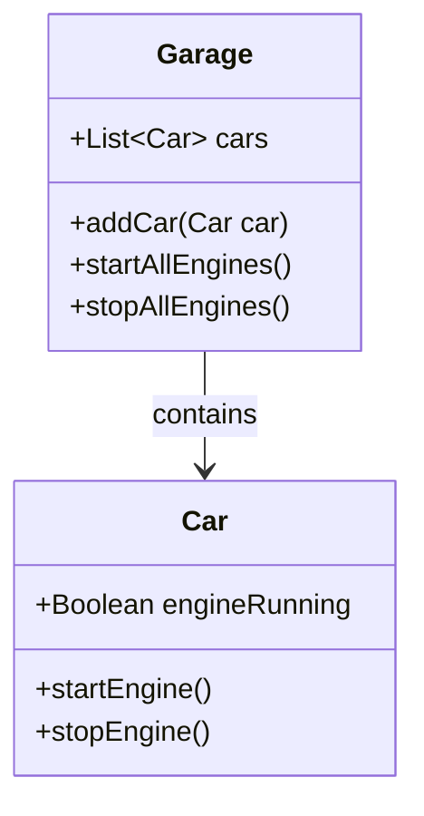

## 11.1 Importance of Testing in Object-Oriented Programming (OOP)

In the world of software development, testing is not just an afterthought; it is a fundamental component that ensures the reliability and quality of applications. This is especially true in object-oriented programming (OOP), where the complexity of interactions between objects can lead to unforeseen issues. In this section, we will delve into the importance of testing in OOP, particularly in JavaScript, and explore how it enhances code quality, supports scalability, and facilitates maintenance.

### Understanding the Role of Testing in Software Development

Testing in software development serves multiple purposes. It helps in identifying bugs early in the development process, ensures that the software behaves as expected, and provides a safety net for future code changes. In the context of OOP, testing becomes even more critical due to the intricate relationships between objects and the potential for complex interactions.

#### Early Bug Detection

One of the primary benefits of testing is the early detection of bugs. By writing tests alongside your code, you can catch errors before they propagate through the system. This is particularly important in OOP, where a change in one class can have ripple effects across the entire application. Early bug detection not only saves time but also reduces the cost of fixing issues later in the development cycle.

#### Improved Code Quality

Testing encourages developers to write cleaner, more modular code. When you know that your code will be tested, you are more likely to adhere to best practices and design patterns that promote maintainability. In OOP, this means creating well-defined classes with clear responsibilities, which in turn leads to more robust and reliable applications.

#### Confidence in Future Code Changes

As applications evolve, code changes are inevitable. Testing provides confidence that these changes will not break existing functionality. This is crucial in OOP, where the introduction of new features or the refactoring of existing code can impact multiple classes and objects. With a comprehensive suite of tests, developers can make changes with the assurance that any issues will be quickly identified.

### Benefits of Testing in Object-Oriented Programming

Testing in OOP offers several specific benefits that contribute to the overall quality and success of a software project. Let's explore some of these benefits in detail.

#### Support for Refactoring

Refactoring is the process of restructuring existing code without changing its external behavior. It is a common practice in OOP to improve the design, structure, and readability of code. Testing plays a crucial role in refactoring by ensuring that changes do not introduce new bugs. With a robust set of tests, developers can refactor code with confidence, knowing that any deviations from expected behavior will be caught.

#### Scalability and Maintainability

As applications grow in size and complexity, scalability and maintainability become major concerns. Testing helps address these concerns by providing a framework for verifying that new features integrate seamlessly with existing functionality. In OOP, this means ensuring that new classes and objects interact correctly with those already in place. Testing also aids in maintaining code quality over time, making it easier to extend and modify the application as needed.

#### Handling Complex Object Interactions

In OOP, objects often interact with each other in complex ways. Testing helps ensure that these interactions occur as expected and that changes to one object do not negatively impact others. By writing tests that cover various scenarios and edge cases, developers can verify that their code handles complex interactions correctly.

### Illustrating the Impact of Testing with Examples

To better understand the impact of testing in OOP, let's consider a few examples that demonstrate how testing can improve code quality and reliability.

#### Example 1: Testing a Simple Class

Consider a simple `Car` class with methods to start and stop the engine. By writing tests for this class, we can ensure that the methods behave as expected.

```javascript
class Car {
  constructor() {
    this.engineRunning = false;
  }

  startEngine() {
    this.engineRunning = true;
  }

  stopEngine() {
    this.engineRunning = false;
  }
}

// Test cases for the Car class
function testCar() {
  const myCar = new Car();

  // Test that the engine is initially off
  console.assert(!myCar.engineRunning, "Engine should be off initially");

  // Test starting the engine
  myCar.startEngine();
  console.assert(myCar.engineRunning, "Engine should be running after starting");

  // Test stopping the engine
  myCar.stopEngine();
  console.assert(!myCar.engineRunning, "Engine should be off after stopping");
}

testCar();
```

In this example, we have a simple test suite that verifies the behavior of the `Car` class. By running these tests, we can quickly identify any issues with the class's methods.

#### Example 2: Testing Object Interactions

Now let's consider a more complex scenario involving interactions between multiple objects. Suppose we have a `Garage` class that can hold multiple `Car` objects.

```javascript
class Garage {
  constructor() {
    this.cars = [];
  }

  addCar(car) {
    this.cars.push(car);
  }

  startAllEngines() {
    this.cars.forEach(car => car.startEngine());
  }

  stopAllEngines() {
    this.cars.forEach(car => car.stopEngine());
  }
}

// Test cases for the Garage class
function testGarage() {
  const garage = new Garage();
  const car1 = new Car();
  const car2 = new Car();

  garage.addCar(car1);
  garage.addCar(car2);

  // Test starting all engines
  garage.startAllEngines();
  console.assert(car1.engineRunning && car2.engineRunning, "All engines should be running");

  // Test stopping all engines
  garage.stopAllEngines();
  console.assert(!car1.engineRunning && !car2.engineRunning, "All engines should be off");
}

testGarage();
```

In this example, we test the interaction between the `Garage` and `Car` classes. By writing tests that cover these interactions, we can ensure that the `Garage` class correctly manages the state of its `Car` objects.

### Encouraging a Test-Driven Development (TDD) Approach

Test-driven development (TDD) is a software development approach where tests are written before the actual code. This approach encourages developers to think about the desired behavior of their code before implementing it, leading to more thoughtful and deliberate design decisions.

#### How TDD Works

1. **Write a Test**: Begin by writing a test for the desired functionality. This test will initially fail, as the functionality has not yet been implemented.
2. **Implement the Code**: Write the minimum amount of code necessary to pass the test.
3. **Refactor**: Once the test passes, refactor the code to improve its design and readability while ensuring that the test still passes.

By following this cycle, developers can build applications that are well-tested and maintainable from the start.

#### Benefits of TDD in OOP

- **Enhanced Code Quality**: TDD encourages developers to write clean, modular code that is easy to test and maintain.
- **Reduced Debugging Time**: With tests in place from the beginning, developers can quickly identify and fix issues as they arise.
- **Improved Design**: By thinking about tests first, developers are more likely to create well-designed classes and objects with clear responsibilities.

### Visualizing Testing in OOP

To further illustrate the importance of testing in OOP, let's use a diagram to visualize the interactions between objects and how testing can ensure their correctness.



In this diagram, we see the relationship between the `Garage` and `Car` classes. Testing ensures that the methods in each class work correctly and that the interactions between the classes occur as expected.

### References and Further Reading

For more information on testing in JavaScript and OOP, consider the following resources:

- [MDN Web Docs: Testing frameworks](https://developer.mozilla.org/en-US/docs/Learn/Tools_and_testing/Testing)
- [W3Schools: JavaScript Testing](https://www.w3schools.com/js/js_testing.asp)
- [Test-Driven Development by Example by Kent Beck](https://www.amazon.com/Test-Driven-Development-Kent-Beck/dp/0321146530)

### Knowledge Check

To reinforce your understanding of the importance of testing in OOP, consider the following questions:

1. What are the primary benefits of testing in software development?
2. How does testing support refactoring in OOP?
3. Why is early bug detection important in the development process?
4. How can testing improve code quality and maintainability?
5. What is test-driven development (TDD), and how does it benefit OOP?

### Embrace the Journey

Remember, testing is an integral part of the software development process, especially in object-oriented programming. By incorporating testing into your workflow, you can build reliable, maintainable, and scalable applications. As you continue your journey in OOP, keep experimenting with different testing techniques and approaches, and enjoy the process of creating high-quality software.

## Quiz Time!



### What is one of the primary benefits of testing in software development?

- [x] Early bug detection
- [ ] Faster code execution
- [ ] Increased code complexity
- [ ] Reduced need for documentation

> **Explanation:** Early bug detection is a key benefit of testing, allowing developers to identify and fix issues early in the development process.

### How does testing support refactoring in OOP?

- [x] By ensuring changes do not introduce new bugs
- [ ] By increasing code complexity
- [ ] By eliminating the need for documentation
- [ ] By reducing the number of classes

> **Explanation:** Testing provides a safety net during refactoring, ensuring that changes do not introduce new bugs and that the code continues to function as expected.

### What is test-driven development (TDD)?

- [x] A development approach where tests are written before the code
- [ ] A method for writing code without tests
- [ ] A technique for optimizing code execution speed
- [ ] A process for documenting code

> **Explanation:** TDD is a development approach where tests are written before the actual code, guiding the design and implementation process.

### Why is early bug detection important in the development process?

- [x] It saves time and reduces the cost of fixing issues
- [ ] It increases the complexity of the code
- [ ] It eliminates the need for documentation
- [ ] It speeds up code execution

> **Explanation:** Early bug detection saves time and reduces the cost of fixing issues by identifying them early in the development cycle.

### How can testing improve code quality and maintainability?

- [x] By encouraging clean, modular code
- [ ] By increasing code complexity
- [ ] By reducing the number of classes
- [ ] By eliminating the need for documentation

> **Explanation:** Testing encourages developers to write clean, modular code that is easy to test and maintain, improving overall code quality.

### What is a benefit of using TDD in OOP?

- [x] Enhanced code quality
- [ ] Increased code complexity
- [ ] Reduced need for documentation
- [ ] Faster code execution

> **Explanation:** TDD enhances code quality by encouraging developers to write clean, modular code that is easy to test and maintain.

### How does testing provide confidence in future code changes?

- [x] By ensuring existing functionality is not broken
- [ ] By increasing code complexity
- [ ] By eliminating the need for documentation
- [ ] By speeding up code execution

> **Explanation:** Testing provides confidence in future code changes by ensuring that existing functionality is not broken when new features are added or existing code is refactored.

### What is one way testing helps with scalability in OOP?

- [x] By verifying that new features integrate seamlessly
- [ ] By increasing code complexity
- [ ] By reducing the number of classes
- [ ] By eliminating the need for documentation

> **Explanation:** Testing helps with scalability by verifying that new features integrate seamlessly with existing functionality, ensuring the application can grow without issues.

### How does testing handle complex object interactions?

- [x] By verifying that interactions occur as expected
- [ ] By increasing code complexity
- [ ] By reducing the number of classes
- [ ] By eliminating the need for documentation

> **Explanation:** Testing handles complex object interactions by verifying that interactions occur as expected, ensuring the application functions correctly.

### True or False: Testing is an optional part of the software development process.

- [ ] True
- [x] False

> **Explanation:** Testing is a crucial part of the software development process, ensuring the reliability and quality of applications.


