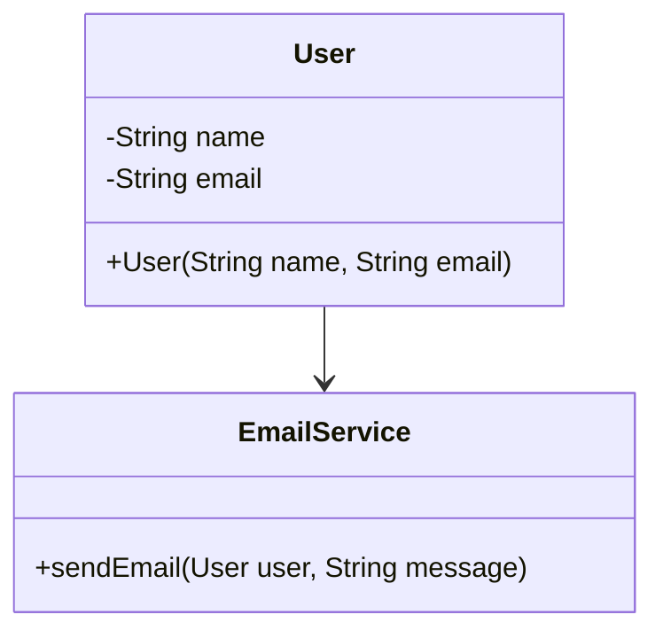

## 11.10 Best Practices for Maintainable Code

In the world of software development, writing maintainable code is crucial. Maintainable code is not only easier to read and understand but also simpler to modify and extend. In this section, we will explore best practices for writing maintainable code in JavaScript, especially when using Object-Oriented Programming (OOP) principles.

### Principles of Writing Clean, Maintainable Code

Writing clean and maintainable code is an art that requires discipline and adherence to certain principles. Let's explore some of these principles:

1. **Simplicity**: Strive for simplicity in your code. Simple code is easier to understand and maintain. Avoid unnecessary complexity and keep your solutions straightforward.

2. **Readability**: Code should be easy to read and understand. Use meaningful variable and function names, and write code that is self-explanatory.

3. **Consistency**: Maintain consistency in your coding style. This includes consistent naming conventions, formatting, and structure.

4. **Modularity**: Break down your code into small, manageable modules. Each module should have a single responsibility and be easy to test and maintain.

5. **Reusability**: Write code that can be reused in different parts of your application. This reduces duplication and makes your codebase more efficient.

6. **Testability**: Write code that is easy to test. This includes writing unit tests and ensuring that your code is modular and decoupled.

### Importance of Clear Naming Conventions and Consistent Formatting

Clear naming conventions and consistent formatting are essential for maintainable code. They make your code easier to read and understand, and they help you and others navigate your codebase more efficiently.

#### Naming Conventions

- **Use descriptive names**: Choose names that clearly describe the purpose of the variable, function, or class. For example, use `calculateTotalPrice` instead of `calcPrice`.
- **Follow a consistent style**: Use camelCase for variables and functions, PascalCase for classes, and UPPER_CASE for constants.
- **Avoid abbreviations**: Abbreviations can be confusing and should be avoided unless they are widely understood.

#### Consistent Formatting

- **Indentation**: Use consistent indentation throughout your code. This helps to visually separate blocks of code and makes it easier to follow the logic.
- **Line length**: Keep lines of code to a reasonable length (e.g., 80-100 characters) to improve readability.
- **Spacing**: Use spaces around operators and after commas to make your code more readable.

### Adherence to the SOLID Principles in OOP

The SOLID principles are a set of guidelines for writing maintainable and scalable object-oriented code. Let's explore each principle:

1. **Single Responsibility Principle (SRP)**: A class should have only one reason to change, meaning it should have only one job or responsibility.

2. **Open/Closed Principle (OCP)**: Software entities should be open for extension but closed for modification. This means you should be able to add new functionality without changing existing code.

3. **Liskov Substitution Principle (LSP)**: Objects of a superclass should be replaceable with objects of a subclass without affecting the correctness of the program.

4. **Interface Segregation Principle (ISP)**: Clients should not be forced to depend on interfaces they do not use. This means you should create smaller, more specific interfaces rather than one large, general-purpose interface.

5. **Dependency Inversion Principle (DIP)**: High-level modules should not depend on low-level modules. Both should depend on abstractions.

### Tips on Modularization and Avoiding Code Duplication

Modularization and avoiding code duplication are key to writing maintainable code. Let's explore some tips:

#### Modularization

- **Divide and conquer**: Break down your code into smaller, manageable modules. Each module should have a single responsibility and be easy to test and maintain.
- **Use classes and objects**: Use classes and objects to encapsulate related functionality and data. This helps to organize your code and makes it easier to understand and maintain.
- **Leverage modules**: Use JavaScript modules to organize your code into separate files. This helps to keep your codebase organized and makes it easier to manage dependencies.

#### Avoiding Code Duplication

- **DRY principle**: Follow the "Don't Repeat Yourself" principle. Avoid duplicating code by creating reusable functions or classes.
- **Refactor common code**: Identify common code patterns and refactor them into reusable functions or classes.
- **Use inheritance and composition**: Use inheritance and composition to share functionality between classes.

### Encouraging Regular Refactoring and Code Reviews

Regular refactoring and code reviews are essential for maintaining a healthy codebase. Let's explore their importance:

#### Refactoring

- **Improve code quality**: Refactoring helps to improve the quality of your code by making it cleaner, more efficient, and easier to understand.
- **Reduce technical debt**: Regular refactoring helps to reduce technical debt by addressing code smells and improving the design of your code.
- **Enhance maintainability**: Refactoring makes your code more maintainable by improving its structure and readability.

#### Code Reviews

- **Catch errors early**: Code reviews help to catch errors and bugs early in the development process, reducing the cost of fixing them later.
- **Share knowledge**: Code reviews provide an opportunity for team members to share knowledge and learn from each other.
- **Ensure consistency**: Code reviews help to ensure consistency in coding style and practices across the team.

### Highlighting the Role of Documentation and Comments

Documentation and comments play a crucial role in aiding future developers (or your future self) in understanding and maintaining the code. Let's explore their importance:

#### Documentation

- **Explain the big picture**: Documentation should provide an overview of the system architecture, design decisions, and important concepts.
- **Describe APIs and interfaces**: Document the public APIs and interfaces of your code to help other developers understand how to use them.
- **Keep it up-to-date**: Regularly update your documentation to reflect changes in the codebase.

#### Comments

- **Explain why, not what**: Comments should explain why the code is written in a certain way, not what the code does.
- **Use sparingly**: Use comments sparingly and only when necessary. Well-written code should be self-explanatory.
- **Keep comments relevant**: Ensure that comments are relevant and up-to-date with the code they describe.

### Code Examples

Let's explore some code examples that demonstrate these best practices.

#### Example 1: Using Clear Naming Conventions

```javascript
// Bad example
function calcPrice(a, b) {
  return a * b;
}

// Good example
function calculateTotalPrice(quantity, pricePerUnit) {
  return quantity * pricePerUnit;
}
```

#### Example 2: Applying the Single Responsibility Principle

```javascript
// Bad example
class User {
  constructor(name, email) {
    this.name = name;
    this.email = email;
  }

  sendEmail(message) {
    // Code to send email
  }
}

// Good example
class User {
  constructor(name, email) {
    this.name = name;
    this.email = email;
  }
}

class EmailService {
  sendEmail(user, message) {
    // Code to send email
  }
}
```

#### Example 3: Avoiding Code Duplication

```javascript
// Bad example
function calculateAreaOfRectangle(width, height) {
  return width * height;
}

function calculateAreaOfSquare(side) {
  return side * side;
}

// Good example
function calculateArea(shape) {
  return shape.width * shape.height;
}

const rectangle = { width: 10, height: 5 };
const square = { width: 4, height: 4 };

console.log(calculateArea(rectangle));
console.log(calculateArea(square));
```

### Try It Yourself

Now that we've explored some best practices for writing maintainable code, it's time to try it yourself. Here are some exercises to help you practice:

1. **Refactor a function**: Take a function from your codebase and refactor it to improve its readability and maintainability. Consider using meaningful names, breaking it down into smaller functions, and adding comments where necessary.

2. **Apply the SOLID principles**: Review your classes and see if they adhere to the SOLID principles. Refactor them if necessary to improve their design.

3. **Conduct a code review**: Pair up with a colleague and conduct a code review. Provide constructive feedback and discuss ways to improve the code.

4. **Document your code**: Choose a module or class from your codebase and write documentation for it. Include an overview, API description, and any important design decisions.

### Visualizing Code Structure

To help visualize the structure of your code, let's use a Mermaid.js diagram to represent the relationship between classes and modules.



This diagram shows the relationship between the `User` class and the `EmailService` class. The `EmailService` class is responsible for sending emails, while the `User` class represents a user with a name and email address.

### References and Links

For further reading on writing maintainable code and the SOLID principles, check out the following resources:

- [MDN Web Docs: JavaScript Guide](https://developer.mozilla.org/en-US/docs/Web/JavaScript/Guide)
- [W3Schools: JavaScript Tutorial](https://www.w3schools.com/js/)
- [Clean Code: A Handbook of Agile Software Craftsmanship](https://www.amazon.com/Clean-Code-Handbook-Software-Craftsmanship/dp/0132350882)
- [Refactoring: Improving the Design of Existing Code](https://www.amazon.com/Refactoring-Improving-Design-Existing-Code/dp/0134757599)

### Knowledge Check

Let's reinforce what we've learned with some questions and exercises:

1. **What is the importance of using clear naming conventions in your code?**

2. **How can the SOLID principles help you write maintainable code?**

3. **Why is it important to avoid code duplication?**

4. **What are some benefits of regular refactoring and code reviews?**

5. **How can documentation and comments aid future developers?**

### Embrace the Journey

Remember, writing maintainable code is a journey, not a destination. As you continue to learn and grow as a developer, you'll discover new techniques and practices that will help you write cleaner, more maintainable code. Keep experimenting, stay curious, and enjoy the journey!

## Quiz Time!



### What is one of the key principles of writing maintainable code?

- [x] Simplicity
- [ ] Complexity
- [ ] Obfuscation
- [ ] Redundancy

> **Explanation:** Simplicity is a key principle of writing maintainable code, as it makes the code easier to understand and maintain.


### Which naming convention is recommended for classes in JavaScript?

- [ ] camelCase
- [x] PascalCase
- [ ] snake_case
- [ ] kebab-case

> **Explanation:** PascalCase is recommended for naming classes in JavaScript, as it helps distinguish them from variables and functions.


### What does the Single Responsibility Principle (SRP) state?

- [x] A class should have only one reason to change.
- [ ] A class should have multiple responsibilities.
- [ ] A class should be open to modification.
- [ ] A class should depend on low-level modules.

> **Explanation:** The Single Responsibility Principle (SRP) states that a class should have only one reason to change, meaning it should have only one job or responsibility.


### How can you avoid code duplication?

- [x] By creating reusable functions or classes
- [ ] By writing the same code multiple times
- [ ] By using different variable names
- [ ] By ignoring the DRY principle

> **Explanation:** You can avoid code duplication by creating reusable functions or classes, following the DRY (Don't Repeat Yourself) principle.


### Why is regular refactoring important?

- [x] To improve code quality
- [ ] To increase code complexity
- [x] To reduce technical debt
- [ ] To add more bugs

> **Explanation:** Regular refactoring is important to improve code quality and reduce technical debt, making the code cleaner and more maintainable.


### What is the role of code reviews?

- [x] To catch errors early
- [ ] To increase code complexity
- [ ] To decrease code readability
- [ ] To ignore coding standards

> **Explanation:** Code reviews help to catch errors early in the development process and ensure consistency in coding style and practices.


### How can documentation aid future developers?

- [x] By explaining the big picture
- [ ] By hiding important information
- [x] By describing APIs and interfaces
- [ ] By being outdated

> **Explanation:** Documentation aids future developers by explaining the big picture and describing APIs and interfaces, helping them understand and use the code.


### What should comments in code explain?

- [x] Why the code is written in a certain way
- [ ] What the code does
- [ ] How to write more code
- [ ] When to delete code

> **Explanation:** Comments should explain why the code is written in a certain way, providing context and reasoning behind the implementation.


### What is the benefit of using classes and objects in JavaScript?

- [x] To encapsulate related functionality and data
- [ ] To increase code complexity
- [ ] To duplicate code
- [ ] To ignore the DRY principle

> **Explanation:** Using classes and objects helps to encapsulate related functionality and data, organizing the code and making it easier to understand and maintain.


### True or False: Consistent formatting is not important for maintainable code.

- [ ] True
- [x] False

> **Explanation:** False. Consistent formatting is important for maintainable code as it improves readability and helps developers navigate the codebase more efficiently.


