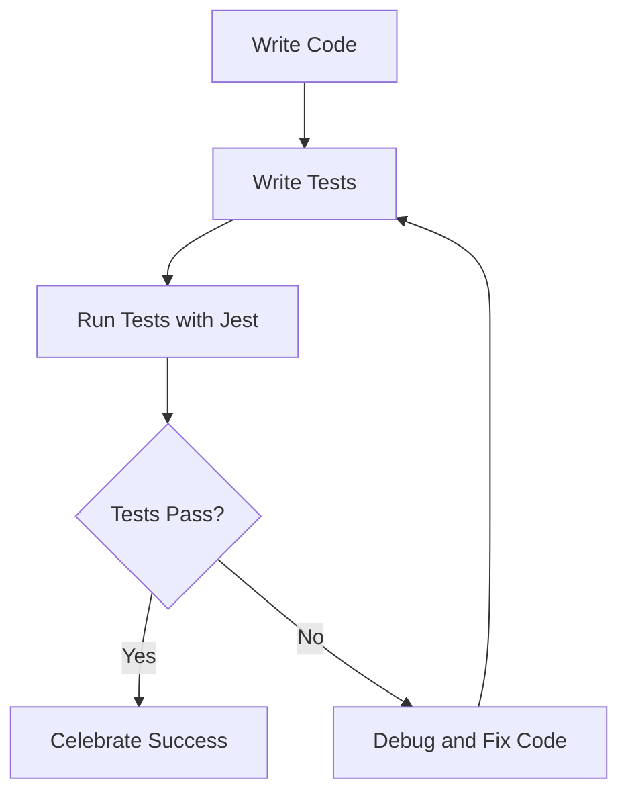

## 11.2 Unit Testing with Jest

In the world of software development, ensuring that your code works as expected is crucial. Unit testing is a fundamental practice that helps developers verify the functionality of individual components of their code. In this section, we will explore how to use Jest, a popular testing framework, to write unit tests for JavaScript classes. Whether you're new to testing or looking to enhance your skills, this guide will provide you with the knowledge you need to get started with Jest.

### What is Jest?

Jest is a delightful JavaScript testing framework with a focus on simplicity. It's widely used in the JavaScript community due to its ease of use, powerful features, and seamless integration with popular libraries and frameworks. Jest is particularly well-suited for testing JavaScript applications, including those that use object-oriented programming (OOP) principles.

#### Key Features of Jest

- **Zero Configuration**: Jest works out of the box for most JavaScript projects.
- **Fast and Reliable**: Jest runs tests in parallel, making it fast and efficient.
- **Snapshot Testing**: Capture the state of your UI components and ensure they don't change unexpectedly.
- **Mocking Capabilities**: Easily mock functions, modules, and timers.
- **Code Coverage**: Generate detailed reports on how much of your code is covered by tests.

### Setting Up Jest

Before we dive into writing tests, let's set up Jest in a JavaScript project. We'll go through the steps to install Jest and configure it for testing our classes.

#### Step 1: Install Jest

To get started with Jest, you'll need to have Node.js and npm (Node Package Manager) installed on your machine. If you haven't installed them yet, you can download them from the [official Node.js website](https://nodejs.org/).

Once you have Node.js and npm installed, you can install Jest by running the following command in your terminal:

```bash
npm install --save-dev jest
```

The `--save-dev` flag indicates that Jest is a development dependency, meaning it is only needed during the development phase.

#### Step 2: Configure Jest

After installing Jest, you'll need to add a test script to your `package.json` file to run your tests. Open your `package.json` file and add the following script:

```json
"scripts": {
  "test": "jest"
}
```

This script allows you to run Jest by simply typing `npm test` in your terminal.

#### Step 3: Create a Test Directory

It's a good practice to organize your tests in a separate directory. Create a `tests` directory in your project root to store all your test files. You can name it anything you like, but `tests` is a common convention.

### Writing Your First Test

Now that we have Jest set up, let's write our first test. We'll start by creating a simple JavaScript class and then write tests to verify its behavior.

#### Example Class: Calculator

Let's create a basic `Calculator` class with methods for addition and subtraction.

```javascript
// calculator.js
class Calculator {
  add(a, b) {
    return a + b;
  }

  subtract(a, b) {
    return a - b;
  }
}

module.exports = Calculator;
```

#### Writing Tests for the Calculator Class

Create a new file named `calculator.test.js` in the `tests` directory. This file will contain our test cases for the `Calculator` class.

```javascript
// calculator.test.js
const Calculator = require('../calculator');

describe('Calculator', () => {
  let calculator;

  beforeEach(() => {
    calculator = new Calculator();
  });

  it('should add two numbers correctly', () => {
    expect(calculator.add(2, 3)).toBe(5);
  });

  it('should subtract two numbers correctly', () => {
    expect(calculator.subtract(5, 3)).toBe(2);
  });
});
```

#### Explanation of the Test Code

- **`describe` Block**: Used to group related tests. In this case, we're grouping tests for the `Calculator` class.
- **`beforeEach` Hook**: Runs before each test in the `describe` block. Here, we're creating a new instance of `Calculator` before each test.
- **`it` Block**: Defines an individual test case. Each `it` block should test a single aspect of the code.
- **`expect` Function**: Asserts that a value meets certain conditions. In our tests, we're checking if the result of the `add` and `subtract` methods matches the expected values.

### Testing Asynchronous Code

Jest makes it easy to test asynchronous code, which is common in JavaScript applications. Let's modify our `Calculator` class to include an asynchronous method and write tests for it.

#### Adding an Asynchronous Method

We'll add a method that simulates a delay before returning the result of a multiplication.

```javascript
// calculator.js
class Calculator {
  // ...previous methods...

  async multiplyAsync(a, b) {
    return new Promise((resolve) => {
      setTimeout(() => {
        resolve(a * b);
      }, 1000);
    });
  }
}

module.exports = Calculator;
```

#### Writing Tests for Asynchronous Methods

To test asynchronous methods, we can use Jest's `async` and `await` syntax.

```javascript
// calculator.test.js
const Calculator = require('../calculator');

describe('Calculator', () => {
  let calculator;

  beforeEach(() => {
    calculator = new Calculator();
  });

  // ...previous tests...

  it('should multiply two numbers asynchronously', async () => {
    const result = await calculator.multiplyAsync(2, 3);
    expect(result).toBe(6);
  });
});
```

### Organizing Tests with `describe` and `it`

Organizing your tests is crucial for maintaining a clean and readable test suite. Jest provides `describe` and `it` blocks to help you structure your tests logically.

- **`describe`**: Use `describe` to group related tests. You can nest `describe` blocks to create a hierarchy of tests.
- **`it`**: Use `it` to define individual test cases. Each `it` block should focus on testing a single behavior or aspect of the code.

Here's an example of how you can organize tests for a more complex class:

```javascript
describe('Calculator', () => {
  describe('Addition', () => {
    it('should add two positive numbers', () => {
      // test code
    });

    it('should add two negative numbers', () => {
      // test code
    });
  });

  describe('Subtraction', () => {
    it('should subtract two numbers', () => {
      // test code
    });
  });

  describe('Multiplication', () => {
    it('should multiply two numbers asynchronously', async () => {
      // test code
    });
  });
});
```

### Interpreting Test Results

Running your tests is as simple as typing `npm test` in your terminal. Jest will execute all the test files and display the results in the console.

#### Understanding the Output

- **Green Checkmarks**: Indicate that a test has passed.
- **Red X Marks**: Indicate that a test has failed. Jest will provide details about the failure, including the expected and received values.

#### Handling Test Failures

When a test fails, it's an opportunity to improve your code. Analyze the error message and the test code to identify the issue. Common causes of test failures include:

- Incorrect assumptions about the code's behavior.
- Changes in the code that were not reflected in the tests.
- Errors in the test logic itself.

### Best Practices for Unit Testing

To make the most of your unit tests, consider the following best practices:

- **Write Isolated Tests**: Each test should be independent and not rely on the outcome of other tests.
- **Keep Tests Repeatable**: Tests should produce the same results every time they run, regardless of the environment.
- **Test Edge Cases**: Consider unusual or extreme inputs that might cause your code to fail.
- **Use Descriptive Test Names**: Clearly describe what each test is verifying.
- **Mock External Dependencies**: Use Jest's mocking capabilities to isolate the code being tested from external systems or libraries.

### Visualizing the Testing Process

To better understand the testing process, let's visualize how Jest interacts with your code and test files.



In this diagram, we see the iterative process of writing code, writing tests, running tests, and debugging as needed. This cycle helps ensure that your code is reliable and functions as expected.

### Try It Yourself

Now that you've learned the basics of unit testing with Jest, it's time to put your knowledge into practice. Here are a few exercises to try:

1. **Extend the Calculator Class**: Add a division method to the `Calculator` class and write tests for it.
2. **Test Error Handling**: Modify the `multiplyAsync` method to throw an error if either argument is not a number. Write tests to verify that the error is thrown correctly.
3. **Mock a Function**: Create a new method in the `Calculator` class that calls an external API. Use Jest to mock the API call and test the method's behavior.

### References and Links

- [Jest Documentation](https://jestjs.io/docs/getting-started): Official Jest documentation for more in-depth information.
- [MDN Web Docs on Testing](https://developer.mozilla.org/en-US/docs/Learn/Tools_and_testing/Testing): A comprehensive guide to testing in JavaScript.
- [Node.js Official Website](https://nodejs.org/): Download and install Node.js and npm.

### Embrace the Journey

Remember, testing is an essential part of the development process. It not only helps you catch bugs early but also gives you confidence in your code's reliability. As you continue to learn and grow as a developer, keep experimenting with different testing strategies and tools. Stay curious, and enjoy the journey!

## Quiz Time!



### What is Jest primarily used for in JavaScript development?

- [x] Unit testing
- [ ] Building user interfaces
- [ ] Managing state
- [ ] Styling components

> **Explanation:** Jest is a testing framework used for unit testing JavaScript applications.

### Which command is used to install Jest as a development dependency?

- [ ] npm install jest
- [x] npm install --save-dev jest
- [ ] npm install -g jest
- [ ] npm install jest --global

> **Explanation:** The `--save-dev` flag installs Jest as a development dependency.

### What does the `describe` block do in Jest?

- [ ] Defines a single test case
- [x] Groups related tests
- [ ] Sets up global test configuration
- [ ] Mocks external dependencies

> **Explanation:** The `describe` block is used to group related tests in Jest.

### How do you test asynchronous code in Jest?

- [ ] Use the `done` callback
- [ ] Use `setTimeout`
- [x] Use `async` and `await`
- [ ] Use `Promise.all`

> **Explanation:** Jest supports testing asynchronous code using `async` and `await`.

### What does a green checkmark indicate in Jest's test results?

- [x] A test has passed
- [ ] A test has failed
- [ ] A test is pending
- [ ] A test is skipped

> **Explanation:** A green checkmark indicates that a test has passed successfully.

### What is a best practice when writing unit tests?

- [x] Write isolated tests
- [ ] Write dependent tests
- [ ] Test only the happy path
- [ ] Avoid mocking dependencies

> **Explanation:** Writing isolated tests ensures that each test is independent and reliable.

### How can you mock a function in Jest?

- [ ] Use `jest.spyOn`
- [x] Use `jest.fn()`
- [ ] Use `jest.mock`
- [ ] Use `jest.clearAllMocks`

> **Explanation:** `jest.fn()` is used to create a mock function in Jest.

### What is the purpose of the `beforeEach` hook in Jest?

- [ ] To run after each test
- [ ] To run once before all tests
- [x] To run before each test
- [ ] To run only if a test fails

> **Explanation:** The `beforeEach` hook runs before each test in a `describe` block.

### Which of the following is NOT a feature of Jest?

- [ ] Snapshot testing
- [ ] Code coverage
- [ ] Mocking capabilities
- [x] CSS styling

> **Explanation:** Jest is a testing framework and does not handle CSS styling.

### True or False: Jest can only test synchronous code.

- [ ] True
- [x] False

> **Explanation:** Jest can test both synchronous and asynchronous code.


