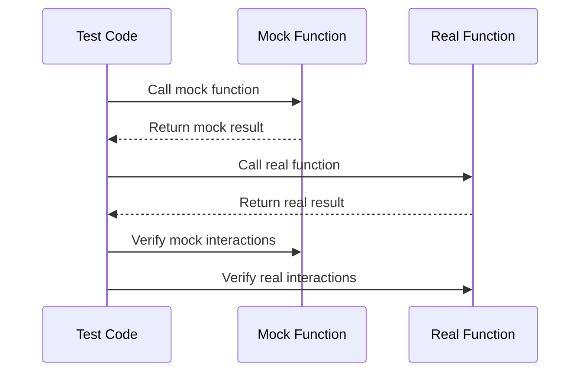

## 11.3 Mocking and Spying on Methods

In the world of software development, testing is a crucial part of ensuring that our code behaves as expected. When working with object-oriented programming in JavaScript, we often need to test individual units of code, such as functions or methods. However, these units may depend on other parts of the code or external systems. This is where mocking and spying come into play. They allow us to simulate dependencies and monitor function calls, making our tests more focused and reliable.

### Understanding Mocking and Spying

Before diving into the practical aspects, let's clarify what mocking and spying mean in the context of testing.

- **Mocking**: This involves creating a simulated version of a function or object to replace the real one during testing. Mocks are used to isolate the unit being tested by controlling its dependencies. This ensures that tests are not affected by external factors and can run consistently.

- **Spying**: Spying involves monitoring the interactions with a real function or method without replacing it. Spies allow us to verify if a function was called, how many times it was called, and with what arguments. This is useful for checking side effects and interactions between components.

### Why Mocking and Spying are Important

Mocking and spying are essential for several reasons:

1. **Isolation**: By mocking dependencies, we can test a unit in isolation, ensuring that failures in other parts of the system do not affect our tests.

2. **Control**: Mocks allow us to control the behavior of dependencies, making it possible to simulate different scenarios and edge cases.

3. **Performance**: Mocking external services or complex operations can significantly speed up tests, as we avoid actual network calls or resource-intensive computations.

4. **Verification**: Spies help verify that functions are called correctly, with the expected arguments, and the right number of times.

### Using Jest for Mocking and Spying

[Jest](https://jestjs.io/) is a popular testing framework for JavaScript that provides built-in support for mocking and spying. Let's explore how to use Jest's features to create mock functions and objects, and to spy on method calls.

#### Creating Mock Functions

Jest allows us to create mock functions using `jest.fn()`. This is useful for replacing a real function with a mock version during testing.

```javascript
// Example of creating a mock function
const mockFunction = jest.fn();

// Using the mock function
mockFunction('hello');
mockFunction('world');

// Checking how many times the mock function was called
console.log(mockFunction.mock.calls.length); // Output: 2

// Checking the arguments of the first call
console.log(mockFunction.mock.calls[0][0]); // Output: 'hello'
```

In this example, `jest.fn()` creates a mock function that records its calls and arguments. We can then inspect these calls using `mock.calls`.

#### Mocking Modules and Objects

Jest also allows us to mock entire modules or objects. This is useful when a unit depends on a module or object that we want to replace with a mock version.

```javascript
// Mocking a module
jest.mock('./myModule', () => ({
  fetchData: jest.fn(() => Promise.resolve('mocked data')),
}));

// Using the mocked module in a test
const { fetchData } = require('./myModule');

test('fetchData returns mocked data', async () => {
  const data = await fetchData();
  expect(data).toBe('mocked data');
});
```

In this example, we mock a module named `myModule` and replace its `fetchData` function with a mock that returns a promise resolving to `'mocked data'`.

#### Spying on Methods

Jest provides `jest.spyOn()` to spy on existing methods. This allows us to monitor calls to a method without replacing it.

```javascript
// Example of spying on a method
const myObject = {
  myMethod: (arg) => `Hello, ${arg}!`,
};

const spy = jest.spyOn(myObject, 'myMethod');

// Calling the method
myObject.myMethod('World');

// Verifying the method was called
expect(spy).toHaveBeenCalled();
expect(spy).toHaveBeenCalledWith('World');

// Restoring the original method
spy.mockRestore();
```

Here, `jest.spyOn()` creates a spy on `myMethod` of `myObject`. We can then verify that the method was called and with what arguments.

### When to Use Mocks vs. Real Implementations

Choosing between mocks and real implementations depends on the context and what you want to achieve with your tests.

- **Use Mocks**: When you need to isolate the unit being tested, control dependencies, simulate edge cases, or improve test performance by avoiding real operations.

- **Use Real Implementations**: When you want to test the integration between components or verify the actual behavior of a function.

### Avoiding Overuse of Mocks

While mocks are powerful, overusing them can lead to brittle tests that are tightly coupled to the implementation details of the code. This can make tests difficult to maintain and less reliable. Here are some tips to avoid overusing mocks:

1. **Focus on Behavior**: Write tests that focus on the behavior and outcomes of the code, rather than its internal implementation.

2. **Limit Mocking to External Dependencies**: Mock only the parts of the code that are external to the unit being tested, such as network calls or database operations.

3. **Use Spies for Verification**: Use spies to verify interactions and side effects, rather than replacing functions with mocks.

4. **Refactor Code for Testability**: Design your code to be testable without heavy reliance on mocks, by using dependency injection and modular design.

### Try It Yourself

Now that we've covered the basics of mocking and spying, let's try some exercises to reinforce your understanding.

1. **Modify the Mock Function**: Change the mock function to return different values based on the input arguments. Verify the behavior using assertions.

2. **Mock a Real Module**: Choose a module from your project and create a mock version for testing. Write a test that uses the mock module.

3. **Spy on a Method**: Create an object with a method and use `jest.spyOn()` to monitor its calls. Verify the interactions using assertions.

### Visualizing Mocking and Spying

To better understand the flow of mocking and spying, let's visualize the process using a sequence diagram.



In this diagram, we see how the test code interacts with both mock and real functions, and how it verifies the interactions.

### References and Links

For further reading on mocking and spying in Jest, check out the following resources:

- [Jest Mock Functions](https://jestjs.io/docs/mock-functions)
- [Jest Spying on Methods](https://jestjs.io/docs/jest-object#jestspyonobject-methodname)
- [MDN Web Docs on Testing](https://developer.mozilla.org/en-US/docs/Learn/Tools_and_testing/Testing)

### Knowledge Check

Let's test your understanding of mocking and spying with some questions and exercises.

1. **What is the purpose of mocking in testing?**
2. **How does `jest.fn()` help in creating mock functions?**
3. **When should you use spies instead of mocks?**
4. **What are the potential downsides of overusing mocks?**
5. **Try modifying a mock function to simulate different scenarios.**

### Embrace the Journey

Remember, mastering mocking and spying is just one step in your journey to becoming proficient in testing object-oriented JavaScript code. Keep experimenting, stay curious, and enjoy the process of learning and improving your testing skills!

## Quiz Time!



### What is the primary purpose of mocking in testing?

- [x] To simulate dependencies and isolate the unit being tested.
- [ ] To replace all functions with mock versions.
- [ ] To ensure tests run faster by skipping real operations.
- [ ] To verify the number of times a function is called.

> **Explanation:** Mocking is used to simulate dependencies and isolate the unit being tested, ensuring that tests are not affected by external factors.

### How can you create a mock function in Jest?

- [x] Using `jest.fn()`.
- [ ] Using `jest.mock()`.
- [ ] Using `jest.spyOn()`.
- [ ] Using `jest.createMockFunction()`.

> **Explanation:** `jest.fn()` is used to create mock functions in Jest, allowing you to simulate and track function calls.

### When should you use spies instead of mocks?

- [x] When you want to monitor interactions with a real function.
- [ ] When you need to replace a function entirely.
- [ ] When you want to simulate different scenarios.
- [ ] When you need to improve test performance.

> **Explanation:** Spies are used to monitor interactions with a real function, verifying calls and arguments without replacing the function.

### What is a potential downside of overusing mocks?

- [x] Tests can become brittle and tightly coupled to implementation details.
- [ ] Tests will run slower due to additional complexity.
- [ ] Mocks cannot simulate external dependencies.
- [ ] Mocks are difficult to create and maintain.

> **Explanation:** Overusing mocks can lead to brittle tests that are tightly coupled to the implementation details, making them harder to maintain.

### How can you mock a module in Jest?

- [x] Using `jest.mock()`.
- [ ] Using `jest.fn()`.
- [ ] Using `jest.spyOn()`.
- [ ] Using `jest.createMockModule()`.

> **Explanation:** `jest.mock()` is used to mock entire modules, replacing their exports with mock versions for testing.

### What is the role of `jest.spyOn()` in testing?

- [x] To create a spy on an existing method and monitor its calls.
- [ ] To replace a method with a mock version.
- [ ] To simulate different return values for a function.
- [ ] To improve test performance by avoiding real operations.

> **Explanation:** `jest.spyOn()` creates a spy on an existing method, allowing you to monitor its calls and interactions without replacing it.

### Why is it important to focus on behavior rather than implementation in tests?

- [x] To ensure tests remain reliable and maintainable.
- [ ] To make tests run faster.
- [ ] To avoid using mocks entirely.
- [ ] To simplify the testing process.

> **Explanation:** Focusing on behavior ensures that tests remain reliable and maintainable, as they are less likely to break with changes in implementation.

### What should you do to restore the original method after spying on it?

- [x] Use `spy.mockRestore()`.
- [ ] Use `jest.restore()`.
- [ ] Use `jest.reset()`.
- [ ] Use `spy.restore()`.

> **Explanation:** `spy.mockRestore()` is used to restore the original method after spying on it, ensuring that subsequent tests are not affected.

### How can you verify the arguments of a mock function call in Jest?

- [x] Using `mockFunction.mock.calls`.
- [ ] Using `jest.verifyArguments()`.
- [ ] Using `jest.checkCalls()`.
- [ ] Using `mockFunction.args`.

> **Explanation:** `mockFunction.mock.calls` provides access to the arguments of each call to the mock function, allowing you to verify them.

### True or False: Mocks should be used for all dependencies in a test.

- [ ] True
- [x] False

> **Explanation:** Mocks should be used judiciously, primarily for external dependencies, to avoid creating brittle tests that are tightly coupled to implementation details.


