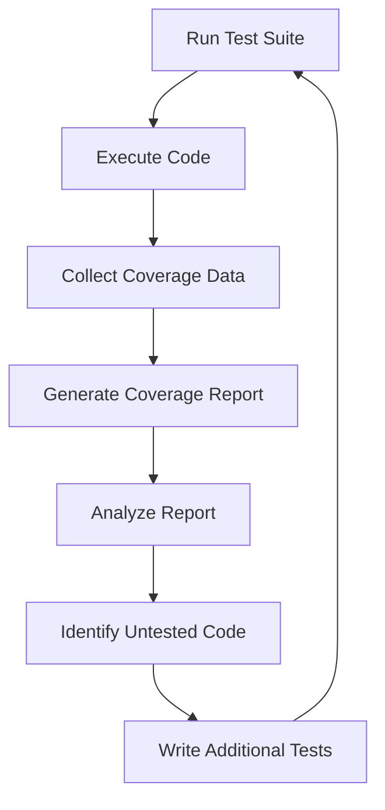

## 11.4 Code Coverage Analysis

In the realm of software development, ensuring that your code behaves as expected is crucial. Testing is a key component of this assurance, and code coverage analysis is a powerful tool in your testing arsenal. In this section, we'll explore what code coverage is, why it matters, and how you can use tools like Jest to measure and improve the coverage of your JavaScript code.

### Understanding Code Coverage

**Code coverage** is a metric used to describe the degree to which the source code of a program is executed when a particular test suite runs. It provides insights into which parts of your code are being tested and which are not, helping you identify gaps in your test suite.

#### Why Code Coverage Matters

1. **Identifying Untested Code**: Code coverage helps you pinpoint areas of your code that have not been tested, allowing you to focus your efforts on writing tests for those areas.
   
2. **Improving Code Quality**: By ensuring that more of your code is tested, you can catch bugs early and improve the overall quality of your software.

3. **Confidence in Refactoring**: High code coverage gives you the confidence to refactor your code, knowing that existing tests will catch any regressions.

4. **Documentation**: Coverage reports can serve as documentation, showing which parts of the codebase are critical and well-tested.

### Generating Code Coverage Reports with Jest

Jest is a popular testing framework for JavaScript, known for its simplicity and powerful features. One of its built-in capabilities is generating code coverage reports. Let's walk through how to set up and interpret these reports.

#### Setting Up Jest for Code Coverage

To start using Jest for code coverage, ensure you have Jest installed in your project. If not, you can install it using npm:

```bash
npm install --save-dev jest
```

Next, configure Jest to collect coverage information. You can do this by adding a script in your `package.json`:

```json
{
  "scripts": {
    "test": "jest --coverage"
  }
}
```

Running `npm test` will now execute your test suite and generate a coverage report.

#### Interpreting Coverage Metrics

Jest provides several key metrics in its coverage reports:

1. **Statements**: The percentage of statements in your code that have been executed.
2. **Branches**: The percentage of control flow branches (e.g., `if` statements) that have been executed.
3. **Functions**: The percentage of functions that have been called.
4. **Lines**: The percentage of lines of code that have been executed.

Here's an example of what a Jest coverage report might look like:

```plaintext
------------------|----------|----------|----------|----------|-------------------|
File              |  % Stmts | % Branch |  % Funcs |  % Lines | Uncovered Line #s |
------------------|----------|----------|----------|----------|-------------------|
All files         |    85.71 |    75.00 |    66.67 |    85.71 |                   |
 calculator.js    |    85.71 |    75.00 |    66.67 |    85.71 | 12, 15, 18        |
------------------|----------|----------|----------|----------|-------------------|
```

#### Visualizing Code Coverage

To better understand how code coverage works, let's visualize the process using a flowchart:



This flowchart illustrates the iterative process of running tests, collecting coverage data, and improving your test suite based on the findings.

### Strategies for Improving Code Coverage

While achieving high code coverage is a worthwhile goal, it's important to focus on meaningful coverage rather than simply aiming for 100%. Here are some strategies to improve your coverage effectively:

#### Identifying Untested Code Paths

1. **Review Coverage Reports**: Regularly review your coverage reports to identify untested areas. Pay attention to low percentages in the branches and functions metrics, as these often indicate complex logic that needs testing.

2. **Focus on Critical Paths**: Prioritize testing critical paths in your application, such as core business logic and frequently used functions.

3. **Use Edge Cases**: Write tests for edge cases and unusual inputs to ensure your code handles them gracefully.

#### Writing Effective Tests

1. **Test Driven Development (TDD)**: Adopt TDD practices by writing tests before implementing new features. This approach naturally leads to higher coverage.

2. **Mock External Dependencies**: Use mocking to isolate the code under test from external dependencies, making it easier to test different scenarios.

3. **Refactor for Testability**: If certain parts of your code are difficult to test, consider refactoring them to improve testability. This might involve breaking down large functions into smaller, more manageable pieces.

#### Balancing Coverage and Quality

While high coverage is desirable, it's essential to maintain the quality of your tests. Here are some tips to balance coverage and quality:

1. **Avoid Coverage for Coverage's Sake**: Don't write superficial tests just to increase coverage numbers. Focus on meaningful tests that validate the behavior of your code.

2. **Use Assertions Wisely**: Ensure your tests contain meaningful assertions that check the correctness of your code.

3. **Review and Refactor Tests**: Regularly review your test suite to identify redundant or outdated tests. Refactor them to improve clarity and maintainability.

### The Limitations of Code Coverage

It's important to recognize that code coverage is not a silver bullet. Here are some limitations to keep in mind:

1. **Coverage is Not Quality**: High coverage does not guarantee that your code is bug-free or that your tests are of high quality. It's possible to have 100% coverage with poorly written tests.

2. **Focus on Behavior**: Ensure your tests focus on the expected behavior of your code rather than just covering lines. Behavior-driven development (BDD) can help in this regard.

3. **Complexity of Measurement**: Some parts of your code, such as asynchronous operations or complex algorithms, may be challenging to cover fully. Focus on testing the most critical aspects.

### Tools and Resources

To further enhance your understanding and application of code coverage, consider exploring these resources:

- [Jest Documentation](https://jestjs.io/docs/en/getting-started): Official documentation for Jest, including coverage configuration and reporting.
- [Codecov](https://codecov.io/): A popular tool for visualizing and tracking code coverage over time.
- [Coveralls](https://coveralls.io/): Another service that provides detailed coverage reports and integrates with various CI/CD pipelines.

### Try It Yourself

Let's put what we've learned into practice. Here's a simple JavaScript function and a corresponding test suite. Try running the tests and generating a coverage report.

```javascript
// calculator.js
function add(a, b) {
    return a + b;
}

function subtract(a, b) {
    return a - b;
}

function multiply(a, b) {
    return a * b;
}

function divide(a, b) {
    if (b === 0) {
        throw new Error("Cannot divide by zero");
    }
    return a / b;
}

module.exports = { add, subtract, multiply, divide };
```

```javascript
// calculator.test.js
const { add, subtract, multiply, divide } = require('./calculator');

test('adds 1 + 2 to equal 3', () => {
    expect(add(1, 2)).toBe(3);
});

test('subtracts 5 - 2 to equal 3', () => {
    expect(subtract(5, 2)).toBe(3);
});

test('multiplies 2 * 3 to equal 6', () => {
    expect(multiply(2, 3)).toBe(6);
});

test('divides 6 / 2 to equal 3', () => {
    expect(divide(6, 2)).toBe(3);
});

test('throws error when dividing by zero', () => {
    expect(() => divide(6, 0)).toThrow("Cannot divide by zero");
});
```

Run the tests and generate a coverage report using the command:

```bash
npm test
```

Examine the coverage report and identify any untested code paths. Try adding additional tests to cover those areas.

### Knowledge Check

Before we wrap up, let's reinforce what we've learned with a few questions:

- What is code coverage, and why is it important?
- How can you generate a code coverage report using Jest?
- What are the key metrics provided in a coverage report?
- Why is it important to balance coverage with test quality?
- What are some limitations of code coverage?

### Embrace the Journey

Remember, achieving high code coverage is a journey, not a destination. As you continue to write and test your code, you'll gain a deeper understanding of your application's behavior and improve its quality. Keep experimenting, stay curious, and enjoy the process!

## Quiz Time!



### What is code coverage?

- [x] A metric that describes the degree to which the source code is executed when a test suite runs.
- [ ] A tool for debugging JavaScript code.
- [ ] A method for optimizing JavaScript performance.
- [ ] A way to deploy JavaScript applications.

> **Explanation:** Code coverage measures how much of your code is executed during testing, helping identify untested areas.

### Which tool is commonly used for generating code coverage reports in JavaScript?

- [x] Jest
- [ ] Webpack
- [ ] Babel
- [ ] ESLint

> **Explanation:** Jest is a popular testing framework that includes built-in capabilities for generating code coverage reports.

### What does the "branches" metric in a coverage report indicate?

- [x] The percentage of control flow branches executed.
- [ ] The number of lines of code executed.
- [ ] The number of functions called.
- [ ] The percentage of statements executed.

> **Explanation:** The "branches" metric shows the percentage of control flow branches, such as `if` statements, that have been executed.

### Why is it important to balance code coverage with test quality?

- [x] High coverage does not guarantee high-quality tests.
- [ ] High coverage always means fewer bugs.
- [ ] Test quality is not important if coverage is high.
- [ ] Coverage and quality are the same.

> **Explanation:** While high coverage is desirable, it doesn't ensure the tests are meaningful or effective in catching bugs.

### What is a limitation of code coverage?

- [x] High coverage does not guarantee bug-free code.
- [ ] It is the only metric needed for testing.
- [ ] It measures code performance.
- [ ] It replaces the need for manual testing.

> **Explanation:** Code coverage doesn't guarantee that the code is bug-free or that the tests are of high quality.

### What is the purpose of using mocking in tests?

- [x] To isolate the code under test from external dependencies.
- [ ] To increase code coverage percentages.
- [ ] To deploy applications faster.
- [ ] To improve code readability.

> **Explanation:** Mocking helps isolate the code under test, making it easier to test different scenarios without external dependencies.

### How can Test Driven Development (TDD) improve code coverage?

- [x] By writing tests before implementing features, leading to naturally higher coverage.
- [ ] By focusing only on the user interface.
- [ ] By reducing the number of tests needed.
- [ ] By increasing code complexity.

> **Explanation:** TDD involves writing tests before code, which naturally leads to higher coverage as features are implemented.

### What is a key benefit of high code coverage?

- [x] Increased confidence in refactoring code.
- [ ] Faster application performance.
- [ ] Reduced need for documentation.
- [ ] Automatic bug fixing.

> **Explanation:** High code coverage provides confidence that existing tests will catch regressions during refactoring.

### Which strategy can help improve code coverage?

- [x] Writing tests for edge cases and unusual inputs.
- [ ] Avoiding tests for complex algorithms.
- [ ] Focusing only on UI tests.
- [ ] Ignoring coverage reports.

> **Explanation:** Writing tests for edge cases ensures that your code handles a wide range of scenarios, improving coverage.

### True or False: 100% code coverage means the code is perfect.

- [ ] True
- [x] False

> **Explanation:** 100% code coverage does not guarantee that the code is bug-free or that the tests are of high quality.




