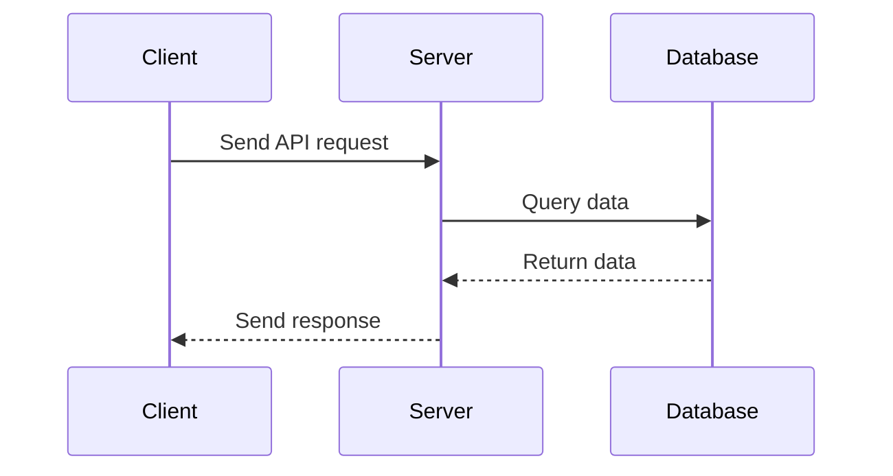

## 11.5 Integration Testing

In the world of software development, ensuring that individual components of an application work seamlessly together is crucial. This is where integration testing comes into play. Integration testing focuses on verifying the interactions between different modules or components of a system, ensuring that they work together as expected. In this section, we will explore the importance of integration testing in object-oriented programming (OOP) applications, differentiate it from unit testing, and provide practical examples and tools to help you implement integration tests effectively.

### Understanding Integration Testing

Integration testing is a level of software testing where individual units or components are combined and tested as a group. The primary goal is to identify issues that occur when different parts of an application interact with each other. This type of testing is essential for detecting interface defects, data flow issues, and other integration-related problems that might not be apparent in unit testing.

#### Differentiating Unit Testing and Integration Testing

Before diving deeper into integration testing, it's important to understand how it differs from unit testing:

- **Unit Testing**: Focuses on testing individual components or functions in isolation. The goal is to verify that each unit of code performs as expected. Unit tests are typically fast and cover small pieces of functionality.

- **Integration Testing**: Involves testing the interactions between integrated units or components. The aim is to ensure that combined parts work together correctly. Integration tests are generally more complex and may take longer to execute than unit tests.

### The Role of Integration Tests

Integration tests play a vital role in verifying the interactions between components or modules in an application. They help ensure that:

- **Data flows correctly** between different parts of the system.
- **Interfaces between modules** are working as expected.
- **Dependencies between components** are correctly managed.
- **End-to-end scenarios** are validated, providing confidence that the system behaves as intended.

### Writing Integration Tests for OOP Applications

Let's explore how to write integration tests for object-oriented JavaScript applications. We'll use a simple example of a user management system with classes representing users and roles.

#### Example: User Management System

Suppose we have a basic user management system with the following classes:

```javascript
// User.js
class User {
  constructor(name, role) {
    this.name = name;
    this.role = role;
  }

  getRole() {
    return this.role;
  }
}

// Role.js
class Role {
  constructor(name) {
    this.name = name;
  }

  getName() {
    return this.name;
  }
}

module.exports = { User, Role };
```

In this system, a `User` has a `Role`, and we want to test the interaction between these two classes.

#### Writing an Integration Test

To write an integration test, we need to verify that a `User` can be correctly assigned a `Role` and that the role can be retrieved as expected.

```javascript
// integration.test.js
const { User, Role } = require('./User');

test('User should have a role assigned', () => {
  const role = new Role('Admin');
  const user = new User('Alice', role);

  expect(user.getRole().getName()).toBe('Admin');
});
```

In this test, we create instances of `User` and `Role` and verify that the `User` has the correct `Role` assigned. This simple test checks the interaction between the `User` and `Role` classes.

### Tools for Integration Testing

Several tools can help you perform integration testing in JavaScript applications. Let's explore two popular ones: Supertest and Puppeteer.

#### Supertest for API Testing

Supertest is a popular library for testing HTTP servers in Node.js. It allows you to test your APIs by simulating HTTP requests and verifying the responses.

**Example: Testing an API with Supertest**

Suppose we have an Express.js application with a simple API endpoint:

```javascript
// app.js
const express = require('express');
const app = express();

app.get('/api/user', (req, res) => {
  res.json({ name: 'Alice', role: 'Admin' });
});

module.exports = app;
```

We can write an integration test using Supertest to verify the API response:

```javascript
// api.test.js
const request = require('supertest');
const app = require('./app');

test('GET /api/user should return user details', async () => {
  const response = await request(app).get('/api/user');
  expect(response.statusCode).toBe(200);
  expect(response.body).toEqual({ name: 'Alice', role: 'Admin' });
});
```

In this test, we use Supertest to send a GET request to the `/api/user` endpoint and verify that the response matches our expectations.

#### Puppeteer for UI Testing

Puppeteer is a Node.js library that provides a high-level API for controlling headless Chrome or Chromium browsers. It's useful for testing web applications' user interfaces.

**Example: Testing a Web Page with Puppeteer**

Suppose we have a simple HTML page with a button that displays an alert:

```html
<!-- index.html -->
<!DOCTYPE html>
<html lang="en">
<head>
  <meta charset="UTF-8">
  <title>Test Page</title>
</head>
<body>
  <button id="alertButton">Click me</button>

  <script>
    document.getElementById('alertButton').addEventListener('click', () => {
      alert('Button clicked!');
    });
  </script>
</body>
</html>
```

We can write an integration test using Puppeteer to simulate a button click and verify the alert:

```javascript
// ui.test.js
const puppeteer = require('puppeteer');

test('Button click should show an alert', async () => {
  const browser = await puppeteer.launch();
  const page = await browser.newPage();
  await page.goto('file://' + __dirname + '/index.html');

  page.on('dialog', async dialog => {
    expect(dialog.message()).toBe('Button clicked!');
    await dialog.dismiss();
  });

  await page.click('#alertButton');
  await browser.close();
});
```

In this test, we use Puppeteer to open the HTML page, simulate a button click, and verify that the correct alert message is displayed.

### Challenges in Integration Testing

Integration testing can present several challenges, including:

- **Test Environment Setup**: Ensuring that the test environment mirrors the production environment as closely as possible.
- **Dependency Management**: Managing dependencies between components and ensuring they are correctly configured for testing.
- **Test Execution Time**: Integration tests can be slower than unit tests, so it's important to balance the number of tests and their execution time.

### Balancing Unit and Integration Tests

Maintaining a balance between unit and integration tests is crucial for an effective testing strategy. While unit tests provide fast feedback on individual components, integration tests ensure that the system as a whole functions correctly. A good practice is to have a higher number of unit tests and a smaller, focused set of integration tests that cover critical interactions.

### Visualizing Integration Testing

To better understand the flow of integration testing, let's visualize the process using a sequence diagram. This diagram illustrates the interaction between a client, server, and database during an integration test.



In this sequence diagram, the client sends a request to the server, which then queries the database. The database returns the data to the server, and the server sends the response back to the client. This flow represents a typical integration test scenario.

### Try It Yourself

To gain hands-on experience with integration testing, try modifying the examples provided:

1. **Extend the User Management System**: Add more classes, such as `Permission`, and write integration tests to verify interactions between users, roles, and permissions.

2. **Enhance the API Test**: Add more endpoints to the Express.js application and write integration tests for each endpoint using Supertest.

3. **Experiment with Puppeteer**: Create a more complex HTML page with multiple interactive elements and write integration tests to verify user interactions.

### References and Further Reading

For more information on integration testing and the tools mentioned, check out the following resources:

- [MDN Web Docs: Introduction to Software Testing](https://developer.mozilla.org/en-US/docs/Learn/Tools_and_testing/Understanding_client-side_tools/Testing)
- [Supertest GitHub Repository](https://github.com/visionmedia/supertest)
- [Puppeteer Documentation](https://pptr.dev/)

### Knowledge Check

Before we wrap up, let's reinforce what we've learned with a few questions:

1. What is the primary goal of integration testing?
2. How does integration testing differ from unit testing?
3. What are some challenges associated with integration testing?
4. Name two tools commonly used for integration testing in JavaScript applications.
5. Why is it important to maintain a balance between unit and integration tests?

### Embrace the Journey

Remember, integration testing is a crucial step in ensuring that your application functions correctly as a whole. As you continue to build and test your applications, keep experimenting with different testing strategies and tools. Stay curious, and enjoy the journey of becoming a proficient JavaScript developer!

## Quiz Time!



### What is the primary goal of integration testing?

- [x] To verify interactions between components or modules
- [ ] To test individual functions in isolation
- [ ] To ensure code coverage
- [ ] To optimize performance

> **Explanation:** The primary goal of integration testing is to verify that different components or modules of an application work together correctly.

### How does integration testing differ from unit testing?

- [x] Integration testing focuses on interactions between components, while unit testing focuses on individual components.
- [ ] Integration testing is faster than unit testing.
- [ ] Integration testing is done before unit testing.
- [ ] Integration testing requires no setup.

> **Explanation:** Integration testing focuses on the interactions between components, whereas unit testing focuses on testing individual components in isolation.

### Which tool is commonly used for API integration testing in JavaScript?

- [x] Supertest
- [ ] Mocha
- [ ] Puppeteer
- [ ] Jasmine

> **Explanation:** Supertest is a popular tool for API integration testing in JavaScript, allowing you to simulate HTTP requests and verify responses.

### What is Puppeteer used for in integration testing?

- [x] UI testing
- [ ] API testing
- [ ] Unit testing
- [ ] Performance testing

> **Explanation:** Puppeteer is used for UI testing by controlling headless Chrome or Chromium browsers to simulate user interactions.

### What is a common challenge in integration testing?

- [x] Test environment setup
- [ ] Lack of test cases
- [ ] High test execution speed
- [ ] Limited test coverage

> **Explanation:** Test environment setup is a common challenge in integration testing, as it requires ensuring that the test environment closely mirrors the production environment.

### Why is it important to maintain a balance between unit and integration tests?

- [x] To ensure both individual components and their interactions are tested
- [ ] To reduce the number of tests
- [ ] To increase test execution time
- [ ] To focus only on integration tests

> **Explanation:** Maintaining a balance between unit and integration tests ensures that both individual components and their interactions are thoroughly tested.

### What does the sequence diagram in the article illustrate?

- [x] Interaction between client, server, and database during an integration test
- [ ] The flow of unit testing
- [ ] The process of setting up a test environment
- [ ] The execution of performance tests

> **Explanation:** The sequence diagram illustrates the interaction between a client, server, and database during an integration test, showing the flow of requests and responses.

### Which of the following is NOT a focus of integration testing?

- [ ] Verifying data flow between components
- [ ] Ensuring interfaces work correctly
- [ ] Testing individual functions in isolation
- [x] Optimizing code performance

> **Explanation:** Integration testing focuses on verifying data flow and interfaces between components, not on optimizing code performance.

### What is a benefit of using Supertest for API testing?

- [x] It allows you to simulate HTTP requests and verify responses.
- [ ] It provides a graphical user interface for testing.
- [ ] It is used for UI testing.
- [ ] It requires no setup.

> **Explanation:** Supertest allows you to simulate HTTP requests and verify responses, making it a powerful tool for API integration testing.

### True or False: Integration tests are generally faster than unit tests.

- [ ] True
- [x] False

> **Explanation:** Integration tests are generally more complex and take longer to execute than unit tests, which focus on individual components.


