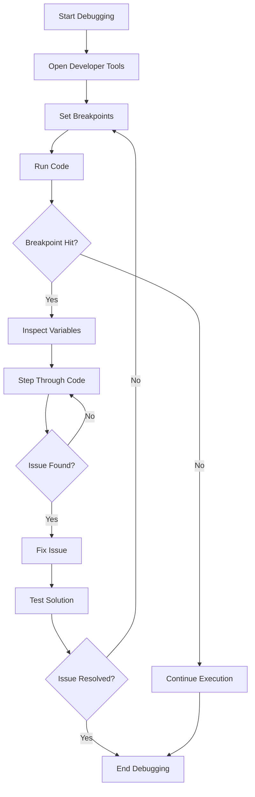

## 11.6 Debugging Techniques

Debugging is an essential skill for any developer, especially when working with JavaScript, a language that runs both in the browser and on the server. In this section, we will explore various debugging techniques to help you efficiently identify and fix issues in your code. We'll cover the use of browser developer tools, setting breakpoints, inspecting variables, and more. By the end of this section, you'll have a solid understanding of how to approach debugging systematically and effectively.

### Understanding Debugging

Debugging is the process of identifying, analyzing, and fixing bugs or errors in your code. Bugs can range from syntax errors to logical errors that cause unexpected behavior. Debugging is a critical part of the development process, as it ensures that your code runs smoothly and meets the intended functionality.

### Using Browser Developer Tools

Browser developer tools are powerful utilities that come built-in with modern web browsers. They provide a wide range of features for inspecting and debugging client-side code. Let's explore how to use these tools effectively.

#### Opening Developer Tools

To open developer tools in most browsers, you can right-click on a webpage and select "Inspect" or use the keyboard shortcut `Ctrl + Shift + I` (Windows/Linux) or `Cmd + Option + I` (Mac).

#### Elements Panel

The Elements panel allows you to inspect and modify the HTML and CSS of a webpage. This is useful for debugging layout and styling issues.

#### Console Panel

The Console panel is a powerful tool for logging messages and interacting with JavaScript on the page. You can execute JavaScript commands directly in the console, which is useful for testing snippets of code.

#### Sources Panel

The Sources panel is where you'll spend most of your time when debugging JavaScript. It allows you to view and edit source files, set breakpoints, and step through code execution.

### Setting Breakpoints and Stepping Through Code

Breakpoints are markers that you can set in your code to pause execution at a specific line. This allows you to inspect the current state of your application and understand how your code is executing.

#### Setting a Breakpoint

To set a breakpoint, navigate to the Sources panel, find the JavaScript file you want to debug, and click on the line number where you want to pause execution. A blue marker will appear, indicating that a breakpoint has been set.

#### Stepping Through Code

Once a breakpoint is hit, you can use the following controls to step through your code:

- **Step Over (`F10`)**: Execute the current line and move to the next line.
- **Step Into (`F11`)**: Enter into a function call to debug inside the function.
- **Step Out (`Shift + F11`)**: Exit the current function and return to the caller.
- **Resume (`F8`)**: Continue execution until the next breakpoint is hit.

#### Inspecting Variables

When execution is paused at a breakpoint, you can inspect the current state of variables in the Scope section of the Sources panel. This allows you to see the values of local and global variables, as well as the call stack.

### Debugging Server-Side Code with Node.js Inspector

For server-side JavaScript, such as Node.js applications, you can use the Node.js Inspector to debug your code. The Node.js Inspector is a built-in debugging tool that allows you to connect to a running Node.js process and debug it using Chrome DevTools.

#### Starting the Node.js Inspector

To start the Node.js Inspector, run your Node.js application with the `--inspect` flag:

```bash
node --inspect your-script.js
```

This will start the application and provide a URL that you can open in Chrome to start debugging.

#### Using Chrome DevTools with Node.js

Once connected, you can use Chrome DevTools to set breakpoints, step through code, and inspect variables just like you would with client-side JavaScript.

### Logging Best Practices and Using Console Methods

Logging is an essential part of debugging, as it allows you to output messages to the console to understand what's happening in your code. Here are some best practices for using console methods effectively:

#### Using `console.log()`

The `console.log()` method is the most commonly used logging method. Use it to output messages, variable values, and other information to the console.

```javascript
console.log('Hello, world!');
console.log('The value of x is:', x);
```

#### Other Console Methods

- **`console.error()`**: Use this to log error messages. It will display messages in red, making them easy to spot.
- **`console.warn()`**: Use this to log warning messages. It will display messages in yellow.
- **`console.table()`**: Use this to display data in a table format, which is useful for arrays and objects.

```javascript
console.error('An error occurred!');
console.warn('This is a warning!');
console.table([{ name: 'Alice', age: 25 }, { name: 'Bob', age: 30 }]);
```

### Advanced Debugging Techniques

As you become more comfortable with basic debugging, you can explore advanced techniques to improve your debugging efficiency.

#### Conditional Breakpoints

Conditional breakpoints allow you to pause execution only when a specific condition is met. This is useful for debugging loops or when you only want to pause execution under certain circumstances.

To set a conditional breakpoint, right-click on a breakpoint and select "Edit Breakpoint." Enter the condition under which you want the breakpoint to trigger.

#### Profiling

Profiling is the process of analyzing the performance of your code to identify bottlenecks and optimize execution. The Performance panel in Chrome DevTools allows you to record and analyze the performance of your application.

### Developing a Systematic Approach to Debugging

Debugging can be challenging, especially for beginners. Developing a systematic approach can help you diagnose issues more effectively. Here are some tips:

1. **Reproduce the Issue**: Ensure you can consistently reproduce the issue before attempting to fix it.
2. **Isolate the Problem**: Narrow down the code that is causing the issue by commenting out sections or using breakpoints.
3. **Inspect and Analyze**: Use developer tools to inspect variables, the call stack, and the execution flow.
4. **Test Solutions**: Try different solutions and test them thoroughly to ensure the issue is resolved.
5. **Document Your Findings**: Keep a record of what you learned and how you fixed the issue for future reference.

### Try It Yourself

To practice debugging, try modifying the following code example and observe how the changes affect the output:

```javascript
function calculateSum(a, b) {
    console.log('Calculating sum of', a, 'and', b);
    return a + b;
}

let result = calculateSum(5, 10);
console.log('Result:', result);
```

- **Experiment**: Change the values of `a` and `b` and observe the output.
- **Add Breakpoints**: Set breakpoints in the `calculateSum` function and step through the code.
- **Use Console Methods**: Try using `console.error()` or `console.warn()` to log different types of messages.

### Visualizing Debugging Workflow

Below is a flowchart that illustrates the typical workflow of debugging JavaScript code using browser developer tools:



### References and Links

- [MDN Web Docs: Debugging JavaScript](https://developer.mozilla.org/en-US/docs/Learn/JavaScript/First_steps/What_is_JavaScript#debugging_javascript)
- [Google Chrome DevTools](https://developer.chrome.com/docs/devtools/)
- [Node.js Debugging Guide](https://nodejs.org/en/docs/guides/debugging-getting-started/)

### Knowledge Check

Before we wrap up, let's review some key takeaways from this section:

- Debugging is an essential skill for identifying and fixing issues in your code.
- Browser developer tools provide powerful features for inspecting and debugging client-side code.
- Breakpoints allow you to pause execution and inspect the current state of your application.
- Logging is a valuable tool for understanding what's happening in your code.
- Developing a systematic approach to debugging can help you diagnose issues more effectively.

### Embrace the Journey

Remember, debugging is a skill that improves with practice. As you continue to develop your JavaScript skills, you'll become more proficient at identifying and fixing issues in your code. Keep experimenting, stay curious, and enjoy the journey!

## Quiz Time!



### What is the primary purpose of debugging in programming?

- [x] To identify and fix errors in the code
- [ ] To write new features
- [ ] To improve code readability
- [ ] To deploy applications

> **Explanation:** Debugging is primarily used to identify and fix errors in the code to ensure it runs as expected.

### Which browser tool is commonly used to inspect and modify HTML and CSS?

- [ ] Console
- [x] Elements Panel
- [ ] Sources Panel
- [ ] Network Panel

> **Explanation:** The Elements panel in browser developer tools is used to inspect and modify HTML and CSS.

### What does setting a breakpoint in your code allow you to do?

- [ ] Skip lines of code
- [x] Pause execution at a specific line
- [ ] Automatically fix errors
- [ ] Run code faster

> **Explanation:** Setting a breakpoint pauses the execution of your code at a specific line, allowing you to inspect the current state.

### Which console method is used to log error messages?

- [ ] console.log()
- [x] console.error()
- [ ] console.warn()
- [ ] console.table()

> **Explanation:** The `console.error()` method is used to log error messages, displaying them in red for easy identification.

### How can you debug server-side JavaScript code?

- [ ] Using the Network Panel
- [x] Using Node.js Inspector
- [ ] Using HTML Inspector
- [ ] Using CSS Debugger

> **Explanation:** The Node.js Inspector is used to debug server-side JavaScript code by connecting to a running Node.js process.

### What is a conditional breakpoint?

- [ ] A breakpoint that always triggers
- [x] A breakpoint that triggers only when a specific condition is met
- [ ] A breakpoint that skips lines
- [ ] A breakpoint that fixes errors

> **Explanation:** A conditional breakpoint triggers only when a specific condition is met, allowing for more targeted debugging.

### Which of the following is a best practice for logging?

- [x] Use `console.log()` to output variable values
- [ ] Log all data indiscriminately
- [x] Use `console.error()` for error messages
- [ ] Avoid logging altogether

> **Explanation:** Using `console.log()` for variable values and `console.error()` for error messages are best practices for effective logging.

### What is the purpose of profiling in debugging?

- [ ] To fix syntax errors
- [ ] To write new code
- [x] To analyze code performance
- [ ] To deploy applications

> **Explanation:** Profiling is used to analyze the performance of your code to identify bottlenecks and optimize execution.

### What is the first step in a systematic approach to debugging?

- [ ] Fix the issue immediately
- [ ] Test solutions
- [x] Reproduce the issue
- [ ] Document findings

> **Explanation:** The first step in a systematic approach to debugging is to reproduce the issue consistently before attempting to fix it.

### True or False: Debugging is only necessary for client-side JavaScript code.

- [ ] True
- [x] False

> **Explanation:** Debugging is necessary for both client-side and server-side JavaScript code to ensure proper functionality.


