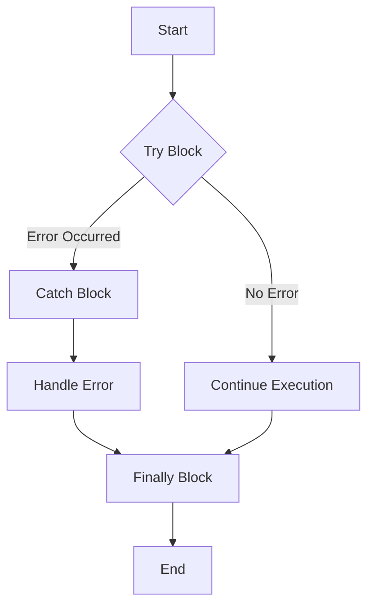

## 11.7 Handling Exceptions Gracefully

In the journey of developing robust applications, handling exceptions gracefully is a crucial skill. Whether you're dealing with unexpected user inputs, network failures, or unforeseen bugs, having a solid error-handling strategy ensures that your application remains resilient and user-friendly. In this section, we'll explore how to handle exceptions in JavaScript using various techniques, including `try...catch...finally` blocks, custom error classes, and more.

### Understanding Exceptions in JavaScript

Exceptions are runtime anomalies that disrupt the normal flow of a program. In JavaScript, exceptions can be generated by the runtime environment or explicitly thrown by the developer. It's essential to handle these exceptions to prevent your application from crashing and to provide meaningful feedback to users.

### Using try...catch...finally Blocks

The `try...catch...finally` construct is a fundamental tool for handling exceptions in JavaScript. It allows you to catch and manage errors gracefully, ensuring that your application can recover or provide informative messages to users.

#### Syntax and Structure

Here's the basic syntax of a `try...catch...finally` block:

```javascript
try {
    // Code that may throw an error
} catch (error) {
    // Code to handle the error
} finally {
    // Code that will always execute, regardless of an error
}
```

- **`try` block**: Contains code that might throw an exception.
- **`catch` block**: Executes if an error occurs in the `try` block. It receives the error object as a parameter.
- **`finally` block**: Executes after the `try` and `catch` blocks, regardless of whether an error occurred. It's useful for cleanup operations.

#### Example: Handling Synchronous Errors

Let's see a simple example of using `try...catch` to handle a synchronous error:

```javascript
function divideNumbers(a, b) {
    try {
        if (b === 0) {
            throw new Error("Division by zero is not allowed.");
        }
        console.log(a / b);
    } catch (error) {
        console.error("An error occurred:", error.message);
    } finally {
        console.log("Division operation completed.");
    }
}

divideNumbers(10, 0);
```

In this example, we attempt to divide two numbers. If the divisor is zero, we throw an error. The `catch` block captures this error and logs a message to the console. The `finally` block runs regardless of whether an error occurred, indicating that the division operation has completed.

### Creating Custom Error Classes

JavaScript allows you to create custom error classes to provide more descriptive and specific error messages. This is particularly useful in large applications where different types of errors need to be distinguished.

#### Defining a Custom Error Class

You can extend the built-in `Error` class to create your own custom error types:

```javascript
class ValidationError extends Error {
    constructor(message) {
        super(message);
        this.name = "ValidationError";
    }
}

function validateUserInput(input) {
    if (!input) {
        throw new ValidationError("Input cannot be empty.");
    }
    console.log("Input is valid:", input);
}

try {
    validateUserInput("");
} catch (error) {
    if (error instanceof ValidationError) {
        console.error("Validation error:", error.message);
    } else {
        console.error("An unexpected error occurred:", error.message);
    }
}
```

In this example, we define a `ValidationError` class that extends the `Error` class. We then use this custom error to handle specific validation errors, allowing us to differentiate between validation and other types of errors.

### Handling Asynchronous Errors

Handling errors in asynchronous code can be more challenging due to the non-blocking nature of JavaScript. However, using promises and `async/await` can simplify this process.

#### Promises and Error Handling

When working with promises, you can use the `.catch()` method to handle errors:

```javascript
function fetchData(url) {
    return new Promise((resolve, reject) => {
        // Simulate an asynchronous operation
        setTimeout(() => {
            if (url === "valid-url") {
                resolve("Data fetched successfully.");
            } else {
                reject(new Error("Invalid URL."));
            }
        }, 1000);
    });
}

fetchData("invalid-url")
    .then(data => console.log(data))
    .catch(error => console.error("Error fetching data:", error.message));
```

In this example, `fetchData` returns a promise. If the URL is invalid, the promise is rejected, and the error is handled in the `.catch()` block.

#### Using async/await for Error Handling

The `async/await` syntax provides a more readable way to handle asynchronous operations and errors:

```javascript
async function fetchDataAsync(url) {
    try {
        const data = await fetchData(url);
        console.log(data);
    } catch (error) {
        console.error("Error fetching data:", error.message);
    }
}

fetchDataAsync("invalid-url");
```

By using `async/await`, we can write asynchronous code that looks synchronous, making it easier to read and maintain. The `try...catch` block can be used to handle errors in the same way as with synchronous code.

### Avoiding Exposure of Sensitive Information

When handling exceptions, it's crucial not to expose sensitive information to end-users. Error messages should be user-friendly and not reveal internal details of your application.

#### Best Practices for User-Friendly Error Messages

- **Be vague about internal errors**: Instead of displaying technical error messages, provide a generic message like "An error occurred. Please try again later."
- **Log detailed errors for diagnostics**: Use logging mechanisms to capture detailed error information for developers and support teams.

### Logging Errors for Diagnostics

Logging errors is essential for diagnosing issues in your application. By capturing error details, you can analyze and fix problems more efficiently.

#### Implementing Error Logging

You can use libraries like [Winston](https://github.com/winstonjs/winston) or [Bunyan](https://github.com/trentm/node-bunyan) for logging in Node.js applications. For browser-based applications, consider using services like [Sentry](https://sentry.io/) or [LogRocket](https://logrocket.com/).

Here's a simple example of logging errors using `console.error`:

```javascript
function logError(error) {
    console.error("Error logged:", error.message);
}

try {
    throw new Error("Something went wrong.");
} catch (error) {
    logError(error);
}
```

In a real-world application, you would replace `console.error` with a more sophisticated logging solution that can store logs for later analysis.

### Global Error Handlers in Frameworks

Many JavaScript frameworks and libraries provide mechanisms for global error handling. These handlers can catch unhandled exceptions and promise rejections, providing a centralized way to manage errors.

#### Example: Global Error Handling in Express.js

In a Node.js application using Express, you can define a global error handler:

```javascript
const express = require('express');
const app = express();

// Define routes
app.get('/', (req, res) => {
    throw new Error("Simulated error.");
});

// Global error handler
app.use((err, req, res, next) => {
    console.error("Error:", err.message);
    res.status(500).send("An unexpected error occurred.");
});

app.listen(3000, () => {
    console.log("Server running on http://localhost:3000");
});
```

In this example, any errors thrown in the route handlers are caught by the global error handler, which logs the error and sends a generic response to the client.

### Try It Yourself

Experiment with the examples provided in this section. Try modifying the code to handle different types of errors or to log additional information. This hands-on practice will help solidify your understanding of error handling in JavaScript.

### Visualizing Error Handling Flow

To better understand the flow of error handling in JavaScript, let's visualize it using a flowchart:



This flowchart illustrates the sequence of operations in a `try...catch...finally` block. If an error occurs in the `try` block, the `catch` block handles it, and the `finally` block executes regardless of whether an error occurred.

### Key Takeaways

- Use `try...catch...finally` blocks to handle exceptions and ensure your application remains stable.
- Create custom error classes to provide more descriptive error messages.
- Handle asynchronous errors using promises and `async/await`.
- Avoid exposing sensitive error information to users; log errors for diagnostics.
- Implement global error handlers in frameworks to manage unhandled exceptions.

### Embrace the Journey

Remember, mastering error handling is a journey. As you gain experience, you'll develop more sophisticated strategies for managing exceptions. Keep experimenting, stay curious, and enjoy the process of creating resilient applications!

## Quiz Time!



### What is the purpose of the `finally` block in a `try...catch...finally` construct?

- [x] To execute code regardless of whether an error occurred
- [ ] To catch and handle errors
- [ ] To throw new errors
- [ ] To log errors to a file

> **Explanation:** The `finally` block is used to execute code after the `try` and `catch` blocks, regardless of whether an error occurred. It's typically used for cleanup operations.

### How can you create a custom error class in JavaScript?

- [x] By extending the built-in `Error` class
- [ ] By using the `throw` statement
- [ ] By using the `catch` block
- [ ] By defining a function

> **Explanation:** You can create a custom error class by extending the built-in `Error` class, allowing you to define specific error types with custom messages.

### Which method is used to handle errors in promises?

- [x] `.catch()`
- [ ] `.then()`
- [ ] `.finally()`
- [ ] `.resolve()`

> **Explanation:** The `.catch()` method is used to handle errors in promises. It allows you to define a callback function that executes when the promise is rejected.

### What is the benefit of using `async/await` for error handling?

- [x] It makes asynchronous code look synchronous and easier to read
- [ ] It eliminates the need for error handling
- [ ] It automatically logs errors to the console
- [ ] It prevents all runtime errors

> **Explanation:** `async/await` makes asynchronous code look synchronous, improving readability and maintainability. It allows you to use `try...catch` blocks for error handling in asynchronous functions.

### Why is it important not to expose sensitive error information to end-users?

- [x] To prevent security vulnerabilities
- [ ] To improve application performance
- [x] To provide a better user experience
- [ ] To reduce the size of error logs

> **Explanation:** Exposing sensitive error information can lead to security vulnerabilities and a poor user experience. It's important to provide generic error messages to users while logging detailed errors for diagnostics.

### What is a global error handler in a framework?

- [x] A centralized mechanism to catch unhandled exceptions
- [ ] A function that logs errors to a file
- [ ] A method to prevent all errors from occurring
- [ ] A way to automatically fix errors

> **Explanation:** A global error handler is a centralized mechanism in frameworks to catch unhandled exceptions and manage errors consistently across the application.

### Which library can be used for logging errors in Node.js applications?

- [x] Winston
- [ ] jQuery
- [x] Bunyan
- [ ] React

> **Explanation:** Libraries like Winston and Bunyan are commonly used for logging errors in Node.js applications, providing robust logging capabilities.

### What does the `instanceof` operator do in error handling?

- [x] Checks if an object is an instance of a specific class
- [ ] Logs errors to the console
- [ ] Catches errors in asynchronous code
- [ ] Executes code in the `finally` block

> **Explanation:** The `instanceof` operator checks if an object is an instance of a specific class, which is useful for identifying custom error types in error handling.

### How can you handle errors in asynchronous code using promises?

- [x] By chaining a `.catch()` method to the promise
- [ ] By using a `try...catch` block
- [ ] By using the `finally` block
- [ ] By throwing an error

> **Explanation:** You can handle errors in asynchronous code using promises by chaining a `.catch()` method to the promise, which allows you to define a callback function for handling rejections.

### True or False: The `finally` block will execute even if the `catch` block throws an error.

- [x] True
- [ ] False

> **Explanation:** True. The `finally` block will execute regardless of whether an error occurs in the `try` or `catch` blocks, making it useful for cleanup operations.




