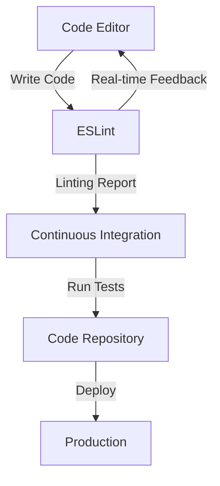

## 11.8 Linting and Code Quality Tools

In the world of software development, maintaining high code quality is crucial. It ensures that the code is not only functional but also readable, maintainable, and free from potential bugs. In JavaScript, a dynamic and flexible language, enforcing coding standards can be challenging. This is where linting and code quality tools, such as ESLint, come into play. In this section, we will explore the role of ESLint in maintaining code quality, how to set it up, extend it with plugins, and integrate it with development tools for real-time feedback.

### Introduction to ESLint

ESLint is a popular linting tool for JavaScript that helps developers identify and fix problems in their code. It enforces coding standards by analyzing code for stylistic and programming errors. ESLint is highly configurable, allowing developers to define their own rules or use predefined sets of rules. It supports ECMAScript versions, JSX, and can be extended with plugins for specific frameworks or coding standards.

#### Why Use ESLint?

- **Consistency**: Enforces a consistent coding style across the codebase, making it easier for teams to collaborate.
- **Error Prevention**: Identifies potential errors before they become bugs, reducing the likelihood of runtime errors.
- **Code Quality**: Encourages best practices and helps maintain high code quality.
- **Customization**: Offers flexibility to tailor linting rules to fit specific project needs.

### Setting Up ESLint in a Project

Setting up ESLint in a JavaScript project is straightforward. Let's walk through the steps to get ESLint up and running.

#### Step 1: Install ESLint

First, ensure you have Node.js and npm (Node Package Manager) installed on your machine. Then, navigate to your project directory and run the following command to install ESLint:

```bash
npm install eslint --save-dev
```

The `--save-dev` flag indicates that ESLint is a development dependency.

#### Step 2: Initialize ESLint

After installing ESLint, you need to create a configuration file. Run the following command to initialize ESLint:

```bash
npx eslint --init
```

This command will prompt you with a series of questions to set up ESLint according to your project's needs. You can choose to:

- Use a popular style guide (e.g., Airbnb, Google).
- Answer questions about your coding style preferences.
- Specify the environments your code will run in (e.g., browser, Node.js).

Once completed, an `.eslintrc` configuration file will be generated in your project directory.

#### Step 3: Configure ESLint

The `.eslintrc` file is where you define your linting rules. Here's an example of a basic configuration:

```json
{
  "env": {
    "browser": true,
    "es2021": true
  },
  "extends": [
    "eslint:recommended"
  ],
  "parserOptions": {
    "ecmaVersion": 12,
    "sourceType": "module"
  },
  "rules": {
    "indent": ["error", 2],
    "linebreak-style": ["error", "unix"],
    "quotes": ["error", "single"],
    "semi": ["error", "always"]
  }
}
```

- **env**: Specifies the environments (e.g., browser, Node.js) that the code is designed to run in.
- **extends**: Allows you to use a predefined set of rules. `eslint:recommended` is a good starting point.
- **parserOptions**: Defines the ECMAScript version and module type.
- **rules**: Customizes specific linting rules. In this example, we enforce 2-space indentation, Unix linebreaks, single quotes, and semicolons.

### Extending ESLint with Plugins

ESLint's flexibility shines through its ability to be extended with plugins. Plugins allow you to add additional rules or support for specific frameworks and libraries.

#### Installing Plugins

To install a plugin, use npm. For example, to add support for React, you would install the `eslint-plugin-react`:

```bash
npm install eslint-plugin-react --save-dev
```

#### Configuring Plugins

Once installed, you need to configure ESLint to use the plugin. Update your `.eslintrc` file to include the plugin:

```json
{
  "plugins": [
    "react"
  ],
  "extends": [
    "eslint:recommended",
    "plugin:react/recommended"
  ],
  "settings": {
    "react": {
      "version": "detect"
    }
  }
}
```

- **plugins**: Lists the plugins to be used.
- **extends**: Includes recommended rules from the plugin.
- **settings**: Provides additional configuration specific to the plugin.

### Common Linting Rules and Their Benefits

Linting rules are the heart of ESLint, guiding developers toward best practices and preventing common errors. Let's explore some common rules and how they help maintain code quality.

#### Example Rules

1. **No Unused Variables**: Warns about variables that are declared but not used anywhere in the code.

   ```json
   "no-unused-vars": ["warn"]
   ```

   This rule helps keep the code clean and free of unnecessary clutter.

2. **Consistent Return**: Ensures that functions either always or never specify values to be returned.

   ```json
   "consistent-return": "error"
   ```

   This rule prevents unexpected behavior by enforcing consistent return statements.

3. **No Console**: Disallows the use of `console.log` in production code.

   ```json
   "no-console": ["warn", { "allow": ["warn", "error"] }]
   ```

   This rule encourages developers to remove debugging statements before deploying code.

4. **Curly**: Requires the use of curly braces for all control statements.

   ```json
   "curly": ["error", "all"]
   ```

   This rule improves readability and reduces the risk of errors in control flow.

#### How Rules Prevent Bugs

Linting rules act as a safety net, catching errors early in the development process. For example, the `no-unused-vars` rule helps identify variables that may have been declared by mistake, preventing potential confusion or errors. Similarly, the `consistent-return` rule ensures that functions behave predictably, reducing the likelihood of unexpected results.

### Integrating ESLint with Development Tools

For maximum effectiveness, ESLint should be integrated into your development workflow. This allows you to receive real-time feedback as you write code.

#### Editor Integration

Most modern code editors, such as Visual Studio Code, Atom, and Sublime Text, support ESLint integration through extensions or plugins. For example, in Visual Studio Code, you can install the ESLint extension from the marketplace. Once installed, ESLint will highlight issues directly in the editor, providing instant feedback.

#### Continuous Integration

Integrating ESLint into your continuous integration (CI) pipeline ensures that code quality is maintained across the entire team. You can configure your CI server to run ESLint checks automatically whenever code is pushed to the repository. This helps catch issues early and prevents them from reaching production.

### Encouraging Consistency in Code Style

Consistency in code style is vital for readability and teamwork. When everyone follows the same coding standards, it becomes easier to read, understand, and maintain the code. ESLint helps enforce these standards, ensuring that all team members adhere to the same guidelines.

#### Code Style Guides

Adopting a code style guide, such as the Airbnb JavaScript Style Guide, provides a set of rules and best practices for writing JavaScript. ESLint can be configured to enforce these guidelines, promoting consistency across the codebase.

#### Benefits of Consistent Code Style

- **Readability**: Consistent code is easier to read and understand, reducing the cognitive load on developers.
- **Maintainability**: A uniform codebase is easier to maintain and refactor, as developers can quickly grasp the structure and logic.
- **Collaboration**: When everyone follows the same standards, collaboration becomes smoother, as team members can focus on solving problems rather than deciphering code.

### Try It Yourself

Now that we've covered the basics of ESLint, let's put it into practice. Try setting up ESLint in a small JavaScript project. Experiment with different rules and configurations to see how they affect your code. Here's a simple exercise to get you started:

1. Create a new JavaScript file with some intentional errors, such as unused variables or inconsistent indentation.
2. Set up ESLint in the project and configure it to enforce your preferred coding standards.
3. Run ESLint and observe the feedback. Fix the issues highlighted by ESLint.
4. Experiment with adding a plugin, such as `eslint-plugin-react`, and configure it in your `.eslintrc` file.

By experimenting with ESLint, you'll gain a deeper understanding of how it can improve your code quality and development workflow.

### Visualizing ESLint's Role in Development

To better understand how ESLint fits into the development process, let's visualize its interaction with the code editor and CI pipeline.



**Diagram Description**: This flowchart illustrates how ESLint integrates with the code editor to provide real-time feedback and is part of the continuous integration process to ensure code quality before deployment.

### References and Links

For further reading and resources on ESLint and code quality tools, consider exploring the following:

- [ESLint Official Documentation](https://eslint.org/docs/user-guide/getting-started)
- [Airbnb JavaScript Style Guide](https://github.com/airbnb/javascript)
- [MDN Web Docs: JavaScript](https://developer.mozilla.org/en-US/docs/Web/JavaScript)
- [Visual Studio Code ESLint Extension](https://marketplace.visualstudio.com/items?itemName=dbaeumer.vscode-eslint)

### Knowledge Check

To reinforce your understanding of linting and code quality tools, consider the following questions and exercises:

- What are the benefits of using ESLint in a JavaScript project?
- How does ESLint help prevent common coding errors?
- Set up ESLint in a new project and configure it with a custom set of rules.
- Experiment with different plugins and observe how they enhance ESLint's capabilities.

### Embrace the Journey

Remember, mastering linting and code quality tools is an ongoing process. As you continue to develop your skills, you'll find that these tools become invaluable in maintaining high-quality code. Keep experimenting, stay curious, and enjoy the journey of becoming a proficient JavaScript developer!

---

## Quiz Time!



### What is the primary purpose of ESLint?

- [x] To enforce coding standards and catch potential issues early
- [ ] To compile JavaScript code into machine code
- [ ] To manage project dependencies
- [ ] To provide a runtime environment for JavaScript

> **Explanation:** ESLint is a linting tool used to enforce coding standards and identify potential issues in JavaScript code.

### How do you install ESLint in a JavaScript project?

- [x] Using the command `npm install eslint --save-dev`
- [ ] By downloading it from the ESLint website
- [ ] By including it in the HTML file
- [ ] By using the command `npm install eslint --global`

> **Explanation:** ESLint is installed as a development dependency using npm with the command `npm install eslint --save-dev`.

### What file is generated when you initialize ESLint in a project?

- [x] .eslintrc
- [ ] package.json
- [ ] index.js
- [ ] config.json

> **Explanation:** The `.eslintrc` file is generated when ESLint is initialized, containing the configuration for linting rules.

### Which ESLint rule helps identify variables that are declared but not used?

- [x] no-unused-vars
- [ ] no-console
- [ ] curly
- [ ] consistent-return

> **Explanation:** The `no-unused-vars` rule warns about variables that are declared but not used anywhere in the code.

### How can ESLint be extended to support React?

- [x] By installing and configuring the `eslint-plugin-react`
- [ ] By using the `react` keyword in the configuration
- [ ] By writing custom React rules
- [ ] By enabling JSX support in ESLint

> **Explanation:** ESLint can be extended to support React by installing the `eslint-plugin-react` and configuring it in the `.eslintrc` file.

### What is the benefit of integrating ESLint with a code editor?

- [x] Provides real-time feedback on code issues
- [ ] Automatically fixes all code errors
- [ ] Compiles code into an executable
- [ ] Deploys code to production

> **Explanation:** Integrating ESLint with a code editor provides real-time feedback, highlighting issues as you write code.

### Why is consistency in code style important?

- [x] It enhances readability and teamwork
- [ ] It increases the execution speed of code
- [ ] It reduces the file size of the codebase
- [ ] It prevents all runtime errors

> **Explanation:** Consistency in code style enhances readability and teamwork, making it easier for developers to collaborate and maintain the code.

### What command is used to initialize ESLint in a project?

- [x] npx eslint --init
- [ ] npm init eslint
- [ ] eslint init
- [ ] npm eslint --init

> **Explanation:** The command `npx eslint --init` is used to initialize ESLint and create a configuration file.

### Which rule ensures that functions either always or never specify values to be returned?

- [x] consistent-return
- [ ] no-console
- [ ] no-unused-vars
- [ ] curly

> **Explanation:** The `consistent-return` rule ensures that functions have consistent return statements, preventing unexpected behavior.

### True or False: ESLint can only be used for JavaScript code running in the browser.

- [ ] True
- [x] False

> **Explanation:** False. ESLint can be used for JavaScript code running in various environments, including Node.js and other platforms.


