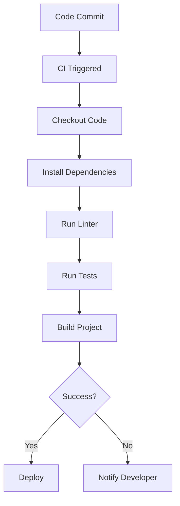

## 11.9 Continuous Integration for JavaScript Projects

In the world of software development, ensuring that your code is always in a deployable state is crucial. Continuous Integration (CI) is a practice that helps developers achieve this by automating the process of integrating code changes from multiple contributors. In this section, we will explore what CI is, its benefits, and how you can set up a CI pipeline for your JavaScript projects using popular tools like GitHub Actions, Travis CI, and Jenkins.

### What is Continuous Integration?

Continuous Integration is a development practice where developers frequently merge their code changes into a central repository, typically several times a day. Each merge triggers an automated build and testing process, allowing teams to detect problems early. The main goals of CI are to improve software quality and reduce the time it takes to deliver updates.

#### Benefits of Continuous Integration

1. **Early Bug Detection**: By integrating code frequently, you can catch bugs early in the development cycle, making them easier and less costly to fix.
2. **Improved Collaboration**: CI encourages developers to share their code and work together, reducing integration problems.
3. **Faster Feedback**: Automated tests provide immediate feedback on the impact of changes, allowing developers to address issues quickly.
4. **Consistent Builds**: Automated builds ensure that the software is built in a consistent environment, reducing "it works on my machine" issues.
5. **Enhanced Code Quality**: By integrating code quality tools into the CI process, teams can maintain high standards and avoid technical debt.

### Setting Up a CI Pipeline

To set up a CI pipeline, you need to choose a CI tool that fits your project's needs. Let's explore how to configure a CI pipeline using three popular tools: GitHub Actions, Travis CI, and Jenkins.

#### GitHub Actions

GitHub Actions is a CI/CD tool integrated directly into GitHub, making it a convenient choice for projects hosted on GitHub.

1. **Creating a Workflow File**: GitHub Actions uses YAML files to define workflows. Create a `.github/workflows/ci.yml` file in your repository.

   ```yaml
   name: CI

   on:
     push:
       branches: [main]
     pull_request:
       branches: [main]

   jobs:
     build:
       runs-on: ubuntu-latest

       steps:
       - name: Checkout code
         uses: actions/checkout@v2

       - name: Set up Node.js
         uses: actions/setup-node@v2
         with:
           node-version: '14'

       - name: Install dependencies
         run: npm install

       - name: Run tests
         run: npm test
   ```

   **Explanation**: This workflow triggers on pushes and pull requests to the `main` branch. It checks out the code, sets up Node.js, installs dependencies, and runs tests.

2. **Running Linters and Build Tasks**: You can extend the workflow to include linters and build tasks.

   ```yaml
   - name: Run linter
     run: npm run lint

   - name: Build project
     run: npm run build
   ```

   **Try It Yourself**: Modify the workflow to run additional scripts, such as code formatters or security checks.

#### Travis CI

Travis CI is a cloud-based CI service that integrates with GitHub repositories.

1. **Creating a `.travis.yml` File**: Define your CI configuration in a `.travis.yml` file at the root of your repository.

   ```yaml
   language: node_js
   node_js:
     - "14"

   script:
     - npm install
     - npm run lint
     - npm test
     - npm run build
   ```

   **Explanation**: This configuration specifies Node.js as the language and runs scripts to install dependencies, lint, test, and build the project.

2. **Integrating Code Coverage**: Use tools like `nyc` to generate code coverage reports and integrate them with Travis CI.

   ```yaml
   after_success:
     - npm run coverage
     - bash <(curl -s https://codecov.io/bash)
   ```

   **Try It Yourself**: Experiment with different Node.js versions to ensure compatibility.

#### Jenkins

Jenkins is an open-source automation server that can be used to build, test, and deploy software.

1. **Installing Jenkins**: Set up Jenkins on your local machine or server. Follow the [Jenkins installation guide](https://www.jenkins.io/doc/book/installing/) for detailed instructions.

2. **Creating a Jenkins Pipeline**: Use Jenkins' Pipeline feature to define your CI process.

   ```groovy
   pipeline {
       agent any

       stages {
           stage('Checkout') {
               steps {
                   checkout scm
               }
           }
           stage('Install Dependencies') {
               steps {
                   sh 'npm install'
               }
           }
           stage('Lint') {
               steps {
                   sh 'npm run lint'
               }
           }
           stage('Test') {
               steps {
                   sh 'npm test'
               }
           }
           stage('Build') {
               steps {
                   sh 'npm run build'
               }
           }
       }
   }
   ```

   **Explanation**: This Jenkinsfile defines a pipeline with stages for checking out code, installing dependencies, linting, testing, and building the project.

3. **Integrating Quality Checks**: Use plugins like Checkstyle and PMD to enforce code quality standards.

   **Try It Yourself**: Set up Jenkins to run on a schedule or trigger builds based on specific events.

### Integrating Code Coverage and Quality Checks

Code coverage and quality checks are essential components of a robust CI pipeline. They help ensure that your code is well-tested and adheres to quality standards.

#### Code Coverage

1. **Using Coverage Tools**: Tools like `nyc` (for JavaScript) can generate coverage reports. Integrate these reports into your CI pipeline to track test coverage over time.

   ```json
   // package.json
   "scripts": {
     "test": "nyc mocha"
   }
   ```

2. **Publishing Coverage Reports**: Use services like [Codecov](https://codecov.io/) or [Coveralls](https://coveralls.io/) to publish and visualize coverage reports.

   **Try It Yourself**: Set up a badge in your repository's README to display the current coverage percentage.

#### Code Quality Checks

1. **Linting**: Use ESLint to enforce coding standards and catch potential issues. Integrate ESLint into your CI pipeline to ensure code quality.

   ```json
   // package.json
   "scripts": {
     "lint": "eslint ."
   }
   ```

2. **Static Code Analysis**: Tools like SonarQube can analyze your code for bugs, vulnerabilities, and code smells. Integrate these tools into your CI process for comprehensive quality checks.

   **Try It Yourself**: Configure ESLint with a custom rule set and observe how it affects your codebase.

### Best Practices for Maintaining CI Configurations

1. **Keep Configurations Simple**: Avoid overly complex CI configurations. Keep your scripts and workflows straightforward and easy to understand.

2. **Use Environment Variables**: Store sensitive information like API keys and credentials in environment variables, not in your CI configuration files.

3. **Version Control Your CI Files**: Keep your CI configuration files in version control alongside your codebase. This practice ensures that changes to the CI process are tracked and can be reviewed.

4. **Regularly Update Dependencies**: Keep your CI tools and dependencies up to date to benefit from the latest features and security patches.

5. **Monitor Build Times**: Keep an eye on your build times and optimize your pipeline to reduce unnecessary delays.

### The Role of CI in Collaborative Projects

In collaborative projects, CI plays a vital role in ensuring that code from different contributors integrates smoothly. It helps prevent integration issues by providing a consistent and automated process for building and testing code.

1. **Facilitating Code Reviews**: CI can automatically run tests and checks on pull requests, providing feedback to reviewers and contributors.

2. **Encouraging Best Practices**: By automating quality checks, CI encourages developers to adhere to coding standards and best practices.

3. **Reducing Merge Conflicts**: Frequent integration and testing reduce the likelihood of merge conflicts, making collaboration smoother.

4. **Enhancing Team Productivity**: By automating repetitive tasks, CI frees up developers to focus on more critical work, boosting overall productivity.

### Visualizing a CI Pipeline

To better understand how a CI pipeline works, let's visualize the process using a flowchart.



**Description**: This flowchart illustrates a typical CI pipeline. After a code commit, the CI process is triggered, leading to code checkout, dependency installation, linting, testing, and building. If successful, the project is deployed; otherwise, the developer is notified of any issues.

### Conclusion

Continuous Integration is a powerful practice that enhances the development workflow by automating testing and deployment processes. By setting up a CI pipeline using tools like GitHub Actions, Travis CI, or Jenkins, you can ensure that your JavaScript projects are always in a deployable state. Remember to integrate code coverage and quality checks to maintain high standards and prevent technical debt. As you continue your journey in software development, embrace CI as a tool to improve collaboration, productivity, and code quality.

## Quiz Time!



### What is the main goal of Continuous Integration?

- [x] To improve software quality and reduce delivery time
- [ ] To increase the number of developers on a project
- [ ] To replace manual testing entirely
- [ ] To eliminate the need for code reviews

> **Explanation:** Continuous Integration aims to improve software quality by detecting issues early and reducing the time it takes to deliver updates.

### Which tool is integrated directly into GitHub for CI/CD?

- [x] GitHub Actions
- [ ] Travis CI
- [ ] Jenkins
- [ ] CircleCI

> **Explanation:** GitHub Actions is a CI/CD tool that is integrated directly into GitHub, making it convenient for projects hosted there.

### What file format does GitHub Actions use to define workflows?

- [x] YAML
- [ ] JSON
- [ ] XML
- [ ] INI

> **Explanation:** GitHub Actions uses YAML files to define workflows, which are easy to read and write.

### In Travis CI, where do you define your CI configuration?

- [x] .travis.yml
- [ ] travis.config
- [ ] ci.yml
- [ ] config.travis

> **Explanation:** Travis CI configurations are defined in a `.travis.yml` file located at the root of the repository.

### What is one benefit of using environment variables in CI configurations?

- [x] To store sensitive information securely
- [ ] To increase build speed
- [ ] To simplify code syntax
- [ ] To reduce the number of configuration files

> **Explanation:** Environment variables are used to store sensitive information like API keys securely, keeping them out of configuration files.

### What is a common tool used for code coverage in JavaScript projects?

- [x] nyc
- [ ] ESLint
- [ ] Prettier
- [ ] Babel

> **Explanation:** `nyc` is a popular tool for generating code coverage reports in JavaScript projects.

### What is the role of a linter in a CI pipeline?

- [x] To enforce coding standards and catch potential issues
- [ ] To deploy the application
- [ ] To generate code coverage reports
- [ ] To manage dependencies

> **Explanation:** A linter enforces coding standards and helps catch potential issues in the code, ensuring quality.

### Which of the following is NOT a benefit of Continuous Integration?

- [ ] Early bug detection
- [ ] Improved collaboration
- [ ] Faster feedback
- [x] Increased hardware costs

> **Explanation:** Continuous Integration provides early bug detection, improved collaboration, and faster feedback, but it does not inherently increase hardware costs.

### What is a Jenkins Pipeline used for?

- [x] To define the CI process with stages for building, testing, and deploying
- [ ] To manage database connections
- [ ] To write JavaScript code
- [ ] To create user interfaces

> **Explanation:** A Jenkins Pipeline is used to define the CI process, including stages for building, testing, and deploying the application.

### True or False: Continuous Integration eliminates the need for code reviews.

- [ ] True
- [x] False

> **Explanation:** Continuous Integration does not eliminate the need for code reviews; it complements them by automating testing and quality checks.


