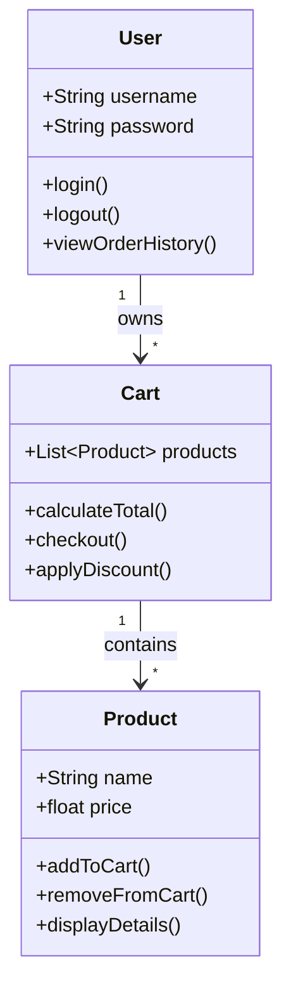
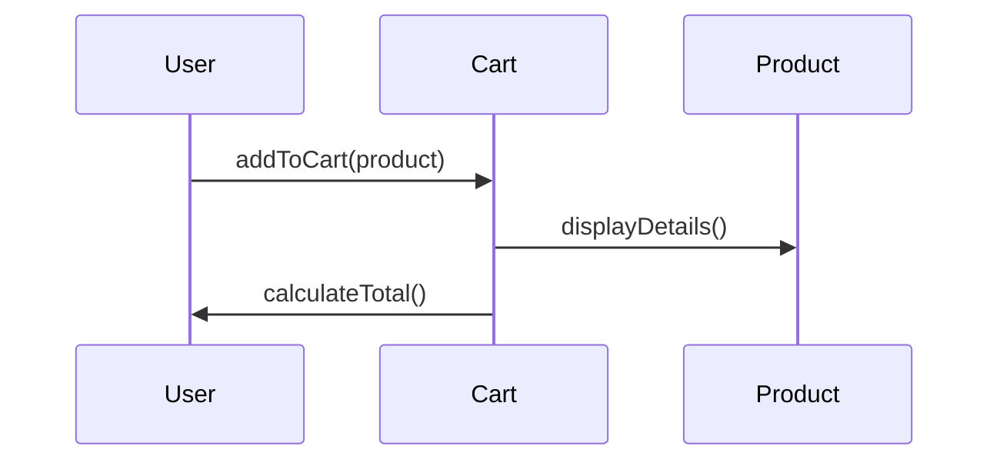

## 12.1 Designing an Application Using Object-Oriented Programming (OOP)

Designing an application using Object-Oriented Programming (OOP) principles in JavaScript involves a structured approach that helps in creating scalable, maintainable, and efficient software. This section will guide you through the process of designing an application from the ground up using OOP concepts. We'll cover everything from gathering requirements to modeling class hierarchies, and we'll introduce tools like UML diagrams to help visualize your design. Let's embark on this journey to build robust applications using OOP!

### Understanding the Basics of Application Design

Before diving into the specifics of OOP, it's essential to understand the general steps involved in designing any application. These steps provide a roadmap that guides the development process:

1. **Requirements Gathering**: This is the initial phase where you identify what the application needs to accomplish. Engage with stakeholders to understand their needs and document the requirements clearly.

2. **Identifying Entities and Behaviors**: Once you have the requirements, the next step is to identify the key entities (objects) and their behaviors (methods) that will form the backbone of your application.

3. **Modeling Class Hierarchies**: Organize these entities into classes and define their relationships. This involves creating a hierarchy that reflects real-world relationships and interactions.

4. **Design Patterns**: Utilize design patterns to solve common problems and improve the design of your application. Patterns provide proven solutions that can be adapted to your specific needs.

5. **Iteration and Flexibility**: Design is an iterative process. Be prepared to revisit and refine your design as new requirements emerge or as you gain a deeper understanding of the problem space.

### Step 1: Gathering Requirements

The first step in designing an application is to gather and understand the requirements. This involves communicating with stakeholders to determine what the application should do. Here are some key activities in this phase:

- **Conduct Interviews**: Talk to users, clients, and other stakeholders to gather insights into their needs and expectations.
- **Create Use Cases**: Document scenarios that describe how users will interact with the application.
- **Define Functional and Non-Functional Requirements**: Identify what the application must do (functional) and how it should perform (non-functional).

### Step 2: Identifying Entities and Behaviors

In OOP, entities are represented as objects, and their behaviors are encapsulated in methods. To identify these, consider the following:

- **Entities**: Determine the main objects in your application. For example, in a library management system, entities might include `Book`, `Member`, and `Librarian`.
- **Behaviors**: Identify what actions these entities can perform. For example, a `Book` might have behaviors like `borrow()`, `return()`, and `reserve()`.

#### Example: Identifying Entities and Behaviors

Let's consider a simple e-commerce application. Here are some potential entities and their behaviors:

- **Product**: `addToCart()`, `removeFromCart()`, `displayDetails()`
- **Cart**: `calculateTotal()`, `checkout()`, `applyDiscount()`
- **User**: `login()`, `logout()`, `viewOrderHistory()`

### Step 3: Modeling Class Hierarchies

Once you have identified the entities and behaviors, the next step is to organize them into classes and define their relationships. This involves creating a class hierarchy that reflects the real-world structure of your application.

#### Using UML Diagrams

Unified Modeling Language (UML) diagrams are a powerful tool for visualizing the design of an application. They help in representing classes, objects, and their interactions.



**Diagram Explanation**: This UML class diagram illustrates the relationships between `Product`, `Cart`, and `User` classes. The `Cart` class contains multiple `Product` objects, and a `User` can own multiple `Cart` instances.

### Step 4: Designing Class Interactions

In addition to modeling class hierarchies, it's crucial to define how these classes will interact with each other. This involves specifying the methods that classes will use to communicate and collaborate.

#### Example: Class Interactions

Continuing with our e-commerce example, let's define how the `Cart` and `Product` classes might interact:

```javascript
class Product {
    constructor(name, price) {
        this.name = name;
        this.price = price;
    }

    displayDetails() {
        console.log(`Product: ${this.name}, Price: $${this.price}`);
    }
}

class Cart {
    constructor() {
        this.products = [];
    }

    addToCart(product) {
        this.products.push(product);
        console.log(`${product.name} added to cart.`);
    }

    calculateTotal() {
        return this.products.reduce((total, product) => total + product.price, 0);
    }
}

// Usage
const product1 = new Product('Laptop', 1200);
const cart = new Cart();
cart.addToCart(product1);
console.log(`Total: $${cart.calculateTotal()}`);
```

**Code Explanation**: In this example, the `Cart` class interacts with the `Product` class by adding products to the cart and calculating the total price.

### Step 5: Utilizing Design Patterns

Design patterns are reusable solutions to common problems in software design. They provide a template for solving issues that developers frequently encounter. Here are some popular design patterns:

- **Singleton**: Ensures a class has only one instance and provides a global point of access to it.
- **Observer**: Defines a subscription mechanism to allow multiple objects to listen to and react to events.
- **Factory**: Provides an interface for creating objects in a superclass but allows subclasses to alter the type of objects that will be created.

#### Example: Using the Singleton Pattern

Let's implement a simple Singleton pattern for a configuration manager in our application:

```javascript
class ConfigurationManager {
    constructor() {
        if (ConfigurationManager.instance) {
            return ConfigurationManager.instance;
        }
        this.settings = {};
        ConfigurationManager.instance = this;
    }

    set(key, value) {
        this.settings[key] = value;
    }

    get(key) {
        return this.settings[key];
    }
}

// Usage
const config1 = new ConfigurationManager();
config1.set('theme', 'dark');

const config2 = new ConfigurationManager();
console.log(config2.get('theme')); // Output: dark
```

**Code Explanation**: The `ConfigurationManager` class ensures that only one instance exists. This is achieved by checking if an instance already exists in the constructor and returning it if it does.

### Step 6: Iteration and Flexibility

Designing an application is not a one-time activity. As you develop your application, you may discover new requirements or better ways to implement features. It's important to iterate on your design and remain flexible.

- **Refactor**: Regularly revisit and improve your code to enhance readability and performance.
- **Test**: Continuously test your application to ensure it meets the requirements and functions correctly.
- **Adapt**: Be open to changing your design as new insights and technologies emerge.

### Try It Yourself: Experiment with Code

To solidify your understanding, try modifying the code examples provided. Here are some suggestions:

- Add a `removeFromCart()` method to the `Cart` class.
- Implement a `User` class with methods for `login()` and `logout()`.
- Create a `Discount` class and integrate it with the `Cart` class to apply discounts.

### Visualizing Class Hierarchies and Interactions

To further aid your understanding, let's visualize how these classes interact in a sequence diagram:



**Diagram Explanation**: This sequence diagram shows the interaction between a `User`, `Cart`, and `Product`. The `User` adds a product to the cart, the cart displays product details, and then calculates the total.

### References and Links

For further reading and deeper dives into the topics covered, consider the following resources:

- [MDN Web Docs on Object-Oriented Programming](https://developer.mozilla.org/en-US/docs/Learn/JavaScript/Objects/Object-oriented_JS)
- [W3Schools JavaScript OOP](https://www.w3schools.com/js/js_object_oriented.asp)
- [UML Diagrams](https://www.uml-diagrams.org/)

### Knowledge Check

Before we wrap up, let's reinforce what we've learned with a few questions:

1. What are the key steps in designing an application using OOP?
2. How do UML diagrams help in visualizing class hierarchies?
3. What is the purpose of design patterns in software design?
4. Why is iteration important in application design?

### Embrace the Journey

Remember, designing an application using OOP is a journey. As you progress, you'll build more complex and interactive applications. Keep experimenting, stay curious, and enjoy the process of creating software that solves real-world problems!

## Quiz Time!



### What is the first step in designing an application using OOP?

- [x] Gathering requirements
- [ ] Modeling class hierarchies
- [ ] Identifying design patterns
- [ ] Writing code

> **Explanation:** Gathering requirements is the initial phase where you identify what the application needs to accomplish.

### Which tool is used for visualizing class hierarchies and interactions?

- [x] UML diagrams
- [ ] JSON
- [ ] CSS
- [ ] HTML

> **Explanation:** UML diagrams are used to represent classes, objects, and their interactions visually.

### What is the purpose of the Singleton design pattern?

- [x] To ensure a class has only one instance
- [ ] To allow multiple instances of a class
- [ ] To create a new instance each time
- [ ] To provide multiple points of access

> **Explanation:** The Singleton pattern ensures a class has only one instance and provides a global point of access to it.

### What does the `addToCart()` method do in the `Cart` class?

- [x] Adds a product to the cart
- [ ] Removes a product from the cart
- [ ] Calculates the total price
- [ ] Displays product details

> **Explanation:** The `addToCart()` method adds a product to the cart.

### Why is iteration important in application design?

- [x] To adapt to new requirements and improve design
- [ ] To finalize the design in one go
- [ ] To avoid changes in the design
- [ ] To ensure no changes are made

> **Explanation:** Iteration allows for adapting to new requirements and refining the design as needed.

### What is the role of behaviors in OOP?

- [x] Define actions that entities can perform
- [ ] Define the appearance of entities
- [ ] Define the storage of entities
- [ ] Define the deletion of entities

> **Explanation:** Behaviors in OOP define the actions that entities (objects) can perform.

### How does the `ConfigurationManager` class ensure only one instance exists?

- [x] By checking if an instance already exists in the constructor
- [ ] By creating a new instance each time
- [ ] By deleting previous instances
- [ ] By using multiple constructors

> **Explanation:** The `ConfigurationManager` class checks if an instance already exists in the constructor and returns it if it does.

### What is the benefit of using design patterns?

- [x] Provide reusable solutions to common problems
- [ ] Increase code complexity
- [ ] Limit code reuse
- [ ] Restrict application functionality

> **Explanation:** Design patterns provide reusable solutions to common problems in software design.

### What is the relationship between `Cart` and `Product` in the UML diagram?

- [x] Cart contains multiple Product objects
- [ ] Product contains multiple Cart objects
- [ ] Cart and Product are unrelated
- [ ] Cart is a subclass of Product

> **Explanation:** The UML diagram shows that the `Cart` class contains multiple `Product` objects.

### True or False: OOP design is a one-time activity and should not be revisited.

- [ ] True
- [x] False

> **Explanation:** OOP design is an iterative process, and it should be revisited and refined as needed.




