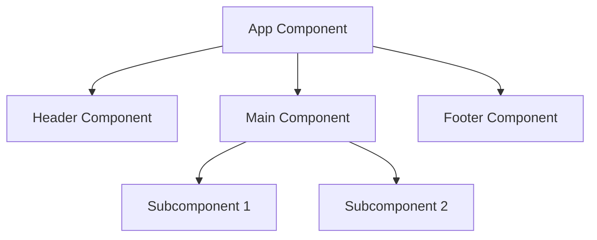

## 12.10 Case Studies of Successful OOP Implementations

In this section, we will delve into real-world examples of successful Object-Oriented Programming (OOP) implementations in JavaScript. By examining these case studies, we aim to provide you with insights into how OOP can be applied effectively in various projects, highlighting the benefits, challenges, and lessons learned. These examples will serve as inspiration and guidance as you embark on your own OOP journey.

### Case Study 1: React.js - A Component-Based Library

#### Overview

React.js, developed by Facebook, is a popular JavaScript library for building user interfaces, particularly for single-page applications. The primary objective of React is to provide a component-based architecture that promotes reusability and maintainability.

#### OOP Contribution

React leverages OOP principles by encapsulating UI elements into components. Each component is a self-contained unit with its own state and behavior, making it easy to manage complex UIs. React's use of classes (prior to the introduction of hooks) allowed developers to define component behavior using methods and lifecycle events.

#### Design Decisions and Challenges

- **Component Reusability**: React components can be reused across different parts of an application, reducing redundancy and improving consistency.
- **State Management**: Managing state within components can be challenging, especially in large applications. React introduced hooks to address some of these challenges by allowing functional components to manage state.
- **Virtual DOM**: React's virtual DOM efficiently updates the UI by minimizing direct manipulation of the real DOM, improving performance.

#### Lessons Learned

- **Encapsulation**: Encapsulating UI logic within components makes it easier to manage and scale applications.
- **Component Hierarchy**: Designing a clear component hierarchy is crucial for maintainability and performance.
- **State Management**: Effective state management is key to building responsive and dynamic applications.

#### Further Exploration

Explore React's documentation and tutorials to understand how OOP principles are applied in building scalable and maintainable UIs. [React Documentation](https://reactjs.org/docs/getting-started.html)

### Case Study 2: Node.js - Server-Side JavaScript

#### Overview

Node.js is a runtime environment that allows JavaScript to be used for server-side scripting. Its primary objective is to enable developers to build scalable network applications.

#### OOP Contribution

Node.js utilizes OOP principles to manage server-side operations. Modules in Node.js act as classes, encapsulating functionality and promoting code reuse. The event-driven architecture of Node.js also aligns with OOP concepts by allowing objects to handle events asynchronously.

#### Design Decisions and Challenges

- **Modular Architecture**: Node.js encourages a modular approach, where each module encapsulates specific functionality, making it easier to maintain and extend.
- **Asynchronous Programming**: Handling asynchronous operations is a core challenge in Node.js. OOP principles help structure code to manage callbacks and promises effectively.
- **Event Loop**: The event loop in Node.js is crucial for handling concurrent requests, and understanding its operation is key to building efficient applications.

#### Lessons Learned

- **Modularity**: Breaking down applications into modules enhances maintainability and scalability.
- **Asynchronous Handling**: Leveraging OOP to manage asynchronous operations leads to cleaner and more efficient code.
- **Event-Driven Design**: Designing applications around events can improve responsiveness and performance.

#### Further Exploration

Dive into Node.js tutorials and documentation to see how OOP principles are applied in server-side development. [Node.js Documentation](https://nodejs.org/en/docs/)

### Case Study 3: Angular - A Framework for Dynamic Web Apps

#### Overview

Angular, developed by Google, is a comprehensive framework for building dynamic web applications. It provides a robust set of tools and features for developing complex applications.

#### OOP Contribution

Angular heavily relies on OOP principles such as inheritance, encapsulation, and polymorphism. Components, services, and directives in Angular are designed as classes, promoting a structured and organized codebase.

#### Design Decisions and Challenges

- **Component-Based Architecture**: Angular's component-based architecture allows for the encapsulation of UI logic and promotes reusability.
- **Dependency Injection**: Angular's dependency injection system simplifies the management of dependencies and enhances testability.
- **Two-Way Data Binding**: While powerful, two-way data binding can introduce complexity and performance issues if not managed properly.

#### Lessons Learned

- **Structured Codebase**: A well-structured codebase using OOP principles enhances maintainability and scalability.
- **Dependency Management**: Effective dependency management is crucial for building testable and modular applications.
- **Performance Optimization**: Understanding the impact of data binding and optimizing performance is essential for building responsive applications.

#### Further Exploration

Explore Angular's documentation and resources to learn more about its OOP-based architecture. [Angular Documentation](https://angular.io/docs)

### Case Study 4: Three.js - 3D Graphics on the Web

#### Overview

Three.js is a JavaScript library that simplifies the creation of 3D graphics on the web. Its primary objective is to make WebGL easier to use for developers.

#### OOP Contribution

Three.js employs OOP principles to manage complex 3D scenes. Objects in Three.js, such as meshes, cameras, and lights, are represented as classes, allowing for easy manipulation and interaction.

#### Design Decisions and Challenges

- **Scene Graph**: Three.js uses a scene graph to organize and manage 3D objects, leveraging OOP to encapsulate properties and behaviors.
- **Performance Optimization**: Rendering 3D graphics efficiently requires careful management of resources and optimization techniques.
- **Cross-Browser Compatibility**: Ensuring consistent performance across different browsers can be challenging.

#### Lessons Learned

- **Encapsulation**: Encapsulating 3D objects and their behaviors simplifies scene management and interaction.
- **Resource Management**: Efficient resource management is crucial for rendering complex scenes smoothly.
- **Cross-Platform Development**: Testing and optimizing for different platforms ensures a consistent user experience.

#### Further Exploration

Discover more about Three.js and its applications in creating interactive 3D experiences. [Three.js Documentation](https://threejs.org/docs/)

### Case Study 5: Electron - Building Cross-Platform Desktop Apps

#### Overview

Electron is a framework that allows developers to build cross-platform desktop applications using web technologies. It combines Chromium and Node.js to create a seamless development experience.

#### OOP Contribution

Electron leverages OOP principles to manage application components and interactions. The use of classes and modules helps organize code and manage the complexity of desktop applications.

#### Design Decisions and Challenges

- **Cross-Platform Compatibility**: Electron abstracts platform-specific details, allowing developers to focus on application logic.
- **Resource Management**: Managing resources efficiently is crucial for building performant desktop applications.
- **Security Considerations**: Ensuring application security is a significant challenge when building desktop apps with web technologies.

#### Lessons Learned

- **Code Organization**: Organizing code using OOP principles enhances maintainability and scalability.
- **Platform Abstraction**: Abstracting platform-specific details simplifies cross-platform development.
- **Security Best Practices**: Implementing security best practices is essential for protecting user data and application integrity.

#### Further Exploration

Explore Electron's documentation and resources to learn more about building cross-platform desktop applications. [Electron Documentation](https://www.electronjs.org/docs)

### Case Study 6: D3.js - Data-Driven Documents

#### Overview

D3.js is a JavaScript library for creating dynamic and interactive data visualizations. Its primary objective is to bring data to life using HTML, SVG, and CSS.

#### OOP Contribution

D3.js utilizes OOP principles to manage complex data visualizations. By encapsulating data and visualization logic into reusable components, D3.js allows developers to create sophisticated visualizations with ease.

#### Design Decisions and Challenges

- **Data Binding**: D3.js's data binding capabilities allow for dynamic updates and interactions with data.
- **Scalability**: Creating scalable visualizations that perform well with large datasets can be challenging.
- **Cross-Browser Compatibility**: Ensuring visualizations work consistently across different browsers requires careful testing and optimization.

#### Lessons Learned

- **Data Encapsulation**: Encapsulating data and visualization logic simplifies the creation and management of complex visualizations.
- **Performance Optimization**: Optimizing performance is crucial for handling large datasets and ensuring smooth interactions.
- **Cross-Platform Testing**: Testing across different platforms ensures consistent and reliable visualizations.

#### Further Exploration

Discover more about D3.js and its applications in creating interactive data visualizations. [D3.js Documentation](https://d3js.org/)

### Visualizing OOP Concepts in Case Studies

To better understand how OOP principles are applied in these case studies, let's visualize the component-based architecture used in React.js and Angular.

**Figure 1: Component Hierarchy in React.js and Angular**

This diagram illustrates how components are organized in a hierarchy, encapsulating UI logic and promoting reusability.

### Encouragement and Exploration

As you explore these case studies, remember that OOP is a powerful tool for building scalable and maintainable applications. By understanding how successful projects leverage OOP principles, you can apply these insights to your own projects. Keep experimenting, stay curious, and enjoy the journey of mastering OOP in JavaScript.

### Knowledge Check

To reinforce your understanding, consider the following questions:

- How does React.js use OOP principles to manage UI components?
- What challenges does Node.js address with its modular architecture?
- How does Angular's dependency injection system enhance testability?
- What are the benefits of using a scene graph in Three.js?
- How does Electron simplify cross-platform development?

### Summary

In this section, we explored several real-world examples of successful OOP implementations in JavaScript. By examining these case studies, we gained insights into how OOP principles can be applied effectively to build scalable, maintainable, and performant applications. As you continue your journey in mastering OOP, remember to draw inspiration from these examples and apply the lessons learned to your own projects.

## Quiz Time!



### How does React.js utilize OOP principles?

- [x] By encapsulating UI elements into components
- [ ] By using only functional programming
- [ ] By avoiding the use of classes
- [ ] By focusing solely on procedural programming

> **Explanation:** React.js uses OOP principles by encapsulating UI elements into components, allowing for reusability and maintainability.

### What is a key challenge addressed by Node.js's modular architecture?

- [x] Managing server-side operations
- [ ] Handling synchronous operations
- [ ] Avoiding the use of events
- [ ] Simplifying client-side scripting

> **Explanation:** Node.js's modular architecture helps manage server-side operations by encapsulating functionality into modules.

### How does Angular's dependency injection system benefit developers?

- [x] It enhances testability and simplifies dependency management
- [ ] It complicates the codebase
- [ ] It eliminates the need for components
- [ ] It reduces the use of services

> **Explanation:** Angular's dependency injection system enhances testability and simplifies dependency management, making applications more modular and testable.

### What is the purpose of a scene graph in Three.js?

- [x] To organize and manage 3D objects
- [ ] To handle server-side operations
- [ ] To simplify data binding
- [ ] To manage user authentication

> **Explanation:** A scene graph in Three.js organizes and manages 3D objects, allowing for efficient rendering and interaction.

### How does Electron facilitate cross-platform development?

- [x] By abstracting platform-specific details
- [ ] By focusing on mobile development only
- [ ] By using only native code
- [ ] By avoiding web technologies

> **Explanation:** Electron facilitates cross-platform development by abstracting platform-specific details, allowing developers to focus on application logic.

### What is a benefit of using D3.js for data visualizations?

- [x] Dynamic updates and interactions with data
- [ ] Simplifying server-side scripting
- [ ] Eliminating the need for HTML and CSS
- [ ] Focusing solely on static images

> **Explanation:** D3.js allows for dynamic updates and interactions with data, making it ideal for creating interactive data visualizations.

### What is a key lesson learned from React.js's component-based architecture?

- [x] Encapsulation of UI logic enhances maintainability
- [ ] Avoiding the use of components
- [ ] Focusing solely on procedural programming
- [ ] Eliminating the use of classes

> **Explanation:** React.js's component-based architecture demonstrates that encapsulating UI logic enhances maintainability and scalability.

### How does Node.js handle asynchronous operations effectively?

- [x] By leveraging OOP to manage callbacks and promises
- [ ] By avoiding the use of events
- [ ] By focusing on synchronous operations
- [ ] By eliminating the use of modules

> **Explanation:** Node.js handles asynchronous operations effectively by leveraging OOP to manage callbacks and promises, resulting in cleaner code.

### What is a challenge when using two-way data binding in Angular?

- [x] It can introduce complexity and performance issues
- [ ] It simplifies all aspects of development
- [ ] It eliminates the need for components
- [ ] It focuses solely on server-side scripting

> **Explanation:** Two-way data binding in Angular can introduce complexity and performance issues if not managed properly.

### True or False: OOP principles are only applicable to front-end development.

- [ ] True
- [x] False

> **Explanation:** OOP principles are applicable to both front-end and back-end development, as demonstrated by the case studies in this section.


