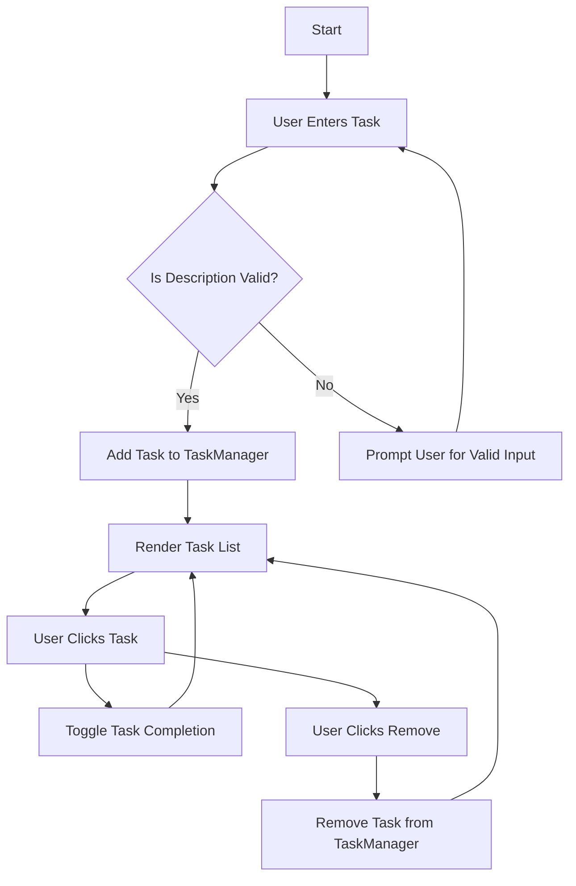

## 12.2 Building a Todo App with Classes

Welcome to an exciting chapter where we will apply Object-Oriented Programming (OOP) concepts to build a practical and interactive Todo App using JavaScript. This project will not only solidify your understanding of classes and objects but also demonstrate how OOP can enhance code organization and scalability.

### Project Scope and Objectives

Before we dive into the code, let's outline what we aim to achieve with this project:

- **Objective**: Develop a Todo application that allows users to add, delete, and manage tasks efficiently.
- **Scope**: Implement core functionalities using JavaScript classes, focusing on task management and user interaction.
- **Outcome**: Gain hands-on experience with OOP principles, such as encapsulation, inheritance, and polymorphism, in a real-world application.

### Setting Up the Project

To get started, ensure you have a basic HTML file to serve as the user interface. We'll use this to interact with our JavaScript code. Here's a simple setup:

```html
<!DOCTYPE html>
<html lang="en">
<head>
    <meta charset="UTF-8">
    <meta name="viewport" content="width=device-width, initial-scale=1.0">
    <title>Todo App</title>
    <link rel="stylesheet" href="styles.css">
</head>
<body>
    <div id="app">
        <h1>Todo List</h1>
        <input type="text" id="taskInput" placeholder="Enter a new task">
        <button id="addTaskButton">Add Task</button>
        <ul id="taskList"></ul>
    </div>
    <script src="app.js"></script>
</body>
</html>
```

### Creating Classes for Tasks and Task Management

Let's begin by defining the core classes for our Todo app. We'll start with a `Task` class to represent individual tasks and a `TaskManager` class to handle task operations.

#### Task Class

The `Task` class will encapsulate properties and methods related to a single task. Here's how you can define it:

```javascript
class Task {
    constructor(description) {
        this.description = description;
        this.completed = false; // Default state of a task
    }

    toggleCompletion() {
        this.completed = !this.completed;
    }
}
```

- **Constructor**: Initializes a task with a description and a default `completed` status of `false`.
- **toggleCompletion Method**: Toggles the task's completion status.

#### TaskManager Class

The `TaskManager` class will manage a collection of tasks, providing methods to add, remove, and display tasks.

```javascript
class TaskManager {
    constructor() {
        this.tasks = [];
    }

    addTask(description) {
        const task = new Task(description);
        this.tasks.push(task);
    }

    removeTask(index) {
        this.tasks.splice(index, 1);
    }

    getTasks() {
        return this.tasks;
    }
}
```

- **Constructor**: Initializes an empty array to store tasks.
- **addTask Method**: Creates a new `Task` and adds it to the list.
- **removeTask Method**: Removes a task by its index.
- **getTasks Method**: Returns the list of tasks.

### Integrating with the User Interface

Now that we have our classes, let's integrate them with the HTML interface to allow user interaction.

#### Adding Event Listeners

We'll add event listeners to handle user actions, such as adding and removing tasks.

```javascript
const taskInput = document.getElementById('taskInput');
const addTaskButton = document.getElementById('addTaskButton');
const taskList = document.getElementById('taskList');

const taskManager = new TaskManager();

addTaskButton.addEventListener('click', () => {
    const description = taskInput.value.trim();
    if (description) {
        taskManager.addTask(description);
        taskInput.value = '';
        renderTasks();
    }
});

function renderTasks() {
    taskList.innerHTML = '';
    taskManager.getTasks().forEach((task, index) => {
        const li = document.createElement('li');
        li.textContent = task.description;
        li.addEventListener('click', () => {
            task.toggleCompletion();
            renderTasks();
        });

        const removeButton = document.createElement('button');
        removeButton.textContent = 'Remove';
        removeButton.addEventListener('click', () => {
            taskManager.removeTask(index);
            renderTasks();
        });

        li.appendChild(removeButton);
        taskList.appendChild(li);
    });
}
```

- **Event Listeners**: Handle clicks on the "Add Task" button and task items.
- **renderTasks Function**: Updates the task list display, reflecting changes in task completion and removal.

### Encouraging Enhancements

Now that you have a basic Todo app, consider adding more features to enhance its functionality:

- **Deadlines**: Add a date property to tasks and display upcoming deadlines.
- **Categories**: Allow users to categorize tasks for better organization.
- **Persistence**: Use local storage to save tasks between sessions.

### Visualizing the Task Management Process

To better understand the flow of task management, let's use a flowchart to visualize the process.



This flowchart illustrates how tasks are added, toggled, and removed within the application.

### How OOP Principles Improve Code Organization and Scalability

By using OOP principles, our Todo app benefits from:

- **Encapsulation**: Each task's data and behavior are contained within the `Task` class, making it easier to manage and modify.
- **Modularity**: The `TaskManager` class separates task management logic from the user interface, promoting clean and organized code.
- **Scalability**: As the app grows, we can easily add new features or modify existing ones without disrupting the entire codebase.

### Try It Yourself

Now it's your turn! Experiment with the code by:

- Adding new features like task priorities or notifications.
- Refactoring the code to use ES6 modules for better organization.
- Implementing a search function to filter tasks by keywords.

### Knowledge Check

Before we wrap up, let's review some key concepts:

- **What is the purpose of the `Task` class?**
- **How does the `TaskManager` class manage tasks?**
- **What are the benefits of using OOP in this project?**

### Summary

In this section, we've built a functional Todo app using JavaScript classes, demonstrating how OOP can enhance code structure and maintainability. By encapsulating task-related logic within classes, we've created a scalable and organized codebase that can be easily extended with new features.

Remember, this is just the beginning. As you progress, you'll build more complex and interactive applications. Keep experimenting, stay curious, and enjoy the journey!

## Quiz Time!



### What is the primary role of the `Task` class in our Todo app?

- [x] To encapsulate properties and methods related to a single task.
- [ ] To manage the entire list of tasks.
- [ ] To handle user input and interface interactions.
- [ ] To store application settings.

> **Explanation:** The `Task` class is responsible for representing individual tasks, including their properties and behaviors.

### How does the `TaskManager` class improve code organization?

- [x] By separating task management logic from the user interface.
- [ ] By storing user preferences.
- [ ] By rendering the task list on the page.
- [ ] By handling network requests.

> **Explanation:** The `TaskManager` class isolates the logic for managing tasks, promoting clean and organized code.

### Which method in the `Task` class is used to change a task's completion status?

- [x] `toggleCompletion()`
- [ ] `addTask()`
- [ ] `removeTask()`
- [ ] `getTasks()`

> **Explanation:** The `toggleCompletion()` method is used to switch the task's completion status between true and false.

### What is the purpose of the `renderTasks` function?

- [x] To update the task list display based on the current state of tasks.
- [ ] To add new tasks to the list.
- [ ] To remove tasks from the list.
- [ ] To store tasks in local storage.

> **Explanation:** The `renderTasks` function is responsible for updating the visual representation of the task list.

### What OOP principle is demonstrated by the `Task` and `TaskManager` classes?

- [x] Encapsulation
- [ ] Inheritance
- [ ] Polymorphism
- [ ] Abstraction

> **Explanation:** Encapsulation is demonstrated by containing task-related logic within the `Task` and `TaskManager` classes.

### What additional feature could you add to the Todo app to enhance functionality?

- [x] Task deadlines
- [ ] User authentication
- [ ] Real-time chat
- [ ] Video streaming

> **Explanation:** Adding task deadlines would enhance the app's functionality by allowing users to track due dates.

### How can you make the Todo app's tasks persist between sessions?

- [x] By using local storage to save tasks.
- [ ] By storing tasks in a database.
- [ ] By using cookies.
- [ ] By implementing a server-side script.

> **Explanation:** Local storage can be used to save tasks, ensuring they persist between browser sessions.

### What is a benefit of using ES6 modules in the Todo app?

- [x] Improved code organization and reusability.
- [ ] Faster rendering of the task list.
- [ ] Enhanced user interface design.
- [ ] Increased network speed.

> **Explanation:** ES6 modules help organize code into reusable components, improving maintainability.

### Which event listener is used to handle adding tasks in the app?

- [x] Click event on the "Add Task" button.
- [ ] Keypress event on the task input field.
- [ ] Mouseover event on the task list.
- [ ] Scroll event on the page.

> **Explanation:** The click event on the "Add Task" button triggers the addition of new tasks.

### True or False: The Todo app demonstrates the use of inheritance in JavaScript.

- [ ] True
- [x] False

> **Explanation:** The Todo app primarily demonstrates encapsulation and modularity, not inheritance.




