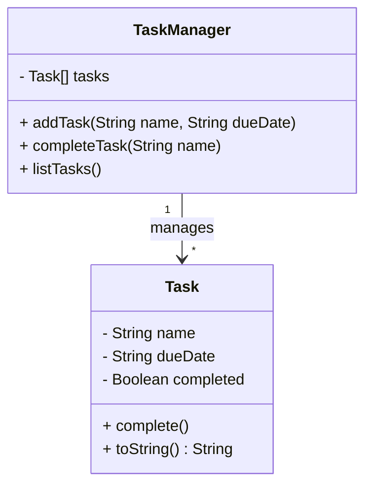

## 12.3 Refactoring Existing Codebase to Use OOP

Refactoring a codebase from a procedural to an object-oriented approach can significantly enhance its maintainability, scalability, and readability. In this section, we will explore why refactoring to Object-Oriented Programming (OOP) is beneficial, provide a systematic approach to refactoring, and demonstrate how to convert functions into class methods. We will also discuss strategies to minimize disruption during the refactoring process and emphasize the importance of testing and documentation.

### Why Refactor to OOP?

Before diving into the refactoring process, it's essential to understand why transitioning to OOP can be advantageous:

1. **Improved Code Organization**: OOP allows you to structure your code into classes and objects, making it easier to manage and navigate.

2. **Reusability**: By encapsulating functionality within classes, you can reuse code more efficiently across different parts of your application.

3. **Scalability**: OOP provides a framework that can be easily extended as your application grows, allowing for the addition of new features without disrupting existing code.

4. **Maintainability**: With clear class hierarchies and encapsulated logic, OOP makes it easier to maintain and update your codebase.

5. **Abstraction**: OOP enables you to hide complex logic behind simple interfaces, making your code easier to understand and use.

### When to Refactor to OOP?

Refactoring to OOP is not always necessary. Here are some situations where it might be beneficial:

- **Complexity**: If your procedural codebase has grown complex and difficult to manage, refactoring to OOP can help simplify it.
- **Duplication**: When you notice repeated code patterns, OOP can help you encapsulate these patterns into reusable classes.
- **Scalability Needs**: If you anticipate adding new features or scaling your application, OOP provides a more flexible structure.
- **Team Collaboration**: OOP can make it easier for multiple developers to work on the same codebase by providing clear boundaries and responsibilities.

### Systematic Approach to Refactoring

Refactoring a codebase to OOP involves several steps. Let's break down the process:

#### 1. Identify Reusable Logic

Begin by identifying parts of your code that can be encapsulated into classes. Look for:

- **Repeated Code**: Functions or blocks of code that appear multiple times.
- **Related Functions**: Functions that operate on the same data or perform similar tasks.
- **Complex Data Structures**: Objects or arrays that could benefit from encapsulation.

#### 2. Define Classes and Objects

Once you've identified reusable logic, define classes to encapsulate this functionality. Consider:

- **Class Responsibilities**: Each class should have a single responsibility or purpose.
- **Data and Methods**: Determine what data (properties) and methods (functions) belong to each class.
- **Relationships**: Identify relationships between classes, such as inheritance or composition.

#### 3. Convert Functions to Class Methods

Transform procedural functions into methods within your classes. This involves:

- **Moving Functions**: Relocate functions into the appropriate class.
- **Using `this`**: Replace global variables with class properties accessed via `this`.
- **Refactoring Logic**: Adjust logic to work within the class context.

#### 4. Minimize Disruption

To minimize disruption during refactoring:

- **Refactor Incrementally**: Change one part of the codebase at a time to avoid introducing errors.
- **Maintain Backward Compatibility**: Ensure existing functionality remains intact during the transition.
- **Use Feature Flags**: Implement feature flags to toggle between old and new implementations.

#### 5. Emphasize Testing

Testing is crucial during refactoring to ensure that your code continues to work as expected:

- **Write Unit Tests**: Create tests for each class and method to verify their functionality.
- **Use Test-Driven Development (TDD)**: Consider writing tests before refactoring to guide your changes.
- **Automate Testing**: Use automated testing tools to run tests frequently and catch errors early.

#### 6. Document Changes

Finally, document your changes to help others understand the new structure:

- **Update Documentation**: Revise any existing documentation to reflect the new class structure.
- **Comment Code**: Add comments to explain complex logic or decisions made during refactoring.
- **Communicate with Team**: Keep your team informed about changes and how they impact the codebase.

### Example: Refactoring a Procedural Codebase

Let's walk through an example of refactoring a simple procedural codebase to OOP. We'll start with a basic task management application.

#### Procedural Code Example

```javascript
// Procedural approach
let tasks = [];

function addTask(name, dueDate) {
    tasks.push({ name, dueDate, completed: false });
}

function completeTask(name) {
    const task = tasks.find(task => task.name === name);
    if (task) {
        task.completed = true;
    }
}

function listTasks() {
    tasks.forEach(task => {
        console.log(`${task.name} - Due: ${task.dueDate} - Completed: ${task.completed}`);
    });
}

// Usage
addTask("Write report", "2024-11-20");
addTask("Submit assignment", "2024-11-22");
completeTask("Write report");
listTasks();
```

#### Refactoring to OOP

We'll refactor the above code to use classes and objects.

```javascript
// Object-Oriented approach
class Task {
    constructor(name, dueDate) {
        this.name = name;
        this.dueDate = dueDate;
        this.completed = false;
    }

    complete() {
        this.completed = true;
    }

    toString() {
        return `${this.name} - Due: ${this.dueDate} - Completed: ${this.completed}`;
    }
}

class TaskManager {
    constructor() {
        this.tasks = [];
    }

    addTask(name, dueDate) {
        const task = new Task(name, dueDate);
        this.tasks.push(task);
    }

    completeTask(name) {
        const task = this.tasks.find(task => task.name === name);
        if (task) {
            task.complete();
        }
    }

    listTasks() {
        this.tasks.forEach(task => {
            console.log(task.toString());
        });
    }
}

// Usage
const taskManager = new TaskManager();
taskManager.addTask("Write report", "2024-11-20");
taskManager.addTask("Submit assignment", "2024-11-22");
taskManager.completeTask("Write report");
taskManager.listTasks();
```

### Visualizing the Refactoring Process

To better understand the refactoring process, let's visualize the transition from procedural to object-oriented code using a class diagram.



**Diagram Description**: The class diagram above illustrates the relationship between the `TaskManager` and `Task` classes. The `TaskManager` class manages multiple `Task` instances, encapsulating the functionality of adding, completing, and listing tasks.

### Try It Yourself

Now that we've refactored a simple task management application, try experimenting with the code:

- **Add New Features**: Implement a method to remove tasks from the list.
- **Enhance Task Details**: Add additional properties to the `Task` class, such as priority or category.
- **Improve User Interaction**: Modify the `listTasks` method to display tasks in a more user-friendly format.

### Knowledge Check

Let's reinforce what we've learned with a few questions:

- What are the benefits of refactoring to OOP?
- How can you identify reusable logic in a procedural codebase?
- What steps can you take to minimize disruption during refactoring?
- Why is testing important during the refactoring process?

### Embrace the Journey

Remember, refactoring is an ongoing process that requires patience and practice. As you continue to refactor your codebase, you'll gain a deeper understanding of OOP principles and how they can improve your applications. Keep experimenting, stay curious, and enjoy the journey!

### References and Links

For further reading on refactoring and OOP, check out these resources:

- [MDN Web Docs: Object-Oriented Programming](https://developer.mozilla.org/en-US/docs/Learn/JavaScript/Objects/Object-oriented_JS)
- [Refactoring Guru: Refactoring Techniques](https://refactoring.guru/refactoring/techniques)
- [W3Schools: JavaScript Classes](https://www.w3schools.com/js/js_classes.asp)

## Quiz Time!



### What is one of the main benefits of refactoring a codebase to use OOP?

- [x] Improved code organization
- [ ] Increased code complexity
- [ ] Reduced code readability
- [ ] Slower application performance

> **Explanation:** Refactoring to OOP improves code organization by structuring code into classes and objects, making it easier to manage and navigate.

### When might it be beneficial to refactor a codebase to OOP?

- [x] When the codebase has grown complex and difficult to manage
- [ ] When the codebase is simple and easy to understand
- [ ] When there are no repeated code patterns
- [ ] When the application does not need to scale

> **Explanation:** Refactoring to OOP is beneficial when the codebase is complex, has repeated patterns, or needs to scale.

### What is the first step in the systematic approach to refactoring?

- [x] Identify reusable logic
- [ ] Convert functions to class methods
- [ ] Define classes and objects
- [ ] Minimize disruption

> **Explanation:** The first step in refactoring is to identify parts of the code that can be encapsulated into classes.

### How can you minimize disruption during the refactoring process?

- [x] Refactor incrementally
- [ ] Change everything at once
- [ ] Ignore backward compatibility
- [ ] Avoid using feature flags

> **Explanation:** Refactoring incrementally helps minimize disruption by allowing you to change one part of the codebase at a time.

### Why is testing important during refactoring?

- [x] To ensure functionality remains intact
- [ ] To make the code more complex
- [ ] To remove errors from the codebase
- [ ] To increase code duplication

> **Explanation:** Testing ensures that the code continues to work as expected and that functionality remains intact during refactoring.

### What should you do after refactoring a codebase?

- [x] Document changes
- [ ] Delete old code
- [ ] Ignore any errors
- [ ] Avoid communicating with the team

> **Explanation:** Documenting changes helps others understand the new structure and keeps the team informed.

### What is the purpose of the `TaskManager` class in the refactored code example?

- [x] To manage multiple `Task` instances
- [ ] To perform calculations
- [ ] To store user input
- [ ] To handle network requests

> **Explanation:** The `TaskManager` class manages multiple `Task` instances, encapsulating the functionality of adding, completing, and listing tasks.

### What does the `complete` method do in the `Task` class?

- [x] Marks the task as completed
- [ ] Deletes the task
- [ ] Adds a new task
- [ ] Lists all tasks

> **Explanation:** The `complete` method marks the task as completed by setting the `completed` property to `true`.

### How can you enhance the `Task` class in the refactored code example?

- [x] Add additional properties like priority or category
- [ ] Remove existing properties
- [ ] Simplify the `toString` method
- [ ] Ignore user input

> **Explanation:** Enhancing the `Task` class by adding additional properties like priority or category can improve task management.

### True or False: Refactoring is a one-time process that does not require ongoing maintenance.

- [ ] True
- [x] False

> **Explanation:** Refactoring is an ongoing process that requires continuous maintenance and improvement to keep the codebase efficient and manageable.


