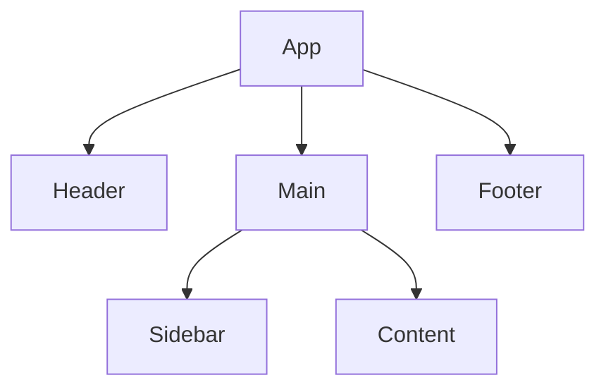

## 12.4 OOP in Front-End Frameworks

In this section, we will delve into how Object-Oriented Programming (OOP) is applied within popular front-end frameworks like React, Angular, and Vue.js. These frameworks have revolutionized the way we build web applications by providing powerful abstractions and tools that leverage OOP principles. Understanding how these frameworks incorporate OOP can enhance your ability to write clean, maintainable, and scalable code.

### Introduction to Front-End Frameworks

Front-end frameworks are libraries that help developers build complex user interfaces efficiently. They provide a structured way to manage the user interface and its interactions, making it easier to develop dynamic and responsive web applications. Let's introduce three of the most popular front-end frameworks: React, Angular, and Vue.js.

#### React

React is a JavaScript library for building user interfaces, developed by Facebook. It emphasizes a component-based architecture where the UI is divided into reusable pieces called components. React utilizes a virtual DOM to optimize rendering performance and allows developers to manage state efficiently.

#### Angular

Angular is a comprehensive framework developed by Google. It provides a robust set of tools for building single-page applications (SPAs). Angular uses TypeScript, a superset of JavaScript, and follows a component-based architecture similar to React. It also includes features like dependency injection, two-way data binding, and a powerful template syntax.

#### Vue.js

Vue.js is a progressive JavaScript framework for building user interfaces. It is designed to be incrementally adoptable, meaning you can use as much or as little of it as you need. Vue.js combines the best features of React and Angular, offering a flexible and approachable solution for building web applications.

### OOP Principles in Front-End Frameworks

Front-end frameworks incorporate several OOP principles, including encapsulation, inheritance, and polymorphism. Let's explore how each framework utilizes these principles.

#### Encapsulation

Encapsulation is the concept of bundling data and methods that operate on that data within a single unit, such as a class or component. In front-end frameworks, encapsulation is achieved through components.

- **React**: Components in React encapsulate their state and behavior. Each component manages its own state and can have its own methods. This encapsulation allows components to be reused across different parts of an application.

- **Angular**: Angular components encapsulate their logic and view. Each component has its own template, styles, and behavior, making it a self-contained unit.

- **Vue.js**: Vue components encapsulate data, methods, and computed properties. They provide a clear separation between the view and the logic, promoting reusability and maintainability.

#### Inheritance

Inheritance allows one class to inherit properties and methods from another class. While classical inheritance is not as common in front-end frameworks, they often use a form of composition to achieve similar results.

- **React**: React encourages composition over inheritance. Components can be composed together to build complex UIs. Higher-order components (HOCs) and render props are patterns that allow components to share behavior.

- **Angular**: Angular uses services and dependency injection to share functionality across components. While inheritance is possible, it is often more common to use services to encapsulate shared logic.

- **Vue.js**: Vue supports mixins, which allow you to share functionality across components. Mixins can be thought of as a form of inheritance, where a component can inherit methods and data from a mixin.

#### Polymorphism

Polymorphism allows objects to be treated as instances of their parent class. In front-end frameworks, polymorphism is often achieved through interfaces and abstract classes.

- **React**: React components can be polymorphic through the use of props. Different components can accept the same props and render them in different ways, allowing for flexible and reusable components.

- **Angular**: Angular's dependency injection system allows for polymorphic behavior. Services can be injected into components, and different implementations of a service can be provided at runtime.

- **Vue.js**: Vue components can be polymorphic through the use of slots and scoped slots. These features allow components to accept content from their parent and render it in different ways.

### Defining Components Using Classes

In front-end frameworks, components are often defined using classes. Let's explore how each framework uses classes to define components.

#### React Class Components

In React, components can be defined as classes or functions. Class components are defined using ES6 classes and extend the `React.Component` class.

```javascript
import React from 'react';

class MyComponent extends React.Component {
  constructor(props) {
    super(props);
    this.state = {
      count: 0
    };
  }

  increment = () => {
    this.setState({ count: this.state.count + 1 });
  };

  render() {
    return (
      <div>
        <p>Count: {this.state.count}</p>
        <button onClick={this.increment}>Increment</button>
      </div>
    );
  }
}

export default MyComponent;
```

In this example, `MyComponent` is a class component that manages its own state. The `increment` method updates the state, and the `render` method returns the component's UI.

#### Angular Components

In Angular, components are defined using classes and decorators. The `@Component` decorator is used to define metadata for the component.

```typescript
import { Component } from '@angular/core';

@Component({
  selector: 'app-my-component',
  template: `
    <div>
      <p>Count: {{ count }}</p>
      <button (click)="increment()">Increment</button>
    </div>
  `
})
export class MyComponent {
  count = 0;

  increment() {
    this.count++;
  }
}
```

In this example, `MyComponent` is an Angular component with a template and a class that manages the component's state and behavior.

#### Vue.js Components

In Vue.js, components can be defined using the `Vue.extend` method or the `Vue.component` method. With the introduction of Vue 3, components can also be defined using the Composition API.

```javascript
Vue.component('my-component', {
  data() {
    return {
      count: 0
    };
  },
  methods: {
    increment() {
      this.count++;
    }
  },
  template: `
    <div>
      <p>Count: {{ count }}</p>
      <button @click="increment">Increment</button>
    </div>
  `
});
```

In this example, `my-component` is a Vue component defined using the `Vue.component` method. It manages its own state and behavior.

### State Management and Data Binding

State management and data binding are crucial aspects of front-end development. Let's explore how each framework handles these concepts.

#### React State Management

React components manage their own state using the `useState` hook or the `this.state` property in class components. State changes trigger re-renders, updating the UI.

```javascript
import React, { useState } from 'react';

function MyComponent() {
  const [count, setCount] = useState(0);

  return (
    <div>
      <p>Count: {count}</p>
      <button onClick={() => setCount(count + 1)}>Increment</button>
    </div>
  );
}

export default MyComponent;
```

In this example, the `useState` hook is used to manage the component's state. The `setCount` function updates the state, triggering a re-render.

#### Angular Data Binding

Angular provides powerful data binding features, including one-way and two-way data binding. One-way data binding binds data from the component to the view, while two-way data binding synchronizes data between the component and the view.

```typescript
import { Component } from '@angular/core';

@Component({
  selector: 'app-my-component',
  template: `
    <div>
      <p>Count: {{ count }}</p>
      <button (click)="increment()">Increment</button>
    </div>
  `
})
export class MyComponent {
  count = 0;

  increment() {
    this.count++;
  }
}
```

In this example, Angular's interpolation syntax (`{{ count }}`) is used for one-way data binding. The `(click)` event binding updates the component's state.

#### Vue.js Data Binding

Vue.js provides a simple and intuitive way to bind data using the `v-bind` directive and the `v-model` directive for two-way data binding.

```javascript
Vue.component('my-component', {
  data() {
    return {
      count: 0
    };
  },
  methods: {
    increment() {
      this.count++;
    }
  },
  template: `
    <div>
      <p>Count: {{ count }}</p>
      <button @click="increment">Increment</button>
    </div>
  `
});
```

In this example, Vue's interpolation syntax (`{{ count }}`) is used for data binding. The `@click` directive binds the click event to the `increment` method.

### Unique Features and Patterns

Each framework has unique features and patterns related to OOP. Let's explore some of these features.

#### React's Component Lifecycle

React components have a lifecycle with methods that allow you to hook into different stages of a component's existence. These methods include `componentDidMount`, `componentDidUpdate`, and `componentWillUnmount`.

```javascript
class MyComponent extends React.Component {
  componentDidMount() {
    console.log('Component mounted');
  }

  componentDidUpdate() {
    console.log('Component updated');
  }

  componentWillUnmount() {
    console.log('Component will unmount');
  }

  render() {
    return <div>My Component</div>;
  }
}
```

These lifecycle methods allow you to perform actions at specific points in a component's lifecycle, such as fetching data or cleaning up resources.

#### Angular's Dependency Injection

Angular's dependency injection system allows you to inject services into components, promoting reusability and separation of concerns.

```typescript
import { Component } from '@angular/core';
import { MyService } from './my-service.service';

@Component({
  selector: 'app-my-component',
  template: `<div>My Component</div>`
})
export class MyComponent {
  constructor(private myService: MyService) {
    this.myService.doSomething();
  }
}
```

In this example, `MyService` is injected into `MyComponent`, allowing the component to use the service's functionality.

#### Vue.js's Composition API

Vue 3 introduced the Composition API, which provides a more flexible way to organize component logic. It allows you to use functions to encapsulate logic and share it across components.

```javascript
import { ref } from 'vue';

export default {
  setup() {
    const count = ref(0);

    function increment() {
      count.value++;
    }

    return { count, increment };
  },
  template: `
    <div>
      <p>Count: {{ count }}</p>
      <button @click="increment">Increment</button>
    </div>
  `
};
```

In this example, the `setup` function is used to define reactive state and methods, providing a clear separation of concerns.

### Understanding Concepts Beyond Framework Abstractions

While frameworks provide powerful abstractions, it's important to understand the underlying concepts. This understanding allows you to make informed decisions and adapt to changes in technology.

- **React**: Understanding the virtual DOM and how React optimizes rendering can help you write more efficient components.

- **Angular**: Grasping the concepts of dependency injection and the Angular lifecycle can improve your ability to build scalable applications.

- **Vue.js**: Familiarity with Vue's reactivity system and the Composition API can enhance your ability to organize complex logic.

### Try It Yourself

Experiment with the code examples provided in this section. Try modifying the components to add new features or change their behavior. For example, you could:

- Add a reset button to the counter components.
- Create a new component that displays a list of items.
- Implement a service in Angular that fetches data from an API.

### Visualizing Component Hierarchies

To better understand how components interact within a framework, let's visualize a simple component hierarchy using a diagram.



This diagram represents a typical component hierarchy in a front-end application. The `App` component contains `Header`, `Main`, and `Footer` components. The `Main` component further contains `Sidebar` and `Content` components.

### References and Links

- [React Documentation](https://reactjs.org/docs/getting-started.html)
- [Angular Documentation](https://angular.io/docs)
- [Vue.js Documentation](https://vuejs.org/v2/guide/)

These resources provide comprehensive guides and references for each framework, allowing you to explore further and deepen your understanding.

### Knowledge Check

- What are the key OOP principles utilized in front-end frameworks?
- How do React, Angular, and Vue.js differ in their approach to state management?
- What are some unique features of each framework related to OOP?

### Summary

In this section, we've explored how OOP principles are applied in popular front-end frameworks like React, Angular, and Vue.js. We've discussed how each framework incorporates encapsulation, inheritance, and polymorphism, and how components are defined using classes. We've also examined state management and data binding, as well as unique features and patterns in each framework. Remember, understanding the underlying concepts beyond framework abstractions is key to becoming a proficient developer. Keep experimenting, stay curious, and enjoy the journey!

## Quiz Time!



### Which of the following frameworks is developed by Facebook?

- [x] React
- [ ] Angular
- [ ] Vue.js
- [ ] Ember.js

> **Explanation:** React is a JavaScript library developed by Facebook for building user interfaces.

### In React, which method is used to update the state of a class component?

- [x] this.setState()
- [ ] this.updateState()
- [ ] this.changeState()
- [ ] this.modifyState()

> **Explanation:** The `this.setState()` method is used to update the state of a class component in React.

### What is the purpose of the @Component decorator in Angular?

- [x] To define metadata for an Angular component
- [ ] To create a service in Angular
- [ ] To bind data in Angular
- [ ] To handle events in Angular

> **Explanation:** The `@Component` decorator is used to define metadata for an Angular component, including its selector, template, and styles.

### Which directive in Vue.js is used for two-way data binding?

- [x] v-model
- [ ] v-bind
- [ ] v-if
- [ ] v-for

> **Explanation:** The `v-model` directive in Vue.js is used for two-way data binding, synchronizing data between the component and the view.

### What is a higher-order component (HOC) in React?

- [x] A function that takes a component and returns a new component
- [ ] A method for updating state in React
- [ ] A type of lifecycle method in React
- [ ] A way to define styles in React

> **Explanation:** A higher-order component (HOC) in React is a function that takes a component and returns a new component, allowing for code reuse and composition.

### In Angular, what is dependency injection used for?

- [x] To inject services into components
- [ ] To bind data to the view
- [ ] To handle events in the component
- [ ] To define component templates

> **Explanation:** Dependency injection in Angular is used to inject services into components, promoting reusability and separation of concerns.

### Which of the following is a feature of Vue 3's Composition API?

- [x] setup function
- [ ] componentDidMount
- [ ] useState hook
- [ ] ngOnInit

> **Explanation:** The `setup` function is a feature of Vue 3's Composition API, allowing developers to define reactive state and methods within a component.

### What is the main advantage of using the virtual DOM in React?

- [x] Optimizes rendering performance
- [ ] Simplifies data binding
- [ ] Provides two-way data binding
- [ ] Enables server-side rendering

> **Explanation:** The virtual DOM in React optimizes rendering performance by minimizing direct manipulation of the real DOM.

### Which framework uses TypeScript as its primary language?

- [x] Angular
- [ ] React
- [ ] Vue.js
- [ ] Svelte

> **Explanation:** Angular uses TypeScript as its primary language, providing strong typing and advanced features for building applications.

### True or False: Vue.js combines the best features of React and Angular.

- [x] True
- [ ] False

> **Explanation:** Vue.js is designed to be a progressive framework, combining the best features of React and Angular to provide a flexible and approachable solution for building web applications.


