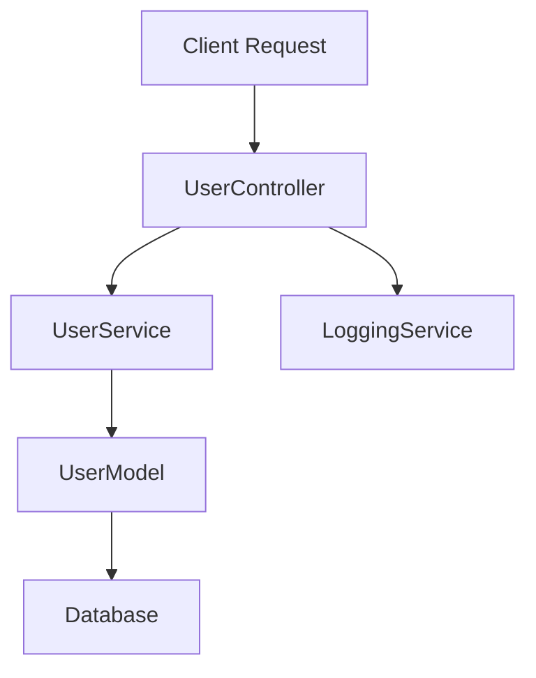

## 12.5 OOP in Back-End Development with Node.js

In this section, we will explore how object-oriented programming (OOP) principles can be effectively applied in back-end development using Node.js. We'll delve into how Node.js supports OOP through classes and modules, provide examples of structuring a back-end application using OOP, discuss integration with databases and ORM libraries, and highlight the benefits of OOP in enhancing code reuse and maintainability. Additionally, we'll touch upon using TypeScript with Node.js for improved OOP support and consider performance and scalability in design.

### Introduction to Node.js and OOP

Node.js is a powerful JavaScript runtime built on Chrome's V8 JavaScript engine. It allows developers to use JavaScript for server-side scripting, enabling the development of scalable network applications. Node.js supports multiple programming paradigms, including object-oriented programming, which can be leveraged to create structured and maintainable back-end code.

#### Why Use OOP in Node.js?

1. **Code Reusability**: OOP allows developers to create reusable code components, which can be easily shared across different parts of an application.
2. **Maintainability**: By organizing code into classes and objects, developers can create a clear structure that is easier to understand and maintain.
3. **Encapsulation**: OOP enables encapsulation, which helps in hiding the internal state of objects and exposing only necessary functionalities.
4. **Abstraction**: It allows developers to focus on high-level design by abstracting complex logic into manageable pieces.
5. **Inheritance and Polymorphism**: These OOP concepts promote code reuse and flexibility, allowing developers to extend existing code without modifying it.

### Node.js Support for OOP

Node.js supports OOP through the use of ES6 classes, which provide a syntactical sugar over JavaScript's prototype-based inheritance. Let's explore how we can define classes and create objects in Node.js.

#### Defining Classes in Node.js

```javascript
// Define a simple class in Node.js
class User {
  constructor(name, email) {
    this.name = name;
    this.email = email;
  }

  // Method to display user details
  displayInfo() {
    console.log(`Name: ${this.name}, Email: ${this.email}`);
  }
}

// Create an instance of the User class
const user1 = new User('Alice', 'alice@example.com');
user1.displayInfo(); // Output: Name: Alice, Email: alice@example.com
```

In the example above, we define a `User` class with a constructor and a method `displayInfo`. We then create an instance of the `User` class and call its method to display user information.

#### Modules in Node.js

Node.js uses a module system to organize code. Modules are files that contain related code and can be imported and exported using `require` and `module.exports`. This modular approach complements OOP by allowing developers to encapsulate functionality within modules.

```javascript
// user.js - Define a User class in a module
class User {
  constructor(name, email) {
    this.name = name;
    this.email = email;
  }

  displayInfo() {
    console.log(`Name: ${this.name}, Email: ${this.email}`);
  }
}

module.exports = User;
```

```javascript
// app.js - Import and use the User class
const User = require('./user');

const user1 = new User('Bob', 'bob@example.com');
user1.displayInfo(); // Output: Name: Bob, Email: bob@example.com
```

### Structuring a Back-End Application with OOP

When building a back-end application, it's important to structure your code in a way that promotes clarity and maintainability. Using OOP, we can organize our application into models, controllers, and services.

#### Models

Models represent the data structure of your application. They define the schema and behavior of data entities. In a Node.js application, models are often used to interact with databases.

```javascript
// models/UserModel.js
class UserModel {
  constructor(database) {
    this.database = database;
  }

  // Method to find a user by ID
  findById(id) {
    return this.database.find(user => user.id === id);
  }

  // Method to create a new user
  create(user) {
    this.database.push(user);
    return user;
  }
}

module.exports = UserModel;
```

#### Controllers

Controllers handle the logic for processing requests and returning responses. They act as an intermediary between models and views.

```javascript
// controllers/UserController.js
class UserController {
  constructor(userModel) {
    this.userModel = userModel;
  }

  // Method to handle user creation
  createUser(req, res) {
    const newUser = this.userModel.create(req.body);
    res.status(201).json(newUser);
  }

  // Method to handle fetching a user by ID
  getUserById(req, res) {
    const user = this.userModel.findById(req.params.id);
    if (user) {
      res.json(user);
    } else {
      res.status(404).send('User not found');
    }
  }
}

module.exports = UserController;
```

#### Services

Services contain business logic and can be used by controllers to perform complex operations. They help in separating concerns and keeping controllers lightweight.

```javascript
// services/UserService.js
class UserService {
  constructor(userModel) {
    this.userModel = userModel;
  }

  // Method to validate and create a user
  createUser(data) {
    if (!data.name || !data.email) {
      throw new Error('Invalid data');
    }
    return this.userModel.create(data);
  }
}

module.exports = UserService;
```

### Integrating with Databases and ORM Libraries

In a back-end application, integrating with a database is crucial for data persistence. Object-Relational Mapping (ORM) libraries provide a way to interact with databases using OOP principles.

#### Using Sequelize ORM

Sequelize is a popular ORM for Node.js that supports various databases, including PostgreSQL, MySQL, and SQLite. It allows developers to define models and interact with the database using JavaScript objects.

```javascript
// models/User.js using Sequelize
const { Sequelize, DataTypes, Model } = require('sequelize');
const sequelize = new Sequelize('sqlite::memory:');

class User extends Model {}

User.init({
  name: {
    type: DataTypes.STRING,
    allowNull: false
  },
  email: {
    type: DataTypes.STRING,
    allowNull: false
  }
}, {
  sequelize,
  modelName: 'User'
});

module.exports = User;
```

In the example above, we define a `User` model using Sequelize. The model defines the schema for the `User` table in the database.

### Enhancing Code Reuse and Maintainability

OOP enhances code reuse and maintainability by promoting the use of classes and objects. By encapsulating related functionality within classes, developers can create reusable components that can be easily maintained and extended.

#### Example: Reusable Logging Service

```javascript
// services/LoggingService.js
class LoggingService {
  log(message) {
    console.log(`[LOG]: ${message}`);
  }

  error(message) {
    console.error(`[ERROR]: ${message}`);
  }
}

module.exports = LoggingService;
```

```javascript
// controllers/UserController.js
const LoggingService = require('../services/LoggingService');
const logger = new LoggingService();

class UserController {
  // Other methods...

  createUser(req, res) {
    try {
      const newUser = this.userModel.create(req.body);
      logger.log('User created successfully');
      res.status(201).json(newUser);
    } catch (error) {
      logger.error('Error creating user');
      res.status(500).send('Internal Server Error');
    }
  }
}

module.exports = UserController;
```

In this example, we create a `LoggingService` that can be reused across different parts of the application. The `UserController` uses this service to log messages, promoting code reuse and maintainability.

### Using TypeScript with Node.js for Improved OOP Support

TypeScript is a superset of JavaScript that adds static typing and other features to the language. It provides better support for OOP by allowing developers to define interfaces, classes, and types.

#### Benefits of Using TypeScript

1. **Type Safety**: TypeScript helps catch errors at compile time, reducing runtime errors.
2. **Improved Code Readability**: With interfaces and types, code becomes more readable and self-documenting.
3. **Enhanced Tooling**: TypeScript provides better support for IDE features like auto-completion and refactoring.

#### Example: Defining Interfaces and Classes in TypeScript

```typescript
// interfaces/IUser.ts
export interface IUser {
  name: string;
  email: string;
}

// models/User.ts
import { IUser } from './interfaces/IUser';

export class User implements IUser {
  constructor(public name: string, public email: string) {}

  displayInfo(): void {
    console.log(`Name: ${this.name}, Email: ${this.email}`);
  }
}
```

In this example, we define an `IUser` interface and a `User` class that implements this interface. TypeScript ensures that the `User` class adheres to the structure defined by the `IUser` interface.

### Performance and Scalability Considerations

When designing a back-end application, it's important to consider performance and scalability. OOP can help achieve these goals by promoting modular design and code reuse.

#### Tips for Performance and Scalability

1. **Use Asynchronous Programming**: Node.js is inherently asynchronous, so leverage asynchronous patterns like Promises and async/await to improve performance.
2. **Optimize Database Queries**: Use ORM features to optimize queries and reduce database load.
3. **Implement Caching**: Cache frequently accessed data to reduce database queries and improve response times.
4. **Design for Scalability**: Use microservices architecture to scale different parts of your application independently.

### Try It Yourself

To reinforce your understanding, try modifying the examples provided in this section. For instance, you can:

- Add new methods to the `User` class to update or delete user information.
- Create a new service for handling email notifications.
- Integrate a different database using Sequelize and define new models.

### Visualizing Node.js OOP Architecture

To better understand how OOP components interact in a Node.js application, let's visualize the architecture using a Mermaid.js diagram.



**Diagram Description**: This diagram illustrates the flow of a client request through a Node.js application. The `UserController` handles the request and interacts with the `UserService` for business logic. The `UserService` communicates with the `UserModel` to access the database. The `LoggingService` is used for logging throughout the process.

### Conclusion

In this section, we've explored how to apply object-oriented programming principles in back-end development using Node.js. By leveraging classes, modules, and ORM libraries, we can create structured and maintainable applications. OOP enhances code reuse and maintainability, making it an ideal choice for building robust back-end systems. Additionally, using TypeScript with Node.js provides improved OOP support through static typing and interfaces. As you continue your journey in back-end development, remember to consider performance and scalability in your designs.

## Quiz Time!



### What is one of the main benefits of using OOP in Node.js?

- [x] Code Reusability
- [ ] Faster Execution
- [ ] Less Memory Usage
- [ ] Automatic Error Handling

> **Explanation:** OOP promotes code reusability by allowing developers to create reusable components through classes and objects.


### Which Node.js feature allows you to organize code into separate files?

- [x] Modules
- [ ] Callbacks
- [ ] Promises
- [ ] Streams

> **Explanation:** Node.js uses a module system to organize code into separate files, which can be imported and exported using `require` and `module.exports`.


### What is the purpose of a controller in a Node.js application?

- [x] To handle logic for processing requests and returning responses
- [ ] To define the data structure of the application
- [ ] To manage database connections
- [ ] To perform logging operations

> **Explanation:** Controllers handle the logic for processing requests and returning responses, acting as an intermediary between models and views.


### Which ORM library is commonly used with Node.js for database interactions?

- [x] Sequelize
- [ ] Mongoose
- [ ] TypeORM
- [ ] Bookshelf

> **Explanation:** Sequelize is a popular ORM library for Node.js that supports various databases and allows developers to define models and interact with the database using JavaScript objects.


### How does TypeScript improve OOP support in Node.js?

- [x] By adding static typing and interfaces
- [ ] By providing faster execution
- [ ] By reducing memory usage
- [ ] By automatically handling errors

> **Explanation:** TypeScript improves OOP support by adding static typing and interfaces, which help catch errors at compile time and enhance code readability.


### What is a benefit of using asynchronous programming in Node.js?

- [x] Improved performance
- [ ] Easier debugging
- [ ] Automatic error handling
- [ ] Reduced code complexity

> **Explanation:** Asynchronous programming improves performance by allowing non-blocking operations, which is a key feature of Node.js.


### Which of the following is a method to enhance code reuse in a Node.js application?

- [x] Creating reusable services
- [ ] Using global variables
- [ ] Writing inline functions
- [ ] Hardcoding configuration values

> **Explanation:** Creating reusable services promotes code reuse by encapsulating related functionality that can be used across different parts of the application.


### What is the role of a service in a Node.js application?

- [x] To contain business logic and perform complex operations
- [ ] To handle HTTP requests and responses
- [ ] To define the data schema
- [ ] To manage user sessions

> **Explanation:** Services contain business logic and perform complex operations, helping to separate concerns and keep controllers lightweight.


### Which of the following is a performance optimization technique in Node.js?

- [x] Implementing caching
- [ ] Using synchronous functions
- [ ] Increasing server memory
- [ ] Hardcoding database queries

> **Explanation:** Implementing caching is a performance optimization technique that reduces database queries and improves response times.


### True or False: TypeScript is a superset of JavaScript that adds static typing and other features.

- [x] True
- [ ] False

> **Explanation:** True. TypeScript is a superset of JavaScript that adds static typing and other features, providing better support for OOP and enhancing code quality.


