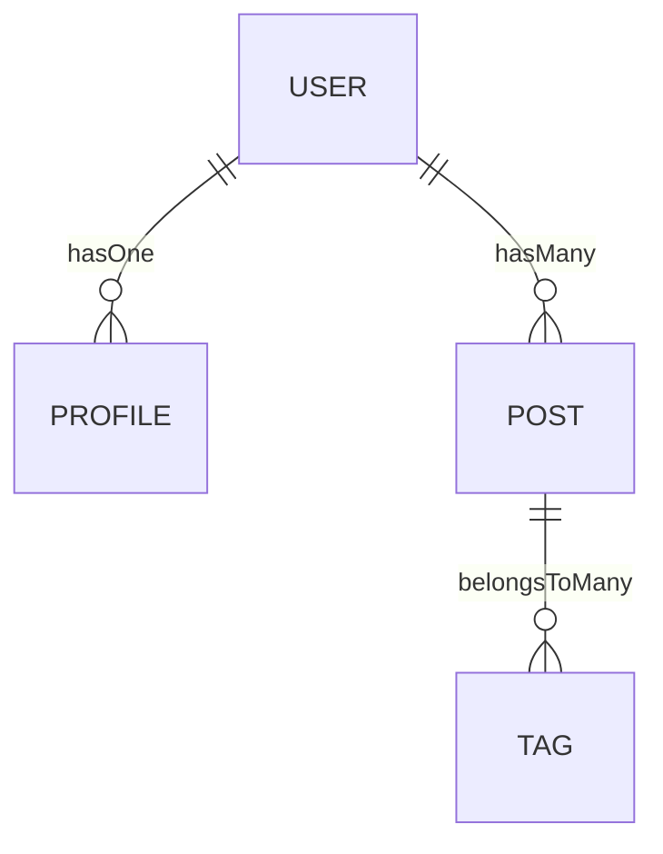

## 12.6 Working with Databases in OOP

In this section, we will explore how to manage data persistence using object-oriented models and ORM (Object-Relational Mapping) tools in JavaScript. By the end of this chapter, you will understand how to define data models as classes, perform CRUD operations, handle relationships between entities, and manage data validation and schema management within models.

### Understanding Object-Relational Mapping (ORM)

Object-Relational Mapping (ORM) is a programming technique that allows you to interact with a database using an object-oriented paradigm. Instead of writing raw SQL queries, you can work with database records as if they were objects in your programming language. This abstraction layer simplifies database interactions, making it easier to manage data and maintain your code.

#### Benefits of Using ORM

- **Simplicity**: ORM abstracts the complexity of SQL queries, allowing you to focus on business logic.
- **Maintainability**: Changes to the database schema can be managed through code, making updates easier.
- **Portability**: ORM tools often support multiple database systems, allowing you to switch databases with minimal code changes.
- **Security**: ORM can help prevent SQL injection attacks by using parameterized queries.

### Introducing ORM Libraries: Sequelize and Mongoose

JavaScript has several popular ORM libraries that facilitate database interactions. Two of the most widely used are Sequelize and Mongoose.

#### Sequelize

Sequelize is a promise-based Node.js ORM for SQL databases like PostgreSQL, MySQL, MariaDB, SQLite, and Microsoft SQL Server. It provides a powerful set of features for managing database operations using JavaScript.

#### Mongoose

Mongoose is an ODM (Object Data Modeling) library for MongoDB and Node.js. It provides a straightforward, schema-based solution to model your application data and includes built-in type casting, validation, query building, and business logic hooks.

### Defining Data Models as Classes

In ORM, data models are typically defined as classes. These classes represent the structure of your database tables or collections. Let's see how to define models using Sequelize and Mongoose.

#### Defining Models with Sequelize

To define a model in Sequelize, you create a class that extends Sequelize's `Model` class. Here's an example of defining a `User` model:

```javascript
const { Sequelize, DataTypes, Model } = require('sequelize');
const sequelize = new Sequelize('sqlite::memory:'); // Example for SQLite

class User extends Model {}

User.init({
  // Define attributes
  firstName: {
    type: DataTypes.STRING,
    allowNull: false
  },
  lastName: {
    type: DataTypes.STRING
  },
  email: {
    type: DataTypes.STRING,
    allowNull: false,
    unique: true
  }
}, {
  // Other model options
  sequelize, // We need to pass the connection instance
  modelName: 'User' // We need to choose the model name
});

// Sync all defined models to the DB
sequelize.sync();
```

#### Defining Models with Mongoose

In Mongoose, you define a schema and then create a model from it. Here's how you can define a `User` model:

```javascript
const mongoose = require('mongoose');

const userSchema = new mongoose.Schema({
  firstName: {
    type: String,
    required: true
  },
  lastName: String,
  email: {
    type: String,
    required: true,
    unique: true
  }
});

const User = mongoose.model('User', userSchema);
```

### Performing CRUD Operations

CRUD stands for Create, Read, Update, and Delete. These are the basic operations you can perform on a database. Let's see how to perform these operations using Sequelize and Mongoose.

#### CRUD Operations with Sequelize

- **Create**: To create a new record, use the `create` method.

  ```javascript
  async function createUser() {
    const user = await User.create({
      firstName: 'John',
      lastName: 'Doe',
      email: 'john.doe@example.com'
    });
    console.log(user.toJSON());
  }
  ```

- **Read**: To read records, use the `findAll` or `findOne` methods.

  ```javascript
  async function getUsers() {
    const users = await User.findAll();
    console.log(users);
  }
  ```

- **Update**: To update a record, use the `update` method.

  ```javascript
  async function updateUser(id) {
    await User.update({ lastName: 'Smith' }, {
      where: {
        id: id
      }
    });
  }
  ```

- **Delete**: To delete a record, use the `destroy` method.

  ```javascript
  async function deleteUser(id) {
    await User.destroy({
      where: {
        id: id
      }
    });
  }
  ```

#### CRUD Operations with Mongoose

- **Create**: To create a new document, use the `save` method.

  ```javascript
  async function createUser() {
    const user = new User({
      firstName: 'John',
      lastName: 'Doe',
      email: 'john.doe@example.com'
    });
    await user.save();
    console.log(user);
  }
  ```

- **Read**: To read documents, use the `find` or `findOne` methods.

  ```javascript
  async function getUsers() {
    const users = await User.find();
    console.log(users);
  }
  ```

- **Update**: To update a document, use the `updateOne` method.

  ```javascript
  async function updateUser(id) {
    await User.updateOne({ _id: id }, { lastName: 'Smith' });
  }
  ```

- **Delete**: To delete a document, use the `deleteOne` method.

  ```javascript
  async function deleteUser(id) {
    await User.deleteOne({ _id: id });
  }
  ```

### Handling Relationships Between Entities

In databases, relationships between entities are crucial for representing complex data structures. ORM tools provide mechanisms to define and manage these relationships.

#### Associations in Sequelize

Sequelize supports various types of associations, such as `One-to-One`, `One-to-Many`, and `Many-to-Many`. Let's explore how to define these associations.

- **One-to-One**: Use `hasOne` and `belongsTo` methods.

  ```javascript
  class Profile extends Model {}
  Profile.init({
    bio: DataTypes.TEXT
  }, { sequelize, modelName: 'Profile' });

  User.hasOne(Profile);
  Profile.belongsTo(User);
  ```

- **One-to-Many**: Use `hasMany` and `belongsTo` methods.

  ```javascript
  class Post extends Model {}
  Post.init({
    title: DataTypes.STRING,
    content: DataTypes.TEXT
  }, { sequelize, modelName: 'Post' });

  User.hasMany(Post);
  Post.belongsTo(User);
  ```

- **Many-to-Many**: Use `belongsToMany` method with a junction table.

  ```javascript
  class Tag extends Model {}
  Tag.init({
    name: DataTypes.STRING
  }, { sequelize, modelName: 'Tag' });

  Post.belongsToMany(Tag, { through: 'PostTags' });
  Tag.belongsToMany(Post, { through: 'PostTags' });
  ```

#### Relationships in Mongoose

In Mongoose, relationships are handled by referencing documents or embedding them.

- **Referencing Documents**: Use `ObjectId` to reference another document.

  ```javascript
  const profileSchema = new mongoose.Schema({
    bio: String,
    user: { type: mongoose.Schema.Types.ObjectId, ref: 'User' }
  });

  const Profile = mongoose.model('Profile', profileSchema);
  ```

- **Embedding Documents**: Embed one document inside another.

  ```javascript
  const postSchema = new mongoose.Schema({
    title: String,
    content: String,
    tags: [{ type: mongoose.Schema.Types.ObjectId, ref: 'Tag' }]
  });

  const Post = mongoose.model('Post', postSchema);
  ```

### Data Validation and Schema Management

Data validation and schema management are essential for ensuring data integrity and consistency. ORM tools provide built-in mechanisms to handle these aspects.

#### Data Validation in Sequelize

Sequelize allows you to define validation rules within your model definitions.

```javascript
User.init({
  firstName: {
    type: DataTypes.STRING,
    allowNull: false,
    validate: {
      notEmpty: true
    }
  },
  email: {
    type: DataTypes.STRING,
    allowNull: false,
    unique: true,
    validate: {
      isEmail: true
    }
  }
}, {
  sequelize,
  modelName: 'User'
});
```

#### Data Validation in Mongoose

Mongoose provides a rich set of validation options within schemas.

```javascript
const userSchema = new mongoose.Schema({
  firstName: {
    type: String,
    required: true,
    trim: true
  },
  email: {
    type: String,
    required: true,
    unique: true,
    match: /.+\@.+\..+/
  }
});
```

### Try It Yourself

Now that we've covered the basics of working with databases using ORM tools, it's time to experiment. Try modifying the code examples to:

- Add new fields to the models and update the CRUD operations accordingly.
- Define additional relationships between models.
- Implement custom validation logic for specific fields.

### Visualizing ORM Relationships

To better understand how ORM manages relationships, let's visualize a simple database schema with Sequelize associations.



In this diagram, we see how a `USER` can have one `PROFILE`, many `POSTS`, and how `POSTS` can have many `TAGS`.

### References and Links

- [Sequelize Documentation](https://sequelize.org/master/)
- [Mongoose Documentation](https://mongoosejs.com/docs/guide.html)
- [MDN Web Docs on Object-Relational Mapping](https://developer.mozilla.org/en-US/docs/Glossary/ORM)

### Knowledge Check

- What is ORM, and why is it useful?
- How do you define a model in Sequelize and Mongoose?
- What are CRUD operations, and how are they performed using ORM?
- How can you handle relationships between entities in Sequelize and Mongoose?
- What are some common data validation techniques in ORM?

### Embrace the Journey

Remember, working with databases using ORM tools is a powerful way to manage data in your applications. As you continue to explore and experiment, you'll gain a deeper understanding of how to leverage these tools effectively. Keep practicing, stay curious, and enjoy the journey of mastering databases in JavaScript!

## Quiz Time!



### What is ORM?

- [x] A technique to interact with databases using object-oriented programming
- [ ] A method to write raw SQL queries
- [ ] A library for front-end development
- [ ] A tool for styling web pages

> **Explanation:** ORM stands for Object-Relational Mapping, which allows developers to interact with databases using an object-oriented approach.

### Which library is used for SQL databases in JavaScript?

- [x] Sequelize
- [ ] Mongoose
- [ ] React
- [ ] Express

> **Explanation:** Sequelize is a popular ORM library for SQL databases in JavaScript.

### How do you define a model in Sequelize?

- [x] By extending the Sequelize Model class and using the init method
- [ ] By creating a new JavaScript object
- [ ] By writing raw SQL queries
- [ ] By using the `createModel` function

> **Explanation:** In Sequelize, models are defined by extending the Model class and using the init method to specify attributes and options.

### What is the purpose of the `belongsToMany` method in Sequelize?

- [x] To define a many-to-many relationship between models
- [ ] To delete a model
- [ ] To create a one-to-one relationship
- [ ] To update a model

> **Explanation:** The `belongsToMany` method in Sequelize is used to define a many-to-many relationship between models.

### How do you perform a read operation in Mongoose?

- [x] Using the `find` or `findOne` methods
- [ ] Using the `save` method
- [ ] Using the `deleteOne` method
- [ ] Using the `updateOne` method

> **Explanation:** In Mongoose, read operations are performed using the `find` or `findOne` methods.

### What is the purpose of data validation in ORM?

- [x] To ensure data integrity and consistency
- [ ] To style web pages
- [ ] To create new database tables
- [ ] To manage server requests

> **Explanation:** Data validation in ORM is crucial for ensuring that the data stored in the database is accurate and consistent.

### Which method is used to update a document in Mongoose?

- [x] `updateOne`
- [ ] `create`
- [ ] `deleteOne`
- [ ] `find`

> **Explanation:** The `updateOne` method in Mongoose is used to update a document in the database.

### What is the role of the `sync` method in Sequelize?

- [x] To synchronize the models with the database
- [ ] To delete all records
- [ ] To create a new database
- [ ] To perform a read operation

> **Explanation:** The `sync` method in Sequelize is used to synchronize the models with the database, creating tables if they do not exist.

### How can you handle a one-to-one relationship in Mongoose?

- [x] By referencing documents using `ObjectId`
- [ ] By embedding documents
- [ ] By using the `hasMany` method
- [ ] By using the `belongsToMany` method

> **Explanation:** In Mongoose, a one-to-one relationship can be handled by referencing documents using `ObjectId`.

### True or False: Mongoose is used for SQL databases.

- [ ] True
- [x] False

> **Explanation:** False. Mongoose is an ODM library used for MongoDB, which is a NoSQL database.


