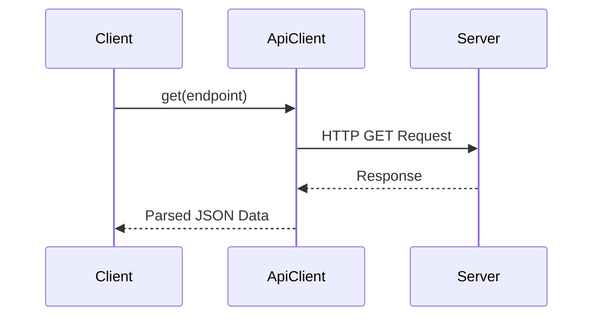

## 12.7 API Development Using Classes

In today's interconnected world, applications often need to communicate with external services to retrieve or send data. This is where APIs, or Application Programming Interfaces, come into play. APIs allow different software systems to interact with each other, enabling developers to build feature-rich applications by leveraging external data and services.

### Understanding APIs in Application Development

APIs are the backbone of modern web applications, providing a way for different systems to communicate over the internet. They enable developers to access functionalities and data from other applications, such as social media platforms, payment gateways, and cloud services, without having to build these features from scratch.

#### The Role of APIs

- **Data Retrieval**: APIs allow applications to fetch data from external sources, such as weather information, stock prices, or user profiles.
- **Data Submission**: Applications can send data to external systems, like submitting a form or uploading a file.
- **Service Integration**: APIs enable the integration of third-party services, such as authentication, payment processing, and analytics.

### Encapsulating API Calls Within Classes

Using object-oriented programming principles, we can encapsulate API interactions within classes. This approach provides a structured way to manage API requests and responses, making the code more organized and reusable.

#### Benefits of Using Classes for API Development

- **Encapsulation**: Group related API functionalities within a class, hiding the implementation details from the rest of the application.
- **Reusability**: Create reusable components that can be easily integrated into different parts of the application.
- **Maintainability**: Simplify maintenance by centralizing API logic in one place, making it easier to update or modify.

### Creating an API Client Class

Let's create a simple API client class to demonstrate how to encapsulate API calls. We'll use the Fetch API, a modern interface for making network requests in JavaScript.

```javascript
class ApiClient {
  constructor(baseURL) {
    this.baseURL = baseURL;
  }

  async get(endpoint) {
    try {
      const response = await fetch(`${this.baseURL}${endpoint}`);
      if (!response.ok) {
        throw new Error(`HTTP error! Status: ${response.status}`);
      }
      return await response.json();
    } catch (error) {
      console.error('Error fetching data:', error);
      throw error;
    }
  }

  async post(endpoint, data) {
    try {
      const response = await fetch(`${this.baseURL}${endpoint}`, {
        method: 'POST',
        headers: {
          'Content-Type': 'application/json',
        },
        body: JSON.stringify(data),
      });
      if (!response.ok) {
        throw new Error(`HTTP error! Status: ${response.status}`);
      }
      return await response.json();
    } catch (error) {
      console.error('Error posting data:', error);
      throw error;
    }
  }
}
```

### Making Requests and Handling Responses

In the `ApiClient` class, we have two methods: `get` and `post`. These methods demonstrate how to make GET and POST requests, respectively, using the Fetch API.

#### GET Requests

The `get` method constructs a URL using the base URL and endpoint, then makes a GET request. It checks the response status and throws an error if the request was unsuccessful. If successful, it parses the JSON response.

#### POST Requests

The `post` method sends data to the server by making a POST request. It sets the request method to 'POST' and includes the data in the request body as a JSON string. It also handles response status and errors similarly to the `get` method.

### Error Handling and Retries in Network Communications

Network requests can fail for various reasons, such as server errors, network issues, or incorrect URLs. It's crucial to handle these errors gracefully to ensure a smooth user experience.

#### Error Handling

In our `ApiClient` class, we use try-catch blocks to handle errors during network requests. When an error occurs, we log it to the console and rethrow it to allow the calling code to handle it appropriately.

#### Implementing Retries

For critical operations, you might want to implement a retry mechanism to attempt the request again after a failure. Here's how you can add a simple retry logic to the `get` method:

```javascript
async getWithRetry(endpoint, retries = 3) {
  for (let attempt = 0; attempt < retries; attempt++) {
    try {
      return await this.get(endpoint);
    } catch (error) {
      if (attempt === retries - 1) {
        throw error;
      }
      console.warn(`Retrying... (${attempt + 1}/${retries})`);
    }
  }
}
```

### Importance of Abstractions in API Usage

Abstraction is a key principle in object-oriented programming that helps simplify complex systems by hiding unnecessary details. By abstracting API interactions within classes, we can provide a clean and simple interface for the rest of the application.

#### Simplifying API Usage

Our `ApiClient` class abstracts the details of making network requests, such as constructing URLs, setting headers, and parsing responses. This allows other parts of the application to use the API client without worrying about these details.

### Adhering to DRY Principles

The DRY (Don't Repeat Yourself) principle is essential in software development to reduce redundancy and improve maintainability. By encapsulating API logic within classes, we avoid duplicating code across the application.

#### Reusing API Logic

Instead of writing similar code for making API requests in multiple places, we can use our `ApiClient` class to handle all API interactions. This not only reduces code duplication but also makes it easier to update or modify the API logic in the future.

### Try It Yourself

Experiment with the `ApiClient` class by modifying the code to add more methods, such as PUT and DELETE requests. Try integrating the class into a simple application to see how it simplifies API interactions.

### Visualizing API Interactions

To better understand how our `ApiClient` class interacts with external APIs, let's visualize the process using a sequence diagram.



This diagram illustrates the flow of a GET request from the client to the server and back, highlighting the role of the `ApiClient` class in managing the interaction.

### References and Links

For further reading on APIs and network requests in JavaScript, check out the following resources:

- [MDN Web Docs: Fetch API](https://developer.mozilla.org/en-US/docs/Web/API/Fetch_API)
- [W3Schools: JavaScript Fetch API](https://www.w3schools.com/js/js_api_fetch.asp)

### Knowledge Check

To reinforce your understanding of API development using classes, consider the following questions:

1. What are the benefits of encapsulating API calls within classes?
2. How does the `ApiClient` class handle errors during network requests?
3. Why is abstraction important in API development?
4. How does adhering to the DRY principle improve code maintainability?

### Embrace the Journey

Remember, mastering API development using classes is just one step in your journey to becoming a proficient JavaScript developer. Keep experimenting, stay curious, and enjoy the process of learning and building amazing applications!

## Quiz Time!



### What is the primary role of APIs in application development?

- [x] To allow different software systems to communicate with each other.
- [ ] To provide a user interface for applications.
- [ ] To store data locally on the user's device.
- [ ] To compile JavaScript code into machine code.

> **Explanation:** APIs enable different software systems to interact and exchange data, which is crucial for building feature-rich applications.

### Which method in the `ApiClient` class is used to make a GET request?

- [x] `get`
- [ ] `post`
- [ ] `fetch`
- [ ] `request`

> **Explanation:** The `get` method is specifically designed to make GET requests to the server.

### How does the `ApiClient` class handle errors during network requests?

- [x] By using try-catch blocks to catch and log errors.
- [ ] By ignoring errors and continuing execution.
- [ ] By automatically retrying the request indefinitely.
- [ ] By terminating the application.

> **Explanation:** The `ApiClient` class uses try-catch blocks to catch errors during network requests, log them, and rethrow them for further handling.

### What is the purpose of the DRY principle in software development?

- [x] To reduce redundancy and improve maintainability.
- [ ] To increase the complexity of the code.
- [ ] To make the code run faster.
- [ ] To ensure the code is written in a single file.

> **Explanation:** The DRY principle aims to reduce code duplication, making it easier to maintain and update the codebase.

### Why is abstraction important in API development?

- [x] It simplifies complex systems by hiding unnecessary details.
- [ ] It increases the number of lines of code.
- [ ] It makes the code harder to understand.
- [ ] It allows direct access to all system resources.

> **Explanation:** Abstraction helps simplify complex systems by providing a clean interface and hiding implementation details, making the code easier to use and maintain.

### What does the `getWithRetry` method do?

- [x] It attempts to make a GET request multiple times if it fails.
- [ ] It makes a POST request with retries.
- [ ] It logs errors without retrying.
- [ ] It cancels the request after the first failure.

> **Explanation:** The `getWithRetry` method implements a retry mechanism to attempt the GET request multiple times if it fails.

### Which of the following is NOT a benefit of using classes for API development?

- [ ] Encapsulation
- [ ] Reusability
- [ ] Maintainability
- [x] Increased code complexity

> **Explanation:** Using classes for API development typically reduces complexity by organizing and encapsulating related functionalities.

### What is the primary function of the `post` method in the `ApiClient` class?

- [x] To send data to the server using a POST request.
- [ ] To retrieve data from the server.
- [ ] To delete data from the server.
- [ ] To update data on the server.

> **Explanation:** The `post` method is used to send data to the server using a POST request.

### How can you add a retry mechanism to a network request in JavaScript?

- [x] By implementing a loop that retries the request a specified number of times.
- [ ] By using a single try-catch block.
- [ ] By increasing the timeout duration.
- [ ] By using synchronous requests.

> **Explanation:** A retry mechanism can be implemented by using a loop to attempt the request multiple times, handling errors appropriately.

### True or False: The Fetch API is a modern interface for making network requests in JavaScript.

- [x] True
- [ ] False

> **Explanation:** The Fetch API is indeed a modern interface for making network requests, providing a more powerful and flexible feature set compared to older methods like XMLHttpRequest.




