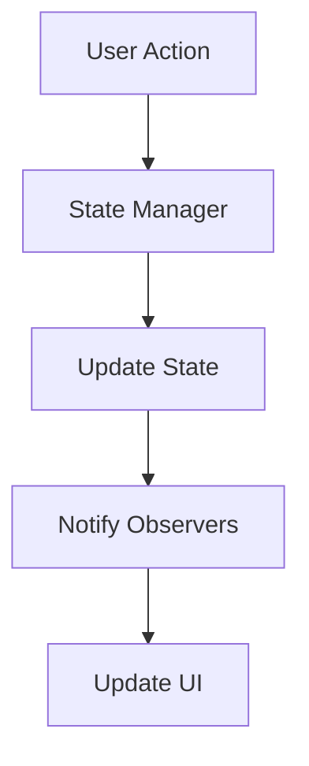

## 12.8 State Management in Applications

In the world of software development, managing the state of an application is a critical aspect that can significantly affect performance, maintainability, and user experience. In this section, we will explore how object-oriented programming (OOP) principles can be applied to efficiently manage application state in JavaScript. We will delve into the definition of application state, explore design patterns like Singleton and Observer, and provide practical examples and strategies for state management.

### Understanding Application State

**Application state** refers to the data that an application needs to function and respond to user interactions. This data can include user inputs, preferences, session information, and more. The state can be transient or persistent, and it often changes over time as users interact with the application.

#### Front-End State

In front-end applications, the state is typically concerned with the user interface (UI) and user interactions. This includes:

- **UI State**: Data related to the current view, such as which tab is active or which items are selected.
- **Session State**: Information that persists during a user's session, like authentication tokens.
- **Application State**: Data shared across different components, such as user profiles or settings.

#### Back-End State

On the back-end, the state often involves:

- **Database State**: Persistent data stored in databases.
- **Session State**: Information about user sessions, often stored in memory or databases.
- **Application State**: Data that affects the behavior of the application, such as configuration settings.

### Design Patterns for State Management

Object-oriented design patterns provide structured approaches to manage application state effectively. Let's explore some of these patterns.

#### Singleton Pattern

The Singleton pattern ensures that a class has only one instance and provides a global point of access to it. This is particularly useful for managing shared state across an application.

```javascript
class AppState {
  constructor() {
    if (AppState.instance) {
      return AppState.instance;
    }
    this.state = {};
    AppState.instance = this;
  }

  getState() {
    return this.state;
  }

  setState(newState) {
    this.state = { ...this.state, ...newState };
  }
}

const appState1 = new AppState();
const appState2 = new AppState();

console.log(appState1 === appState2); // true
```

In this example, `AppState` is a Singleton class that manages the application state. It ensures that only one instance of the state exists, which can be accessed globally.

#### Observer Pattern

The Observer pattern is used to create a subscription mechanism to notify multiple objects about changes in state. This is useful for updating the UI in response to state changes.

```javascript
class Subject {
  constructor() {
    this.observers = [];
  }

  subscribe(observer) {
    this.observers.push(observer);
  }

  unsubscribe(observer) {
    this.observers = this.observers.filter(obs => obs !== observer);
  }

  notify(data) {
    this.observers.forEach(observer => observer.update(data));
  }
}

class Observer {
  update(data) {
    console.log('Observer received data:', data);
  }
}

const subject = new Subject();
const observer1 = new Observer();
const observer2 = new Observer();

subject.subscribe(observer1);
subject.subscribe(observer2);

subject.notify('New State');
```

Here, the `Subject` class maintains a list of observers and notifies them of any state changes. Observers can subscribe or unsubscribe from notifications.

### Implementing a State Manager with Classes

Let's implement a simple state manager using classes to encapsulate state logic.

```javascript
class StateManager {
  constructor(initialState = {}) {
    this.state = initialState;
    this.listeners = [];
  }

  getState() {
    return this.state;
  }

  setState(newState) {
    this.state = { ...this.state, ...newState };
    this.notifyListeners();
  }

  subscribe(listener) {
    this.listeners.push(listener);
  }

  unsubscribe(listener) {
    this.listeners = this.listeners.filter(l => l !== listener);
  }

  notifyListeners() {
    this.listeners.forEach(listener => listener(this.state));
  }
}

const stateManager = new StateManager({ count: 0 });

stateManager.subscribe(state => {
  console.log('State updated:', state);
});

stateManager.setState({ count: 1 });
```

In this example, `StateManager` is a class that manages the application state and notifies subscribed listeners of any changes. This pattern is particularly useful in front-end applications where the UI needs to react to state changes.

### Popular State Management Libraries

Several libraries have been developed to simplify state management in JavaScript applications, often leveraging OOP concepts.

#### Redux

Redux is a popular state management library that follows a unidirectional data flow pattern. While not strictly OOP, it can be integrated with object-oriented components.

- **Store**: Holds the application state.
- **Actions**: Describe changes to the state.
- **Reducers**: Pure functions that take the current state and an action, returning a new state.

#### MobX

MobX is another library that uses observable patterns to manage state. It is more aligned with OOP principles and provides a simple API for managing state.

- **Observable State**: State that can be observed for changes.
- **Actions**: Functions that modify the state.
- **Reactions**: Functions that automatically run when the state changes.

### Synchronizing State and Handling Updates

Efficient state management involves synchronizing state across different parts of an application and handling updates efficiently.

#### State Synchronization

State synchronization ensures that all parts of an application have a consistent view of the state. This can be achieved through:

- **Centralized State Store**: Using a single source of truth for the application state.
- **Event-Driven Updates**: Broadcasting state changes through events or observers.

#### Handling State Updates

Handling state updates involves:

- **Immutable State**: Ensuring state changes do not mutate the original state, often using libraries like Immutable.js.
- **Batching Updates**: Grouping multiple state updates to improve performance.

### Potential Pitfalls in State Management

Managing application state can introduce several challenges, including:

#### State Mutation

Mutating state directly can lead to unpredictable behavior and bugs. Always use immutable patterns to update state.

#### Concurrency Issues

In applications with concurrent operations, managing state can become complex. Use locks or atomic operations to ensure state consistency.

### Visualizing State Management

To better understand state management, let's visualize how state flows through an application using a flowchart.



In this flowchart, a user action triggers the state manager to update the state, which then notifies observers to update the UI.

### Try It Yourself

Experiment with the code examples provided in this section. Try modifying the `StateManager` class to add more complex state logic or integrate it with a simple UI component. Observe how changes in state affect the behavior of your application.

### References and Further Reading

- [MDN Web Docs: State Management](https://developer.mozilla.org/en-US/docs/Web/JavaScript/Guide/State_Management)
- [Redux Documentation](https://redux.js.org/)
- [MobX Documentation](https://mobx.js.org/)

### Knowledge Check

- What is the difference between front-end and back-end state?
- How does the Singleton pattern help in managing application state?
- What are the benefits of using the Observer pattern for state management?
- How can you ensure state updates do not mutate the original state?
- What are some potential pitfalls in managing application state?

### Embrace the Journey

Remember, mastering state management is a journey. As you continue to explore and experiment with different patterns and libraries, you'll gain a deeper understanding of how to build efficient and maintainable applications. Keep experimenting, stay curious, and enjoy the journey!

## Quiz Time!



### What is application state?

- [x] Data that an application needs to function and respond to user interactions.
- [ ] The visual appearance of an application.
- [ ] The programming language used to build an application.
- [ ] The hardware on which an application runs.

> **Explanation:** Application state refers to the data that an application needs to function and respond to user interactions.

### Which pattern ensures a class has only one instance?

- [x] Singleton
- [ ] Observer
- [ ] Factory
- [ ] Decorator

> **Explanation:** The Singleton pattern ensures that a class has only one instance and provides a global point of access to it.

### What is the role of the Observer pattern in state management?

- [x] To notify multiple objects about changes in state.
- [ ] To create a single instance of a class.
- [ ] To encapsulate a request as an object.
- [ ] To define a family of algorithms.

> **Explanation:** The Observer pattern is used to create a subscription mechanism to notify multiple objects about changes in state.

### How can you ensure state updates do not mutate the original state?

- [x] Use immutable patterns.
- [ ] Use mutable patterns.
- [ ] Directly modify the state object.
- [ ] Use a single instance of the state.

> **Explanation:** Using immutable patterns ensures that state updates do not mutate the original state.

### What is a potential pitfall in managing application state?

- [x] State mutation
- [ ] State synchronization
- [ ] State immutability
- [ ] State consistency

> **Explanation:** State mutation is a potential pitfall in managing application state, as it can lead to unpredictable behavior and bugs.

### What does the StateManager class do in the provided example?

- [x] Manages application state and notifies subscribed listeners of changes.
- [ ] Creates a single instance of a class.
- [ ] Encapsulates a request as an object.
- [ ] Defines a family of algorithms.

> **Explanation:** The StateManager class manages the application state and notifies subscribed listeners of any changes.

### What is a benefit of using a centralized state store?

- [x] Ensures a consistent view of the state across the application.
- [ ] Increases the complexity of the application.
- [ ] Makes the application slower.
- [ ] Reduces the maintainability of the application.

> **Explanation:** A centralized state store ensures that all parts of an application have a consistent view of the state.

### Which library follows a unidirectional data flow pattern?

- [x] Redux
- [ ] MobX
- [ ] jQuery
- [ ] Angular

> **Explanation:** Redux is a popular state management library that follows a unidirectional data flow pattern.

### What is the purpose of batching updates in state management?

- [x] To improve performance by grouping multiple state updates.
- [ ] To decrease performance by separating state updates.
- [ ] To create a single instance of a class.
- [ ] To notify multiple objects about changes in state.

> **Explanation:** Batching updates improves performance by grouping multiple state updates.

### True or False: The Observer pattern is useful for updating the UI in response to state changes.

- [x] True
- [ ] False

> **Explanation:** The Observer pattern is indeed useful for updating the UI in response to state changes, as it allows multiple objects to be notified of changes.


