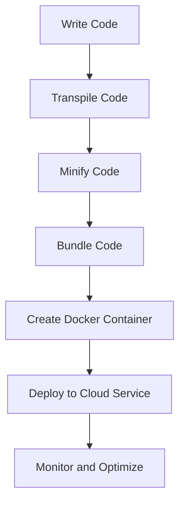

## 12.9 Deploying Object-Oriented Applications

Deploying an application is a crucial step in the software development lifecycle. It involves preparing your application to be accessible to users in a production environment. In this section, we will explore the key considerations and steps involved in deploying object-oriented JavaScript applications. We'll cover build processes, the importance of transpilation, minification, and bundling, and provide examples of deployment pipelines using tools like Docker and cloud services. Additionally, we'll discuss environment configurations, managing secrets securely, performance optimization, monitoring, and continuous deployment practices.

### Understanding the Deployment Process

Before we dive into the specifics, let's briefly outline what the deployment process entails. Deployment involves several stages:

1. **Build Preparation**: Preparing your code for production by transforming it into a format suitable for deployment.
2. **Environment Configuration**: Setting up the necessary configurations for different environments (development, testing, production).
3. **Deployment Execution**: Moving the application to a server or cloud service where it can be accessed by users.
4. **Monitoring and Maintenance**: Continuously monitoring the application for performance and errors and making necessary updates or fixes.

### Build Processes: Transpilation, Minification, and Bundling

#### Transpilation

JavaScript is a constantly evolving language, and new features are regularly introduced. However, not all environments support the latest JavaScript features. Transpilation is the process of converting your modern JavaScript code (ES6 and beyond) into a version that is compatible with older browsers. Tools like Babel are commonly used for this purpose.

```javascript
// Example of ES6 code using arrow functions
const greet = (name) => `Hello, ${name}!`;

// Transpiled ES5 equivalent
var greet = function(name) {
  return 'Hello, ' + name + '!';
};
```

#### Minification

Minification involves removing unnecessary characters from your code (such as whitespace, comments, and semicolons) without changing its functionality. This reduces the size of your JavaScript files, leading to faster load times. Tools like UglifyJS and Terser are popular for minifying JavaScript code.

```javascript
// Original code
function add(a, b) {
  return a + b;
}

// Minified code
function add(a,b){return a+b;}
```

#### Bundling

Bundling is the process of combining multiple JavaScript files into a single file or a few files. This reduces the number of HTTP requests required to load your application, improving performance. Webpack is a powerful tool for bundling JavaScript applications.

```javascript
// Webpack configuration example
module.exports = {
  entry: './src/index.js',
  output: {
    filename: 'bundle.js',
    path: __dirname + '/dist'
  }
};
```

### Deployment Pipelines: Docker and Cloud Services

#### Using Docker for Deployment

Docker is a platform that allows you to package your application and its dependencies into a container, ensuring consistency across different environments. Here's a simple Dockerfile example for a Node.js application:

```dockerfile
FROM node:14

WORKDIR /usr/src/app

COPY package*.json ./

RUN npm install

COPY . .

EXPOSE 3000

CMD ["node", "app.js"]
```

#### Deploying to Cloud Services

Cloud services like AWS, Google Cloud Platform, and Azure offer various options for deploying JavaScript applications. These platforms provide scalable infrastructure, making it easier to handle increased traffic and demand.

- **AWS Elastic Beanstalk**: A service for deploying and scaling web applications and services.
- **Google App Engine**: A platform for building scalable web applications and mobile backends.
- **Azure App Service**: A fully managed platform for building, deploying, and scaling web apps.

### Environment Configurations and Managing Secrets

#### Environment Configurations

Different environments (development, testing, production) require different configurations. Environment variables are commonly used to manage these configurations. They allow you to change settings without modifying the codebase.

```javascript
// Accessing environment variables in Node.js
const dbHost = process.env.DB_HOST || 'localhost';
```

#### Managing Secrets Securely

Managing secrets (such as API keys and database credentials) securely is crucial to protect your application from unauthorized access. Here are some best practices:

- **Use Environment Variables**: Store secrets in environment variables instead of hardcoding them in your code.
- **Secret Management Tools**: Use tools like AWS Secrets Manager or HashiCorp Vault to manage and access secrets securely.
- **Version Control Exclusion**: Ensure that secrets are not included in version control by adding them to `.gitignore`.

### Performance Optimization and Monitoring

#### Performance Optimization

Optimizing your application's performance is essential for providing a smooth user experience. Here are some strategies:

- **Lazy Loading**: Load resources only when they are needed to reduce initial load times.
- **Code Splitting**: Split your code into smaller chunks that can be loaded on demand.
- **Caching**: Use caching mechanisms to store frequently accessed data and reduce server load.

#### Monitoring

Monitoring your application helps you identify and resolve issues quickly. Tools like New Relic, Datadog, and Sentry provide insights into application performance and errors.

### Continuous Deployment Practices

Continuous deployment is the practice of automatically deploying code changes to production as soon as they pass testing. This approach reduces the time between development and deployment, allowing you to deliver updates and new features faster.

- **CI/CD Pipelines**: Use tools like Jenkins, Travis CI, or GitHub Actions to automate the build, test, and deployment processes.
- **Automated Testing**: Ensure that your code is thoroughly tested before deployment to catch any issues early.

### Try It Yourself

To solidify your understanding, try setting up a simple deployment pipeline for a JavaScript application. Use Docker to containerize your application and deploy it to a cloud service like AWS or Google Cloud Platform. Experiment with different configurations and optimizations to see how they affect performance.

### Visualizing the Deployment Process

Let's visualize the deployment process using a flowchart:



This flowchart represents the steps involved in deploying a JavaScript application, from writing code to monitoring and optimizing the deployed application.

### References and Links

- [MDN Web Docs: JavaScript Guide](https://developer.mozilla.org/en-US/docs/Web/JavaScript/Guide)
- [Babel Documentation](https://babeljs.io/docs/en/)
- [Webpack Documentation](https://webpack.js.org/concepts/)
- [Docker Documentation](https://docs.docker.com/)
- [AWS Elastic Beanstalk](https://aws.amazon.com/elasticbeanstalk/)
- [Google Cloud Platform](https://cloud.google.com/)
- [Azure App Service](https://azure.microsoft.com/en-us/services/app-service/)

### Knowledge Check

- What are the benefits of transpiling JavaScript code?
- How does minification improve application performance?
- What is the purpose of bundling JavaScript files?
- How can Docker help in deploying applications consistently?
- Why is it important to manage secrets securely?

### Embrace the Journey

Remember, deploying an application is just the beginning. As you gain experience, you'll learn to optimize and scale your applications to handle more users and provide a better experience. Keep experimenting, stay curious, and enjoy the journey!

## Quiz Time!



### What is the primary purpose of transpilation in JavaScript deployment?

- [x] To convert modern JavaScript code into a version compatible with older browsers
- [ ] To combine multiple JavaScript files into a single file
- [ ] To remove unnecessary characters from the code
- [ ] To package the application into a container

> **Explanation:** Transpilation converts modern JavaScript code into a version that is compatible with older browsers, ensuring broader accessibility.

### Which tool is commonly used for minifying JavaScript code?

- [ ] Babel
- [x] UglifyJS
- [ ] Docker
- [ ] Webpack

> **Explanation:** UglifyJS is a popular tool for minifying JavaScript code, reducing file size by removing unnecessary characters.

### What is the benefit of bundling JavaScript files?

- [ ] It increases the number of HTTP requests
- [x] It reduces the number of HTTP requests
- [ ] It makes the code more readable
- [ ] It converts code to a lower version

> **Explanation:** Bundling reduces the number of HTTP requests by combining multiple JavaScript files into a single file, improving load times.

### How does Docker contribute to consistent application deployment?

- [ ] By converting code to a lower version
- [x] By packaging the application and its dependencies into a container
- [ ] By removing unnecessary characters from the code
- [ ] By combining multiple files into one

> **Explanation:** Docker packages the application and its dependencies into a container, ensuring consistency across different environments.

### What is a best practice for managing secrets securely?

- [ ] Hardcoding secrets in the code
- [x] Storing secrets in environment variables
- [ ] Including secrets in version control
- [ ] Sharing secrets in documentation

> **Explanation:** Storing secrets in environment variables is a best practice for managing them securely, avoiding exposure in the codebase.

### Which cloud service is NOT mentioned as an option for deploying JavaScript applications?

- [ ] AWS Elastic Beanstalk
- [ ] Google App Engine
- [x] Heroku
- [ ] Azure App Service

> **Explanation:** Heroku is not mentioned in this section, although it is a viable option for deploying JavaScript applications.

### What is the purpose of lazy loading in performance optimization?

- [ ] To load all resources at once
- [x] To load resources only when they are needed
- [ ] To convert code to a lower version
- [ ] To combine multiple files into one

> **Explanation:** Lazy loading improves performance by loading resources only when they are needed, reducing initial load times.

### Which tool is used for automating build, test, and deployment processes?

- [ ] Docker
- [ ] Babel
- [x] Jenkins
- [ ] Webpack

> **Explanation:** Jenkins is a tool used for automating build, test, and deployment processes, facilitating continuous integration and deployment.

### What is the role of monitoring in the deployment process?

- [ ] To convert code to a lower version
- [ ] To package the application into a container
- [x] To identify and resolve issues quickly
- [ ] To combine multiple files into one

> **Explanation:** Monitoring helps identify and resolve issues quickly, ensuring the application runs smoothly in production.

### True or False: Continuous deployment automatically deploys code changes to production as soon as they pass testing.

- [x] True
- [ ] False

> **Explanation:** Continuous deployment automatically deploys code changes to production as soon as they pass testing, enabling faster delivery of updates.


