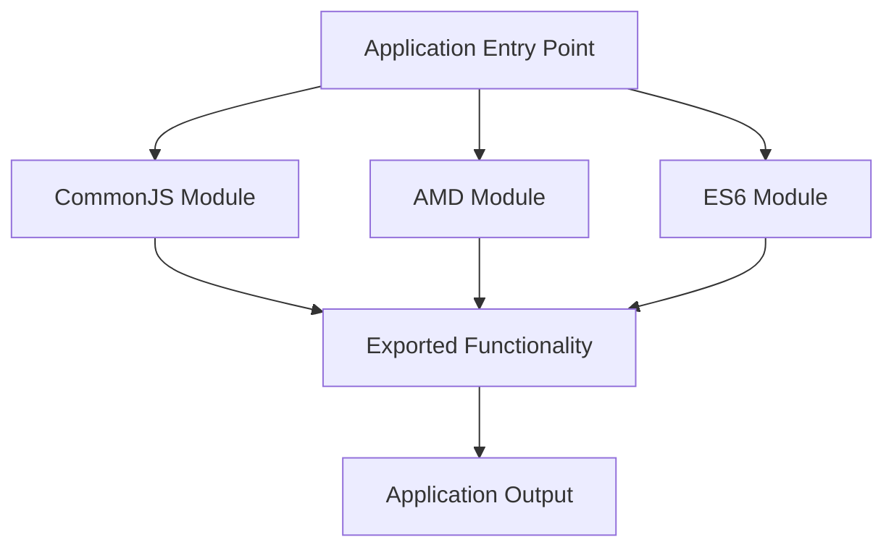

## 13.1 Module Systems and Code Organization

In the world of software development, organizing code effectively is crucial for maintaining a scalable and efficient codebase. As applications grow in complexity, managing code dependencies and namespaces becomes increasingly challenging. This is where JavaScript module systems come into play. In this section, we will explore the need for modules, delve into different module systems such as CommonJS, AMD, and ES6 modules, and understand how tools like Webpack help in managing these systems. By the end of this guide, you'll have a solid understanding of how to structure your projects for scalability and maintainability.

### Why Do We Need Modules?

Before diving into the specifics of module systems, let's first understand why modules are essential in JavaScript development. Modules help in:

- **Managing Code Dependencies**: As your application grows, so does the number of files and dependencies. Modules allow you to manage these dependencies efficiently.
- **Avoiding Global Namespace Pollution**: In JavaScript, all variables declared in the global scope are accessible throughout the application. Modules help encapsulate code, reducing the risk of variable name collisions.
- **Improving Code Reusability**: Modules promote the reuse of code by allowing you to import and export functionality across different parts of your application.
- **Facilitating Lazy Loading**: Modules enable lazy loading, which means loading only the necessary parts of the application when needed, improving performance.
- **Enhancing Maintainability**: With a modular structure, it's easier to maintain and update code without affecting other parts of the application.

### Introduction to JavaScript Module Systems

JavaScript has evolved over the years, and so have its module systems. Let's explore the three main module systems: CommonJS, AMD, and ES6 modules.

#### CommonJS

CommonJS is a module system primarily used in Node.js environments. It was designed to provide a way to structure code in server-side applications.

- **Syntax**: CommonJS uses `require()` to import modules and `module.exports` to export them.

```javascript
// math.js
const add = (a, b) => a + b;
const subtract = (a, b) => a - b;

module.exports = { add, subtract };

// app.js
const math = require('./math');
console.log(math.add(2, 3)); // Output: 5
```

- **Characteristics**: 
  - Synchronous loading of modules.
  - Best suited for server-side applications where synchronous loading is acceptable.
  - Widely used in Node.js applications.

#### Asynchronous Module Definition (AMD)

AMD is a module system designed for the browser. It allows asynchronous loading of modules, which is crucial for web applications to avoid blocking the user interface.

- **Syntax**: AMD uses `define()` to define modules and `require()` to load them.

```javascript
// math.js
define([], function() {
  const add = (a, b) => a + b;
  const subtract = (a, b) => a - b;
  return { add, subtract };
});

// app.js
require(['math'], function(math) {
  console.log(math.add(2, 3)); // Output: 5
});
```

- **Characteristics**:
  - Asynchronous loading of modules.
  - Suitable for browser environments.
  - Often used with libraries like RequireJS.

#### ES6 Modules

ES6 modules are the standardized module system introduced in ECMAScript 2015 (ES6). They are now widely supported in modern browsers and can be used in both client-side and server-side applications.

- **Syntax**: ES6 modules use `import` and `export` keywords.

```javascript
// math.js
export const add = (a, b) => a + b;
export const subtract = (a, b) => a - b;

// app.js
import { add, subtract } from './math.js';
console.log(add(2, 3)); // Output: 5
```

- **Characteristics**:
  - Static analysis of imports and exports.
  - Support for both synchronous and asynchronous loading.
  - Native support in modern browsers and Node.js (with the `.mjs` extension or `"type": "module"` in `package.json`).

### Module Bundlers: Webpack

While module systems help in organizing code, module bundlers like Webpack play a crucial role in managing these modules, especially in complex applications.

#### What is Webpack?

Webpack is a popular module bundler for JavaScript applications. It takes modules with dependencies and generates static assets representing those modules.

- **Features**:
  - **Code Splitting**: Breaks down code into smaller chunks, which can be loaded on demand.
  - **Loaders**: Transforms files into modules as they are added to the dependency graph.
  - **Plugins**: Extends Webpack's capabilities with additional functionality.

#### How Webpack Handles Different Module Systems

Webpack supports various module systems, including CommonJS, AMD, and ES6 modules. It can bundle these modules into a single file or multiple files for optimized loading.

- **Configuration Example**:

```javascript
// webpack.config.js
const path = require('path');

module.exports = {
  entry: './src/index.js',
  output: {
    filename: 'bundle.js',
    path: path.resolve(__dirname, 'dist')
  },
  module: {
    rules: [
      {
        test: /\.js$/,
        exclude: /node_modules/,
        use: {
          loader: 'babel-loader',
          options: {
            presets: ['@babel/preset-env']
          }
        }
      }
    ]
  }
};
```

- **Code Splitting Example**:

```javascript
// index.js
import('./math.js').then(math => {
  console.log(math.add(2, 3)); // Output: 5
});
```

### Structuring Projects with Modules

Organizing your codebase into modules is essential for scalability and maintainability. Here are some best practices for structuring projects with modules:

1. **Divide by Feature**: Organize modules by feature rather than by type. This makes it easier to locate and manage related code.

```
/src
  /features
    /auth
      login.js
      signup.js
    /dashboard
      dashboard.js
```

2. **Use Index Files**: Create an `index.js` file in each directory to export all modules, simplifying imports.

```javascript
// /features/auth/index.js
export { default as login } from './login';
export { default as signup } from './signup';

// Usage
import { login, signup } from './features/auth';
```

3. **Encapsulate Functionality**: Ensure each module encapsulates a specific functionality or feature, promoting reusability.

4. **Consistent Naming Conventions**: Use consistent naming conventions for files and directories to improve readability and maintainability.

5. **Documentation**: Document each module's purpose and usage to facilitate collaboration and onboarding.

### Benefits of Using Modules

Using modules in your JavaScript projects offers several benefits:

- **Code Reuse**: Modules allow you to reuse code across different parts of your application, reducing redundancy.
- **Lazy Loading**: Load only the necessary modules when needed, improving application performance.
- **Reduced Global Scope Pollution**: Encapsulate code within modules, minimizing the risk of variable name collisions.
- **Improved Maintainability**: A modular structure makes it easier to update and maintain code without affecting other parts of the application.

### Compatibility Considerations

When integrating various module systems, it's essential to consider compatibility issues:

- **Browser Support**: Ensure that the module system you choose is supported by the browsers you target. ES6 modules are widely supported in modern browsers.
- **Transpilation**: Use tools like Babel to transpile modern JavaScript code (including ES6 modules) to a format compatible with older browsers.
- **Polyfills**: Include polyfills for features not natively supported in older environments.

### Try It Yourself

To get hands-on experience with modules, try the following exercises:

1. **Create a Simple Module**: Write a module that exports a function to calculate the area of a rectangle. Import and use this module in another file.

2. **Experiment with Webpack**: Set up a basic Webpack configuration and bundle a simple project with multiple modules.

3. **Explore Code Splitting**: Implement code splitting in a Webpack project and observe how it affects loading times.

### Visualizing Module Systems

To better understand how module systems work, let's visualize the process using a flowchart.



**Diagram Explanation**: This flowchart illustrates how different module systems (CommonJS, AMD, ES6) export functionality that is then used in the application output.

### References and Links

For further reading on JavaScript module systems and code organization, check out the following resources:

- [MDN Web Docs: JavaScript Modules](https://developer.mozilla.org/en-US/docs/Web/JavaScript/Guide/Modules)
- [Webpack Official Documentation](https://webpack.js.org/)
- [Node.js Modules Documentation](https://nodejs.org/api/modules.html)

### Knowledge Check

Before moving on, let's review some key points:

- **What are the main benefits of using modules in JavaScript?**
- **How do CommonJS and AMD differ in terms of loading modules?**
- **What role does Webpack play in managing modules?**

### Embrace the Journey

Remember, mastering module systems and code organization is a journey. As you continue to build and scale your applications, the concepts covered here will become second nature. Keep experimenting, stay curious, and enjoy the process of creating clean, efficient, and maintainable code.

## Quiz Time!



### What is one of the main benefits of using modules in JavaScript?

- [x] Reducing global scope pollution
- [ ] Increasing global scope pollution
- [ ] Decreasing code reusability
- [ ] Slowing down application performance

> **Explanation:** Modules help encapsulate code, reducing the risk of variable name collisions and global scope pollution.


### Which module system is primarily used in Node.js environments?

- [x] CommonJS
- [ ] AMD
- [ ] ES6 Modules
- [ ] UMD

> **Explanation:** CommonJS is the module system used in Node.js environments for server-side applications.


### What is the main characteristic of AMD modules?

- [ ] Synchronous loading
- [x] Asynchronous loading
- [ ] Static analysis
- [ ] Server-side usage

> **Explanation:** AMD modules allow asynchronous loading, which is crucial for non-blocking operations in web applications.


### Which keyword is used to export functionality in ES6 modules?

- [ ] require
- [ ] define
- [x] export
- [ ] module.exports

> **Explanation:** The `export` keyword is used in ES6 modules to export functionality.


### What tool is commonly used to bundle JavaScript modules?

- [ ] Babel
- [x] Webpack
- [ ] ESLint
- [ ] Prettier

> **Explanation:** Webpack is a popular module bundler that manages dependencies and generates static assets.


### How does Webpack handle different module systems?

- [x] By bundling them into a single file or multiple files
- [ ] By ignoring them
- [ ] By converting them to CommonJS
- [ ] By converting them to AMD

> **Explanation:** Webpack can bundle various module systems into a single file or multiple files for optimized loading.


### What is a best practice for structuring projects with modules?

- [x] Divide by feature
- [ ] Divide by file size
- [ ] Divide by color
- [ ] Divide by author

> **Explanation:** Organizing modules by feature makes it easier to manage related code and improve scalability.


### What is the purpose of using index files in module directories?

- [x] To simplify imports
- [ ] To complicate imports
- [ ] To increase file size
- [ ] To decrease file size

> **Explanation:** Index files export all modules in a directory, simplifying the import process.


### What should you consider when integrating various module systems?

- [x] Compatibility issues
- [ ] Color schemes
- [ ] File extensions
- [ ] Author names

> **Explanation:** Compatibility issues, such as browser support and transpilation, should be considered when integrating module systems.


### ES6 modules are now widely supported in modern browsers.

- [x] True
- [ ] False

> **Explanation:** ES6 modules are natively supported in modern browsers, making them a standard choice for both client-side and server-side applications.


