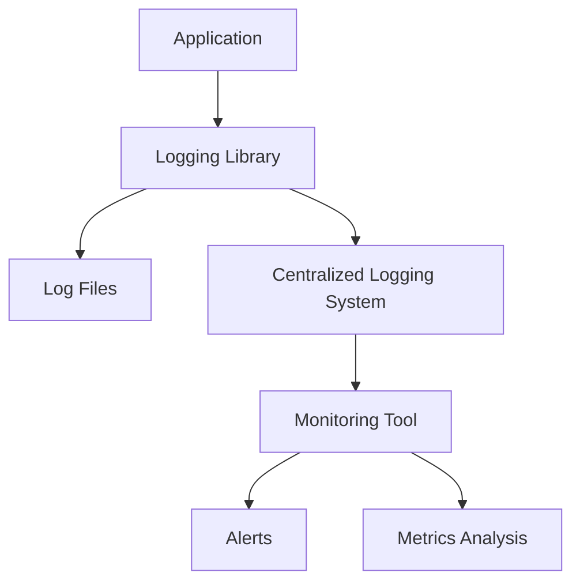

## 13.10 Monitoring and Logging

In the world of software development, ensuring that applications run smoothly and efficiently is crucial. Monitoring and logging are two essential practices that help developers maintain application health, identify performance bottlenecks, and debug issues effectively. In this section, we'll explore the role of logging in debugging and monitoring, introduce popular logging libraries, and discuss best practices for structuring log messages. We'll also delve into centralized logging systems, tools and services for monitoring, and the importance of proactive monitoring.

### The Role of Logging in Debugging and Monitoring

Logging is the process of recording information about an application's execution. It provides insights into the application's behavior, helping developers understand what happened at a particular point in time. Logs are invaluable for debugging, as they can reveal the sequence of events leading to an issue. Additionally, logs are used for monitoring application performance and detecting anomalies.

#### Key Benefits of Logging:

- **Debugging**: Logs help trace the source of errors and understand the context in which they occurred.
- **Performance Monitoring**: Logs can indicate performance issues, such as slow response times or resource bottlenecks.
- **Security**: Logs can track unauthorized access attempts or suspicious activities.
- **Audit Trails**: Logs provide a record of actions taken within an application, useful for compliance and auditing.

### Introducing Logging Libraries

JavaScript offers several libraries to facilitate logging. These libraries provide features like log levels, formatting, and output options. Let's explore some popular logging libraries:

#### 1. **Winston**

Winston is a versatile logging library for Node.js applications. It supports multiple transports (e.g., console, file, HTTP) and allows for custom log levels.

```javascript
const winston = require('winston');

const logger = winston.createLogger({
  level: 'info',
  format: winston.format.json(),
  transports: [
    new winston.transports.Console(),
    new winston.transports.File({ filename: 'application.log' })
  ]
});

logger.info('This is an info message');
logger.error('This is an error message');
```

#### 2. **Log4js**

Log4js is another popular logging library for Node.js, inspired by the Java library log4j. It supports various appenders and log levels.

```javascript
const log4js = require('log4js');

log4js.configure({
  appenders: { file: { type: 'file', filename: 'app.log' } },
  categories: { default: { appenders: ['file'], level: 'info' } }
});

const logger = log4js.getLogger();

logger.info('This is an info message');
logger.warn('This is a warning message');
```

### Best Practices for Structuring Log Messages

Effective logging requires structuring log messages in a way that makes them easy to understand and analyze. Here are some best practices:

- **Use Log Levels**: Categorize logs by severity (e.g., DEBUG, INFO, WARN, ERROR) to filter and prioritize messages.
- **Include Contextual Information**: Add relevant details like timestamps, user IDs, and request IDs to provide context.
- **Be Consistent**: Use a consistent format for log messages to make them easier to parse and analyze.
- **Avoid Sensitive Information**: Do not log sensitive data such as passwords or personal information.
- **Log at Appropriate Levels**: Use different log levels appropriately to avoid cluttering logs with unnecessary information.

### Implementing Centralized Logging Systems

Centralized logging systems aggregate logs from multiple sources, making it easier to search, analyze, and visualize log data. These systems are essential for large applications with distributed components.

#### Popular Centralized Logging Solutions:

- **Elasticsearch, Logstash, and Kibana (ELK Stack)**: A powerful stack for collecting, storing, and visualizing log data.
- **Graylog**: An open-source log management platform that supports real-time search and analysis.
- **Splunk**: A commercial solution for searching, monitoring, and analyzing machine-generated data.

### Tools and Services for Monitoring

Monitoring tools provide real-time insights into application performance and health. They help detect issues before they impact users and facilitate proactive maintenance.

#### Popular Monitoring Tools:

- **New Relic**: Offers application performance monitoring (APM) and infrastructure monitoring.
- **Prometheus**: An open-source monitoring system with a powerful query language and alerting capabilities.
- **Datadog**: Provides monitoring and analytics for applications, infrastructure, and logs.

### Setting Up Alerts and Analyzing Metrics

Alerts notify developers of potential issues, allowing for quick response and resolution. Monitoring tools typically offer alerting features based on predefined thresholds or anomalies.

#### Steps to Set Up Alerts:

1. **Define Metrics**: Identify key performance indicators (KPIs) to monitor, such as response times, error rates, and resource utilization.
2. **Set Thresholds**: Establish acceptable ranges for each metric and define thresholds for alerts.
3. **Configure Alerts**: Use monitoring tools to set up alerts based on defined thresholds.
4. **Analyze Metrics**: Regularly review metrics to identify trends and potential issues.

### Proactive Monitoring to Detect and Resolve Issues

Proactive monitoring involves continuously observing application performance and health to detect issues before they affect users. It enables developers to address problems early, reducing downtime and improving user experience.

#### Key Strategies for Proactive Monitoring:

- **Regularly Review Logs**: Analyze logs for patterns or anomalies that may indicate issues.
- **Automate Monitoring**: Use tools to automate data collection and analysis, freeing up time for developers.
- **Conduct Load Testing**: Simulate high-traffic scenarios to identify performance bottlenecks.
- **Implement Health Checks**: Regularly test application components to ensure they are functioning correctly.

### Visualizing Monitoring and Logging

To better understand the flow of monitoring and logging, let's visualize the process using a flowchart.



**Diagram Description**: This flowchart illustrates the process of logging and monitoring in an application. Logs are generated by the application and processed by a logging library. They are then stored in log files and/or sent to a centralized logging system. The centralized system integrates with a monitoring tool, which provides alerts and metrics analysis.

### Try It Yourself

Experiment with the logging code examples provided earlier. Try changing log levels, adding contextual information, or integrating with a centralized logging system. Observe how different configurations affect the output and usefulness of logs.

### References and Links

- [MDN Web Docs: Logging](https://developer.mozilla.org/en-US/docs/Web/API/Console/log)
- [Winston Documentation](https://github.com/winstonjs/winston)
- [Log4js Documentation](https://log4js-node.github.io/log4js-node/)
- [New Relic](https://newrelic.com/)
- [Prometheus](https://prometheus.io/)
- [Datadog](https://www.datadoghq.com/)

### Knowledge Check

- What are the key benefits of logging in an application?
- How do logging libraries like Winston and Log4js help in managing logs?
- What are some best practices for structuring log messages?
- Why is centralized logging important for large applications?
- How do monitoring tools like New Relic and Prometheus assist in maintaining application health?

### Embrace the Journey

Remember, logging and monitoring are ongoing processes that require regular attention and refinement. As you gain experience, you'll develop a deeper understanding of your application's behavior and how to maintain its health effectively. Keep experimenting, stay curious, and enjoy the journey!

## Quiz Time!



### What is the primary role of logging in an application?

- [x] To record information about the application's execution
- [ ] To increase the application's speed
- [ ] To replace the need for testing
- [ ] To store user data

> **Explanation:** Logging records information about the application's execution, which is crucial for debugging and monitoring.

### Which of the following is a popular logging library for Node.js?

- [x] Winston
- [ ] React
- [ ] Angular
- [ ] Vue

> **Explanation:** Winston is a popular logging library for Node.js applications, providing various features for managing logs.

### What is a centralized logging system used for?

- [x] Aggregating logs from multiple sources
- [ ] Increasing application speed
- [ ] Replacing the need for monitoring
- [ ] Storing user passwords

> **Explanation:** A centralized logging system aggregates logs from multiple sources, making it easier to search, analyze, and visualize log data.

### What is the purpose of setting up alerts in monitoring tools?

- [x] To notify developers of potential issues
- [ ] To increase application speed
- [ ] To replace the need for logging
- [ ] To store user data

> **Explanation:** Alerts notify developers of potential issues, allowing for quick response and resolution.

### Which of the following is NOT a best practice for structuring log messages?

- [ ] Use log levels
- [ ] Include contextual information
- [x] Log sensitive information
- [ ] Be consistent

> **Explanation:** Logging sensitive information is not a best practice, as it can lead to security risks.

### What is proactive monitoring?

- [x] Continuously observing application performance to detect issues early
- [ ] Waiting for users to report issues
- [ ] Ignoring application performance
- [ ] Storing user data

> **Explanation:** Proactive monitoring involves continuously observing application performance to detect issues before they affect users.

### Which tool is known for application performance monitoring (APM)?

- [x] New Relic
- [ ] React
- [ ] Angular
- [ ] Vue

> **Explanation:** New Relic is known for application performance monitoring (APM) and infrastructure monitoring.

### What is a key benefit of using log levels?

- [x] To categorize logs by severity
- [ ] To increase application speed
- [ ] To replace the need for testing
- [ ] To store user data

> **Explanation:** Log levels categorize logs by severity, helping to filter and prioritize messages.

### Which of the following is an open-source monitoring system?

- [x] Prometheus
- [ ] React
- [ ] Angular
- [ ] Vue

> **Explanation:** Prometheus is an open-source monitoring system with a powerful query language and alerting capabilities.

### True or False: Logs should include sensitive information like passwords.

- [ ] True
- [x] False

> **Explanation:** Logs should not include sensitive information like passwords, as this can lead to security risks.


