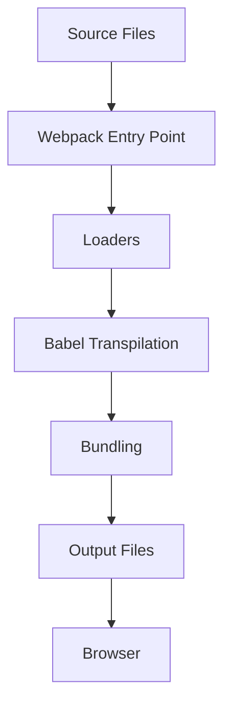

## 13.2 Using Webpack and Babel

In the modern JavaScript ecosystem, Webpack and Babel have become essential tools for developers. They help manage and optimize code, ensuring it runs smoothly across different environments. In this section, we will explore how Webpack bundles assets and dependencies, and how Babel transpiles modern JavaScript into a format compatible with older browsers. We'll provide step-by-step instructions for setting up these tools in your project, discuss configuring loaders and plugins, and demonstrate enabling advanced features like code splitting and hot module replacement.

### Understanding Webpack

Webpack is a static module bundler for JavaScript applications. It takes modules with dependencies and generates static assets representing those modules. Webpack's primary purpose is to bundle JavaScript files for usage in a browser, but it can also transform or package other resources like CSS, images, and fonts.

#### Why Use Webpack?

- **Module Bundling**: Webpack bundles JavaScript files into a single file or smaller chunks, reducing the number of HTTP requests.
- **Asset Management**: It handles assets like images and stylesheets, optimizing them for better performance.
- **Development Enhancements**: Features like Hot Module Replacement (HMR) and live reloading improve the development experience.
- **Code Splitting**: Webpack can split code into smaller chunks, loading them on demand to improve performance.

### Setting Up Webpack

Let's walk through setting up Webpack in a JavaScript project.

#### Step 1: Install Webpack

First, ensure you have Node.js and npm installed. Then, create a new project directory and initialize it:

```bash
mkdir my-webpack-project
cd my-webpack-project
npm init -y
```

Next, install Webpack and Webpack CLI as development dependencies:

```bash
npm install webpack webpack-cli --save-dev
```

#### Step 2: Create a Basic Webpack Configuration

Create a `webpack.config.js` file in your project root:

```javascript
const path = require('path');

module.exports = {
  entry: './src/index.js', // Entry point for your application
  output: {
    filename: 'bundle.js', // Output file name
    path: path.resolve(__dirname, 'dist'), // Output directory
  },
  mode: 'development', // Set mode to 'development' or 'production'
};
```

This configuration specifies the entry point, output file, and mode. The entry point is the main file Webpack will start from, and the output is where the bundled file will be saved.

#### Step 3: Create Source Files

Create a `src` directory and an `index.js` file:

```javascript
// src/index.js
console.log('Hello, Webpack!');
```

#### Step 4: Build the Project

Add a build script to your `package.json`:

```json
"scripts": {
  "build": "webpack"
}
```

Run the build script:

```bash
npm run build
```

Webpack will create a `dist` directory with the bundled `bundle.js` file.

### Introducing Babel

Babel is a JavaScript compiler that allows you to use next-generation JavaScript today. It transpiles modern JavaScript (ES6+) into backward-compatible versions for older browsers.

#### Why Use Babel?

- **Compatibility**: Ensures your code runs on older browsers that don't support modern JavaScript features.
- **Syntax Features**: Use the latest JavaScript syntax and features without waiting for browser support.
- **Plugins and Presets**: Extend Babel's capabilities with plugins and presets for specific syntax transformations.

### Setting Up Babel

Let's integrate Babel into our Webpack setup.

#### Step 1: Install Babel

Install Babel core and the necessary presets:

```bash
npm install @babel/core @babel/preset-env babel-loader --save-dev
```

#### Step 2: Configure Babel

Create a `.babelrc` file in your project root:

```json
{
  "presets": ["@babel/preset-env"]
}
```

This configuration tells Babel to use the `@babel/preset-env` preset, which automatically determines the Babel plugins you need based on your target environments.

#### Step 3: Update Webpack Configuration

Modify `webpack.config.js` to include Babel:

```javascript
const path = require('path');

module.exports = {
  entry: './src/index.js',
  output: {
    filename: 'bundle.js',
    path: path.resolve(__dirname, 'dist'),
  },
  module: {
    rules: [
      {
        test: /\.js$/, // Apply this rule to JavaScript files
        exclude: /node_modules/, // Exclude node_modules directory
        use: {
          loader: 'babel-loader', // Use Babel loader
        },
      },
    ],
  },
  mode: 'development',
};
```

This configuration adds a rule for processing JavaScript files with Babel.

### Configuring Loaders and Plugins

Webpack uses loaders to preprocess files and plugins to perform a wider range of tasks. Let's explore some common loaders and plugins.

#### Loaders

- **CSS Loader**: Processes CSS files and injects them into the DOM.
- **File Loader**: Handles importing files like images and fonts.
- **Sass Loader**: Compiles Sass to CSS.

#### Plugins

- **HtmlWebpackPlugin**: Generates an HTML file and injects script tags for your bundles.
- **CleanWebpackPlugin**: Cleans the output directory before each build.
- **MiniCssExtractPlugin**: Extracts CSS into separate files.

#### Example: Adding CSS Support

Install the necessary loaders:

```bash
npm install css-loader style-loader --save-dev
```

Update `webpack.config.js`:

```javascript
const path = require('path');

module.exports = {
  entry: './src/index.js',
  output: {
    filename: 'bundle.js',
    path: path.resolve(__dirname, 'dist'),
  },
  module: {
    rules: [
      {
        test: /\.js$/,
        exclude: /node_modules/,
        use: {
          loader: 'babel-loader',
        },
      },
      {
        test: /\.css$/, // Apply this rule to CSS files
        use: ['style-loader', 'css-loader'], // Use style and CSS loaders
      },
    ],
  },
  mode: 'development',
};
```

Create a CSS file and import it in your JavaScript:

```css
/* src/styles.css */
body {
  background-color: lightblue;
}
```

```javascript
// src/index.js
import './styles.css';
console.log('Hello, Webpack with CSS!');
```

### Advanced Features: Code Splitting and Hot Module Replacement

Webpack offers advanced features to enhance performance and development workflow.

#### Code Splitting

Code splitting allows you to split your code into separate bundles, which can be loaded on demand. This improves load times and performance.

Update `webpack.config.js` to enable code splitting:

```javascript
const path = require('path');

module.exports = {
  entry: {
    main: './src/index.js',
    vendor: './src/vendor.js', // Separate entry for vendor code
  },
  output: {
    filename: '[name].bundle.js', // Use name placeholders for output files
    path: path.resolve(__dirname, 'dist'),
  },
  module: {
    rules: [
      {
        test: /\.js$/,
        exclude: /node_modules/,
        use: {
          loader: 'babel-loader',
        },
      },
      {
        test: /\.css$/,
        use: ['style-loader', 'css-loader'],
      },
    ],
  },
  optimization: {
    splitChunks: {
      chunks: 'all', // Split all chunks
    },
  },
  mode: 'development',
};
```

#### Hot Module Replacement (HMR)

HMR allows you to update modules in the browser without a full reload, preserving application state.

Install the Webpack Dev Server:

```bash
npm install webpack-dev-server --save-dev
```

Update `webpack.config.js`:

```javascript
const path = require('path');

module.exports = {
  entry: './src/index.js',
  output: {
    filename: 'bundle.js',
    path: path.resolve(__dirname, 'dist'),
  },
  devServer: {
    contentBase: path.join(__dirname, 'dist'),
    hot: true, // Enable HMR
  },
  module: {
    rules: [
      {
        test: /\.js$/,
        exclude: /node_modules/,
        use: {
          loader: 'babel-loader',
        },
      },
      {
        test: /\.css$/,
        use: ['style-loader', 'css-loader'],
      },
    ],
  },
  mode: 'development',
};
```

Add a start script to `package.json`:

```json
"scripts": {
  "start": "webpack serve"
}
```

Run the development server:

```bash
npm start
```

Now, changes to your code will be reflected in the browser without a full reload.

### Impact on Development Workflow and Code Performance

Using Webpack and Babel significantly enhances your development workflow and code performance:

- **Improved Load Times**: Code splitting reduces initial load times by loading only necessary code.
- **Modern Syntax**: Babel allows you to use modern JavaScript features without worrying about browser support.
- **Efficient Development**: HMR and live reloading speed up development by reducing the need for manual refreshes.
- **Optimized Assets**: Webpack optimizes assets, reducing file sizes and improving load times.

### Visualizing Webpack and Babel Workflow

To better understand how Webpack and Babel work together, let's visualize the process.



**Diagram Description**: This diagram illustrates the workflow of Webpack and Babel. Source files are processed through Webpack's entry point, where loaders and Babel transpilation occur. The code is then bundled and outputted as files, which are served to the browser.

### Try It Yourself

Now that you've learned the basics of Webpack and Babel, try experimenting with the setup:

- **Add More Loaders**: Try adding loaders for images or fonts.
- **Configure Plugins**: Explore plugins like `HtmlWebpackPlugin` to automate HTML generation.
- **Experiment with Code Splitting**: Create multiple entry points and observe how Webpack handles them.
- **Enable HMR**: Make changes to your code and see how HMR updates the browser without a full reload.

### Summary

Webpack and Babel are powerful tools that enhance JavaScript development by optimizing code and ensuring compatibility across different environments. By setting up Webpack and Babel, you can take advantage of modern JavaScript features, improve performance, and streamline your development workflow. Remember, this is just the beginning. As you progress, you'll build more complex and interactive web applications. Keep experimenting, stay curious, and enjoy the journey!

## Quiz Time!



### What is the primary purpose of Webpack?

- [x] To bundle JavaScript files for usage in a browser
- [ ] To transpile JavaScript code to older versions
- [ ] To manage CSS stylesheets
- [ ] To compile Sass to CSS

> **Explanation:** Webpack is primarily used to bundle JavaScript files for usage in a browser, although it can handle other assets as well.

### Which Babel preset is commonly used to transpile modern JavaScript?

- [x] @babel/preset-env
- [ ] @babel/preset-react
- [ ] @babel/preset-typescript
- [ ] @babel/preset-node

> **Explanation:** The `@babel/preset-env` preset is commonly used to transpile modern JavaScript to ensure compatibility with older browsers.

### How do you enable Hot Module Replacement in Webpack?

- [x] By setting `hot: true` in the `devServer` configuration
- [ ] By installing the `webpack-hot-middleware` package
- [ ] By using the `webpack-hot-server` command
- [ ] By adding `hot: false` in the `devServer` configuration

> **Explanation:** Hot Module Replacement is enabled by setting `hot: true` in the `devServer` configuration in Webpack.

### What is the role of Babel in a JavaScript project?

- [x] To transpile modern JavaScript into backward-compatible versions
- [ ] To bundle JavaScript files into a single file
- [ ] To manage and optimize CSS stylesheets
- [ ] To compile TypeScript to JavaScript

> **Explanation:** Babel is used to transpile modern JavaScript into backward-compatible versions for older browsers.

### Which Webpack feature helps reduce initial load times by loading only necessary code?

- [x] Code Splitting
- [ ] Hot Module Replacement
- [ ] Asset Management
- [ ] Module Bundling

> **Explanation:** Code Splitting in Webpack helps reduce initial load times by loading only the necessary code.

### What command is used to install Webpack and Webpack CLI?

- [x] npm install webpack webpack-cli --save-dev
- [ ] npm install webpack babel --save-dev
- [ ] npm install webpack webpack-dev-server --save-dev
- [ ] npm install webpack-cli babel-cli --save-dev

> **Explanation:** The command `npm install webpack webpack-cli --save-dev` installs Webpack and Webpack CLI as development dependencies.

### How do you specify the output directory in a Webpack configuration?

- [x] By setting the `path` property in the `output` configuration
- [ ] By using the `outputDir` option in the `entry` configuration
- [ ] By adding a `dist` folder in the project root
- [ ] By setting the `outputPath` property in the `module` configuration

> **Explanation:** The `path` property in the `output` configuration specifies the output directory in a Webpack configuration.

### Which loader is used to process CSS files in Webpack?

- [x] css-loader
- [ ] babel-loader
- [ ] file-loader
- [ ] sass-loader

> **Explanation:** The `css-loader` is used to process CSS files in Webpack.

### What is the purpose of the `HtmlWebpackPlugin`?

- [x] To generate an HTML file and inject script tags for your bundles
- [ ] To clean the output directory before each build
- [ ] To extract CSS into separate files
- [ ] To enable Hot Module Replacement

> **Explanation:** The `HtmlWebpackPlugin` generates an HTML file and injects script tags for your bundles.

### True or False: Babel can only be used with Webpack.

- [ ] True
- [x] False

> **Explanation:** False. Babel can be used independently or with other build tools, not just with Webpack.


