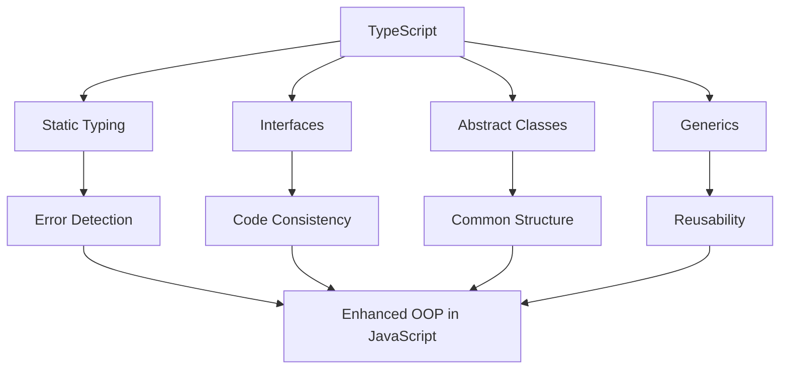

## 13.3 TypeScript for Enhanced OOP

In this section, we will delve into how TypeScript enhances object-oriented programming (OOP) in JavaScript by introducing static typing and advanced features. TypeScript, a superset of JavaScript, provides a robust framework for building scalable and maintainable applications, especially when dealing with complex projects or large teams. Let's explore the benefits of using TypeScript for OOP and how it integrates seamlessly with existing JavaScript codebases.

### Why TypeScript?

TypeScript offers several advantages over plain JavaScript, particularly when it comes to OOP:

- **Static Typing**: TypeScript introduces static typing, which helps catch errors at compile time rather than runtime, leading to more reliable code.
- **Enhanced Readability and Maintainability**: With explicit types, the code becomes more readable and easier to maintain, especially in large codebases.
- **Advanced OOP Features**: TypeScript supports interfaces, abstract classes, and generics, which are not natively available in JavaScript.
- **Tooling and IDE Support**: TypeScript's integration with popular IDEs provides features like autocompletion, refactoring, and navigation, enhancing developer productivity.

### Getting Started with TypeScript

To start using TypeScript, you need to install it and set up a configuration file. Let's walk through these steps:

1. **Installation**: You can install TypeScript globally using npm:

   ```bash
   npm install -g typescript
   ```

2. **Creating a TypeScript Project**: Initialize a new TypeScript project by creating a `tsconfig.json` file. This file configures the TypeScript compiler options.

   ```json
   {
     "compilerOptions": {
       "target": "es6",
       "module": "commonjs",
       "strict": true,
       "outDir": "./dist",
       "rootDir": "./src"
     },
     "include": ["src/**/*"]
   }
   ```

   - **target**: Specifies the JavaScript version to compile to.
   - **module**: Defines the module system.
   - **strict**: Enables all strict type-checking options.
   - **outDir**: The output directory for compiled JavaScript files.
   - **rootDir**: The root directory of TypeScript source files.

3. **Compiling TypeScript**: Use the TypeScript compiler (`tsc`) to compile `.ts` files into JavaScript.

   ```bash
   tsc
   ```

### Defining Interfaces in TypeScript

Interfaces in TypeScript define the structure of an object, providing a contract that classes or objects must adhere to. They are crucial for type-checking and ensuring consistency across your codebase.

```typescript
interface Person {
  name: string;
  age: number;
  greet(): void;
}

class Student implements Person {
  constructor(public name: string, public age: number) {}

  greet() {
    console.log(`Hello, my name is ${this.name} and I am ${this.age} years old.`);
  }
}

const student = new Student("Alice", 21);
student.greet();
```

In this example, the `Person` interface defines a structure with a `name`, `age`, and a `greet` method. The `Student` class implements this interface, ensuring it adheres to the defined structure.

### Abstract Classes in TypeScript

Abstract classes in TypeScript allow you to define methods that must be implemented by derived classes. They provide a way to enforce a common structure while allowing flexibility in implementation.

```typescript
abstract class Animal {
  constructor(public name: string) {}

  abstract makeSound(): void;

  move(): void {
    console.log(`${this.name} is moving.`);
  }
}

class Dog extends Animal {
  makeSound() {
    console.log("Woof! Woof!");
  }
}

const dog = new Dog("Buddy");
dog.makeSound();
dog.move();
```

Here, the `Animal` class is abstract, meaning it cannot be instantiated directly. The `Dog` class extends `Animal` and provides an implementation for the `makeSound` method.

### Generics in TypeScript

Generics allow you to create reusable components that work with any data type. They provide a way to define functions, classes, or interfaces that are type-safe and flexible.

```typescript
function identity<T>(arg: T): T {
  return arg;
}

let output1 = identity<string>("Hello TypeScript");
let output2 = identity<number>(42);

console.log(output1); // Hello TypeScript
console.log(output2); // 42
```

In this example, the `identity` function uses a generic type `T`, allowing it to accept and return any type. This makes the function reusable for different data types.

### TypeScript Compiler and Configuration

The TypeScript compiler (`tsc`) is a powerful tool that converts TypeScript code into JavaScript. The `tsconfig.json` file plays a crucial role in configuring the compiler's behavior.

- **Strict Mode**: Enabling strict mode (`"strict": true`) activates all strict type-checking options, ensuring a higher level of type safety.
- **Module Resolution**: TypeScript supports different module systems like CommonJS, AMD, and ES6 modules. Configure the module system using the `"module"` option.
- **Source Maps**: Generate source maps for easier debugging by setting `"sourceMap": true`.

### Integrating TypeScript with JavaScript Codebases

One of TypeScript's strengths is its ability to integrate with existing JavaScript codebases. You can gradually adopt TypeScript by renaming `.js` files to `.ts` and adding type annotations.

- **Incremental Adoption**: Start by adding TypeScript to new files or modules, gradually refactoring existing code.
- **Type Definitions**: Use DefinitelyTyped to find type definitions for third-party libraries, ensuring type safety when using external packages.

### Common Challenges and Solutions

When adopting TypeScript, you may encounter challenges, especially when dealing with third-party libraries or legacy code.

- **Third-Party Libraries**: Not all libraries have type definitions. Use `@types` packages or create custom type declarations.
- **Legacy Code**: Refactoring large codebases can be daunting. Focus on critical modules first and use `any` type as a temporary solution.

### Benefits for Large Teams and Complex Projects

TypeScript shines in large teams and complex projects due to its static typing and tooling support.

- **Code Quality**: Static typing reduces runtime errors and improves code quality.
- **Collaboration**: Explicit types make the codebase easier to understand, facilitating collaboration among team members.
- **Refactoring**: TypeScript's tooling support simplifies refactoring, making it easier to maintain and evolve the codebase.

### Visualizing TypeScript's Role in OOP

To better understand how TypeScript enhances OOP, let's visualize the interaction between TypeScript's features and JavaScript's OOP capabilities.



This diagram illustrates how TypeScript's features contribute to enhanced OOP in JavaScript, leading to more robust and maintainable code.

### Try It Yourself

Experiment with TypeScript by modifying the code examples provided. Try creating your own interfaces, abstract classes, and generic functions. Observe how TypeScript's static typing helps catch errors early and enhances code readability.

### References and Further Reading

- [TypeScript Official Documentation](https://www.typescriptlang.org/docs/)
- [MDN Web Docs: TypeScript](https://developer.mozilla.org/en-US/docs/Web/JavaScript/Reference/Global_Objects/TypeScript)
- [DefinitelyTyped](https://github.com/DefinitelyTyped/DefinitelyTyped)

### Knowledge Check

Before we wrap up, let's reinforce what we've learned with a few questions and exercises.

- **Exercise 1**: Create a TypeScript interface for a `Vehicle` with properties like `make`, `model`, and `year`. Implement this interface in a `Car` class.
- **Exercise 2**: Define an abstract class `Shape` with an abstract method `calculateArea`. Create subclasses `Circle` and `Rectangle` that implement this method.
- **Exercise 3**: Write a generic function that takes an array of any type and returns the first element.

### Embrace the Journey

Remember, learning TypeScript is a journey. As you continue to explore its features, you'll find new ways to enhance your JavaScript applications. Stay curious, experiment with different concepts, and enjoy the process of becoming a more proficient developer.

## Quiz Time!



### What is one of the main benefits of using TypeScript in JavaScript projects?

- [x] Static typing
- [ ] Dynamic typing
- [ ] Faster runtime performance
- [ ] Smaller file sizes

> **Explanation:** Static typing is a key feature of TypeScript, allowing developers to catch errors at compile time.

### How do you define an interface in TypeScript?

- [x] Using the `interface` keyword
- [ ] Using the `class` keyword
- [ ] Using the `function` keyword
- [ ] Using the `type` keyword

> **Explanation:** Interfaces in TypeScript are defined using the `interface` keyword, which specifies a contract for classes to follow.

### What is the purpose of abstract classes in TypeScript?

- [x] To define methods that must be implemented by derived classes
- [ ] To create instances directly
- [ ] To provide default implementations for all methods
- [ ] To enforce strict typing

> **Explanation:** Abstract classes define methods that must be implemented by derived classes, providing a common structure.

### Which TypeScript feature allows you to create reusable components that work with any data type?

- [x] Generics
- [ ] Interfaces
- [ ] Abstract classes
- [ ] Modules

> **Explanation:** Generics in TypeScript allow you to create reusable components that work with any data type, enhancing flexibility.

### What is the role of the `tsconfig.json` file in a TypeScript project?

- [x] To configure the TypeScript compiler options
- [ ] To define the project's dependencies
- [ ] To specify the project's entry point
- [ ] To list all TypeScript files in the project

> **Explanation:** The `tsconfig.json` file configures the TypeScript compiler options, such as target JavaScript version and module system.

### How can TypeScript be integrated into an existing JavaScript codebase?

- [x] By gradually adding TypeScript files and type annotations
- [ ] By rewriting all code in TypeScript at once
- [ ] By using a different compiler for JavaScript
- [ ] By converting JavaScript to TypeScript automatically

> **Explanation:** TypeScript can be integrated into an existing JavaScript codebase by gradually adding TypeScript files and type annotations.

### Which TypeScript feature helps in catching errors at compile time?

- [x] Static typing
- [ ] Dynamic typing
- [ ] Module resolution
- [ ] Source maps

> **Explanation:** Static typing in TypeScript helps catch errors at compile time, improving code reliability.

### What is a common challenge when adopting TypeScript in a project?

- [x] Dealing with third-party libraries without type definitions
- [ ] Lack of IDE support
- [ ] Increased runtime errors
- [ ] Difficulty in writing JavaScript code

> **Explanation:** A common challenge when adopting TypeScript is dealing with third-party libraries that do not have type definitions.

### True or False: TypeScript can only be used in new projects, not existing ones.

- [ ] True
- [x] False

> **Explanation:** False. TypeScript can be integrated into existing projects by gradually adding TypeScript files and type annotations.

### Why is TypeScript beneficial for large teams?

- [x] It improves code readability and maintainability
- [ ] It reduces the need for documentation
- [ ] It eliminates the need for testing
- [ ] It automatically optimizes code for performance

> **Explanation:** TypeScript improves code readability and maintainability, making it easier for large teams to collaborate and understand the codebase.


