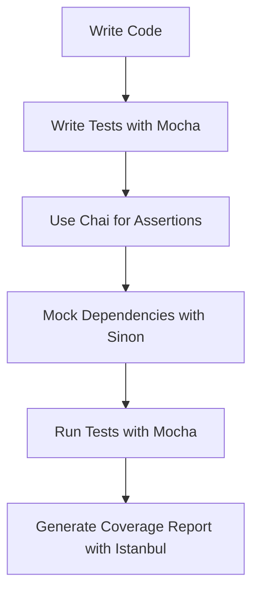

## 13.4 Testing Frameworks and Libraries

In the world of software development, testing is a critical component that ensures the reliability and quality of your code. As we delve into Object-Oriented Programming (OOP) in JavaScript, understanding how to effectively test our code is paramount. In this section, we will explore some of the most popular testing frameworks and libraries that can enhance your testing strategy: Mocha, Chai, and Sinon. We will also discuss how these tools can be integrated with coverage tools like Istanbul to provide comprehensive testing solutions.

### Introduction to Testing Frameworks

Before we dive into specific tools, let's briefly discuss what a testing framework is. A testing framework provides a structured environment to write, organize, and run tests. It helps automate the testing process, making it easier to identify bugs and ensure that your code behaves as expected. Testing frameworks often come with features like test runners, assertion libraries, and tools for mocking and stubbing.

### Mocha: A Feature-Rich Testing Framework

Mocha is a popular JavaScript testing framework that runs on Node.js and in the browser. It is known for its flexibility, allowing developers to choose their assertion libraries and mocking tools. Mocha provides a simple syntax for writing tests and supports asynchronous testing, making it a great choice for testing JavaScript applications.

#### Setting Up Mocha

To get started with Mocha, you need to install it using npm (Node Package Manager). Open your terminal and run the following command:

```bash
npm install --save-dev mocha
```

Once installed, you can create a test directory and add your test files. Mocha will automatically detect and run these files.

#### Writing Your First Test with Mocha

Let's write a simple test using Mocha. Suppose we have a function `add` that adds two numbers:

```javascript
// add.js
function add(a, b) {
  return a + b;
}

module.exports = add;
```

Now, let's create a test file to verify that the `add` function works correctly:

```javascript
// test/add.test.js
const assert = require('assert');
const add = require('../add');

describe('Add Function', function() {
  it('should return the sum of two numbers', function() {
    assert.strictEqual(add(2, 3), 5);
  });
});
```

In this example, we use Mocha's `describe` and `it` functions to define our test suite and test case, respectively. We use Node's built-in `assert` module to perform assertions.

#### Running Mocha Tests

To run your tests, you can use the following command:

```bash
npx mocha
```

Mocha will execute all the test files in your test directory and display the results in the terminal.

### Chai: An Assertion Library

While Mocha provides a great test runner, it doesn't include an assertion library. This is where Chai comes in. Chai is a popular assertion library that works seamlessly with Mocha. It offers a variety of assertion styles, including BDD (Behavior-Driven Development) and TDD (Test-Driven Development) styles.

#### Installing Chai

To use Chai, you need to install it via npm:

```bash
npm install --save-dev chai
```

#### Using Chai for Assertions

Let's modify our previous test to use Chai for assertions:

```javascript
// test/add.test.js
const chai = require('chai');
const expect = chai.expect;
const add = require('../add');

describe('Add Function', function() {
  it('should return the sum of two numbers', function() {
    expect(add(2, 3)).to.equal(5);
  });
});
```

In this example, we use Chai's `expect` style for assertions. Chai provides a more expressive and readable syntax compared to Node's built-in `assert` module.

### Sinon: Mocking and Stubbing

In real-world applications, you often need to test code that interacts with external systems or has side effects. Sinon is a library that provides powerful tools for creating mocks, stubs, and spies, allowing you to isolate the code under test.

#### Installing Sinon

To use Sinon, install it via npm:

```bash
npm install --save-dev sinon
```

#### Using Sinon for Mocking

Let's say we have a function that sends an email. We want to test this function without actually sending an email. We can use Sinon to create a mock:

```javascript
// email.js
function sendEmail(to, subject, body) {
  // Imagine this function sends an email
}

module.exports = sendEmail;
```

```javascript
// test/email.test.js
const sinon = require('sinon');
const sendEmail = require('../email');

describe('Send Email Function', function() {
  it('should call the email sending service', function() {
    const sendEmailSpy = sinon.spy(sendEmail);

    sendEmailSpy('test@example.com', 'Hello', 'This is a test email.');

    sinon.assert.calledOnce(sendEmailSpy);
    sinon.assert.calledWith(sendEmailSpy, 'test@example.com', 'Hello', 'This is a test email.');
  });
});
```

In this example, we use Sinon to create a spy on the `sendEmail` function. We then assert that the function was called once with the expected arguments.

### Integrating with Istanbul for Coverage

While writing tests is important, it's equally important to ensure that your tests cover all parts of your code. Istanbul is a tool that provides code coverage analysis, helping you identify untested parts of your codebase.

#### Installing Istanbul

To use Istanbul, install it via npm:

```bash
npm install --save-dev nyc
```

`nyc` is the command-line interface for Istanbul.

#### Running Tests with Coverage

To run your tests with coverage, use the following command:

```bash
npx nyc mocha
```

Istanbul will generate a coverage report, showing you which lines of code were executed during the tests.

### Choosing the Right Tools

When selecting testing frameworks and libraries, consider the following factors:

- **Project Requirements**: Different projects have different testing needs. Choose tools that align with your project's complexity and requirements.
- **Team Preference**: Consider the familiarity and comfort level of your team with different tools.
- **Integration with Other Tools**: Ensure that the tools you choose can be easily integrated with your existing development and deployment workflows.

### Try It Yourself

To get hands-on experience, try modifying the code examples provided. For instance, add more test cases to the `add` function, or create a new function and write tests for it using Mocha, Chai, and Sinon. Experiment with different assertion styles and explore more features of these libraries.

### Visualizing the Testing Workflow

To better understand how these tools work together, let's visualize the testing workflow using a Mermaid.js diagram.



This diagram illustrates the typical workflow when using Mocha, Chai, Sinon, and Istanbul in a JavaScript project.

### Further Reading

For more information on these tools, check out the following resources:

- [Mocha Documentation](https://mochajs.org/)
- [Chai Documentation](https://www.chaijs.com/)
- [Sinon Documentation](https://sinonjs.org/)
- [Istanbul Documentation](https://istanbul.js.org/)

### Knowledge Check

To reinforce your understanding, consider the following questions:

- What are the benefits of using a testing framework like Mocha?
- How does Chai enhance the testing experience?
- In what scenarios would you use Sinon for mocking?
- How does Istanbul help improve your testing strategy?

### Embrace the Journey

Remember, testing is an integral part of the development process. As you continue to learn and grow, you'll find that writing tests becomes second nature. Keep experimenting, stay curious, and enjoy the journey!

## Quiz Time!



### What is Mocha primarily used for in JavaScript testing?

- [x] A test runner for executing tests
- [ ] An assertion library
- [ ] A mocking library
- [ ] A code coverage tool

> **Explanation:** Mocha is primarily used as a test runner to execute JavaScript tests.

### Which assertion style does Chai NOT support?

- [ ] BDD
- [ ] TDD
- [x] JSDoc
- [ ] Assert

> **Explanation:** Chai supports BDD, TDD, and Assert styles, but not JSDoc.

### What is the purpose of Sinon in testing?

- [ ] To run tests
- [x] To mock, stub, and spy on functions
- [ ] To provide assertions
- [ ] To generate coverage reports

> **Explanation:** Sinon is used for creating mocks, stubs, and spies to test functions in isolation.

### How do you install Mocha using npm?

- [x] npm install --save-dev mocha
- [ ] npm install mocha
- [ ] npm install --global mocha
- [ ] npm install mocha --save

> **Explanation:** The correct command to install Mocha as a development dependency is `npm install --save-dev mocha`.

### What does Istanbul provide for testing?

- [ ] Test execution
- [ ] Assertions
- [x] Code coverage analysis
- [ ] Mocking and stubbing

> **Explanation:** Istanbul provides code coverage analysis to identify untested parts of the code.

### Which command runs tests with Mocha and generates a coverage report using Istanbul?

- [ ] npx mocha
- [x] npx nyc mocha
- [ ] npx mocha --coverage
- [ ] npx istanbul mocha

> **Explanation:** The command `npx nyc mocha` runs tests with Mocha and generates a coverage report using Istanbul.

### What is a key feature of Chai?

- [ ] Test running
- [x] Providing expressive assertions
- [ ] Mocking functions
- [ ] Generating coverage reports

> **Explanation:** Chai provides expressive assertions to enhance the readability of tests.

### What does Sinon allow you to do with functions?

- [ ] Execute them
- [x] Spy on them
- [ ] Assert them
- [ ] Cover them

> **Explanation:** Sinon allows you to spy on functions to monitor their behavior during tests.

### What is the main advantage of using testing frameworks?

- [x] Automating the testing process
- [ ] Writing code faster
- [ ] Reducing code size
- [ ] Increasing code complexity

> **Explanation:** Testing frameworks automate the testing process, making it easier to identify bugs and ensure code quality.

### True or False: Mocha, Chai, and Sinon can be used together in a testing workflow.

- [x] True
- [ ] False

> **Explanation:** Mocha, Chai, and Sinon are often used together to provide a comprehensive testing solution for JavaScript applications.


