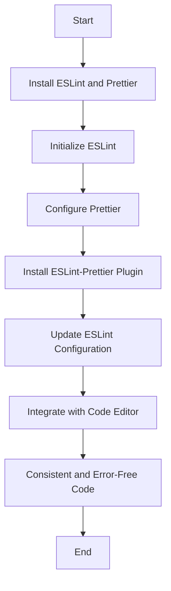

## 13.5 Linting and Formatting with ESLint and Prettier

In the world of software development, maintaining a consistent code style across a project is crucial for readability, maintainability, and collaboration. Two powerful tools that help achieve this in JavaScript projects are ESLint and Prettier. In this section, we will explore how these tools work, how to configure them, and the benefits they bring to your development process.

### Understanding ESLint and Prettier

Before diving into the configuration and integration of ESLint and Prettier, let's understand what each tool does and why they are essential in modern JavaScript development.

#### What is ESLint?

ESLint is a static code analysis tool used to identify problematic patterns in JavaScript code. It helps enforce coding standards and best practices by providing a way to define rules that the code must adhere to. ESLint can catch syntax errors, detect potential bugs, and enforce consistent coding styles.

**Key Features of ESLint:**

- **Customizable Rules:** ESLint allows you to define your own set of rules or extend existing ones.
- **Pluggable Architecture:** You can extend ESLint's functionality with plugins.
- **Integration with Editors:** ESLint integrates with popular code editors for real-time linting.

#### What is Prettier?

Prettier is an opinionated code formatter that enforces a consistent style by parsing your code and reprinting it with its own rules. Unlike ESLint, which focuses on finding and fixing code issues, Prettier automatically formats your code to ensure it adheres to a consistent style.

**Key Features of Prettier:**

- **Automatic Formatting:** Prettier formats your code automatically, eliminating the need for manual adjustments.
- **Supports Multiple Languages:** In addition to JavaScript, Prettier supports HTML, CSS, and more.
- **Integrates with Editors and Build Tools:** Prettier can be integrated into your development workflow easily.

### Why Use ESLint and Prettier Together?

While ESLint and Prettier serve different purposes, they complement each other well. ESLint focuses on code quality and potential errors, while Prettier ensures code style consistency. By using them together, you can maintain high-quality, consistently styled code.

### Setting Up ESLint and Prettier

Let's walk through the process of setting up ESLint and Prettier in a JavaScript project.

#### Step 1: Installing ESLint and Prettier

First, you'll need to install both ESLint and Prettier as development dependencies in your project. You can do this using npm or yarn.

```bash
npm install --save-dev eslint prettier
```

#### Step 2: Initializing ESLint

After installing ESLint, you can initialize it in your project. This will create a configuration file where you can define your linting rules.

```bash
npx eslint --init
```

During the initialization process, you'll be prompted to answer a few questions about your project. Based on your answers, ESLint will generate a configuration file (`.eslintrc.json` or `.eslintrc.js`).

#### Step 3: Configuring Prettier

Prettier doesn't require an initialization step like ESLint, but you can create a configuration file (`.prettierrc`) to customize its behavior. Here's an example configuration:

```json
{
  "semi": false,
  "singleQuote": true,
  "trailingComma": "es5"
}
```

This configuration tells Prettier to format code without semicolons, use single quotes, and include trailing commas where valid in ES5.

### Integrating ESLint and Prettier

To ensure ESLint and Prettier work together without conflicts, you need to configure ESLint to recognize Prettier's formatting rules.

#### Step 4: Installing ESLint-Prettier Plugin

Install the `eslint-config-prettier` and `eslint-plugin-prettier` packages. These packages help integrate Prettier's formatting rules into ESLint.

```bash
npm install --save-dev eslint-config-prettier eslint-plugin-prettier
```

#### Step 5: Updating ESLint Configuration

Modify your ESLint configuration file to include Prettier's rules. Here's an example of how your `.eslintrc.json` might look:

```json
{
  "extends": [
    "eslint:recommended",
    "plugin:prettier/recommended"
  ],
  "plugins": ["prettier"],
  "rules": {
    "prettier/prettier": "error"
  }
}
```

By extending `plugin:prettier/recommended`, you ensure that ESLint respects Prettier's formatting rules. The `prettier/prettier` rule is set to "error," meaning any formatting issues will be treated as errors.

### Benefits of Using ESLint and Prettier

Integrating ESLint and Prettier into your development workflow offers several benefits:

#### Consistent Code Style

Prettier ensures that your code is consistently formatted, regardless of who writes it. This consistency makes it easier to read and understand code, especially in large projects with multiple contributors.

#### Reduced Code Review Overhead

With Prettier handling code formatting, code reviews can focus on logic and functionality rather than style issues. This reduces the time spent on stylistic debates and helps teams collaborate more effectively.

#### Early Error Detection

ESLint catches potential errors and enforces coding standards early in the development process. This proactive approach helps prevent bugs and improves code quality.

#### Improved Developer Experience

By integrating ESLint and Prettier with your code editor, you can receive real-time feedback on code quality and style. This immediate feedback loop enhances the developer experience and encourages adherence to best practices.

### Configuring Rules and Formatting Options

Both ESLint and Prettier offer a wide range of configuration options. Let's explore some common configurations and how they can be customized to suit your project's needs.

#### ESLint Rules

ESLint rules can be configured to enforce specific coding standards. Here are a few examples:

- **Enforcing Consistent Indentation:**

  ```json
  {
    "rules": {
      "indent": ["error", 2]
    }
  }
  ```

  This rule enforces a consistent indentation of 2 spaces.

- **Disallowing Unused Variables:**

  ```json
  {
    "rules": {
      "no-unused-vars": "warn"
    }
  }
  ```

  This rule warns about variables that are declared but not used.

#### Prettier Options

Prettier's configuration options allow you to define your preferred code style. Here are some common options:

- **Using Tabs for Indentation:**

  ```json
  {
    "useTabs": true
  }
  ```

  This option formats code using tabs instead of spaces.

- **Maximum Line Length:**

  ```json
  {
    "printWidth": 80
  }
  ```

  This option sets the maximum line length to 80 characters.

### Integrating ESLint and Prettier with Code Editors

To maximize the benefits of ESLint and Prettier, integrate them with your code editor. Most popular editors, such as Visual Studio Code, have extensions that provide real-time linting and formatting.

#### Visual Studio Code Integration

1. **Install Extensions:**

   - **ESLint Extension:** Provides real-time linting feedback.
   - **Prettier Extension:** Automatically formats code on save.

2. **Configure Settings:**

   In your VS Code settings, you can enable format-on-save and configure ESLint to run automatically.

   ```json
   {
     "editor.formatOnSave": true,
     "eslint.autoFixOnSave": true
   }
   ```

### Visualizing the Integration Process

To better understand how ESLint and Prettier work together, let's visualize the integration process using a flowchart.



**Diagram Description:** This flowchart illustrates the steps to integrate ESLint and Prettier into a JavaScript project, resulting in consistent and error-free code.

### Encouraging Team Consensus on Coding Standards

For ESLint and Prettier to be effective, it's essential for teams to agree on coding standards. Here are some tips for achieving consensus:

1. **Collaborative Discussions:** Involve the entire team in discussions about coding standards and tool configurations. This ensures that everyone has a say and feels invested in the process.

2. **Document Standards:** Create a document outlining the agreed-upon coding standards and tool configurations. This serves as a reference for the team and new members.

3. **Regular Reviews:** Periodically review and update coding standards to reflect changes in the project or team preferences.

### Try It Yourself

To get hands-on experience with ESLint and Prettier, try the following exercise:

1. **Create a New JavaScript Project:** Initialize a new project and install ESLint and Prettier.
2. **Configure ESLint and Prettier:** Set up the tools with your preferred rules and options.
3. **Write Some Code:** Write a simple JavaScript program and intentionally introduce some style inconsistencies.
4. **Run ESLint and Prettier:** Use the tools to identify and fix issues in your code.
5. **Experiment with Configurations:** Modify the configuration files to see how different settings affect your code.

### Conclusion

Integrating ESLint and Prettier into your JavaScript projects is a powerful way to maintain high-quality, consistently styled code. By automating code formatting and enforcing coding standards, these tools reduce the overhead of manual reviews and improve the overall development experience. Remember, this is just the beginning. As you progress, you'll build more complex and interactive web pages. Keep experimenting, stay curious, and enjoy the journey!

## Quiz Time!



### What is the primary purpose of ESLint?

- [x] To identify problematic patterns in JavaScript code
- [ ] To automatically format code
- [ ] To manage project dependencies
- [ ] To compile JavaScript code

> **Explanation:** ESLint is a static code analysis tool used to identify problematic patterns and enforce coding standards in JavaScript code.

### What does Prettier do?

- [ ] Identifies syntax errors
- [x] Automatically formats code
- [ ] Manages project dependencies
- [ ] Compiles JavaScript code

> **Explanation:** Prettier is an opinionated code formatter that automatically formats code to ensure it adheres to a consistent style.

### How can you install ESLint and Prettier in a project?

- [x] Using npm or yarn
- [ ] Using a web browser
- [ ] By downloading a zip file
- [ ] Through a mobile app

> **Explanation:** ESLint and Prettier can be installed as development dependencies in a project using npm or yarn.

### What is the purpose of the `eslint-config-prettier` package?

- [x] To integrate Prettier's formatting rules into ESLint
- [ ] To manage project dependencies
- [ ] To compile JavaScript code
- [ ] To automatically format code

> **Explanation:** The `eslint-config-prettier` package helps integrate Prettier's formatting rules into ESLint, ensuring they work together without conflicts.

### Which configuration file is used to customize Prettier's behavior?

- [x] .prettierrc
- [ ] .eslintrc.json
- [ ] package.json
- [ ] config.js

> **Explanation:** The `.prettierrc` file is used to customize Prettier's behavior and define preferred code style options.

### What is one benefit of using ESLint and Prettier together?

- [x] Consistent code style and early error detection
- [ ] Faster code execution
- [ ] Reduced file size
- [ ] Improved network performance

> **Explanation:** Using ESLint and Prettier together ensures consistent code style and early error detection, improving code quality and maintainability.

### How can you integrate ESLint and Prettier with Visual Studio Code?

- [x] By installing ESLint and Prettier extensions
- [ ] By downloading a zip file
- [ ] Through a mobile app
- [ ] By using a web browser

> **Explanation:** ESLint and Prettier can be integrated with Visual Studio Code by installing their respective extensions, providing real-time feedback and automatic formatting.

### What is the purpose of the `prettier/prettier` rule in ESLint?

- [x] To treat formatting issues as errors
- [ ] To manage project dependencies
- [ ] To compile JavaScript code
- [ ] To automatically format code

> **Explanation:** The `prettier/prettier` rule in ESLint is set to "error," meaning any formatting issues will be treated as errors, ensuring code adheres to Prettier's style.

### Why is it important for teams to agree on coding standards?

- [x] To ensure consistency and collaboration
- [ ] To reduce file size
- [ ] To improve network performance
- [ ] To increase code execution speed

> **Explanation:** Agreeing on coding standards ensures consistency and collaboration within a team, making code easier to read, understand, and maintain.

### True or False: Prettier can only format JavaScript code.

- [ ] True
- [x] False

> **Explanation:** False. Prettier supports multiple languages, including HTML, CSS, and more, in addition to JavaScript.


