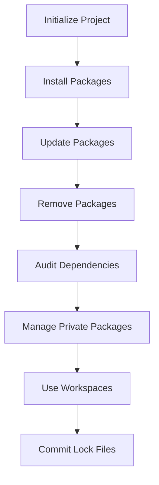

## 13.6 Package Management with npm and Yarn

In the world of JavaScript development, managing dependencies is a crucial aspect that can significantly impact the efficiency and maintainability of your projects. Two of the most popular tools for this purpose are npm (Node Package Manager) and Yarn. Both are package managers that help developers manage libraries and tools that their projects depend on, ensuring that the right versions are installed and that the project can be easily shared and collaborated on.

### Understanding npm and Yarn

#### What is npm?

npm, which stands for Node Package Manager, is the default package manager for Node.js. It is a command-line tool that allows developers to install, update, and manage packages (libraries or modules) that their projects depend on. npm also hosts an online repository, the npm registry, where developers can publish and share their packages with the community.

#### What is Yarn?

Yarn is an alternative package manager created by Facebook to address some of the shortcomings of npm, particularly around speed, reliability, and security. Yarn uses the npm registry but provides additional features and improvements, such as faster installation times, deterministic installs via lock files, and workspaces for managing multiple packages within a single project.

### Initializing a Project

Before you can start managing dependencies, you need to initialize your project. This process involves creating a `package.json` file, which serves as the manifest for your project, detailing its dependencies, scripts, and other metadata.

#### Initializing with npm

To initialize a project with npm, use the following command in your terminal:

```bash
npm init
```

This command will prompt you to enter details about your project, such as its name, version, description, and entry point. You can also use the `-y` flag to skip the prompts and create a `package.json` file with default values:

```bash
npm init -y
```

#### Initializing with Yarn

Similarly, you can initialize a project with Yarn using the following command:

```bash
yarn init
```

Yarn will guide you through a series of prompts similar to npm. To create a `package.json` file with default values, use:

```bash
yarn init -y
```

### Installing Packages

Once your project is initialized, you can start adding dependencies. Both npm and Yarn allow you to install packages from the npm registry and other sources.

#### Installing with npm

To install a package using npm, use the `install` command followed by the package name:

```bash
npm install package-name
```

This command will add the package to your `node_modules` directory and update your `package.json` and `package-lock.json` files. To install a package as a development dependency, use the `--save-dev` flag:

```bash
npm install package-name --save-dev
```

#### Installing with Yarn

To install a package with Yarn, use the `add` command:

```bash
yarn add package-name
```

Yarn will update your `package.json` and `yarn.lock` files. To add a package as a development dependency, use the `--dev` flag:

```bash
yarn add package-name --dev
```

### Updating and Removing Packages

Managing the lifecycle of your dependencies involves updating and removing packages as needed.

#### Updating Packages with npm

To update a package to its latest version, use the `update` command:

```bash
npm update package-name
```

To update all packages, simply run:

```bash
npm update
```

#### Updating Packages with Yarn

Yarn provides a similar command to update packages:

```bash
yarn upgrade package-name
```

To upgrade all dependencies, use:

```bash
yarn upgrade
```

#### Removing Packages

To remove a package with npm, use the `uninstall` command:

```bash
npm uninstall package-name
```

With Yarn, use the `remove` command:

```bash
yarn remove package-name
```

### Lock Files: Ensuring Consistent Installs

Lock files are crucial for ensuring that your project installs the exact same versions of dependencies across different environments.

#### npm's package-lock.json

When you install a package with npm, it generates a `package-lock.json` file. This file locks the versions of your dependencies, ensuring that the same versions are installed whenever the project is set up.

#### Yarn's yarn.lock

Yarn uses a similar mechanism with its `yarn.lock` file. This file serves the same purpose as `package-lock.json`, providing deterministic installs.

### Workspaces: Managing Monorepos

Workspaces are a feature that allows you to manage multiple packages within a single repository, often referred to as a monorepo.

#### npm Workspaces

npm introduced workspaces in version 7. To use workspaces, define them in your `package.json`:

```json
{
  "workspaces": ["packages/*"]
}
```

#### Yarn Workspaces

Yarn has supported workspaces for longer and provides a similar configuration:

```json
{
  "workspaces": ["packages/*"]
}
```

Workspaces allow you to run commands across all packages, manage shared dependencies, and streamline development workflows.

### Performance Comparison

Yarn was initially created to address performance issues with npm. While npm has made significant improvements, Yarn still offers some advantages in terms of speed and reliability, particularly for large projects with many dependencies.

### Handling Versioning and Semantic Versioning

Versioning is a critical aspect of dependency management. Both npm and Yarn use semantic versioning (semver) to specify package versions.

#### Understanding Semantic Versioning

Semantic versioning follows the format `MAJOR.MINOR.PATCH`, where:

- **MAJOR**: Incompatible API changes
- **MINOR**: Backward-compatible functionality
- **PATCH**: Backward-compatible bug fixes

#### Specifying Versions in package.json

In your `package.json`, you can specify version ranges using operators like `^` and `~`. For example:

- `^1.2.3`: Compatible with version 1.x.x
- `~1.2.3`: Compatible with version 1.2.x

### Auditing Dependencies for Security

Security is a major concern in software development. Both npm and Yarn provide tools to audit your dependencies for vulnerabilities.

#### npm Audit

Use the following command to check for vulnerabilities in your npm dependencies:

```bash
npm audit
```

This command will provide a report of any security issues and suggest fixes.

#### Yarn Audit

Yarn offers a similar command:

```bash
yarn audit
```

Regularly auditing your dependencies is crucial for maintaining a secure project.

### Managing Private Packages and Repositories

In some cases, you may need to manage private packages that are not published to the public npm registry.

#### npm Private Packages

npm allows you to publish private packages by setting the `private` field in your `package.json` to `true`:

```json
{
  "private": true
}
```

You can also use npm's private registry service, npm Enterprise, for managing private packages.

#### Yarn Private Packages

Yarn supports private packages through the same mechanisms as npm, as it uses the npm registry.

### Best Practices for Package Management

Here are some best practices to follow when managing dependencies in your JavaScript projects:

1. **Keep Dependencies Updated**: Regularly update your dependencies to benefit from the latest features and security patches.

2. **Use Lock Files**: Always commit your lock files to version control to ensure consistent installs across environments.

3. **Audit Regularly**: Use `npm audit` or `yarn audit` to check for vulnerabilities and address them promptly.

4. **Version Carefully**: Use semantic versioning to specify compatible versions and avoid breaking changes.

5. **Consider Workspaces**: If you're managing multiple packages, consider using workspaces to streamline your workflow.

6. **Manage Private Packages Securely**: Use private registries or set the `private` field in your `package.json` for private packages.

### Visualizing Package Management Workflow

To better understand the workflow of package management with npm and Yarn, let's visualize the process using a flowchart.



**Figure 1:** A flowchart illustrating the typical workflow of managing packages with npm and Yarn.

### Try It Yourself

Experiment with the following tasks to reinforce your understanding of npm and Yarn:

1. **Initialize a New Project**: Create a new project using both npm and Yarn. Compare the `package.json` files generated by each tool.

2. **Install and Remove Packages**: Practice installing and removing packages. Observe how the `package.json` and lock files are updated.

3. **Use Workspaces**: Set up a simple monorepo using workspaces. Add multiple packages and explore how dependencies are managed.

4. **Audit Your Project**: Run `npm audit` and `yarn audit` on your project. Review the reports and try fixing any vulnerabilities.

5. **Experiment with Versioning**: Modify the version ranges in your `package.json` and observe how it affects package installations.

### References and Links

- [npm Documentation](https://docs.npmjs.com/)
- [Yarn Documentation](https://yarnpkg.com/)
- [Semantic Versioning](https://semver.org/)
- [MDN Web Docs: JavaScript](https://developer.mozilla.org/en-US/docs/Web/JavaScript)

### Knowledge Check

- What is the purpose of a lock file in package management?
- How do you specify a development dependency with npm and Yarn?
- What command would you use to audit your project's dependencies for security vulnerabilities?

### Embrace the Journey

Remember, mastering package management is a significant step in becoming a proficient JavaScript developer. As you continue to explore npm and Yarn, you'll gain confidence in managing dependencies, ensuring your projects are efficient, secure, and maintainable. Keep experimenting, stay curious, and enjoy the journey!

## Quiz Time!



### What is the primary purpose of a package manager like npm or Yarn?

- [x] To manage project dependencies
- [ ] To compile JavaScript code
- [ ] To host websites
- [ ] To design user interfaces

> **Explanation:** Package managers like npm and Yarn are used to manage the libraries and tools that a project depends on.

### How do you initialize a new project with npm?

- [x] npm init
- [ ] npm start
- [ ] npm create
- [ ] npm begin

> **Explanation:** The `npm init` command is used to create a new `package.json` file, initializing a project.

### Which command is used to add a package as a development dependency in Yarn?

- [x] yarn add package-name --dev
- [ ] yarn install package-name --dev
- [ ] yarn update package-name --dev
- [ ] yarn remove package-name --dev

> **Explanation:** The `yarn add package-name --dev` command adds a package as a development dependency.

### What file does npm use to lock dependency versions?

- [x] package-lock.json
- [ ] yarn.lock
- [ ] package.json
- [ ] lock.json

> **Explanation:** npm uses the `package-lock.json` file to lock dependency versions.

### Which feature allows managing multiple packages in a single repository?

- [x] Workspaces
- [ ] Modules
- [ ] Plugins
- [ ] Scripts

> **Explanation:** Workspaces allow managing multiple packages within a single repository, often referred to as a monorepo.

### What is semantic versioning?

- [x] A versioning system using MAJOR.MINOR.PATCH
- [ ] A system for naming JavaScript functions
- [ ] A method for designing user interfaces
- [ ] A way to style web pages

> **Explanation:** Semantic versioning is a versioning system that uses the format MAJOR.MINOR.PATCH to indicate changes.

### How do you audit dependencies for vulnerabilities with Yarn?

- [x] yarn audit
- [ ] yarn check
- [ ] yarn verify
- [ ] yarn scan

> **Explanation:** The `yarn audit` command is used to check for vulnerabilities in dependencies.

### What is the purpose of the `private` field in package.json?

- [x] To prevent a package from being published publicly
- [ ] To make a package faster
- [ ] To add more dependencies
- [ ] To enhance security

> **Explanation:** Setting the `private` field to `true` in `package.json` prevents a package from being published to the public npm registry.

### Which command is used to remove a package with npm?

- [x] npm uninstall package-name
- [ ] npm delete package-name
- [ ] npm remove package-name
- [ ] npm discard package-name

> **Explanation:** The `npm uninstall package-name` command is used to remove a package.

### True or False: Yarn and npm use the same registry for packages.

- [x] True
- [ ] False

> **Explanation:** Both Yarn and npm use the npm registry to manage and install packages.


